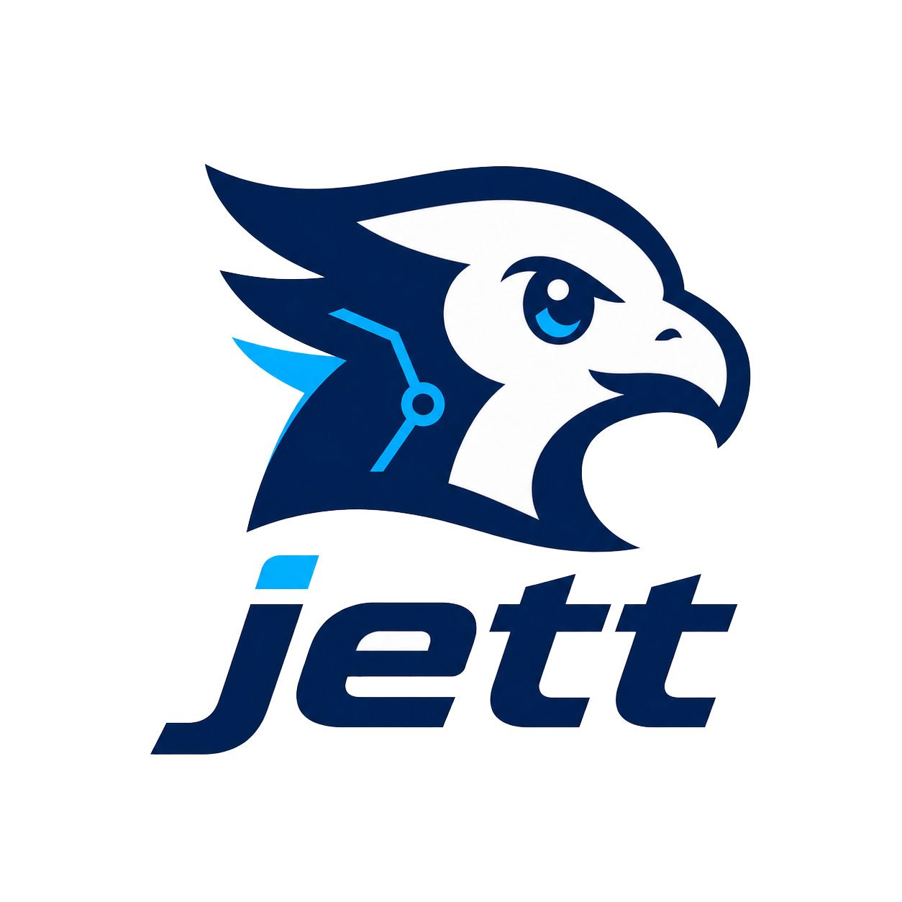

# Jett

[](https://www.patreon.com/cw/vycdev) [](https://discord.gg/nU63sFMcnX) [](https://www.youtube.com/@vycdev)

Jett is a general-purpose programming language designed from the ground up for LLM consumption, generation, and maintenance.

It is not an AI framework. It is a small, explicit, statically typed language whose syntax and semantics are shaped around the way coding agents read files, search code, apply patches, and recover from compiler feedback.

<br clear="left" />

## Why Jett Exists

Most programming languages were designed for humans typing into editors. Jett starts from a different premise: a growing share of code will be written, reviewed, and refactored by large language models and coding agents.

That changes the tradeoffs.

- One canonical form beats many clever shortcuts.
- Local context beats implicit global behavior.
- Explicit effects beat hidden side effects.
- Predictable syntax beats flexible syntax.
- Structured compiler errors beat prose diagnostics.
- Small, bounded functions beat sprawling control flow.

Jett is meant to feel pragmatic rather than academic: close in spirit to Go or Rust, with straightforward imperative code, strong static checking, explicit ownership/view semantics, and purity enforced through capability parameters.

## Language Shape

```jett
namespace app

struct User:
    id: string serialize "userId"
    name: string
    token: secret[string]

function greeting(view user: User) returns string:
    return "hello, {user.name}"

function main(view stdout: Stdout) returns nothing:
    User user = User(id: "u1", name: "Ada", token: "private")
    Stdout.write(view stdout, greeting(view user))
```

Core ideas already present in the implementation include:

- type-checked functions, structs, enums, interfaces, generics, and methods
- ownership analysis with `view` parameters and move tracking
- explicit capability parameters for impure operations
- `result[T, E]` and `optional[T]` handling with required `handle` blocks
- refinement types and compile-time `verify` / `property` blocks
- actors, structured concurrency, bitfields, closures, and pipelines
- comptime type reflection and reflected JSON serialization/parsing work
- a formatter, LSP server, and agent-oriented diagnostic output

## Current Status

Jett is experimental, but the compiler front half is substantial.

- The lexer, parser, formatter, resolver, typechecker, ownership checker, comptime interpreter, runtime interpreter, CLI, fixture suite, and VS Code extension are working.
- `jett build` currently validates and type-checks programs. Native LLVM code generation is planned but not implemented yet.
- `jett run` executes programs through the tree-walking interpreter.
- `jett test` runs `verify` and `property` blocks.
- The standard library is partly Rust-backed and partly written in `.jett`; `stdlib/json.jett` is the active bridge toward reflection-powered stdlib JSON.

See [docs/progress.md](docs/progress.md) for the detailed implementation matrix.

## Quick Start

Build the compiler workspace:

```bash
cargo build
```

Run a sample Jett program:

```bash
cargo run -p jett_cli -- run tests/run_pass/hello_print.jett
```

Type-check a file:

```bash
cargo run -p jett_cli -- build tests/run_pass/hello_print.jett
```

Format a file:

```bash
cargo run -p jett_cli -- format tests/run_pass/hello_print.jett
```

Run the fixture suite:

```bash
cargo test -p jett_driver --test fixture_suite
```

Run the lower-level compiler tests:

```bash
cargo test -p jett_typecheck
cargo test -p jett_comptime
```

## CLI

The main binary is `jett`.

```text
jett format [--check] <file.jett>
jett build [--agent] [--release] [--target <triple>] <file.jett>
jett run <file.jett>
jett test [file.jett]
jett lsp
```

`--agent` on `build` emits structured TOON diagnostics so a coding agent can parse compiler feedback mechanically.

## Repository Layout

```text
crates/
    jett_common        shared spans, file ids, and symbols
    jett_diagnostics   human and TOON diagnostics
    jett_lexer         tokenization and indentation handling
    jett_parser        parser and CST construction
    jett_ast           AST data structures and lowering
    jett_resolve       namespaces, imports, and name resolution
    jett_types         type representations and definitions
    jett_typecheck     type checking, ownership, capabilities, complexity limits
    jett_comptime      comptime interpreter, verify blocks, runtime interpreter
    jett_fmt           canonical formatter
    jett_driver        pipeline orchestration
    jett_lsp           editor integration
    jett_cli           command-line entry point
stdlib/                standard library .jett modules
tests/                 compile-pass, compile-fail, and run-pass fixtures
docs/                  design notes, architecture, and staging plans
editor/vscode/         VS Code extension
```

## Design Documents

- [Docs index](docs/README.md)
- [Language design](docs/design.md)
- [Compiler architecture](docs/architecture.md)
- [Implementation progress](docs/progress.md)
- [JsonValue to JsonTree transition](docs/active/json_value_transition_plan.md)
- [JSON stdlib extraction plan](docs/active/stdlib_json_extraction_plan.md)

## Development Notes

Useful commands while working on the compiler:

```bash
cargo fmt
cargo test -p jett_driver --test fixture_suite
cargo test -p jett_typecheck
cargo test -p jett_comptime
```

Compile-fail fixtures live in `tests/compile_fail` and assert specific diagnostics. Run-pass fixtures live in `tests/run_pass` and exercise interpreter behavior.

The language intentionally enforces function complexity limits. The current checker caps functions at 100 statements, nesting depth 4, and cyclomatic complexity 10.

## License

The Cargo workspace declares this project as MIT licensed.
