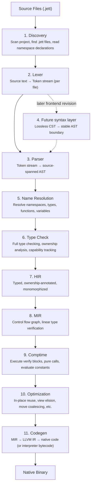
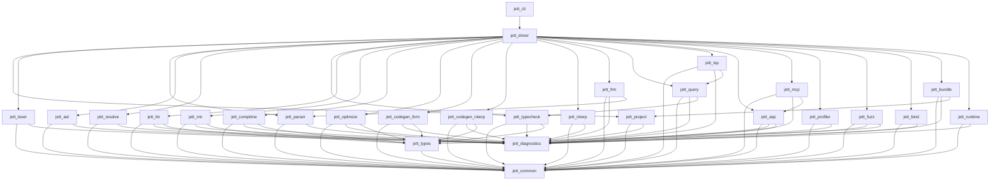
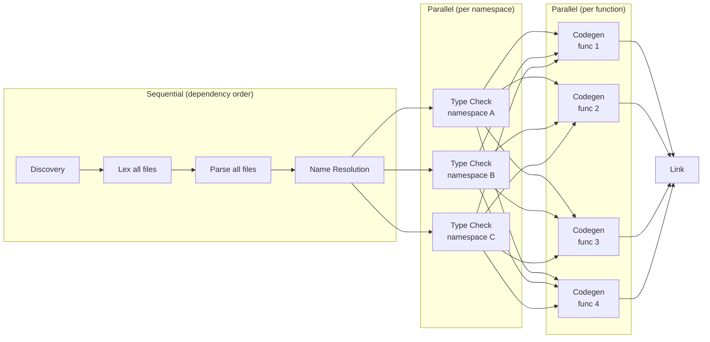
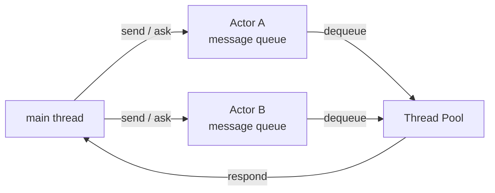

# Jett Compiler Architecture

## Overview

The Jett compiler (`jettc`) is a multi-pass, ahead-of-time compiler written in Rust that translates Jett source code into native machine code via LLVM. It also supports an interpreter mode for rapid prototyping (`jett run`). The architecture is designed around four goals:

1. **Correctness** — The type system is the most critical component. Linear types, capabilities, refinement types, state machines, and secret tracking must all be enforced with zero false negatives.
2. **Incremental compilation** — Sub-second recompilation for typical changes (Footnote 5 of the design doc). The architecture supports fine-grained caching at every phase.
3. **Dual output modes** — Human-readable terminal output and structured TOON output for LLM agents (ASP, Rule Set 21).
4. **Testability** — Every compiler phase is independently testable with clear input/output boundaries.

---

## High-Level Pipeline



Initial versions intentionally parse directly into the AST. A later frontend
revision will insert a lossless CST before the same AST boundary; see the
[frontend syntax tree staging decision](active/frontend_syntax_tree_staging.md).

---

## Crate Organization

The compiler is organized as a Cargo workspace with one crate per major phase. Crates have strict dependency ordering — no cycles, no upward dependencies. Shared types live in foundational crates.

```
jett/
├── Cargo.toml                  # Workspace root
├── crates/
│   ├── jett_common/            # Shared types: Span, FileId, Symbol, diagnostics
│   ├── jett_diagnostics/       # Error/warning types, TOON + human formatting
│   ├── jett_lexer/             # Tokenizer
│   ├── jett_parser/            # Current direct source-spanned AST parser
│   ├── jett_ast/               # Reserved future AST boundary; not implemented yet
│   ├── jett_resolve/           # Name resolution, namespace registry, import resolution
│   ├── jett_types/             # Type representations, type interning, type relationships
│   ├── jett_typecheck/         # Type checking, ownership analysis, capability tracking
│   ├── jett_hir/               # High-level IR: typed + monomorphized
│   ├── jett_mir/               # Mid-level IR: CFG-based, linear type verification
│   ├── jett_comptime/          # Compile-time interpreter (verify blocks, comptime fns)
│   ├── jett_optimize/          # Jett-level optimizations before codegen
│   ├── jett_codegen_llvm/      # LLVM IR generation via inkwell
│   ├── jett_codegen_interp/    # Bytecode generation for interpreter mode
│   ├── jett_interp/            # Bytecode interpreter for `jett run`
│   ├── jett_fmt/               # Code formatter (`jett format`)
│   ├── jett_query/             # Planned Salsa owner; initial direct-AST query boundary
│   ├── jett_lsp/               # Language Server Protocol implementation
│   ├── jett_asp/               # Agent Server Protocol (TOON output formatting)
│   ├── jett_mcp/               # MCP server wrapping ASP
│   ├── jett_profiler/          # Built-in CPU/memory profiler
│   ├── jett_fuzz/              # Property-based test runner and fuzzer
│   ├── jett_bind/              # C header → .jett binding generator
│   ├── jett_runtime/           # Runtime library linked into every binary (allocator, actors, strings)
│   ├── jett_bundle/            # Bundle multi-file projects into single distributable .jett
│   ├── jett_project/           # Project file (jett.proj) parsing, file discovery
│   ├── jett_driver/            # Orchestrates the full pipeline, CLI argument parsing
│   └── jett_cli/               # Binary entry point, subcommand dispatch
├── stdlib/                     # Standard library .jett files
├── tests/                      # Integration tests
│   ├── compile_pass/           # Programs that should compile successfully
│   ├── compile_fail/           # Programs that should produce specific errors
│   ├── run_pass/               # Programs that should compile and produce expected output
│   └── snapshots/              # Snapshot tests for AST, HIR, MIR, LLVM IR
└── docs/
    ├── design.md
    └── architecture.md
```

The selected [`jett_profiler` contract](completed/cpu_memory_profiling_contract.md)
defines CPU/memory events, attribution, bounded collection, deterministic
reporting, security, and the interpreter/future-runtime handoff. The initial
backend-neutral crate validates CPU report controls and aggregates injected
samples into deterministic bottleneck records; rendering, CLI integration, and
runtime adapters remain staged.

### Crate Dependency Graph



---

## Phase 1: Project Discovery (`jett_project`)

**Input:** A path to a `.jett` file or a directory containing `jett.proj`.

**Output:** A `Project` struct containing all source files, their paths, and basic metadata.

### Responsibilities

1. Locate `jett.proj` by walking up from the given path.
2. Parse the TOON-format project file (name, version, entry point).
3. Discover project sources, nested vendored dependencies under `deps/`, and
   compiler-shipped stdlib sources as distinct origins. Dependencies are `.jett`
   source tracked in git; compilation performs no package-registry or network
   lookup.
4. Normalize origin-relative logical paths and assign each file a stable
   `FileKey` plus a session-local diagnostic `FileId`.
5. Pre-scan namespaces and build the complete module registry before name
   resolution. Project and dependency namespaces have one owning file; only
   stdlib namespaces may use ordered fragments.
6. Reject dependency cycles, duplicate roots, namespace collisions, and project
   attempts to reopen stdlib namespaces deterministically.
7. Read file contents into an arena-allocated string store for zero-copy access.

### Key Data Structures

```
Project {
    name: String,
    version: String,
    entry_file: FileId,
    files: Vec<SourceFile>,
}

SourceOrigin = Project(ProjectKey) | Dependency(DependencyKey) | Stdlib(StdlibKey)

FileKey {
    origin: SourceOrigin,
    logical_path: String,
}

ModuleId {
    origin: SourceOrigin,
    namespace: Symbol,
}

SourceFile {
    id: FileId,
    path: PathBuf,
    content: String,                    // Owned source text
    namespaces: Vec<NamespaceSpan>,     // All namespace declarations in this file
}

NamespaceSpan {
    name: Symbol,           // e.g. "auth" or "net.http.server"
    byte_offset: u32,       // Where in the file this namespace block starts
}
```

### Design Decisions

- **File contents are loaded once and stored in an arena.** All subsequent phases reference file content by `FileId` + byte offset (`Span`). No re-reading.
- **Explicit origin identity.** `FileId` is a compact source handle, not an
  authorization mechanism. Compiler-assigned `SourceOrigin` and canonical
  declaration identity carry stdlib trust through resolution, lowering, and
  caches.
- **Namespace pre-scan.** Before full lexing, discovery extracts every
  `namespace` declaration and builds the registry needed for two-pass
  resolution. A file may contain multiple namespaces, but project/dependency
  namespaces cannot span files.
- **One registry-backed import model.** Block-local `use` resolves an existing
  namespace and adds no runtime work or trust. The detailed discovery, import,
  prelude, and trusted-origin rules are defined in the
  [module and trusted-origin contract](completed/module_import_trusted_origin_contract.md).

---

## Phase 2: Lexer (`jett_lexer`)

**Input:** Source text (referenced by `FileId`).

**Output:** `Vec<Token>` — a flat array of tokens with spans.

### Token Design

```
Token {
    kind: TokenKind,
    span: Span,
}

Span {
    file: FileId,
    start: u32,      // Byte offset into source
    end: u32,        // Byte offset into source
}
```

`TokenKind` is an enum covering:
- **Keywords:** `Function`, `Return`, `Returns`, `If`, `Else`, `For`, `In`, `Into`, `While`, `Struct`, `Enum`, `Match`, `Use`, `Mutable`, `Handle`, `Error`, `Default`, `Result`, `Ok`, `Fail`, `Clone`, `View`, `Type`, `Where`, `Machine`, `States`, `Transitions`, `To`, `At`, `Is`, `Actor`, `Receive`, `Send`, `Ask`, `Respond`, `Spawn`, `Run`, `Join`, `Cancel`, `Comptime`, `Verify`, `Property`, `Given`, `Trace`, `Breakpoint`, `Secret`, `Declassify`, `Coarsen`, `Serialize`, `Namespace`, `Bitfield`, `Bit`, `Bits`, `Network` (bitfield byte-order modifier), `Implement`, `Interface`, `Mutual`, `Assert`, `Some`, `None`, `Nothing`, `True`, `False`, `Modulo`, `As`, `Break`, `Continue`, `And`, `Within`, `Self_`, `Value`, `Transition`, `Optional`, `Other` (match catch-all), `Not` (boolean negation keyword — used as `not x`, replaces `!` prefix per Rule Set 1's keyword-over-symbol preference)
- **Type keywords:** `Int8`, `Int16`, `Int32`, `Int64`, `Uint8`, `Uint16`, `Uint32`, `Uint64`, `Float32`, `Float64`, `String_`, `Bool_`, `Bytes_`, `List_`, `Map_`, `Set_`. These are reserved keywords, not identifiers — they are tokenized distinctly so the parser can recognize type annotations unambiguously.
- **Literals:** `IntLiteral`, `FloatLiteral`, `StringLiteral` (with interpolation segments), `BoolLiteral`
- **Symbols:** `Eq`, `EqEq`, `NotEq`, `Lt`, `Gt`, `LtEq`, `GtEq`, `Plus`, `Minus`, `Star`, `Slash`, `AmpAmp`, `PipePipe`, `Bang`, `Dot`, `Comma`, `Colon`, `LParen`, `RParen`, `LBracket`, `RBracket`, `Hash`
- **Structural:** `Newline`, `Indent`, `Dedent`, `Eof`

### Indentation Handling

The lexer tracks indentation levels using a stack. At each line start:
1. Count leading spaces (must be a multiple of 4 — emit error otherwise).
2. Compare to the current indentation level.
3. If deeper: push level, emit `Indent` token.
4. If shallower: pop levels until matching, emit one `Dedent` per level popped.
5. If same: no structural token needed.

This converts Python-style whitespace into explicit `Indent`/`Dedent` tokens that the parser consumes like braces. Tabs, trailing whitespace, and non-multiple-of-4 indentation are lexer errors.

### String Interpolation

String literals with `{expr}` are tokenized as a sequence:
`StringStart`, tokens for the expression, `StringMid` (for text between expressions), ..., `StringEnd`.

This lets the parser handle interpolated expressions using the same expression parsing logic.

### Design Decisions

- **No multi-pass lexing.** The lexer is single-pass, streaming tokens. It does not need the full file in memory beyond what's currently being tokenized.
- **All errors are recoverable.** The lexer emits an `Error` token and continues. This allows the parser to report multiple errors per file.
- **Spans are byte offsets, not line/column.** Line/column computation is deferred to diagnostics rendering. This is cheaper and allows lazy line-table computation.

---

## Phase 3: Parser (`jett_parser`)

**Input:** `Vec<Token>` from the lexer.

**Current output:** a source-spanned syntax AST. Tokens and comment trivia are
retained separately where formatting and source tooling need them.

### Parser Strategy: Recursive Descent with Pratt Parsing

- **Recursive descent** for statements and declarations (function, struct, enum, etc.).
- **Pratt parsing** (precedence climbing) for expressions — handles arithmetic operators, comparisons, boolean operators, and `modulo` with correct precedence.
- **Error recovery:** On a parse error, the parser skips to the next `Dedent` at the current level or `Newline`, emitting an error node. This allows reporting multiple errors per file.

### Direct AST now, CST later

Initial Jett versions deliberately parse directly into the AST while language
semantics stabilize. The formatter currently works from lexer tokens and
comment trivia, and semantic tooling uses AST spans plus compiler side tables.

A later version will introduce a lossless, error-tolerant CST for exact source
structure, malformed-file tooling, structural agent edits, comment attachment,
and incremental parsing. CST nodes will lower into the same AST consumed by
semantic phases and retain provenance through HIR, MIR, diagnostics, and
runtime debugging. The staged requirements are recorded in the
[frontend syntax tree decision](active/frontend_syntax_tree_staging.md).

### Key Syntax Node Types

```
File            → (NamespaceDecl (TopLevelItem)*)+    // One or more namespace blocks per file
TopLevelItem    → FunctionDef | StructDef | EnumDef | InterfaceDef |
                  ImplementBlock | MachineDef | ActorDef | TypeAlias |
                  VerifyBlock | PropertyBlock | MutualBlock | BitfieldDef |
                  ConstDecl
FunctionDef     → ('export')? 'function' Name GenericParams? '(' ParamList ')' 'returns' Type ':' Block
StructDef       → ('export')? 'struct' Name ':' FieldList FunctionDef*    // Fields may have 'serialize "jsonName"' annotation
EnumDef         → ('export')? 'enum' Name ':' VariantList      // Variants may have data fields or integer values (e.g., tcp = 6)
MachineDef      → ('export')? 'machine' Name ':' StatesBlock TransitionsBlock
ActorDef        → ('export')? 'actor' Name '(' ParamList ')' ':' (ReceiveHandler)*
BitfieldDef     → ('export')? ('network')? 'bitfield' Name ':' BitfieldList  // Fields: 'name: N bits' (1..63 => int64, 64 => uint64), 'name: N bits as EnumType', or 'payload: list[uint8]'
TypeAlias       → ('export')? 'type' Name GenericParams? '=' Type ('where' Expr)?
                # Root aliases are rejected; exported types retain canonical namespace ownership.
VerifyBlock     → 'verify' Name ':' Block
PropertyBlock   → 'property' Name ':' GivenDecls Block
InterfaceDef    → ('export')? 'interface' Name ':' FunctionSignature*
ImplementBlock  → 'implement' Name 'for' Name ':' FunctionDef*
MutualBlock     → 'mutual' ':' MutualSignature*
MutualSignature → ('export')? FunctionSignature

MatchArm        → Pattern ':' Block      // Pattern includes variant destructure or 'other' catch-all

Statement       → VarDecl | Assignment | ExprStmt | ReturnStmt |
                  IfStmt | ForStmt | WhileStmt | MatchStmt |
                  UseDecl | TraceStmt | BreakpointStmt | BreakStmt |
                  ContinueStmt | SendStmt | RespondStmt | AssertStmt

Expression      → Literal | Ident | BinaryExpr | UnaryExpr |
                  FunctionCall | FieldAccess | PipelineExpr |
                  StructConstruction | ListConstruction | MapConstruction | SetConstruction |
                  StringInterpolation | HandleExpr | CloneExpr |
                  CoarsenExpr | DeclassifyExpr | RunExpr | JoinExpr |
                  CancelExpr | SpawnExpr | AskExpr | IfExpr |
                  AnonymousFunctionExpr | ViewExpr | ComptimeExpr |
                  TransitionExpr | IsExpr | AtExpr
```

---

## Phase 4: Future CST-to-AST Lowering (`jett_ast`)

**Status:** planned for a later frontend version; not present in the current
compiler.

**Future input:** lossless CST.

**Future output:** the stable semantic AST, dropping trivia while preserving
source-node provenance.

### Desugaring Performed

1. **Pipeline desugaring:** `x into f(y)` → `f(x, y)`. Generic steps keep ordinary call spelling: `x into f[T](y)` → `f[T](x, y)`. Multi-step pipelines become sequential let-bindings. Pipeline steps with `handle error:` / `handle:` are represented as step-local handle blocks on the intermediate call, so the unwrapped success or `default` value flows to the next `into` step while `return` exits the enclosing function. Pipeline steps with `view` (e.g., `into view json.serialize[T]()`) are desugared to pass the piped value as a view argument.
2. **String interpolation:** `"hello {name}"` → series of `Displayable.display()` calls joined together. This is a compiler-stdlib coupling — the compiler has hardcoded knowledge of the `Displayable` interface.
3. **`else if` chains:** Lowered to nested `if/else` in the AST.
4. **`for item in view items:`** → loop with explicit view semantics annotated.
5. **Named arguments:** Reordered to match parameter declaration order with source mapping preserved.
6. **`== X within Y`:** Approximate float comparison in verify/property blocks is desugared to `math.abs(left - right) <= Y`.
7. **No nested function calls as arguments:** `f(g(x))` is rejected at this phase (Rule Set 19). The caller must bind `g(x)` to a variable first. String interpolation is the only exception — inline expressions like `"hello {string.upper(name)}"` are allowed.

### AST Design Principles

- **Every current node has a `Span`** for error reporting. Resolver and
  typechecker side tables use spans where they need to associate facts with
  direct-AST nodes.
- **The parser-owned AST is treated as immutable** once constructed. One
  parse result owns all nodes reachable from it.
- **Current parser AST identifiers own `String` values.** The
  `SymbolInterner` is used separately by project discovery for namespace
  prescans; its numeric handles are not parser-node or persistent cache
  identities.
- **Stable `NodeId` and tracked top-level items do not exist yet.** The first
  incremental slice memoizes the whole direct AST by stable logical file key.
  Declaration identity, signature/body splitting, and item-local arenas are
  later stages of the
  [initial query boundary](open_design/incremental_query_boundary.md).

---

## Phase 5: Name Resolution (`jett_resolve`)

**Input:** AST + Namespace registry from discovery.

**Output:** A `ResolveResult` mapping every name reference to its definition.

### Two-Pass Resolution

1. **Declaration pass (top-down per file):**
   - Register all top-level declarations (functions, structs, enums, machines, actors, interfaces, type aliases, bitfields) into a per-namespace symbol table.
   - Respect strict top-to-bottom ordering (Rule Set 4): a declaration is only visible to code that follows it.
   - Handle `mutual` blocks: register all signatures in the mutual block before processing their bodies.
   - Record namespace visibility: declarations in an explicit namespace are private by default unless marked `export`.

2. **Reference pass:**
   - Walk all expressions and resolve identifiers to their declarations.
   - Resolve `use` statements: look up the namespace registry, bind the last segment (or `as` alias) in the function's local scope.
   - Enforce namespace visibility: code outside a namespace can reference only exported declarations, and must do so through the qualified namespace path or an explicit namespace alias.
   - Enforce: no forward references, no circular imports, no unused imports, no unused variables, no variable shadowing.

### Key Data Structures

```
NamespaceRegistry {
    namespaces: HashMap<Symbol, NamespaceId>,
    namespace_to_file: HashMap<NamespaceId, (FileId, u32)>,  // FileId + byte offset (multiple namespaces per file)
}

SymbolTable {
    scopes: Vec<Scope>,       // Stack of scopes (function, block, etc.)
}

Scope {
    bindings: HashMap<Symbol, DefId>,
    parent: Option<ScopeId>,
}

ResolveResult {
    references: HashMap<NodeId, DefId>,    // Maps usage → definition
    definitions: HashMap<DefId, DefInfo>,  // Maps DefId → definition metadata
}
```

### Enforcement at This Phase

- **No forward references** (except within `mutual` blocks).
- **No variable shadowing** — a binding in an inner scope cannot reuse a name from an outer scope.
- **No unused imports** — every `use` must be referenced.
- **No unused variables** — every variable declaration must be referenced.
- **Inline-only imports** — `use` statements are only allowed inside functions/blocks, never at file level. Within a function or nested block, `use` must appear before any other code. Executable access to another project or vendored namespace requires an active local import; same-namespace access and canonical qualified types in declaration signatures do not. Compiler-provided standard namespaces remain available by canonical qualification under the fixed prelude and module contract.
- **Duplicate namespace detection** — two project/dependency files declaring the same namespace is an error. Compiler-shipped stdlib files have a narrow fragment exception so one stdlib namespace can be split across several implementation files; duplicate declarations inside that namespace still fail normally.
- **Global constants** — registered as top-level declarations (global mutable variables are forbidden). Their initializers may use literals and same-namespace declarations, but project or vendored declarations from another namespace are rejected with `E0211`; compiler-provided standard declarations follow the fixed stdlib namespace and prelude policy.
- **Canonical type names** — every struct, enum, interface, machine, actor,
  bitfield, alias, and refinement declaration is validated before registration.
  Names must begin with an ASCII uppercase letter and otherwise contain only
  ASCII letters or digits. E0212 reports lowercase or underscore-separated
  names and provides a PascalCase replacement while still registering the
  declaration to avoid cascading undefined-name errors.
- **No circular imports** — if namespace A uses namespace B and B uses A, it's a compile error.
- **Import aliasing** — `use net.http as net_http` binds the alias in local scope. Conflicting last-segment names require `as`.
- **Parent namespace aggregation** — `use net.http` imports all child namespaces (`net.http.server`, `net.http.client`) when `net.http` itself is not a declared namespace but its children are. Accessing child items uses the last segment: `server.listen(...)`, `client.get(...)`.
- **Namespace exports** — namespaced declarations are private to their declaring namespace by default. `export` marks public API declarations, but executable code outside the namespace must first import it locally and then use the import's bound name or alias; exported names are not inserted into the global flat scope.

---

## Phase 6: Type Checking (`jett_typecheck`)

This is the most complex phase of the compiler. It enforces the majority of Jett's semantic rules.

**Input:** AST + `ResolveResult`.

**Output:** checked diagnostics, a `Span -> TypeId` expression type map,
definition types, checked reflection metadata, normalized call-argument
orders, source-defined method and struct-construction targets, an ordered
concrete generic instantiation manifest with the same per-instantiation facts,
and ownership/capability diagnostics. HIR materializes this as typed nodes; the
current driver also uses the global expression map for hover/tooling and
interpreter runtime facts.

### Sub-Phases (executed in order)

#### 6a. Type Collection

Walk all type declarations and build the type registry:

- **Primitive types:** `int8`..`int64`, `uint8`..`uint64`, `float32`, `float64`, `string`, `bool`, `bytes`, `nothing`. (`bytes` is a raw byte buffer with no UTF-8 guarantee, distinct from `string`.)
- **Built-in generic types:** `list[T]`, `map[K, V]`, `set[T]`, `optional[T]`, `result[T, E]`. `list[T]` is the sole sequence type; fixed-length invariants use refinements and do not change runtime layout. `array[T, N]` is rejected with E0360. Map keys and set elements are limited to integer, `string`, `bool`, or primitive-backed refinement types.
- **User-defined types:** structs, enums, machines, actors, bitfields, interfaces, type aliases (including refinement types).
- **Compiler-shipped resource types:** nominal `resource Name` declarations with
  no source representation or constructor. They are move-only, carry one
  trusted cleanup obligation, and expose only name plus `resource_type` in
  type-level reflection. See the
  [opaque runtime resource contract](completed/opaque_runtime_resource_contract.md).
- **Function types:** `function(T) returns U`.
- **Capability types:** `Filesystem`, `Network`, `Stdout`, `Stderr`, `Stdin`, `Clock`, `Random`, `Process`, `Environment`, `Foreign`, `Log`. Random sampling uses the explicit `view Random` API, injected per-runtime generator state, and non-cryptographic contract defined in the [Random capability and entropy contract](completed/random_capability_entropy_contract.md). The interpreter-backed [`Environment` contract](open_design/environment_argv_capability_contract.md) uses source-owned `Environment.get` and `Environment.args` over one immutable injected launch snapshot; ambient `os.env`/`os.args` are removed. `Foreign` guards the generated native C boundary specified by the [C FFI contract](open_design/c_ffi_binding_contract.md). `Log` authorizes the independent structured application-log channel defined by the [structured logging contract](completed/structured_logging_contract.md). Property tests may create only the typed test capabilities admitted by the [capability mocking contract](completed/capability_mocking_test_harness_contract.md); this does not open the capability set or add production constructors.
- **Secret wrapper:** `secret[T]`.
- **State-qualified types:** `Machine at state`.
- **Task-control failures:** `CancelledError` terminates a cancelled pending task
  at its next capability checkpoint and is surfaced by `join`; it is not the
  `E` parameter of the interrupted function's declared `result[T, E]`.
- **String position policy:** source code never sees byte offsets. Current
  string search helpers return optional grapheme indices or extracted strings;
  no `StringPosition` runtime type is exposed yet.

Types are interned for O(1) comparison: each unique type gets a `TypeId`. The type interner deduplicates structurally equal types.

**Standard library interfaces** are registered as built-in types during this phase:

| Interface | Implemented by | Used for |
|---|---|---|
| `Equatable` | numeric primitives, `string`, `bool`, explicit user structs | `==`, `!=` |
| `Orderable` | `int64`, `float64`, `string` | `<`, `>`, `<=`, `>=` |
| `Displayable` | `int64`, `float64`, `string`, `bool` | String interpolation `{expr}` (compiler-stdlib coupling) |
| `Serializable` | JSON-data primitives, structs, enums, bitfields, serializable machine values, and raw JSON tree aliases | `json.serialize[T]()`, `json.parse[T]()`, `json.parse_exact[T]()` |

These are ordinary `implement` blocks in the standard library, but the compiler has hardcoded knowledge of `Displayable` for string interpolation and JSON policy gates for parse/serialization. The JSON bodies are stdlib-reflected in normal builds; the compiler-owned part is the policy boundary, not format-specific field walking.
Functions, actors, interfaces, and `TypeConstruction` are explicitly outside
the current JSON data surface. Bare and state-qualified machine values serialize
and parse through the state/payload envelope when every payload field is
JSON-compatible.

#### 6b. Interface Verification

For every `implement Interface for Type` block:
- Verify that every function in the interface is implemented.
- Verify that the implemented function signatures match the interface signatures exactly.
- Register the implementation for later trait constraint checking.

#### 6c. Expression Type Checking

Bottom-up type checking of every expression:

- **Literal inference:** `42` → `int64`, `3.14` → `float64`, `"hello"` → `string`, `true`/`false` → `bool`.
- **Variable references:** look up the type from the variable's declaration.
- **Function calls:** verify argument types match parameter types, verify generic type-argument arity exactly for user functions and builtins, verify generic constraints, verify return type.
- **Compiler-owned numeric call policy:** the source-defined `math.abs`, `math.min`, and `math.max` facades are checked through a small exact `int64`/`float64` table. This keeps their return types precise without adding user-defined overloads; execution still resolves through `stdlib/math.jett` and private trusted kernels.
- **No implicit conversions** — `int64` is not `float64`. Every mismatch is an error with a hint.
- **Expected-type expression facts:** when context determines a more specific
  primitive type, such as a small integer literal inside a `uint64` argument or
  `list[uint64]` element, the expression type map records the checked type
  rather than the literal's default carrier.
- **Refinement type assignments:** wrapping a base type in a refinement type is fallible → must have `handle error:`.
- **Handle blocks:** verify that `handle error:` is used on `result[T, E]` and `handle:` on `optional[T]`. Verify handle blocks end with `return` or `default`. The `default` keyword inside a handle block is part of the `HandleExpr` structure — it provides a fallback value and resumes normal execution.
- **Coarsen expressions:** `coarsen value` converts a refinement type to an ancestor type. The target type is determined by the variable declaration's type annotation on the left side. The type checker walks the refinement chain to verify the target is a valid ancestor.
- **Match exhaustiveness:** verify all enum variants are covered.
- **Constrained generics:** For `function sort[T implements Orderable](...)`, verify that type arguments at call sites implement the required interfaces. Multiple constraints use `and` (e.g., `T implements Orderable and Displayable`). Unconstrained `T` can only be stored and passed around — no operations.
- **`is` expressions:** In comptime context, `T is int64` checks if a generic type parameter matches a concrete type (resolved at compile time). In runtime context, `value is Variant` checks enum discriminant (compiled to integer comparison).
- **`at` expressions:** `machine_var at state_name` checks if a state machine is in a specific state. Compiled to state tag comparison.
- **Valued enums:** Enums with explicit integer values (e.g., `tcp = 6`) use the specified integers as discriminants instead of auto-assigned values. These integrate with bitfield `as EnumType` annotations — the codegen maps between the integer value in the bitfield and the enum variant.
- **Explicit struct equality:** `==` and `!=` on a user-defined struct require
  an exact `Equatable` implementation. The standard interface declares
  `equals(view self: Equatable, view other: Equatable) returns bool`; both
  interface-typed parameters substitute the concrete owner during
  implementation validation. `!=` negates `equals` rather than adding a second
  customization point. Missing implementations report E0358. Enums retain
  variant-and-payload equality.
- **Primitive collection hashing boundary:** Type formation for `map[K, V]`
  and `set[T]` accepts signed/unsigned integers, `string`, `bool`, and
  refinements backed by those types. Other types report E0359 before
  construction, JSON, reflection, or collection operations. There is no
  public `Hashable` interface or custom hash return representation. Structured
  values use explicit primitive IDs as keys/elements; cryptographic hashing is
  a separate stdlib contract.
- **Recursive owned types:** A struct or enum may refer to itself without a
  source-level pointer type when the declaration has a finite base value.
  Struct fields must terminate through `optional`, an empty collection, a
  finite `result` branch, or a non-recursive shape; recursive enums require at
  least one finitely constructible variant. Recursive generic references must
  preserve their declared arguments exactly. Invalid declarations report
  E0357 before construction, property generation, or backend layout. Mutual
  named-type declarations remain unavailable; shared and cyclic graphs use
  explicit IDs and collections.
- **Return value consumption:** A function call that returns anything other than `nothing` cannot appear as a standalone `ExprStmt`. The return value must be bound to a variable. This is enforced here for all types (not just linear ones — even `int64` returns must be consumed).
- **Generic monomorphization:** record all concrete type parameter instantiations for later HIR generation.

#### 6d. Ownership Analysis (Linear Type Checking)

This sub-phase tracks the ownership state of every variable through the control flow:

**Variable states:**
- `Owned` — the variable holds an owned value.
- `Viewed` — the variable is a `view` (read-only borrow).
- `Consumed` — the variable has been moved/consumed and is no longer valid.
- `Pending` — the variable was produced by `run` and cannot be used until `join`ed or `cancel`led.
- `Uninitialized` — before first assignment.

**Rules enforced:**
- A variable can only be used once unless it is a `view` or has an explicitly
  copyable type. Numeric primitives, `bool`, `nothing`, and immutable `string`
  are implicitly copyable; the primitive `bytes` type is move-only.
- After a variable is passed to a non-`view` parameter, it becomes `Consumed`.
- Using a `Consumed` variable is a compile error.
- `view` parameters can read but not consume.
- `view` values cannot be returned, stored in structs, or sent to actors.
- For types that support duplication, `clone` creates an owned duplicate from
  an owned or viewed value. Clone support is type-specific rather than universal.
- `mutable` variables can be rebound after their value is consumed.
- **For loops:** `for item in items` consumes `items`; `for item in view items` borrows `items`.
- **Run/join:** `run` marks a value as pending; it cannot be used until `join`ed.
- **No orphaned tasks:** every `run` must have a matching `join` or `cancel` before the function returns.
- **No rebinding while viewed:** The owner of a variable cannot rebind it while a `view` to it exists. This prevents `items = new_list` inside a `for item in view items:` loop body, and prevents rebinding a variable that was passed as `view` to a `run` task until the task is `join`ed or `cancel`led.
- **Cancellation semantics:** `cancel task` sets a cancellation flag. The task is
  not killed immediately — its next capability checkpoint terminates the pending
  task with `CancelledError` before the capability operation takes effect. The
  task handle remains live and must still be `join`ed; `join` exposes the
  task-control failure independently of the function's declared result error.
- **View propagation:** Views propagate through field access and collection element access. `view list[T]` element access yields `view T`, not an owned copy. `clone` is required to get an owned value from a view.
- **Closure capture analysis:** Anonymous functions may capture only implicitly copyable values from the enclosing scope. Each capture is copied into the closure. Capturing a move-only value is a compile error; it must be passed explicitly as a parameter.

**Implementation strategy:** Abstract interpretation over the control flow graph. At each program point, maintain a mapping from variable → ownership state. At control flow joins (if/else merge points, loop entries), states must be compatible:

```
OwnershipEnv {
    states: HashMap<DefId, OwnershipState>,
}

// At merge points:
// - If both branches consume a variable → consumed
// - If one branch consumes and the other doesn't → error (variable may or may not be valid)
// - If both branches leave it owned → owned
```

#### 6e. Capability Analysis

Track which capabilities flow through the program:

- A function with no capability parameters is free of semantic program effects.
  Explicit compiler-owned debug observations are tracked separately from this
  capability guarantee.
- A function that calls another function requiring a capability must itself accept that capability.
- Capability narrowing consumes the original and produces a restricted version. All narrowing operations: `Filesystem.read_only(fs)`, `Filesystem.scoped(fs, "/data/")`, `Network.allow(net, "localhost")`, `Stdout.buffered(stdout)`. The runtime enforces restricted permissions (e.g., `read_only` prevents write operations, `scoped` restricts file paths).
- **Only `main()` owns production capabilities.** Every other function must
  borrow them via `view`. The sole construction exception is a property body
  owning a typed, attempt-scoped `test.mock` capability under `jett test`; this
  creates no production authority. A non-`main` function declaring an owned
  (non-view) capability parameter remains a compile error.
- Actors receive capabilities at spawn time via `clone` (since passing would consume the caller's capability).
- **Verify blocks** can only call pure functions (no capabilities).
- **Random sampling is a capability operation.** The public `random.*`
  functions borrow `view Random`; there are no capability-free compatibility
  signatures.
  The runner injects generator state so production uses platform entropy while
  property tests use the narrow trusted `test.mock.random` facade over scripted
  deterministic samples. Verify and comptime evaluation cannot sample
  randomness. See the
  [Random capability and entropy contract](completed/random_capability_entropy_contract.md).
- **Clock reads are capability operations.** The canonical operation is
  `Clock.now(view clock) -> time.Timestamp`; the ambient `time.now_ms` and
  `time.now_s` spellings have been removed. Verify and comptime evaluation
  cannot read a clock. Runtime contexts receive an injected production or
  deterministic property-test clock through `test.mock.clock`. See the
  [Time and Clock capability contract](completed/time_clock_capability_contract.md).
- **Launch inputs are capability operations.** The source-owned
  `Environment.get(view env, key)` and `Environment.args(view env)` read one
  immutable runtime-injected launch snapshot through private trusted kernels.
  Capability-free `os.env` and `os.args` are removed with focused migration
  diagnostics. Verify, property generation, and comptime evaluation cannot
  access process launch data. Production captures native launch data before
  `main`; a property body may explicitly create an isolated test snapshot
  through `test.mock.environment`. See the
  [Environment and argument capability contract](open_design/environment_argv_capability_contract.md)
  and implementation issue [#170](https://github.com/vycdev/jett/issues/170).
- **Application logging is a capability operation.** The source-owned
  `log.emit` and level wrappers borrow `view Log`; the runtime injects a
  dedicated provider, filter, capture, and checked sequence state. It remains
  separate from stdout, stderr, compiler diagnostics, and debug output. See the
  [structured logging contract](completed/structured_logging_contract.md).
- **`trace` and `breakpoint` are capability-exempt** — they produce output/open connections without requiring a `Stdout` or `Network` capability. They are compiler keywords with special treatment, compiled out in release mode.
- **`print` and `println` are compiler-owned debug builtins, not ordinary I/O.**
  They remain secret-output boundaries and require no `Stdout` capability. The
  current interpreter shares its stdout path with `Stdout.write`; a distinct
  debug-event channel is pending. Mode-aware checking rejects them in release
  builds with E0362. Future backends must either route them through a
  debug diagnostic channel or reject them; they must never silently lower to
  ambient process stdout. Verify/comptime entrypoints may allow them only when
  debug text is isolated from protocol output. See the
  [decided policy](open_design/print_debug_builtin_policy.md).

**Implementation:** For each function, compute the set of semantic capabilities
it transitively requires. Compare against its declared parameters. If a
function's body requires a capability not in its parameters → compile error.
Compiler-owned debug observations follow their separate mode policy and do not
grant a program capability.

#### 6f. Secret Taint Analysis

Track `secret[T]` values through the program:

- **Taint propagation:** Any operation on a `secret[T]` produces a `secret[T]`. When a `secret[string]` is passed to a function expecting `string`, the type checker automatically lifts the function through `secret` — the call is valid but the return type becomes `secret[ReturnType]`. This is a special type-checking rule for secret types only.
- `secret[T]` cannot be passed to `Stdout.write`, `print`, `println`, `json.serialize`, string interpolation, or any output function.
- `declassify` is the only way to extract the inner value.
- `secret.redact()` and `secret.compare()` are safe operations that don't
  declassify. `secret.compare` accepts only compatible `secret[string]` and
  `secret[bytes]` values, including refinement aliases that coarsen to those
  payloads. Strings compare as UTF-8 bytes. The interpreter treats length as
  observable, rejects length mismatches directly, and passes equal-length
  payloads to a vetted constant-time byte comparison with no content-dependent
  early exit. Unsupported payloads are rejected by the checker. Future
  HIR/MIR/native lowering must use a vetted
  constant-time primitive or otherwise preserve this no-short-circuit contract;
  [#33](https://github.com/vycdev/jett/issues/33) defines the boundary, while
  [#20](https://github.com/vycdev/jett/issues/20) and
  [#22](https://github.com/vycdev/jett/issues/22) own future lowering.
- `json.serialize` on a struct with secret fields is a compile error -> use `json.serialize_public`. Public JSON serialization omits secret-bearing record fields; it may descend through containers to project nested records, but rejects secret wrappers and secret-bearing enums when their secret data cannot be projected away through record fields. A future explicit full-serialization path can require a declassification token.
- **Secret refinement types:** For `type ApiKey = secret[string] where string.char_count(value) == 40`, the `where` clause operates on the inner `string` value — the constraint function implicitly receives the unwrapped value for validation purposes only.

#### 6g. State Machine Validation

For each `machine` type:
- Validate that all transitions reference declared states.
- At each `transition()` call, verify:
  - The source state matches the machine's current state type.
  - The transition is declared in the machine's `transitions` block.
  - All state-specific data fields are provided.
- `Machine.transition(source, target, ...)` is the sole transition call surface;
  the compiler does not synthesize target-specific functions such as
  `Machine.to_target(...)`.
- Function parameters with `Machine at state` are only callable when the machine is in that state.
- State-qualified type annotations are accepted anywhere ordinary type
  annotations are accepted, including local variable declarations, so local
  temporaries can preserve precise state after construction or transition.
- A value with type `Machine at state` can flow to a bare `Machine` expectation
  when an API intentionally erases precise state. Parameter, return, and local
  annotation boundaries are authoritative: once typed as bare `Machine`, exact
  state is forgotten and is not recovered from construction or caller history.
  A positive `if value at state:` guard narrows that local variable back to
  `Machine at state` for the guarded branch, exposing state payload fields and
  legal transitions there. A bare `Machine` value cannot satisfy a
  `Machine at state` parameter without such a visible guard, even when its
  construction site was precise.
- State narrowing is intentionally and permanently local-variable scoped.
  Guards over field paths or other arbitrary expressions are still boolean
  state tests, but they do not narrow subsequent path accesses; the checker
  does not preserve path facts across possible mutation or aliasing.
- A narrowed local keeps the exact state type for the guarded branch. Assigning
  a different state to that same local is rejected rather than silently widening
  the branch fact in place.
- If the guarded value is a bare machine and an `if` / `else if` chain excludes
  all but one declared state, the final `else` branch narrows to that single
  remaining state. For `if not (value at state):`, the immediate `else` branch
  narrows to the checked state. On two-state bare machines, the guarded branch
  also narrows to the other state. Other multi-state negative branches stay
  bare by design; the checker records exact state facts only and does not
  synthesize union-state types.
- Reflection distinguishes `Machine` and `Machine at state` through
  `TypeInfo.kind` (`machine` / `machine_state`) and structured `TypeKind`
  tags (`machine_type` / `machine_state_type`). `type.machine_layout[T]()`,
  `type.machine_states[T]()`, and `type.machine_transitions[T]()` expose the
  checked state list, state payload fields, and transition edges. Public
  reflection field names avoid reserved syntax tokens: machine layouts use
  `states` and `edges`, and each edge uses `source` / `target`.
- JSON policy gates allow `Machine` and `Machine at state` serialization and
  parsing through an envelope object with `state` and `payload` keys. The
  reflected `type.construct_machine_start` builder path gives parsing a checked
  way to construct machine snapshots while preserving state-qualified target
  precision.

#### 6h. Complexity Limits Enforcement

At the end of type checking each function:
- Count statements (excluding `use` declarations) — max 100.
- Compute nesting depth — max 4 levels.
- Count parameters — max 6.
- Compute cyclomatic complexity — max 10.

These are compile errors, not warnings.

---

## Phase 7: High-Level IR (`jett_hir`)

> Tracked by [#20](https://github.com/vycdev/jett/issues/20).

**Input:** semantic AST + `ResolveResult` + `CheckResult` from Phase 6. The
current checked-program boundary is maps plus the shared type interner rather
than a duplicate `TypedTree`; HIR materializes those facts into typed nodes.

**Output:** HIR — a typed, backend-neutral, fully monomorphized intermediate
representation.

**Implementation status:** the `jett_hir` crate lowers ordinary functions and
the typechecker's ordered concrete generic-instantiation manifest. Explicit,
inferred, repeated, and nested generic calls resolve to deterministic concrete
HIR functions while each instantiation retains its own checked facts. Named
arguments are normalized to parameter order while retaining lexical evaluation
order explicitly; source-defined interface and type-module calls select
concrete method bodies; struct construction records canonical field order and
refinement validation; and struct field access uses dense field IDs. Typed
parameters and locals, direct user calls, core
expressions, returns, branches, and loops are also covered. Remaining source
constructs are staged by the
[initial HIR lowering plan](active/hir_lowering_plan.md).

### Purpose

The HIR is the first representation where generic functions are fully expanded. Each call to `sort[int64]` and `sort[string]` produces a separate HIR function. The HIR is also where desugaring is complete — no more syntax sugar, just core operations.

Resolver `DefId` and `TypeId` values remain session-local join keys. An
in-memory HIR function identity is the compiler-supplied source origin,
canonical namespace, canonical declaration name and kind, plus concrete type
arguments. Persistent artifacts replace raw type interner IDs with canonical
structural type identities. Lowering never infers source authority from
`FileId` ranges or trusted-looking names.
Interface-implementation method declarations additionally include both the
concrete owner and canonical interface in their identity.

### Key Transformations

1. **Monomorphization:** Generate concrete versions of all generic functions for each type parameter combination used in the program.
2. **Method-target materialization:** the checked target for `Speaker.speak(view my_dog)` becomes the specific `implement Speaker for Dog` HIR function.
3. **Auto-view for field access:** `self.x` is annotated as an implicit view operation.
4. **Explicit copyability:** Numeric primitives, `bool`, `nothing`, and immutable
   `string` are implicitly copyable. The primitive `bytes` type remains
   move-only and follows the same view/consume rules as other owned storage.
5. **Comptime reflection lowering:** Preserve enough type metadata for comptime code to inspect `type.name[T]()`, `type.kind[T]()`, `type.has_secret[T]()`, `type.fields[T]()`, bitfield layout metadata, state-machine state/transition metadata, active machine states, and reflected active-state payload fields. JSON serialization is expressible in terms of these reflection primitives rather than as format-specific HIR magic. Struct, bitfield, enum, and state-machine deserialization use the explicit `TypeConstruction` builder family to build `T` from parsed field values; that builder is the sole canonical source form, with no parallel construction-block syntax.

---

## Phase 8: Mid-Level IR (`jett_mir`)

> Tracked by [#22](https://github.com/vycdev/jett/issues/22).

**Input:** HIR.

**Output:** MIR — a control-flow-graph-based representation.

### Purpose

The MIR decomposes functions into basic blocks connected by control flow edges. This representation is ideal for:

- **Linear type verification** — definitive ownership analysis on the CFG.
- **Comptime evaluation** — the comptime interpreter operates on MIR.
- **Optimization** — dead code elimination, constant folding, in-place reuse detection.
- **Codegen** — LLVM IR maps naturally from CFG-based MIR.

### MIR Structure

```
MirParam {
    name: Symbol,
    type_id: TypeId,
    ownership: OwnershipMode,    // Owned or View
}

MirFunction {
    name: Symbol,
    params: Vec<MirParam>,
    return_type: TypeId,
    is_pure: bool,            // No capability parameters — safe for comptime, memoization
    blocks: Vec<BasicBlock>,
    entry: BlockId,
}

BasicBlock {
    id: BlockId,
    statements: Vec<MirStatement>,
    terminator: Terminator,
}

Terminator {
    Return(MirOperand),
    Branch { condition: MirOperand, true_block: BlockId, false_block: BlockId },
    Jump(BlockId),
    Unreachable,
}

MirStatement {
    Assign { dest: MirPlace, value: MirRvalue },
    Drop(MirPlace),                              // Linear type: value freed here
    Call { dest: MirPlace, func: FuncId, args: Vec<MirOperand> },
    ViewBorrow { dest: MirPlace, source: MirPlace },
    ViewRelease(MirPlace),
    Clone { dest: MirPlace, source: MirPlace },
    Trace(MirPlace),                             // Instrumentation for trace keyword
    Nop,
}
```

### Definitive Ownership Verification

The MIR phase performs a final, CFG-based ownership check to catch issues that the AST-level analysis might miss at complex control flow joins. This is the last line of defense before codegen.

---

## Phase 9: Comptime Evaluation (`jett_comptime`)

**Input:** MIR for explicit comptime evaluation sites and verify blocks.

**Output:** Evaluated constant values, verify pass/fail results.

### Comptime Interpreter

The comptime interpreter is a MIR interpreter that executes functions at compile time. It operates on a virtual memory model:

```
ComptimeVM {
    memory: HashMap<Address, ComptimeValue>,
    call_stack: Vec<ComptimeFrame>,
    constants: Vec<(DefId, ComptimeValue)>,    // Results cached here
}

ComptimeValue {
    Int64(i64),
    Float64(f64),
    String(String),
    Bool(bool),
    Bytes(Vec<u8>),
    List(Vec<ComptimeValue>),
    Map(BTreeMap<ComptimeValue, ComptimeValue>),
    Set(BTreeSet<ComptimeValue>),
    Struct { type_id: TypeId, fields: Vec<ComptimeValue> },
    Enum { type_id: TypeId, variant: Symbol, fields: Vec<ComptimeValue> },
    Optional(Option<Box<ComptimeValue>>),           // none or some(value)
    Result { ok: bool, value: Box<ComptimeValue> }, // ok(value) or fail(error)
    Nothing,
}
```

The current tree-walking comptime/runtime interpreter also receives checked
reflection metadata and checked expression type names from the driver. It uses
those expression facts to keep runtime value carriers aligned with typechecker
decisions in expression-only sites, for example preserving `uint64` rather than
falling back to a small `int64` carrier inside `list[uint64]` construction or
primitive interface dispatch. The same normalization enforces the declared
`int8`/`int16`/`int32` and `uint8`/`uint16`/`uint32` ranges after expressions
and at typed assignment, parameter, and return boundaries; values outside the
checked primitive range stop interpretation with a deterministic diagnostic.
The driver additionally evaluates every explicit `comptime expression` after
type checking and stores the resulting value by source span. Runtime
interpretation consumes that stored value instead of evaluating the expression
again. Explicit expressions are evaluated in an empty lexical environment, so
runtime parameters and locals cannot leak into required compile-time work.

### What Runs at Comptime

1. **`verify` blocks** — All assertions are evaluated. Any failure stops compilation.
2. **Explicit comptime calls** — the target and all transitive callees may be
   any pure project, dependency, or stdlib function; results are baked into the
   binary as constants. The expression must be closed. No declaration marker
   or allowlist grants eligibility.
3. **`comptime` expressions** — `if comptime is_numeric[T]()` branches are resolved, dead branches are eliminated.
4. **Refinement type constraints on literals** — `Port p = 80` validates `80 >= 1 && 80 <= 65535` at compile time.
5. **Bitfield literal validation** — `ColorChannel(red: 300, ...)` catches the out-of-range value at compile time.

### Comptime Type Reflection

The comptime interpreter supports basic type-level reflection for generic type parameters:
- `T is int64` — checks if a type parameter matches a concrete type (returns `bool`).
- `T.name` — returns the type's name as a string (e.g., `"int64"`, `"User"`).

These are built-in operations of the comptime interpreter that query the compiler's type table. They enable `if comptime` branching on type properties.

Generic specialization uses only reflection facts that remain structurally
tied to the reflected type: direct `TypeKind` / `TypePrimitive` comparisons,
immutable locals carrying those tags, typed helper parameters receiving them
from the same generic instantiation, and matching arms. Arbitrary tags supplied
by callers are not facts about `T`. The checker can use visible facts to
determine branch reachability and validate casts for a concrete instantiation.
Predicate calls that return `bool` and reflection comparisons copied into
arbitrary `bool` locals do not carry type evidence. This conservative boundary
prevents facts from being detached from their generic parameter or from hiding
mixed runtime carriers behind a classifier; it is pinned by the
`generic_reflection_predicate_fact_boundary.jett` and
`generic_reflection_boolean_fact_boundary.jett` compile-fail fixtures. Static
predicate folding or trusted annotations must never promote calls or detached
booleans into type proofs or generic branch specialization. Both branches are
checked before any later optimization, so folding cannot change source
validity. The settled boundary is recorded in the completed
[reflection predicate fact contract](completed/reflection_predicate_facts.md).

### Capability Restriction

The comptime interpreter refuses to execute any function that takes capability
parameters. Purity is the sole eligibility test: there is no independent
comptime-safe annotation and no project/dependency/stdlib allowlist. Capability
requirements propagate through ordinary type checking, so a nominally pure
wrapper cannot hide an impure call. If a `verify` block or another comptime
entrypoint calls an impure function, compilation fails before interpretation.
The compiler never constructs runtime capability values for comptime; file,
network, clock, randomness, environment, process, foreign access, and
application logging are all excluded.

Only explicit `comptime expression` sites require build-time value evaluation.
Ordinary pure calls may be constant-folded later, but that optimization cannot
affect diagnostics or source acceptance.

---

## Phase 10: Optimization

Optimization in Jett happens at **three levels**: Jett-level MIR optimizations that leverage ownership knowledge LLVM cannot have, LLVM IR annotations that guide LLVM's optimizer, and compilation speed optimizations that keep the build-fix loop fast.

### 10a. Jett MIR Optimizer (`jett_optimize`)

**Input:** MIR.

**Output:** Optimized MIR.

These optimizations exploit Jett's linear type system — the compiler has **perfect alias information** (no value is ever aliased) and **perfect lifetime information** (every value's last use is statically known). LLVM cannot derive this information from the IR alone.

#### Ownership-Aware Optimizations

1. **In-place reuse (consume-transform pattern):** When a value is consumed and immediately transformed (`x = transform(x)`), the compiler detects that the old value has no other references and mutates the underlying memory in-place. This turns `list.append(old_list, item)` into a genuine in-place buffer append (no copy), and `struct.with_field(old_struct, new_value)` into a field write on the existing allocation. This is the single highest-impact Jett-specific optimization — it turns what looks like immutable functional code into zero-copy imperative code.

2. **Move coalescing:** When a value is moved through a chain of single-use variables (`a` → `b` → `c` → `f(c)`), the intermediate names are eliminated and the value stays in the same memory location. No intermediate allocations or copies.

3. **Last-use drop sinking:** The compiler knows the exact last use of every value. Instead of dropping a value at scope exit, it inserts the `Drop` immediately after the last use. This frees memory earlier, reducing peak memory usage.

4. **View elimination:** Views are raw pointers with zero runtime overhead. When a view's lifetime is entirely within a single statement, the compiler can pass the pointed-to value directly without materializing a pointer.

5. **Dead allocation elimination:** If a value is allocated and then consumed by a function that doesn't actually read all of its fields, the unused fields were never needed. The compiler can skip allocating them (partial allocation).

6. **Struct field reuse across calls:** When a function takes a struct by ownership, modifies one field, and returns it, the compiler detects that the input and output share the same allocation and skips the copy for unchanged fields.

#### Pure Function Optimizations

Because the capability system provably identifies pure functions (Rule Set 2), the compiler can:

7. **Pure function memoization:** If a pure function is called multiple times with the same arguments within a function body, the compiler can cache the result. This is safe because pure functions have no side effects.

8. **Pure function reordering:** Pure function calls can be reordered freely for better instruction scheduling or memory locality. Calls that don't depend on each other can be interleaved.

9. **Dead pure call elimination:** A pure function call whose result is never used can be eliminated entirely (it has no side effects, so removing it changes nothing). Note: this cannot apply to impure functions — even if the result is unused, the side effect must occur.

10. **Constant propagation through pure functions:** If all arguments to a pure function are known at compile time, the optimizer may fold the call into a constant. Without an explicit `comptime` expression this is invisible optimization only: evaluation failure cannot become a source diagnostic, and folding cannot change program acceptance.

#### Control Flow Optimizations

11. **Comptime branch elimination:** After comptime evaluation resolves `if comptime ...` branches, the dead branches are removed entirely from the MIR. This eliminates unreachable code before it reaches LLVM.

12. **State machine transition devirtualization:** When a state machine's current state is known at a call site (e.g., immediately after a transition), `match` expressions on that state can be resolved to the single matching arm.

13. **Refinement range propagation:** When a value has a refinement type (e.g., `Port` with `value >= 1 && value <= 65535`), the range information is propagated through arithmetic operations, enabling bounds check elimination and narrower integer representations.

### 10b. LLVM IR Annotations (`jett_codegen_llvm`)

When generating LLVM IR, the codegen phase emits metadata and attributes that tell LLVM what Jett's type system has proven. This enables LLVM optimizations that would be impossible without this information.

#### Function Attributes

Every Jett function gets these LLVM attributes:

| Attribute | Condition | Effect |
|---|---|---|
| `nounwind` | All functions (Jett has no exceptions) | Eliminates unwind tables and landing pads. Simpler CFG enables better optimization. Uses `call` instead of `invoke` everywhere. |
| `willreturn` | All non-looping functions | LLVM can assume the function terminates. Enables dead code elimination after calls. |
| `mustprogress` | All functions | Required by LLVM to optimize assuming forward progress. |
| `noundef` | All parameters | The value is never `undef` or `poison`. Jett has no uninitialized variables. |

Pure functions additionally get:

| Attribute | Condition | Effect |
|---|---|---|
| `readnone` | Pure function with no view parameters | The function reads no memory at all. LLVM can freely reorder, eliminate, or hoist it. |
| `readonly` | Pure function with view parameters | The function only reads memory through its view parameters. No writes. |
| `memory(argmem: read)` | Pure function that only reads through argument pointers | Modern LLVM syntax (15+). More precise than `readonly` — tells LLVM no global memory is accessed. |
| `memory(argmem: readwrite)` | Impure function that only accesses argument memory | Tells LLVM the function cannot affect global state — only the memory reachable through its parameters. |
| `nosync` | Pure functions | No synchronization operations. Safe to parallelize. |
| `nofree` | Pure functions | Does not free memory. LLVM can assume pointers remain valid across the call. |
| `speculatable` | Pure functions with no view parameters | The function can be speculatively executed with no side effects regardless of inputs. Enables hoisting calls out of conditional branches. |

Error handling and panic paths get:

| Attribute | Condition | Effect |
|---|---|---|
| `cold` | Panic handler, assert failure handler | Tells LLVM this code is rarely executed. Prevents inlining cold code into hot paths. Improves instruction cache locality. |
| `noinline` | Panic handler, assert failure handler | Prevents LLVM from inlining error handling code, keeping the hot path compact. |

#### Pointer Annotations

Linear types give Jett something most languages cannot provide — **universal `noalias`**:

| Annotation | Where applied | Effect |
|---|---|---|
| `noalias` | Every owned pointer parameter | Guarantees the pointer does not alias any other pointer accessible to the function. LLVM can assume stores through this pointer don't affect loads through other pointers. This is Jett's most powerful optimization enabler — most languages can only apply `noalias` to restricted cases. |
| `noalias` | Return values of allocation functions | The returned pointer doesn't alias anything in the caller's scope. Emitted on every function that returns a newly allocated value. |
| `nonnull` | Every non-optional pointer | The pointer is never null. Eliminates null checks and enables folding. |
| `dereferenceable(N)` | Pointers to known-size types | The pointer points to at least N bytes of valid memory. Enables speculative loads and load hoisting. |
| `align(N)` | All pointers | Alignment guarantee for the pointed-to type. Enables aligned loads/stores and vectorization. |
| `!range` metadata | Refinement-typed integers, enum discriminants, booleans | Tells LLVM the value is within a specific range (e.g., `Port` is 1–65535, `bool` is 0–1). Enables branch folding and narrowing. |

#### Memory Access Annotations

| Annotation | Where applied | Effect |
|---|---|---|
| `llvm.lifetime.start` / `end` | Every local value | Precise lifetime boundaries from linear type analysis. The compiler knows the exact point of last use — more precise than C/C++ where lifetimes extend to scope exit. LLVM reuses stack slots more aggressively. |
| `!tbaa` (Type-Based Alias Analysis) | Every load/store | One TBAA node per primitive type and per struct type. Tells LLVM that an `int64*` and a `string*` never alias, even without `noalias`. |
| `!invariant.load` | Loads through `view` parameters | Views are read-only — the pointed-to memory cannot change during the view's lifetime. LLVM can cache the loaded value and eliminate redundant loads. |
| `!prof` (branch weights) | `handle error:` / `handle:` branches | Error paths are marked as unlikely (`!prof !{"branch_weights", i32 1, i32 2000}`). LLVM lays out the hot path linearly for instruction cache locality. |

#### Data Layout Optimizations

**Struct field reordering:** LLVM does **not** reorder struct fields — the frontend must handle this. The codegen sorts struct fields by alignment (descending) to minimize internal padding. An `int64` (8-byte aligned) followed by an `int8` wastes 7 bytes of padding; sorting by alignment eliminates this waste. The source-level field order is preserved in debug info, but the memory layout is optimized.

**Enum niche optimization:** For `optional[T]` where `T` is a pointer type (non-nullable), the compiler can represent the optional as a nullable pointer — `none` is null, `some(value)` is the pointer itself. This eliminates the discriminant byte entirely. Similarly, `optional[bool]` can use a three-state byte (0 = false, 1 = true, 2 = none). The `!range` metadata communicates valid values to LLVM.

**Tail call optimization:** For functions in tail position (the call immediately precedes `return`), the compiler emits the `tail` LLVM attribute. When the linear type system can prove that all owned values have been consumed before the tail call (no destructors to run after), the compiler emits `musttail` for guaranteed tail call elimination. This is particularly useful for state machine dispatch and recursive algorithms.

#### The `noalias` Advantage

This deserves emphasis. In C, `restrict` is a programmer promise that's rarely used and often wrong. In Rust, `noalias` is emitted on `&mut T` references but not on shared `&T` references (because multiple `&T` can alias). In Jett, **every owned parameter is `noalias`** because linear types guarantee single ownership — no other pointer in the entire program points to the same data. This gives LLVM more optimization freedom than it gets from virtually any other language.

The compound effect is significant: `nounwind` + `noalias` + `memory(argmem: readwrite)` + `nofree` together make function calls nearly transparent to LLVM — loads can be hoisted above calls, stores can be sunk below them, and redundant operations can be eliminated across call boundaries. Each attribute makes the others more effective.

#### Implementation Priority

When building the codegen, implement LLVM annotations in this order (highest impact first):

1. `nounwind` on every function — trivial to implement, universal benefit
2. `noalias` on every owned pointer parameter — second highest impact
3. `nonnull`, `dereferenceable(N)`, `align(N)` on pointers — enables speculation
4. `willreturn`, `mustprogress` — enables dead call elimination
5. `memory(argmem: ...)` on functions — enables load/store reordering across calls
6. Lifetime markers — enables stack slot reuse
7. `cold` + `noinline` on error/panic paths, `!prof` branch weights — improves code layout
8. Basic TBAA tree — helps with remaining alias analysis gaps
9. Struct field reordering — reduces memory footprint
10. Enum niche optimization — reduces memory for optional types
11. `!range` metadata for refinements — enables narrowing
12. Tail call attributes — enables TCO for recursive patterns

### 10c. Build Modes and Optimization Levels

The compiler supports two primary build modes with distinct optimization strategies:

#### Debug Mode (`jett build` default, `jett run`)

**Goal:** Fastest possible compilation. Minimal runtime performance.

- **No Jett MIR optimizations** — skip Phase 10a entirely.
- **LLVM optimization level: O0** — no LLVM optimization passes. Just codegen.
- **Full debug info** — DWARF debug info emitted for all variables, functions, and types.
- **`trace` and `breakpoint` instrumentation** — compiled in (stripped in release).
- **Interpreter mode** (`jett run`) — skip LLVM entirely, execute MIR via the bytecode interpreter for instant startup.

#### Release Mode (`jett build --release`)

**Goal:** Maximum runtime performance. Compilation time is secondary.

- **Full Jett MIR optimizations** — all 13 optimizations in Phase 10a.
- **LLVM optimization level: O2** — full optimization pipeline (O3 is available but rarely worth the extra compile time for the marginal benefit).
- **LTO (Link-Time Optimization):** ThinLTO by default — optimizes across compilation units with moderate compile time cost. Full LTO available via `--lto=full` for maximum performance at the cost of longer link times.
- **`trace` and `breakpoint` stripped** — compiled out entirely, zero overhead.
- **Debug info: stripped** by default, available with `--release --debug-info`.

### 10d. Compilation Speed Optimizations

Fast compilation is a design goal (Footnote 5: sub-second recompilation). These strategies minimize compilation time:

#### Parallel Compilation



- **Lexing and parsing** are parallelized per-file (each file is independent).
- **Name resolution** must be sequential across namespaces (it builds the global namespace registry), but is fast.
- **Type checking** is parallelized per-namespace after name resolution completes. Namespaces that don't depend on each other can be checked simultaneously. Within a namespace, items are checked in dependency order.
- **Codegen** is the most parallelizable phase — each function generates LLVM IR independently. This is where most compilation time is spent, and where parallelism has the biggest impact.
- **Linking** is single-threaded but fast with `mold` (Linux) or `lld` (cross-platform).

#### LLVM Speed Strategies

LLVM is the compilation bottleneck. Strategies to minimize its impact:

1. **Codegen unit splitting:** Functions are distributed across N LLVM modules (codegen units). Each unit is compiled in parallel. Debug builds use many units (~256) for maximum parallelism. Release builds use fewer (~16) to give LLVM more optimization context per unit.

2. **LLVM optimization level selection:**

   | Level | Compile time | Code quality | Use case |
   |---|---|---|---|
   | O0 | 1x baseline | Poor (redundant loads/stores) | Debug builds |
   | O1 | ~1.5-2x | Decent (removes obvious waste) | Fast development builds |
   | O2 | ~3-5x | Production-quality | Release builds |
   | O3 | ~4-6x | Marginally better than O2, sometimes worse due to bloat | Almost never worth it |

   The jump from O0 to O1 is large in code quality but modest in compile time. O2 to O3 adds significant compile time for marginal benefit. The compiler uses O0 for debug, O2 for release.

3. **ThinLTO for release:** ThinLTO imports callee summaries into each module, enabling cross-module inlining and devirtualization without merging everything into one module. Achieves ~90-95% of full LTO's performance at much lower compile time. Each module is re-optimized in parallel.

4. **Future: Cranelift for debug builds.** Cranelift compiles ~5-10x faster than LLVM O0 by avoiding LLVM's inherent overhead (IR construction, verifier, pass infrastructure). Code runs ~20-30% slower, acceptable for debug. Supports x86-64, AArch64, RISC-V. This would be a `jett_codegen_cranelift` crate following the same MIR → IR interface.

#### Linking

| Platform | Debug linker | Release linker |
|---|---|---|
| Linux | `mold` (~5-10x faster than `lld`) | `lld` (handles LTO) |
| macOS | `lld` or Apple's linker | `lld` or Apple's linker |
| Windows | `lld-link` | `lld-link` |

Additional linking optimizations:
- **Split DWARF** (`-gsplit-dwarf`): Moves debug info into separate `.dwo` files that the linker does not process. Reduces link time by 30-50% for debug builds with large debug info. The debugger reads `.dwo` files directly.
- **Hidden symbol visibility by default:** Only export symbols that are part of the public API. Fewer symbols = faster symbol resolution in the linker.
- **Static linking by default:** The runtime library and stdlib are statically linked. No dynamic library resolution overhead at startup.

---

## Phase 11: Code Generation

### LLVM Backend (`jett_codegen_llvm`)

**Input:** Optimized MIR.

**Output:** LLVM IR → native object files → linked binary.

Uses the `inkwell` crate for safe Rust bindings to the LLVM C API.

#### Key Mapping Decisions

| Jett Concept | LLVM Representation |
|---|---|
| Structs | LLVM struct types with fields sorted by alignment (descending) to minimize padding. Source-level field order preserved in debug info. |
| Enums | Tagged union: i8 discriminant + union of variant payloads |
| Recursive owned edge | Compiler-inserted uniquely owned pointer at the required recursive layout boundary; no source-level `box[T]` |
| State machines | Same as enums (state tag + state-specific data) |
| `list[T]` | Pointer to heap-allocated `{ length: i64, capacity: i64, data: T* }` |
| `map[K, V]` | Pointer to heap-allocated hash table |
| `set[T]` | Pointer to heap-allocated hash set (keys only, no values) |
| `string` | 3-word struct with small string optimization (SSO): strings up to ~23 bytes inline, larger strings heap-allocated `{ length: i64, capacity: i64, data: u8* }` (UTF-8) |
| `bytes` | Pointer to heap-allocated `{ length: i64, data: u8* }` (raw bytes, no UTF-8 guarantee) |
| `optional[T]` | Tagged union: `{ present: i1, value: T }` (or pointer + null for heap types) |
| `result[T, E]` | Tagged union: `{ ok: i1, payload: union { T, E } }` |
| `secret[T]` | Same representation as `T` — security is compile-time only |
| `view` | Raw pointer (no reference counting, safety is compile-time) |
| `clone` | Deep copy via generated clone functions |
| Struct `==` / `!=` | Dispatch to the explicit `Equatable.equals` implementation; `!=` negates the result |
| Actors | OS threads with message queues |
| `run`/`join` | Thread spawn + join (or task pool) |
| `assert` | Condition check + halt with message (two forms: bare and with message string) |
| `trace` | Conditional instrumentation code (compiled out in release) |
| `breakpoint` | Conditional pause + IPC server (compiled out in release). Supports optional condition expression (`breakpoint expr`) — only pauses when condition is true |
| Bitfields | Packed integer types with shift/mask accessors |
| `function(T) returns U` | Function pointer. Closures capturing immutable values use a fat pointer: `{ fn_ptr, env_ptr }` |
| Capabilities | Regular struct parameters — no special runtime representation |

#### Platform-Specific Capability Lowering

The codegen phase maps capability method calls to platform-specific system calls based on the `--target` flag:

```
Filesystem.read_file(fs, path)
  → Linux:   open() + read()
  → Windows: CreateFileW() + ReadFile()
  → macOS:   open() + read() (BSD variant)
  → WASM:    WASI fd_read()
```

Each capability type has a platform-specific implementation module within `jett_codegen_llvm`. The correct module is selected at codegen time based on the target triple. This covers all capability operations including byte-level variants (`Filesystem.read_bytes`, `Filesystem.write_bytes`).

#### Cross-Compilation

The LLVM target triple is set based on `--target`:
- `linux-x86_64` → `x86_64-unknown-linux-gnu`
- `windows-x86_64` → `x86_64-pc-windows-msvc`
- `macos-arm64` → `aarch64-apple-darwin`
- `wasm` → `wasm32-wasi`

Path normalization (forward slashes → backslashes on Windows) is handled in the capability lowering layer.

### Interpreter Backend (`jett_codegen_interp` + `jett_interp`)

For `jett run`, the MIR is compiled to a simple bytecode format and executed by a stack-based interpreter. This provides instant startup without the LLVM compilation overhead.

The interpreter is not optimized for performance — it's for rapid prototyping and debugging. The native compiler is for production use.

### Future: C Transpilation Backend

The design document specifies a future secondary target: **transpilation to C**. This would provide portability to platforms LLVM does not cover well (niche embedded targets), enable building without an LLVM installation, and produce inspectable intermediate output. When implemented, this would be a `jett_codegen_c` crate that emits C source from MIR, following the same phase structure as `jett_codegen_llvm`.

---

## Runtime Library (`jett_runtime`)

> The TCP-first `net.socket` source/runtime boundary, opaque resource handles,
> event-loop behavior, and capability provenance are defined in
> [`docs/open_design/net_socket_transport_contract.md`](open_design/net_socket_transport_contract.md)
> for [#104](https://github.com/vycdev/jett/issues/104). The prerequisite
> `resource Name` declaration, exactly-once cleanup, interpreter registry, and
> backend handoff are defined by the
> [opaque runtime resource contract](completed/opaque_runtime_resource_contract.md)
> from [#175](https://github.com/vycdev/jett/issues/175).
> The initial outbound `net.http` client, including its `Network` capability,
> cancellation, HTTPS, and private runtime-hook boundary, is
> [tracked by #101](https://github.com/vycdev/jett/issues/101).

Every compiled Jett binary links against the runtime library. The runtime is written in Rust (later self-hosted in Jett) and provides the services that cannot be inlined by the compiler.

### Runtime Size

The runtime sits between Rust (~2K lines, no scheduler) and Pony (~15-20K lines, full actor system). Linear types eliminate the need for GC, but the actor scheduler is irreducible complexity. Estimated ~5K-10K lines of Rust.

### What the Runtime Contains

| Component | Size estimate | Purpose |
|---|---|---|
| **Allocator** | ~200 lines | Thin wrapper around the system allocator (`malloc`/`free`). The compiler emits `alloc`/`dealloc` calls at the exact points where linear values are created/dropped — no GC or reference counting. |
| **String representation** | ~500 lines + Unicode support | UTF-8 byte buffer with **small string optimization** (SSO): strings up to ~23 bytes are stored inline in the String struct, avoiding heap allocation. Larger strings use `{ length: i64, capacity: i64, data: *u8 }`. The interpreter uses full extended-grapheme segmentation; search and extraction helpers align matches to grapheme boundaries. The regex handoff pins Unicode 17.0.0/UAX #29 revision 47 data in a checked manifest shared with string operations, and every native runtime must reproduce those boundaries rather than substitute host Unicode defaults. |
| **Actor scheduler** | ~3K-5K lines | Thread pool (one thread per CPU core) + per-actor bounded MPSC message queues + work-stealing. See Actor Runtime section below. |
| **Async I/O event loop** | ~1K-3K lines | Integrates with the actor scheduler to avoid blocking thread pool threads on I/O. Uses `epoll` (Linux), `kqueue` (macOS), `IOCP` (Windows). When a capability method performs I/O, it submits the operation to the event loop and yields the actor, freeing the thread for other work. |
| **Task scheduler** | ~500 lines | For `run`/`join`/`cancel` structured concurrency. Built on top of the actor scheduler — a spawned task is a lightweight actor. |
| **Capability constructors** | ~200 lines | Production functions create capability values at program startup for the generated `main` wrapper. Separately linked test-runner hooks may create only manifest-authorized, attempt-scoped providers for direct `test.mock` calls in property bodies. |
| **Panic handler** | ~100 lines | For `assert` failures and unrecoverable errors. Prints the message and aborts. |
| **Breakpoint control plane** | ~300 lines | Debug-only. A compiler-owned operation layer exposes pause, inspection, evaluation, and resume through an authenticated loopback HTTP adapter. The [decided protocol](completed/breakpoint_pause_inspection_protocol.md) is compiled out in release. |
| **Entry point** | ~100 lines | `_jett_entry` initializes the runtime (thread pool, event loop), constructs capabilities, calls user's `main()`, and shuts down cleanly. |

### Opaque Runtime Resources

Compiler-shipped source declares a runtime-owned nominal type only as
`resource Name`. Resource declarations have no body, fields, constructor,
generic parameters, user destructor, or source-visible carrier. The checked
program binds private trusted operations by stdlib-origin declaration identity,
not by matching a public qualified-name string.

The interpreter stores each live resource in a run-context registry and gives
source execution an internal key containing context, nominal type, slot, and
generation identities. Operations validate every component before provider
dispatch. Finalization detaches pending work, runs one infallible trusted
cleanup, retires the slot, and advances its generation so stale callbacks or
copied backend bits cannot target a replacement resource.

Move dataflow transfers one cleanup obligation; views never own cleanup. Scope
exit, return, handled failure, cancellation, dropped actor messages, and runtime
teardown finalize each remaining owner in deterministic reverse-acquisition
order. Explicit close consumes the owner and suppresses the later scope drop.
HIR preserves the nominal type and trusted-hook identity; MIR drop elaboration
must prove one cleanup on every owner-ending control-flow edge before native
resource APIs are exposed.

Registry entries retain authority provenance for validation by later operations,
but a resource is not a capability. Cleanup may use internal provider state only
to release the owned object after source authority has moved. It cannot mint a
capability or perform new work. C FFI `opaque pointer` declarations share
move/view and drop analysis but retain their separate generated-source, ABI,
policy, and `Foreign` capability contract. The complete rules and deterministic
test matrix are in the
[opaque runtime resource contract](completed/opaque_runtime_resource_contract.md).

### Breakpoint Control Plane

The breakpoint protocol is shared compiler/runtime policy, not an HTTP-specific
debugger API. A debug launch creates the operation service before user code,
binds an ephemeral exact-loopback address, and publishes its endpoint and fresh
bearer token through an owner-only control descriptor. Stdio is not the initial
transport because the running Jett program may own stdin and stdout. The
listener must never bind a wildcard/non-loopback address, place the token in a
URL or process arguments, or grant user code a `Network` capability.

On a breakpoint hit, the interpreter pauses immediately after the optional
condition. A future concurrent runtime quiesces all Jett tasks at scheduler safe
points before publishing a process-scoped `pause_id`; callbacks from completed
OS work remain unscheduled until resume. One authenticated controller then uses
the shared `wait`, `bindings`, `value`, `evaluate`, `stack`, `continue`, and
`disconnect` operations. Commands are serialized separately from the one
permitted outstanding event `wait`, allowing `continue` or `disconnect` to
complete a long poll without introducing competing command order. Requests and
responses are correlated TOON envelopes.
Protocol failures have stable breakpoint codes, while compiler-produced
expression diagnostics reuse the ASP diagnostic collection owned by #35.

Inspection reads the checked scope and the compiler's loaded source map. It
cannot read arbitrary filesystem paths, reveal capabilities or secret-bearing
values, consume/mutate program values, or execute effectful expressions.
Evaluation uses implicit views, checked pure calls, bounded scratch state, and
no committed writes. Disconnect resumes by default (or aborts when selected by
the launcher), invalidates the token, and removes the descriptor so an abandoned
agent cannot leave the process paused indefinitely.

The current tree-walking interpreter's one-line binding snapshot is the
compatibility baseline, not the interactive implementation. The staged order is
typed protocol/renderer tests, interpreter pause and operations, complete
stack/source context, then HIR/MIR/native safe-point lowering. Native code adapts
values to the same operation model instead of defining a second debugger wire
schema. See the
[breakpoint protocol record](completed/breakpoint_pause_inspection_protocol.md)
for the lifecycle, authorization, envelopes, examples, and verification slices.

### How the Compiler Uses the Runtime

The compiler does **not** inline platform-specific code. Instead, codegen emits calls to runtime functions:

```
// Jett source:
Filesystem.read_file(view fs, "config.json")

// LLVM IR generated by codegen:
%result = call %Result @jett_rt_fs_read_file(%Filesystem* %fs, %String* @str_config_json)
```

The runtime library is compiled as a static library (`.a` / `.lib`) and linked into the final binary. This keeps the codegen phase platform-agnostic — it always emits the same `jett_rt_*` calls regardless of target. The runtime library is compiled per-target when cross-compiling.

### Entry Point and Capability Injection

The compiler generates a thin wrapper around the user's `main()` that constructs capability values based on the declared parameters:

```
// User writes (target capability contract; implementation is staged):
function main(stdout: Stdout, logs: Log, fs: Filesystem, env: Environment) returns nothing:
    ...

// Compiler generates (pseudocode):
fn _jett_entry() {
    let stdout = jett_rt_create_stdout();      // Creates Stdout capability
    let logs = jett_rt_create_log();           // Creates configured Log provider
    let fs = jett_rt_create_filesystem();      // Creates Filesystem capability
    let env = jett_rt_capture_environment();   // Freezes argv + environment
    // Network is NOT created — main() didn't request it
    user_main(stdout, logs, fs, env);
    jett_rt_drop_environment(env);             // Releases the launch snapshot
    jett_rt_drop_filesystem(fs);               // Cleanup
    jett_rt_drop_log(logs);
    jett_rt_drop_stdout(stdout);
}
```

Capability values are opaque structs containing OS-level handles (file descriptors, socket handles, etc.) or runner-owned state. `Environment` carries an immutable copy of launch arguments and environment entries; it never performs a fresh ambient host lookup after entry. `Log` carries an independently configured provider, filter, capture, and sequence state; it is never synthesized from stdout or stderr. `Filesystem.read_only(fs)` creates a new capability with a restricted permission flag — the runtime checks this flag before executing write operations. `Foreign` is the exception with no OS handle: when `main` requests it, the entry wrapper creates an unforgeable zero-sized token that authorizes calls through checked generated foreign declarations. It otherwise follows the same ownership, `view`, and explicit actor/task clone rules.

`jett test` has a separate property-attempt entry path. It creates a fresh
private provider registry and may execute checked direct `test.mock`
constructor sites. The build/run entry wrapper above never links or invokes
those hooks. Build, query, and LSP pipelines still parse, resolve, type-check,
and diagnose property source but do not execute a property or constructor.
---

## Actor Runtime

The actor system is built on the runtime library's thread pool and message queue infrastructure.

### Architecture



### Components

**Message queues:** Each actor has a bounded MPSC (multi-producer, single-consumer) lock-free queue. `send` enqueues a message and returns immediately. If the queue is full, `send` blocks until space is available (backpressure).

**Thread pool with work-stealing:** Actors are multiplexed onto a thread pool (one thread per CPU core by default). Each thread has a local run queue of ready actors. When a thread's queue is empty, it steals from other threads. Only one message is processed at a time per actor — no concurrent access to the actor's state.

**Non-blocking I/O integration:** When an actor's receive handler performs I/O (through a capability method), the operation is submitted to the async I/O event loop (`epoll`/`kqueue`/`IOCP`) and the actor yields its thread. When the I/O completes, the actor is re-enqueued as ready. This prevents blocking syscalls from stalling the thread pool — a critical design for systems with many actors performing I/O.

**`send` semantics:** Fire-and-forget. The message (including consumed linear values) is moved into the queue. The sender does not wait.

**`ask` semantics:** The caller sends the message with a one-shot response channel attached. The caller blocks until the actor's `respond` statement sends a value back through the channel. `ask` returns a `result` to handle the case where the actor has been terminated.

**`spawn` codegen:**
1. Allocate the actor's state struct (fields + captured capabilities).
2. Create a bounded MPSC channel.
3. Register the actor with the thread pool.
4. Return an `ActorRef` containing the channel sender endpoint.

**Actor lifecycle:** An actor runs until its message queue is empty and all `ActorRef` handles to it have been dropped (no more possible senders). The thread pool detects this and deallocates the actor's state. If `main()` returns while actors are still running, the runtime drops all `ActorRef` handles and waits for actors to drain their queues before exiting.

**Linear type safety across actors:** When a move-only value is `send`/`ask`'d to an actor, ownership is transferred into the message queue and the sender's handle becomes invalid. The runtime may transfer a small value's bits or move a heap allocation's pointer; neither operation duplicates semantic ownership. Implicitly copyable values are copied into the queue and remain usable by the sender. No deep copy of move-only heap data is needed because single ownership guarantees no aliasing. This is the key advantage of linear types for actor message passing — zero-copy transfer with compile-time safety.

---

## Compiler Intrinsics vs Standard Library

> The crypto text-digest API, algorithm classifications, secret policy,
> and stdlib/runtime boundary are defined in the
> [Crypto hashing and security contract](completed/crypto_hashing_security_contract.md).
> Encoding's byte/string representations, strict failures, URL/form
> distinction, and source/runtime boundary are defined in the
> [Encoding representation and failure contract](completed/encoding_representation_failure_contract.md).
> The proposed public-source/private-kernel boundary for TCP sockets is recorded
> in [`docs/open_design/net_socket_transport_contract.md`](open_design/net_socket_transport_contract.md)
> for [#104](https://github.com/vycdev/jett/issues/104).
> The public-source/private-runtime boundary for the initial `net.http` client
> is separately [tracked by #101](https://github.com/vycdev/jett/issues/101).
> The test-only source facade, typed provider registry, exact-script policy,
> and property-attempt isolation boundary for capability mocks are defined in
> the [capability mocking and deterministic test harness contract](completed/capability_mocking_test_harness_contract.md).

The boundary between compiler-generated code and stdlib-implemented code is a critical architectural decision.

### Three Categories

**1. Compiler intrinsics** — minimal compiler-provided operations that expose type metadata or unavoidable runtime hooks:

| Intrinsic | Trigger | What the compiler provides |
|---|---|---|
| `type.name[T]()` | Comptime reflection | Stable display name for `T` |
| `type.kind[T]()` | Comptime reflection | Category such as `primitive`, `list`, `struct`, `secret` |
| `type.kind_tag[T]()` | Comptime reflection | Structured `TypeKind` tag for `T` |
| `type.primitive_tag[T]()` | Comptime reflection | Optional structured `TypePrimitive` tag for primitive `T` |
| `type.has_secret[T]()` | Comptime reflection | Whether `T` contains secret data |
| `type.info[T]()` | Comptime reflection | Recursive `TypeInfo` metadata for `T`, including nested type arguments, structured kind tags, and optional primitive tags |
| `type.arg[T](index)` | Comptime reflection | Indexed `TypeInfo` argument for generic wrappers; direct literal indexes can bind scoped comptime types |
| `type.fields[T]()` | Struct/bitfield reflection | Ordered `list[TypeField]` metadata for struct and bitfield fields, including owning type, optional owner member, and `serialize` names for structs |
| `type.bitfield_layout[T]()` | Bitfield reflection | `TypeBitfield` metadata for byte order and field-level layout |
| `type.bitfield_fields[T]()` | Bitfield reflection | Ordered `list[TypeBitfieldField]` metadata for bit widths, payload shape, and enum annotations |
| `type.machine_layout[T]()` | State-machine reflection | `TypeMachine` metadata for declared states and legal transition edges |
| `type.machine_states[T]()` | State-machine reflection | Ordered `list[TypeMachineState]` metadata for state payload fields, secret-bearing state flags, and owning machine identity |
| `type.machine_transitions[T]()` | State-machine reflection | Ordered `list[TypeMachineTransition]` metadata with source/target state names and indexes |
| `type.machine_state_value[T](view value)` | State-machine reflection | Active `TypeMachineState` metadata for a concrete machine value |
| `type.machine_field_value[T, U](view value, view field)` | State-machine reflection | Checked active-state payload field read by reflected `TypeField` metadata from the same machine state |
| `type.variants[T]()` | Enum reflection | Ordered `list[TypeVariant]` metadata for enum variants, owning enum identity, discriminants, and payload fields |
| `type.variant_value[T](view value)` | Enum reflection | Active `TypeVariant` metadata for an enum value |
| `type.variant_field_value[T, U](view value, view field)` | Enum reflection | Checked payload field read by reflected `TypeField` metadata from the same enum variant |
| `type.field_value[T, U](view value, view field)` | Struct/bitfield reflection | Checked field read by reflected `TypeField` metadata from the same owner type |
| `type.construct_start[T]()` | Struct/bitfield reflection | Start an opaque `TypeConstruction` builder for constructible `T` |
| `type.construct_variant_start[T](variant)` | Enum reflection | Start an opaque `TypeConstruction` builder for a checked enum variant |
| `type.construct_machine_start[T](state)` | State-machine reflection | Start an opaque `TypeConstruction` builder for a checked machine state |
| `type.construct_put[T, U](builder, field, value)` | Reflection construction | Add a typed field or payload value to a builder after metadata/type checks |
| `type.construct_finish[T](builder)` | Reflection construction | Finish a builder as `result[T, string]`, checking missing fields, refinements, bitfield widths, enum payload arity, and state-qualified machine precision |
| `T.to_bytes()` / `T.from_bytes()` | Binary serialization | Field-by-field binary packing/unpacking |
| `Displayable.display()` for structs | Struct implementing `Displayable` | Field-by-field string representation |
| `clone` for structs | `clone value` on a struct | Field-by-field recursive deep copy |
| Recursive structs/enums | Ordinary move-only values | Compiler-managed indirection; generated drop and clone follow the finite owned shape |
| Refinement type constraint functions | `type Port = int64 where ...` | Synthesized boolean check function |

Shape-specific aggregate reflection APIs are total probes: for non-matching
top-level kinds, `type.fields`, `type.variants`, bitfield layout/field APIs,
and machine layout/state/transition APIs return empty metadata rather than a
diagnostic. Code that requires a particular shape should first check
`type.kind_tag`; value-carrying APIs such as `type.field_value`,
`type.variant_value`, `type.machine_state_value`, `type.machine_field_value`,
and reflection construction remain checked.

Reflection metadata records are compiler-produced values. User code may inspect
and pass `TypeInfo`, `TypeField`, `TypeBitfield`, `TypeBitfieldField`,
`TypeMachine`, `TypeMachineState`, `TypeMachineTransition`, and `TypeVariant`
values returned by reflection intrinsics, but direct source constructors for
those metadata records are rejected. This keeps metadata authority tied to the
compiler rather than to lookalike user-created structs.

Format-specific modules such as `json` should live in `.jett` stdlib code once reflection can express their behavior. JSON is now staged this way for normal builds: public compiler-policy entrypoints delegate to trusted stdlib wrappers, raw JSON uses the stdlib `json.JsonTree` representation, and typed parse/serialize bodies consume the same type metadata (`TypeInfo`, `TypeKind`, `TypePrimitive`, `TypeField`, `TypeBitfieldField`, `TypeMachineState`, `TypeVariant`, `serialize_name`, field values, active machine state values, layout information, and secret information) that user comptime code can inspect. Remaining Rust-side JSON behavior should stay limited to bootstrap/no-stdlib compatibility paths or compiler-owned policy gates.

**2. Stdlib functions** — normal Jett code shipped in `stdlib/`:

Functions like `list.filter`, `string.trim`, `math.sqrt`, and `time.format` are
regular `.jett` files in the target architecture and use the same language
features as user code. The compiler discovers them via the namespace system
(they declare namespaces like `namespace string`, `namespace math`, etc.).

The complete public `string.*` API is defined in `stdlib/string.jett` and
resolved from source declarations like ordinary namespaced code. Compositional
operations have Jett bodies. Private trusted runtime kernels are limited to
primitive conversions and Unicode-, grapheme-, search-, or text-sensitive work
that Jett cannot yet express safely; their checker and interpreter entry points
reject project calls.

The complete public `bytes.*` API is defined in `stdlib/bytes.jett`. Bytes are
move-only: `length`, `get`, `slice`, `to_string`, and `to_hex` borrow their
input as a read-only view, while `concat` consumes both inputs and returns the
replacement. `slice` returns an independent owned range. Private trusted
kernels provide raw allocation, indexing, slicing, concatenation, and exact
UTF-8/hex conversion behavior; project code cannot call them.

The public map namespace is defined in `stdlib/map.jett`. Every public map
operation resolves through an exported source declaration, including
construction, lookup/update, conversions, merging, and higher-order traversal.
Compositional and higher-order operations have Jett bodies. The runtime boundary
contains only private trusted kernels for allocation, storage, equality,
lookup/update, cardinality, and parallel-list conversion. Their checker and
interpreter entry points reject project calls.

`map.entries[K, V]` uses the exported `map.Entry[K, V]` struct rather than a
heterogeneous compiler wildcard. Operations that produce owned values consume
their collection inputs; only the source-declared observer parameters are
views. This keeps map ownership aligned with the move-only collection rule.

At the target boundary, the compiler does not have hardcoded knowledge of
public stdlib function names or signatures. Source-defined public functions are
resolved through their declarations like ordinary namespaced code.

The public set namespace is defined in `stdlib/set.jett`. Every public set
operation has a source signature; conversion and set algebra use real Jett
loops, while private trusted kernels cover only allocation, equality, storage,
and cardinality. Set transformations consume their inputs, observer parameters
are views, and iteration-derived output order remains insertion-derived.

The public list namespace is fully defined in `stdlib/list.jett`. Every public
signature resolves from source, and compositional operations use Jett bodies.
Only private trusted kernels cross into Rust for allocation, cloned indexing,
mutation, sorting, numeric sum, and callback-driven sorting/grouping. Kernel
entry points are rejected outside compiler-shipped stdlib code.

List observers declare views; transformations consume their inputs. Typed
`list.Pair[A, B]` and `list.Indexed[T]` records carry the results of `zip` and
`enumerate`. `flatten` and `sort_by_index` expose nested-list input shapes
directly. The global variable-arity `range` builtin is canonical, and the old
`list.range` alias is intentionally absent.

Public APIs such as `list.filter`, `string.trim`, `math.sqrt`, `time.format`,
and `crypto.sha256` are intended to be regular `.jett` functions. The compiler
will discover their source declarations through namespaces such as `string` and
`math`; any public APIs that still exist only as hardcoded compiler signatures
or Rust dispatch cases are transitional bootstrap implementations.

In the target architecture, the compiler has no hardcoded knowledge of public
stdlib functions. They resolve by name like declarations from any other trusted
compiler-shipped source file, while only private implementation kernels cross
the runtime boundary.

Crypto has reached that boundary for its implemented initial surface. Public
`crypto.sha256` and legacy-only `crypto.md5` declarations live in
`stdlib/crypto.jett`; source wrappers convert exact UTF-8 through `bytes` and
format raw fixed-size digests as lowercase hex. Only private trusted compression
kernels remain in the interpreter, and project code cannot call them. SHA-512
and HMAC remain reserved and undiscoverable until implemented. Exact taint,
security, and backend obligations are defined by the
[Crypto hashing and security contract](completed/crypto_hashing_security_contract.md).

Encoding has reached that boundary for the interpreter-backed compiler. All
eight public byte-native Base64/hex and textual URL/form declarations live in
`stdlib/encoding.jett`; every decoder is fallible, byte encoders borrow their
input, and only private trusted kernels remain runtime-backed. Strict
acceptance, stable errors, and future-backend obligations are defined by the
[Encoding representation and failure contract](completed/encoding_representation_failure_contract.md).

Random has reached that boundary for the interpreter-backed compiler. Its five
public declarations, range validation, choice, and shuffle live in trusted
`stdlib/random.jett`; only opaque generator access and primitive sampling remain
in private trusted kernels. The runner injects isolated production state or a
typed deterministic test provider. Later backends and concurrent cancellation
must preserve the [Random capability and entropy contract](completed/random_capability_entropy_contract.md).

Capability mocks use the same public-source/private-runtime split without
turning test providers into application APIs. `stdlib/test/mock.jett` owns
typed scripts and property-only constructor declarations; a private test
runtime registry owns capability handles, provider cursors, per-attempt
isolation, and exact-consumption diagnostics. Clock, Random, and Environment
adapt their existing typed test seams to that registry. The full boundary is
defined by the [capability mocking and deterministic test harness contract](completed/capability_mocking_test_harness_contract.md).

The complete public `math.*` API is defined in `stdlib/math.jett`. Compositional
helpers have Jett bodies, including the consuming `math.sum(list[int64])`, which
uses wrapping source addition. Private trusted kernels preserve floating-point
primitives and constants, numeric-list aggregation, and operations whose
remaining domain failures cannot yet be raised from Jett source. Their
checker and interpreter entry points reject project calls. The source-defined
`math.abs`, `math.min`, and `math.max` facades retain one narrow compiler-owned
type-policy gate for exact `int64`/`float64` dispatch; this is not general
function overloading.

**3. Runtime-backed stdlib** — Jett functions that call into the runtime:

Functions like `Filesystem.read_file`, `net.socket.listen`, `Stdout.write`, and
`Clock.now` are Jett function signatures that the compiler maps to runtime
calls. These exist as `.jett` signature stubs in `stdlib/` with bodies that call
`jett_rt_*` runtime functions. Random follows the same public-source/private-runtime
split: public `random.*` wrappers visibly borrow `Random`, while opaque generator
state and unbiased primitive sampling stay behind trusted kernels. The exact
capability, deterministic-test, distribution, and security rules are defined in
the [Random capability and entropy contract](completed/random_capability_entropy_contract.md).
For time, only injected wall-clock sampling is a
runtime kernel; public timestamp/duration conversions, comparisons, and checked
arithmetic belong in compiler-shipped `.jett` source. The exact value,
capability, determinism, and compatibility rules are defined in the
[Time and Clock capability contract](completed/time_clock_capability_contract.md).

### How the Compiler Locates the Stdlib

The stdlib is a set of `.jett` files bundled with the compiler installation. The
driver discovers them under an installation-selected root and assigns
`SourceOrigin::Stdlib`; source syntax, project configuration, path spelling, and
namespace names cannot request that origin. Foundational root files are ordered
before nested namespace fragments; files at the same depth remain lexical, so
numbered fragments such as `json/10_*.jett` keep deterministic top-to-bottom
declaration order. Compiler-shipped stdlib files alone may use namespace
fragments. Project files and vendored dependencies cannot use this exception or
reopen stdlib namespaces.

Stdlib namespaces are available by canonical qualification without a required
`use`, but members remain namespaced and private by default. A fixed compiler
manifest exposes only foundational prelude declarations such as `Equatable`;
it cannot inject root type aliases. `export` controls source visibility, while
trusted origin controls compiler policy and private-kernel delegation. The full
contract and implementation stages are recorded in
[module, import, prelude, and trusted origin](completed/module_import_trusted_origin_contract.md).

---

## Diagnostics System (`jett_diagnostics`)

> Tracked by [#35](https://github.com/vycdev/jett/issues/35) for the optional
> ASP diagnostic context and structured command-failure contract.

All compiler errors flow through a unified diagnostics system that supports dual output modes.

### Diagnostic Structure

```
Diagnostic {
    severity: Severity,              // Error, Warning, Info
    code: DiagnosticCode,            // E0001, E0002, ... — stable, greppable
    message: String,                 // Plain-English description
    span: Span,                      // Primary location
    labels: Vec<Label>,              // Secondary locations with messages
    ast_node: Option<AstNodeInfo>,   // AST context for ASP
    scope: Option<ScopeInfo>,        // Variables in scope for ASP
    constraint: Option<ConstraintInfo>, // Which rule was violated
    suggested_fix: Option<SuggestedFix>, // Apply-ready fix
}

SuggestedFix {
    action: FixAction,               // Replace, Insert, Delete
    span: Span,
    old_text: String,
    new_text: String,
    explanation: String,
}
```

### Dual Output

- **Human mode (default):** Uses `ariadne`-style rendering with colored output, source snippets, arrows pointing to the error location.
- **Agent mode (`--agent`):** Emits a TOON document with all diagnostic fields structured and labeled. Zero formatting, zero color codes.

The same `Diagnostic` struct feeds both renderers. The rendering choice is made at the final output stage, not during diagnostic construction.

### Error Codes

Every error has a stable code (e.g., `E0601` for secret type exposure, `E0801` for statement limit exceeded). These codes are deterministic and machine-parseable. The ASP TOON output includes the code for every error.

---

## Query Engine (`jett_query`)

> Agent-mode diagnostic preservation is tracked by
> [#35](https://github.com/vycdev/jett/issues/35).

The current driver provides the compiler facts used by both LSP and ASP
interactive operations. The implemented `jett_query` crate owns the Salsa
database and initial whole-file parse query; later operation migrations keep
these public shapes:

| Query | Description | Used by |
|---|---|---|
| `file_symbols(file)` | File-local top-level declaration outline, including private symbols, declaration-name ranges, and function signatures | ASP |
| `type_at(file, line, col)` | Type and selected-expression range at a position | LSP hover, ASP |
| `signature(function_name)` | Full function signature | ASP |
| `complete_at(file, line, col)` | Prefix-filtered completion candidates with deterministic rank, match kind, namespace, source range, and signature metadata | LSP, ASP |
| `namespaces()` | All namespaces with public functions/types and declaration ranges | ASP |
| `definition_at(file, line, col)` | Go-to-definition target with declaration-name range | LSP, ASP |
| `references_at(file, line, col)` | Find all references to the selected symbol with use-site ranges | LSP, ASP |
| `diagnostics(file)` | All errors/warnings for a file | LSP |

File-symbol parse failures, references-at parse/resolution failures, and
type-at parse, resolution, and type-check failures with known source context
retain `Diagnostic` values through the driver boundary. Type-at and
references-at failures retain the source map used by the compiler, so
diagnostics and labels in sibling project or stdlib files keep their own paths
and ranges. Agent mode renders those failures with the build diagnostic
envelope. Because the current suggested-fix table has no file column, fixes
are emitted only for the requested file. Operational failures without matching
compiler source context use a prose `error` scalar. Extending that boundary and
a file-aware fix schema to the remaining queries and commands is
tracked by #35.

### Demand-Driven Computation

The initial in-process `jett_query` database is implemented and memoizes
`parse_file(FileKey) -> ParsedFile`. The current driver creates a fresh database
at its migrated single-file parse adapter, while project semantic passes and
interactive operations still invoke resolver and typechecker operations
directly. Cross-request LSP reuse and item-level semantic queries are not yet
implemented. The bounded first slice was tracked by
[#166](https://github.com/vycdev/jett/issues/166).

The [initial query boundary](open_design/incremental_query_boundary.md) defines
database ownership, ground-truth inputs, stable file identity, deterministic
diagnostics, LSP/ASP snapshots, cancellation staging, and the later path to
item-level signatures and bodies. Demand-driven semantic computation must not
be claimed until its recomputation tests pass.

### Persistent Content-Addressed Cache

The selected
[content-addressed compilation cache contract](completed/content_addressed_compilation_cache_contract.md)
adds a separate local, cross-process performance layer after in-process Salsa
memoization. Its first artifact is a successful whole-file direct AST plus
non-error parser diagnostics. Exact source bytes, a canonical artifact schema,
and a deterministic compiler compatibility identity form its SHA-256 key. The
current `jett_query` cache module implements the exact v1 parse-key record,
digest, strict decoder, and current-source validation. Artifact serialization,
authenticated storage, and persistent query read-through remain pending.

The wire format is compiler-owned and independent of Rust layout, Salsa handles,
process-local `FileId` values, pointers, and checkout paths. A hit reconstructs
fresh owned AST values and binds spans to the caller's current `FileKey`,
`FileId`, source map, and provenance. Discovery, namespace ownership, stdlib
trust, resolution, type checking, capability policy, comptime, and verification
still run against the current invocation.

Cache objects are authenticated with a separate per-user key, then decoded as
untrusted, size-bounded data, fully validated, kept immutable, and published
atomically. Misses, incompatible versions, corruption, permission errors, full
disks, and cleanup contention fall back to ordinary compilation. Failed,
cancelled, stale, panicked, and partial work is not cached. Remote or shared
caches, negative results, checked programs, HIR/MIR, and backend objects remain
separate future contracts.

---

## LSP Server (`jett_lsp`)

Standard LSP implementation using the `tower-lsp` crate. Provides:

- Real-time diagnostics (errors/warnings as you type).
- Hover information (type at cursor).
- Go-to-definition.
- Find all references in the current document, optionally including the declaration.
- Code completion.
- Document symbols from the latest in-memory source, including declaration
  kinds, signatures, and UTF-16 ranges for editor outlines.
- Whole-document formatting is provided through `jett_fmt`.
- Planned follow-up: rename symbol.

The LSP server currently stores full document text, invokes driver operations,
and suppresses diagnostics from stale document versions. After `jett_query`
lands, one database per workspace session will reuse unchanged parse results;
version checks remain the final publish guard.

---

## ASP Server (`jett_asp`)

> The remaining cross-command failure envelope is tracked by
> [#35](https://github.com/vycdev/jett/issues/35).

The Agent Server Protocol is not a persistent server — it's the `--agent` flag on CLI commands. Each invocation produces a TOON document on stdout:

| Command | TOON Output |
|---|---|
| `jett build --agent` | Build errors or success |
| `jett run --agent` | Captured stdout/stderr, typed debug rows, structured logs, and an optional profile in distinct fields |
| `jett test --agent` | Verify + property test results with block ranges |
| `jett query --agent --symbols ...` | File-local symbol outline |
| `jett query --agent --type-at ...` | Type information |
| `jett query --agent --definition-at ...` | Definition target |
| `jett query --agent --references-at ...` | Reference locations |
| `jett query --agent --signature ...` | Function signature |
| `jett query --agent --complete-at ...` | Ranked completions |
| `jett query --agent --namespaces` | Namespace registry |
| `jett run --agent --profile` | Profiling bottleneck summary |
| `jett bundle --output lib.jett` | Validated single-file bundle with source manifest |

The ASP module formats `Diagnostic` structs and query results into TOON. It shares all data with the human-mode output — only the rendering differs.

---

## MCP Server (`jett_mcp`)

> Tracked by [#37](https://github.com/vycdev/jett/issues/37) for the initial
> transport, lifecycle, and shared ASP operation boundary.

`jett mcp` starts a local MCP server (HTTP on localhost) that wraps ASP commands as MCP tools. Any MCP-compatible agent connects and calls tools like `jett_build`, `jett_query_type`, `jett_test`, etc.

MCP is purely a transport layer — tools return the same TOON payloads as the ASP CLI commands.

---

## Formatter (`jett_fmt`)

**Current input:** source text and the direct parser/token boundary. A future
frontend may provide a lossless CST without changing canonical formatting
policy.

**Output:** Formatted source text.

The formatter enforces the single canonical style:
- 4-space indentation.
- No trailing whitespace.
- Blank lines between top-level declarations.
- Consistent spacing around operators.
- Canonical ordering of modifiers (`mutable`, `view`, etc.).

Since Jett has one canonical form for everything, the formatter is relatively simple — it's mostly about consistent whitespace, not code restructuring.

---

## Property-Based Test Runner (`jett_fuzz`)

The `jett test` command runs both `verify` blocks (at compile time, via the comptime interpreter) and `property` blocks (at test time, via the fuzzer).

### Fuzzer Architecture

1. **Type-aware generation:** For each `given` parameter, generate random values based on the type:
   - `int64`: 0, 1, -1, max, min, random, powers of 2, boundary values.
   - `string`: empty, single char, ASCII, unicode, long strings, null bytes.
   - `list[T]`: empty, single, many, duplicates, sorted, reverse-sorted.
   - Refinement types: values at constraint boundaries.
   - Custom structs: all fields generated recursively.

2. **Execution:** Run the property block body with each generated input. All values are implicitly viewable in property/verify/breakpoint contexts (relaxed linear typing — values can be used multiple times without being consumed).

3. **Shrinking:** When a failure is found, iteratively simplify the input while maintaining the failure. Binary search on list lengths, individual element simplification, etc.

4. **Reporting:** Output the minimal failing case via the diagnostics system (TOON for `--agent`, human-readable otherwise).

Default: 10,000 iterations per property block. Configurable via CLI flag.

---

## Profiler (`jett_profiler`)

`jett_profiler` owns backend-neutral CPU samples and allocation events plus pure
aggregation, thresholding, source sanitization, deterministic suggestions, and
human/TOON rendering. The driver owns capability negotiation, run-manifest
metadata, lifecycle finalization, and composition with `RunOutput`; the CLI owns
argument validation, output channels, and exit behavior. Runtimes only produce
safe events and exclude collector metadata.

### CPU Profiling

`jett run --profile` requests monotonic elapsed-time samples at 1000 Hz by
default. The timer keeps at most one pending request per runtime worker. The
current tree-walking interpreter acknowledges requests at statement/call safe
points on its dedicated runtime thread; future native runtimes may use safe
platform sampling. Backends report coalesced, unavailable, runtime, and waiting
observations instead of charging them to the last user frame. Statement counts
are not an allowed timing substitute.

### Memory Profiling

`jett run --profile-memory` observes only the Jett-managed heap. Normalized
allocate, resize, and free events produce exact allocation count, allocated and
freed bytes, live bytes, global peak, and final retained bytes. Allocation sites
own retained attribution. Compiler, profiler, stack, foreign allocator, RSS,
mapped-file, and child-process memory are outside this coverage.

Both modes use one stable attribution model over normalized relative paths,
source spans, call chains, and run-local execution identities. They share exact
threshold, tie, truncation, redaction, and fixed-template suggestion rules.
Human summaries follow program output on stderr. `--agent` embeds a typed
`jett.profile.v1` object beside captured program streams in one parseable run
envelope. Unsupported required capabilities fail before `main`; interrupted or
bounded-collector results are explicit partial profiles.

The complete selected behavior and staged verification matrix are in the
[CPU and memory profiling contract](completed/cpu_memory_profiling_contract.md).

---

## C Binding Generator (`jett_bind`)

> The staged architecture is specified by the [initial C FFI and generated
> binding contract](open_design/c_ffi_binding_contract.md), tracked by
> [#53](https://github.com/vycdev/jett/issues/53). The initial foreign
> declaration frontend slice is tracked by
> [#173](https://github.com/vycdev/jett/issues/173).

`jett bind "header.h" --policy binding-policy.toml --target x86_64-unknown-linux-gnu --output deps/binding.jett`

### Architecture

Delivery is dependency-ordered:

1. **Source model:** the parser and AST gain first-class foreign blocks, opaque
   handle types, target/ABI metadata, no-body function declarations, and C
   symbol links. The resolver, typechecker, formatter, LSP, and ASP enforce and
   expose that data. Semantic comments are not metadata.
2. **Capability boundary:** every foreign function has an exact leading
   `view ffi: Foreign` source parameter. It propagates through ordinary
   capability analysis but is omitted from the C ABI. The interpreter,
   comptime engine, and verify paths reject execution before dispatch.
3. **Deterministic generator:** `jett_bind` configures its C frontend for the
   explicit target, resolves only selected declarations and dependencies,
   validates reviewed ownership/error policy, and emits canonical private
   declarations plus public wrappers and an adjacent `.jett.bind.toml` input
   registration. It formats, regenerates, and checks both files before an atomic
   replacement; `--check` compares without writing.
4. **Checked lowering:** after the checked-program/HIR and MIR boundaries in
   [#20](https://github.com/vycdev/jett/issues/20) and
   [#22](https://github.com/vycdev/jett/issues/22), lowering preserves target,
   ABI, symbol, ownership mode, and side-effecting status as typed data.
5. **Native backend and linker:** native lowering handles only the supported
   scalar and opaque-pointer carriers, then resolves target-specific project
   libraries and symbols. Target or symbol mismatches fail before producing an
   artifact.

The initial generator does not infer ownership or fallibility from C names and
does not silently skip unsupported selected declarations. Variadics, callbacks,
arbitrary pointers, character pointers/string marshalling, enum-typed function
signatures, borrowed returns, writable buffers, by-value records, unions,
additional calling conventions, dynamic loading, and C++ remain future design
work.

---

## Incremental Compilation Strategy

Fast recompilation is critical for the LLM compile-fix loop (Footnote 5). The
current compiler has the initial Salsa-backed direct-AST parse query, while
project semantic passes remain whole-project. The selected policy starts with
this measured, correctness-preserving file boundary:

```text
parse_file(file: FileKey) -> ParsedFile
```

The selected
[deterministic parallel compilation boundary](open_design/parallel_compilation_boundary.md)
starts with bounded concurrent requests for independent whole-file parse
queries. Results are collected in canonical manifest order before the current
sequential semantic passes run. Later namespace and body parallelism is gated
on stable declaration identities, ordered signature summaries, immutable query
ownership, and exact dependency facts; worker timing is never a compiler input.
Persistent compiler-result and artifact identity, serialization, and cache
safety follow the
[content-addressed compilation cache contract](completed/content_addressed_compilation_cache_contract.md)
selected by [#153](https://github.com/vycdev/jett/issues/153).

`FileKey` is an interned source-origin plus normalized logical path; current
position-assigned `FileId` values are diagnostic handles, not cache identities.
`ParsedFile` owns one immutable direct AST and its lexer/parser diagnostics.
Unchanged files can reuse parsing, while resolver and typechecker work initially
remains whole-project and is not described as item-incremental.

Later stages introduce tested declaration identities, ordered signature
summaries, and body queries. They must preserve strict top-to-bottom visibility:
editing or inserting an earlier declaration can invalidate later declarations,
and a `mutual:` block forms one signature-collection unit. A body-only edit may
reuse callers only after a recomputation observer proves that their unchanged
signature boundary was reused.

Initial diagnostics remain owned query results rather than assumed Salsa
accumulators. LSP cancellation begins with current document-version stale-result
suppression; cooperative query cancellation is added only against the pinned
Salsa API. AST/body allocations are owned by immutable query results and no
arena index crosses a revision boundary.

The complete ground-truth input list, invalidation matrix, diagnostic ordering,
cycle policy, ASP/LSP behavior, CST/HIR/MIR compatibility, bounded migration
sequence, and cache-observability test matrix are defined in the
[initial incremental query and invalidation boundary](open_design/incremental_query_boundary.md),
selected by [#147](https://github.com/vycdev/jett/issues/147). The first
database-and-parse-reuse implementation is tracked by
[#166](https://github.com/vycdev/jett/issues/166). The parallel contract
separately defines deterministic planning, interner ownership, diagnostic
merging, cancellation, worker limits, and atomic publication.
Persistent caching remains a separate implementation stage: it starts with
successful parse artifacts and cannot serialize Salsa state or current
process-local semantic identities.

---

## Testing Strategy

### Unit Tests (per crate)

Each crate has its own unit tests:
- **Lexer:** token sequence tests for each language construct, error recovery tests.
- **Parser:** direct source-spanned AST structure tests and error recovery tests.
- **Type checker:** type inference tests, error message tests, ownership analysis tests.
- **Comptime:** interpreter correctness tests, verify block tests.
- **Codegen:** LLVM IR snapshot tests.

### Integration Tests (`tests/`)

- **`compile_pass/`** — Jett programs that should compile without errors. Tests run `jett build` and assert exit code 0.
- **`compile_fail/`** — Jett programs with intentional errors. Each test file declares its expected error-code multiset with comment annotations such as `# ERROR: E0601`; repeated diagnostics use the compact form `# ERROR: E0601 x3`. The harness rejects missing or malformed annotations, unexpected codes, and incorrect duplicate counts without depending on diagnostic order. Message text is not currently contractual.
- **`run_pass/`** — Jett programs that should compile and execute successfully. Verify/property fixtures assert internally, and stdout-producing runtime fixtures can be pinned through the driver's captured-stdout test helper.
- **`snapshots/`** — Source fixtures for the current direct AST snapshots tracked by [#162](https://github.com/vycdev/jett/issues/162); the committed `insta` outputs use the parser crate's conventional snapshot directory. HIR, MIR, and LLVM IR snapshots remain deferred until those representations exist.

### Property-Based Compiler Tests

Property-based coverage is staged with the compiler pipeline:
- **Current frontend:** a bounded integration test passes curated malformed input
  and 1,024 deterministically generated arbitrary UTF-8 sources through the public
  lexer and parser entrypoints. It checks panic safety and validates the file,
  ordering, bounds, and UTF-8 boundaries of token, comment, and diagnostic spans.
  Random failures report the fixed seed, case index, and escaped source so they can
  be reproduced and reduced into focused regressions. This coverage is
  [tracked by #159](https://github.com/vycdev/jett/issues/159).
- **Deferred until the lossless CST/trivia path exists:**
  tokenize(source) → detokenize(tokens) == source, and source → CST → source is
  identity for formatted source.
- **Deferred until code generation exists:** if type checking succeeds, codegen
  never encounters a type error.

### Capability Mocks in Language Property Tests

`test.mock` is a compiler-shipped, test-only source facade. A property block
may construct typed Clock, Random, or Environment test capabilities and pass
them through ordinary `view` parameters. The checker authorizes a constructor
only by the exact manifest `DeclarationId` with `SourceOrigin::Stdlib`, never by
qualified-name or path spelling. Constructor calls are source-legal only as
direct property-body expressions, excluding nested declarations, closures,
actors, and spawned tasks. Normal functions, `main`, verify,
comptime, and application runtime code cannot construct them.

Build, query, and LSP pipelines run the same parse, resolution, type, ownership,
capability, and context checks over property source without executing it. Only a
live `jett test` property attempt installs the private hooks and executes a
constructor. Each construction site carries the property `DeclarationId`,
`FileKey` (`SourceOrigin` plus logical path), a half-open UTF-8 source span, a
lexical ordinal, and a checked per-site occurrence. Physical roots never enter
identity, replay, or diagnostic ordering.

Every normal property iteration, replay, and shrink candidate receives a fresh
private provider registry. Sequential providers consume capability-specific
FIFO scripts exactly, explicit clones and actor handoffs share one cursor, and
successful attempts reject unused suffixes. Different capability providers do
not acquire an implicit global ordering. Generated `given` values are replayed
and shrunk separately from source-owned scripts. Provider mismatches use one
canonical schema and order; shrinking preserves the full stable primary failure
fingerprint, and replay tokens bind exact source/property digests plus a
relocation-independent digest of the full checked source, configuration, and
semantic-option graph. See the
[capability mocking and deterministic test harness contract](completed/capability_mocking_test_harness_contract.md).

---

## Implementation Phases

The compiler should be built incrementally, with each phase producing a usable (if incomplete) tool.

### Phase A: Foundation

**Goal:** Parse a minimal Jett subset and produce a formatted AST.

1. `jett_common` — Span, FileId, Symbol interner, diagnostics infrastructure.
2. `jett_diagnostics` — Error types, human-readable rendering.
3. `jett_project` — Project file (`jett.proj`) parsing, file discovery, namespace pre-scan.
4. `jett_lexer` — Full tokenizer including indentation handling.
4. `jett_parser` — Parse functions, structs, basic expressions, if/else, for/while.
5. `jett_ast` — AST data structures and CST → AST lowering.
6. `jett_fmt` — Basic formatter.
7. `jett_driver` — Pipeline orchestration, wiring phases together.
8. `jett_cli` — `jett format` command.

**Milestone:** `jett format` works on basic Jett files.

### Phase B: Type System Core

**Goal:** Type check a meaningful subset of Jett.

1. `jett_resolve` — Name resolution, namespace registry.
2. `jett_types` — Type interning, type representations.
3. `jett_typecheck` — Basic type checking (no ownership yet): expression types, function calls, generics, enums, match exhaustiveness.

**Milestone:** The compiler rejects type errors and produces useful error messages.

### Phase C: Ownership and Capabilities

**Goal:** Enforce linear types and capability-based purity.

1. Ownership analysis in `jett_typecheck` — move semantics, view borrowing, consume tracking.
2. Capability analysis — purity enforcement, capability threading.
3. Secret taint analysis.

**Milestone:** The compiler enforces ownership, purity, and secret safety.

### Phase D: Code Generation + Core Stdlib

**Goal:** Produce running binaries with basic standard library support.

1. `jett_hir` — Monomorphization, method resolution, compiler intrinsic generation (serialization, clone, display).
2. `jett_mir` — CFG-based IR, definitive ownership verification.
3. `jett_optimize` — Jett MIR optimizations (in-place reuse, move coalescing, pure function optimizations).
4. `jett_runtime` — Core runtime: allocator, string representation, panic handler, capability constructors, platform-specific I/O for the host platform.
5. `jett_codegen_llvm` — LLVM IR generation for the host platform.
5. Core stdlib `.jett` files — `Displayable` implementations for primitives, basic `string`, `list`, `math` operations, `json` module. These are needed for verify blocks and string interpolation to work.
6. `jett_cli` — `jett build` command.

**Milestone:** `jett build` produces a working native binary. String interpolation, basic collections, and `json.serialize` work.

### Phase E: Comptime and Verification

**Goal:** Execute verify blocks at compile time.

1. `jett_comptime` — MIR interpreter.
2. Wire `verify` blocks through the comptime interpreter during `jett build`.

**Milestone:** `verify` block failures prevent compilation.

### Phase F: Interpreter

**Goal:** `jett run` for rapid prototyping.

1. `jett_codegen_interp` — Bytecode generation from MIR.
2. `jett_interp` — Bytecode interpreter.
3. `jett_cli` — `jett run` command.

**Milestone:** `jett run file.jett` executes programs without LLVM compilation.

### Phase G: Advanced Type Features

**Goal:** State machines, refinement types, bitfields, actors.

1. State machine validation in type checker.
2. Refinement type checking (compile-time for literals, runtime `handle` for variables).
3. Bitfield parsing, validation, and codegen.
4. Actor model: spawn, send, ask, receive codegen.
5. Structured concurrency: run, join, cancel codegen.

**Milestone:** All 28 rule sets are enforced.

### Phase H: Agent Tooling

**Goal:** Full ASP, LSP, MCP support.

1. `jett_asp` — TOON output formatting for all commands.
2. Driver-backed agent query interfaces for symbols, types, signatures,
   definitions, references, namespaces, and completion. The future
   `jett_query` Salsa database belongs to Phase L.
3. `jett_lsp` — LSP server.
4. `jett_mcp` — MCP server.
5. `jett_cli` — `--agent` flag on all commands.

**Milestone:** LLM agents can use the full compile-fix loop via ASP/MCP.

### Phase I: Testing and Profiling

**Goal:** Property testing, profiling, tracing, breakpoints.

1. `jett_fuzz` — Property-based test runner with shrinking.
2. `jett_profiler` — CPU and memory profiling with bottleneck summaries.
3. Trace instrumentation in codegen.
4. Breakpoint instrumentation in codegen (debug mode only).
5. `jett_cli` — `jett test`, `--profile`, `--profile-memory` commands.

**Milestone:** Full testing and debugging workflow available.

### Phase J: Cross-Compilation, C Interop, and Bundling

**Goal:** Multi-platform support, C bindings, and library distribution.

1. Platform-specific capability lowering in codegen (Linux, Windows, macOS, WASM).
2. Cross-compilation support in the CLI (`--target` flag).
3. `jett_bind` — C header binding generator.
4. `jett_bundle` — Resolver-owned cross-file dependency edges, deterministic whole-file topological ordering, structured cycle and namespace-boundary diagnostics, source-to-output line manifests, and validation-before-write for single-file distributable `.jett` bundles. The bundler never reorders declarations inside a file; the implemented contract is recorded in `docs/completed/bundle_ordering_contract.md`.
5. `jett_cli` — `jett bind` and `jett bundle` commands.

**Milestone:** Cross-compile for all supported platforms, call C libraries from Jett, distribute libraries as single files.

### Phase K: Full Standard Library

**Goal:** Complete the stdlib to cover all modules from Rule Set 8.

Core stdlib (string, list, math, json) is implemented in Phase D. This phase completes the remaining modules:

- **I/O:** `net.http` (initial outbound client and `Network` capability contract [tracked by #101](https://github.com/vycdev/jett/issues/101)), `net.socket` (TCP-first transport and runtime contract
  proposed in
  [`docs/open_design/net_socket_transport_contract.md`](open_design/net_socket_transport_contract.md)
  for [#104](https://github.com/vycdev/jett/issues/104), with its opaque runtime
  resource prerequisite [tracked by #175](https://github.com/vycdev/jett/issues/175)), `csv` (public
  declarations are source-owned in `stdlib/csv.jett`, with only private trusted
  parse/stringify kernels remaining in the interpreter; `parse` and
  `parse_with_header` are strict and return `result[..., string]`; one leading
  UTF-8 BOM is ignored, empty input contains zero records, a physical blank line
  is preserved as one record with one empty field, and raw parsing preserves
  ragged row widths. LF and CRLF terminate records; a bare CR outside a quoted
  field is rejected. Leading and trailing whitespace in unquoted fields is
  preserved as data rather than trimmed. Malformed quoting, empty or duplicate
  headers, and header/data width mismatches fail explicitly. `stringify` emits
  deterministic LF-separated records with no final newline. Future backends
  retain the implemented [CSV format and failure contract](completed/csv_format_failure_contract.md))
- **Time:** `time` (the implemented wall-clock value, capability, determinism, and
  source/runtime boundary is defined in the
  [Time and Clock capability contract](completed/time_clock_capability_contract.md))
- **Security:** `crypto`, `encoding`, `validate` (the crypto hashing contract is
  defined in the [crypto contract](completed/crypto_hashing_security_contract.md), and encoding's
  implemented byte-native codecs and strict failure policy are defined by the
  [encoding contract](completed/encoding_representation_failure_contract.md))
- **OS:** `Environment` for read-only launch environment variables and user arguments (the proposed capability, snapshot, Unicode-failure, compatibility, and source/runtime boundary is defined in the [Environment and argument contract](open_design/environment_argv_capability_contract.md)); process management remains a separate `Process` capability concern
- **Utilities:** `regex` (the selected pure surface uses one-shot matching,
  non-overlapping iteration, an exact portable grammar, Unicode 17.0.0
  grapheme/fold data, grapheme-indexed spans, structured captures/errors, and
  checked canonical NFA/work limits; implementation is pending under the
  [regular expression contract](completed/regex_matching_extraction_contract.md)
  from [#140](https://github.com/vycdev/jett/issues/140)), `random` (the explicit capability, entropy,
  deterministic injection, and source/runtime policy is defined in the
  [random contract](completed/random_capability_entropy_contract.md)), `uuid`
  (generation and entropy contract [tracked by #73](https://github.com/vycdev/jett/issues/73)), `log`
  (structured event, dedicated capability, secret, sink, deterministic capture,
  and source/runtime boundary selected by the
  [structured logging contract](completed/structured_logging_contract.md) from
  [#143](https://github.com/vycdev/jett/issues/143)), `format`
- **Testing:** `test.mock` (property-only typed capability scripts and private per-attempt provider registry; the selected isolation, ordering, replay, shrinking, ownership, and backend contract is defined in the [capability mocking and deterministic test harness contract](completed/capability_mocking_test_harness_contract.md) from [#145](https://github.com/vycdev/jett/issues/145))

**Milestone:** The standard library covers virtually every common operation. LLMs write orchestration code, not algorithms.

### Phase L: Incremental Compilation and Polish

**Goal:** Sub-second recompilation, production readiness.

1. `jett_query` demand-driven database with the selected direct-AST parse
   boundary ([tracked by #166](https://github.com/vycdev/jett/issues/166)),
   then measured declaration/body query stages (Salsa integration).
2. Parallel compilation starts with independent whole-file parses and later
   admits ready namespace/body queries under the
   [deterministic scheduling and publication contract](open_design/parallel_compilation_boundary.md)
   selected for [#151](https://github.com/vycdev/jett/issues/151).
3. Content-addressed caching starts with successful whole-file parse artifacts
   under the selected identity, canonical serialization, per-user
   authentication, untrusted validation, atomic publication, and bounded lifecycle
   [contract](completed/content_addressed_compilation_cache_contract.md) from
   [#153](https://github.com/vycdev/jett/issues/153); later checked/backend
   artifact kinds wait for stable representations.
4. Comprehensive test suite.

**Milestone:** Production-ready compiler with fast iteration cycles.

---

## Key Rust Crates (Dependencies)

| Crate | Purpose |
|---|---|
| `inkwell` | Safe LLVM bindings for code generation |
| `ariadne` | Beautiful human-readable error rendering |
| `logos` | Fast lexer generation (or hand-written for more control) |
| `rowan` (planned) | Candidate lossless CST representation for the deferred frontend stage |
| `salsa` (planned) | Demand-driven incremental framework for the selected `jett_query` boundary |
| `tower-lsp` | LSP server framework |
| `clang-sys` | libclang bindings for C header parsing |
| `insta` | Snapshot testing |
| `proptest` | Property-based testing for the compiler itself |
| `clap` | CLI argument parsing |
| `serde` | Serialization (for caching) |
| `toon` | TOON format parsing/serialization (for `jett.proj`, ASP output). Custom crate or integrated into `jett_common` if no existing crate is available. |
| `unicode-segmentation` | Current interpreter dependency for extended-grapheme segmentation; its package version is non-normative, and the Unicode 17.0.0 manifest/conformance gate in the regular-expression contract fixes observable boundaries for future backends |
| `mimalloc` | High-performance allocator (or system allocator as default) |

---

## Appendix: Error Code Registry

Error codes are organized by phase and category. The current implemented
registry is intentionally compact; constructs such as pipelines reuse ordinary
call, type, and handle diagnostics instead of getting a parallel error family.

| Range | Category |
|---|---|
| E0000 | Driver and file/project discovery errors |
| E0200–E0212 | Name resolution errors and warnings (undefined, duplicate, namespace visibility, `export root`, type naming) |
| E0300–E0362 | Type and language policy errors: calls, generic arity, handles, interfaces, refinements, bitfields, JSON policy, state machines, reflection metadata, pipeline boundaries, collection hashing, sequence policy, arithmetic safety, and release debug-print policy |
| E0400–E0401 | Ownership errors (use-after-move, consuming a view) |
| E0500–E0503 | Capability and purity errors (impure calls and capability-parameter ownership) |
| E0600–E0603 | Secret errors (secret exposure, invalid declassification/helper use, secret-containing output) |
| E0700 | Actor response errors (`respond` outside a handler with `responds`) |
| E0800–E0802 | Complexity limit errors (too many statements, too much nesting, too much cyclomatic complexity) |
| E0999–E1000 | Lexer/parser diagnostics surfaced by the parser |
| E9000 | Comptime verify failures |
