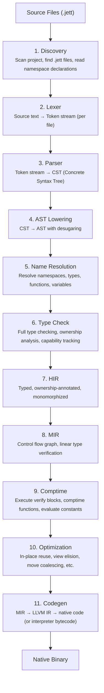
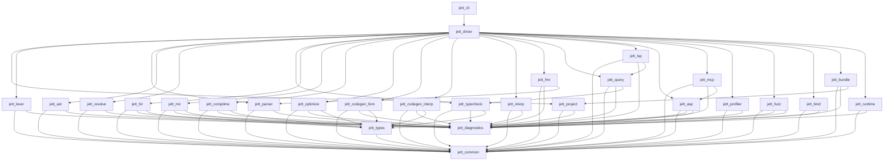
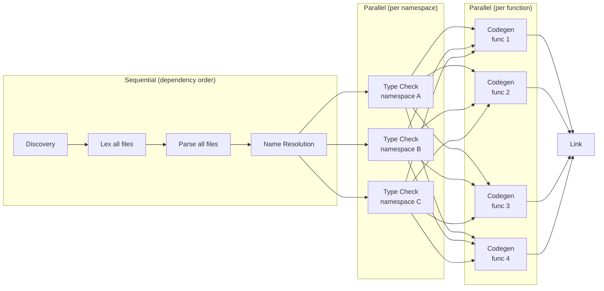
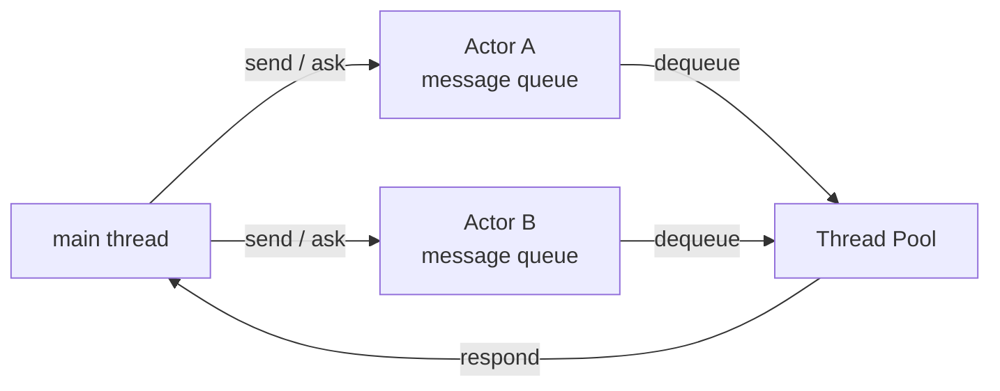

# Jett Compiler Architecture

## Overview

The Jett compiler (`jettc`) is a multi-pass, ahead-of-time compiler written in Rust that translates Jett source code into native machine code via LLVM. It also supports an interpreter mode for rapid prototyping (`jett run`). The architecture is designed around four goals:

1. **Correctness** — The type system is the most critical component. Linear types, capabilities, refinement types, state machines, and secret tracking must all be enforced with zero false negatives.
2. **Incremental compilation** — Sub-second recompilation for typical changes (Footnote 5 of the design doc). The architecture supports fine-grained caching at every phase.
3. **Dual output modes** — Human-readable terminal output and structured TOON output for LLM agents (ASP, Rule Set 21).
4. **Testability** — Every compiler phase is independently testable with clear input/output boundaries.

---

## High-Level Pipeline



---

## Crate Organization

The compiler is organized as a Cargo workspace with one crate per major phase. Crates have strict dependency ordering — no cycles, no upward dependencies. Shared types live in foundational crates.

```
jett/
├── Cargo.toml                  # Workspace root
├── crates/
│   ├── jett_common/            # Shared types: Span, FileId, Symbol, diagnostics
│   ├── jett_diagnostics/       # Error/warning types, TOON + human formatting
│   ├── jett_lexer/             # Tokenizer
│   ├── jett_parser/            # Parser → CST
│   ├── jett_ast/               # AST data structures and lowering from CST
│   ├── jett_resolve/           # Name resolution, namespace registry, import resolution
│   ├── jett_types/             # Type representations, type interning, type relationships
│   ├── jett_typecheck/         # Type checking, ownership analysis, capability tracking
│   ├── jett_hir/               # High-level IR: typed + monomorphized
│   ├── jett_mir/               # Mid-level IR: CFG-based, linear type verification
│   ├── jett_comptime/          # Compile-time interpreter (verify blocks, comptime fns)
│   ├── jett_optimize/          # Jett-level optimizations before codegen
│   ├── jett_codegen_llvm/      # LLVM IR generation via inkwell
│   ├── jett_codegen_interp/    # Bytecode generation for interpreter mode
│   ├── jett_interp/            # Bytecode interpreter for `jett run`
│   ├── jett_fmt/               # Code formatter (`jett format`)
│   ├── jett_query/             # Query engine for ASP/LSP (type-at, signature, completions)
│   ├── jett_lsp/               # Language Server Protocol implementation
│   ├── jett_asp/               # Agent Server Protocol (TOON output formatting)
│   ├── jett_mcp/               # MCP server wrapping ASP
│   ├── jett_profiler/          # Built-in CPU/memory profiler
│   ├── jett_fuzz/              # Property-based test runner and fuzzer
│   ├── jett_bind/              # C header → .jett binding generator
│   ├── jett_runtime/           # Runtime library linked into every binary (allocator, actors, strings)
│   ├── jett_bundle/            # Bundle multi-file projects into single distributable .jett
│   ├── jett_project/           # Project file (jett.proj) parsing, file discovery
│   ├── jett_driver/            # Orchestrates the full pipeline, CLI argument parsing
│   └── jett_cli/               # Binary entry point, subcommand dispatch
├── stdlib/                     # Standard library .jett files
├── tests/                      # Integration tests
│   ├── compile_pass/           # Programs that should compile successfully
│   ├── compile_fail/           # Programs that should produce specific errors
│   ├── run_pass/               # Programs that should compile and produce expected output
│   └── snapshots/              # Snapshot tests for AST, HIR, MIR, LLVM IR
└── docs/
    ├── design.md
    └── architecture.md
```

### Crate Dependency Graph



---

## Phase 1: Project Discovery (`jett_project`)

**Input:** A path to a `.jett` file or a directory containing `jett.proj`.

**Output:** A `Project` struct containing all source files, their paths, and basic metadata.

### Responsibilities

1. Locate `jett.proj` by walking up from the given path.
2. Parse the TOON-format project file (name, version, entry point).
3. Recursively discover all `.jett` files in the project directory, including vendored dependencies in `deps/` (Rule Set 14). Dependencies are `.jett` source files tracked in git — no package registry, no lock file.
4. Assign each file a unique `FileId` (integer handle for source tracking).
5. Read file contents into an arena-allocated string store for zero-copy access.

### Key Data Structures

```
Project {
    name: String,
    version: String,
    entry_file: FileId,
    files: Vec<SourceFile>,
}

SourceFile {
    id: FileId,
    path: PathBuf,
    content: String,                    // Owned source text
    namespaces: Vec<NamespaceSpan>,     // All namespace declarations in this file
}

NamespaceSpan {
    name: Symbol,           // e.g. "auth" or "net.http.server"
    byte_offset: u32,       // Where in the file this namespace block starts
}
```

### Design Decisions

- **File contents are loaded once and stored in an arena.** All subsequent phases reference file content by `FileId` + byte offset (`Span`). No re-reading.
- **Namespace pre-scan.** Before full lexing, the discovery phase does a lightweight scan of each file to extract all `namespace` declarations. A single file can contain multiple namespaces (Rule Set 22). This builds the namespace registry needed for two-pass resolution.

---

## Phase 2: Lexer (`jett_lexer`)

**Input:** Source text (referenced by `FileId`).

**Output:** `Vec<Token>` — a flat array of tokens with spans.

### Token Design

```
Token {
    kind: TokenKind,
    span: Span,
}

Span {
    file: FileId,
    start: u32,      // Byte offset into source
    end: u32,        // Byte offset into source
}
```

`TokenKind` is an enum covering:
- **Keywords:** `Function`, `Return`, `Returns`, `If`, `Else`, `For`, `In`, `Into`, `While`, `Struct`, `Enum`, `Match`, `Use`, `Mutable`, `Handle`, `Error`, `Default`, `Result`, `Ok`, `Fail`, `Clone`, `View`, `Type`, `Where`, `Machine`, `States`, `Transitions`, `To`, `At`, `Is`, `Actor`, `Receive`, `Send`, `Ask`, `Respond`, `Spawn`, `Run`, `Join`, `Cancel`, `Comptime`, `Verify`, `Property`, `Given`, `Trace`, `Breakpoint`, `Secret`, `Declassify`, `Coarsen`, `Serialize`, `Namespace`, `Bitfield`, `Bit`, `Bits`, `Network` (bitfield byte-order modifier), `Implement`, `Interface`, `Mutual`, `Assert`, `Some`, `None`, `Nothing`, `True`, `False`, `Modulo`, `As`, `Break`, `Continue`, `And`, `Within`, `Self_`, `Value`, `Transition`, `Optional`, `Other` (match catch-all), `Not` (boolean negation keyword — used as `not x`, replaces `!` prefix per Rule Set 1's keyword-over-symbol preference)
- **Type keywords:** `Int8`, `Int16`, `Int32`, `Int64`, `Uint8`, `Uint16`, `Uint32`, `Uint64`, `Float32`, `Float64`, `String_`, `Bool_`, `Bytes_`, `List_`, `Map_`, `Set_`. These are reserved keywords, not identifiers — they are tokenized distinctly so the parser can recognize type annotations unambiguously.
- **Literals:** `IntLiteral`, `FloatLiteral`, `StringLiteral` (with interpolation segments), `BoolLiteral`
- **Symbols:** `Eq`, `EqEq`, `NotEq`, `Lt`, `Gt`, `LtEq`, `GtEq`, `Plus`, `Minus`, `Star`, `Slash`, `AmpAmp`, `PipePipe`, `Bang`, `Dot`, `Comma`, `Colon`, `LParen`, `RParen`, `LBracket`, `RBracket`, `Hash`
- **Structural:** `Newline`, `Indent`, `Dedent`, `Eof`

### Indentation Handling

The lexer tracks indentation levels using a stack. At each line start:
1. Count leading spaces (must be a multiple of 4 — emit error otherwise).
2. Compare to the current indentation level.
3. If deeper: push level, emit `Indent` token.
4. If shallower: pop levels until matching, emit one `Dedent` per level popped.
5. If same: no structural token needed.

This converts Python-style whitespace into explicit `Indent`/`Dedent` tokens that the parser consumes like braces. Tabs, trailing whitespace, and non-multiple-of-4 indentation are lexer errors.

### String Interpolation

String literals with `{expr}` are tokenized as a sequence:
`StringStart`, tokens for the expression, `StringMid` (for text between expressions), ..., `StringEnd`.

This lets the parser handle interpolated expressions using the same expression parsing logic.

### Design Decisions

- **No multi-pass lexing.** The lexer is single-pass, streaming tokens. It does not need the full file in memory beyond what's currently being tokenized.
- **All errors are recoverable.** The lexer emits an `Error` token and continues. This allows the parser to report multiple errors per file.
- **Spans are byte offsets, not line/column.** Line/column computation is deferred to diagnostics rendering. This is cheaper and allows lazy line-table computation.

---

## Phase 3: Parser (`jett_parser`)

**Input:** `Vec<Token>` from the lexer.

**Output:** CST (Concrete Syntax Tree) — a lossless, fully-faithful representation of the source.

### Parser Strategy: Recursive Descent with Pratt Parsing

- **Recursive descent** for statements and declarations (function, struct, enum, etc.).
- **Pratt parsing** (precedence climbing) for expressions — handles arithmetic operators, comparisons, boolean operators, and `modulo` with correct precedence.
- **Error recovery:** On a parse error, the parser skips to the next `Dedent` at the current level or `Newline`, emitting an error node. This allows reporting multiple errors per file.

### CST vs AST

The CST preserves every token including whitespace, comments, and exact formatting. This is needed for:
- **`jett format`** — the formatter works on the CST to preserve/restructure whitespace.
- **LSP** — syntax highlighting, goto-definition, etc. need exact source positions.
- **JSON AST round-tripping** (Rule Set 3) — lossless source ↔ AST conversion.

The CST uses a flat arena-allocated representation (like `rowan` in rust-analyzer) for memory efficiency.

### Key CST Node Types

```
File            → (NamespaceDecl (TopLevelItem)*)+    // One or more namespace blocks per file
TopLevelItem    → FunctionDef | StructDef | EnumDef | InterfaceDef |
                  ImplementBlock | MachineDef | ActorDef | TypeAlias |
                  VerifyBlock | PropertyBlock | MutualBlock | BitfieldDef |
                  ConstDecl
FunctionDef     → ('export')? 'function' Name GenericParams? '(' ParamList ')' 'returns' Type ':' Block
StructDef       → ('export')? 'struct' Name ':' FieldList FunctionDef*    // Fields may have 'serialize "jsonName"' annotation
EnumDef         → ('export')? 'enum' Name ':' VariantList      // Variants may have data fields or integer values (e.g., tcp = 6)
MachineDef      → 'machine' Name ':' StatesBlock TransitionsBlock
ActorDef        → 'actor' Name '(' ParamList ')' ':' (ReceiveHandler)*
BitfieldDef     → ('export')? ('network')? 'bitfield' Name ':' BitfieldList  // Fields: 'name: N bits' (1..63 => int64, 64 => uint64), 'name: N bits as EnumType', or 'payload: list[uint8]'
TypeAlias       → ('export' ('root')?)? 'type' Name GenericParams? '=' Type ('where' Expr)?
                # 'export root type' is stdlib-only and currently restricted to root compatibility aliases.
VerifyBlock     → 'verify' Name ':' Block
PropertyBlock   → 'property' Name ':' GivenDecls Block
InterfaceDef    → ('export')? 'interface' Name ':' FunctionSignature*
ImplementBlock  → 'implement' Name 'for' Name ':' FunctionDef*
MutualBlock     → 'mutual' ':' MutualSignature*
MutualSignature → ('export')? FunctionSignature

MatchArm        → Pattern ':' Block      // Pattern includes variant destructure or 'other' catch-all

Statement       → VarDecl | Assignment | ExprStmt | ReturnStmt |
                  IfStmt | ForStmt | WhileStmt | MatchStmt |
                  UseDecl | TraceStmt | BreakpointStmt | BreakStmt |
                  ContinueStmt | SendStmt | RespondStmt | AssertStmt

Expression      → Literal | Ident | BinaryExpr | UnaryExpr |
                  FunctionCall | FieldAccess | PipelineExpr |
                  StructConstruction | ListConstruction | MapConstruction | SetConstruction |
                  StringInterpolation | HandleExpr | CloneExpr |
                  CoarsenExpr | DeclassifyExpr | RunExpr | JoinExpr |
                  CancelExpr | SpawnExpr | AskExpr | IfExpr |
                  AnonymousFunctionExpr | ViewExpr | ComptimeExpr |
                  TransitionExpr | IsExpr | AtExpr
```

---

## Phase 4: AST Lowering (`jett_ast`)

**Input:** CST.

**Output:** AST — a cleaner, desugared representation dropping trivia (whitespace, comments).

### Desugaring Performed

1. **Pipeline desugaring:** `x into f(y)` → `f(x, y)`. Multi-step pipelines become sequential let-bindings. Pipeline steps with `handle error:` / `handle:` are desugared to handle blocks on the intermediate call. Pipeline steps with `view` (e.g., `into view json.serialize[T]`) are desugared to pass the piped value as a view argument.
2. **String interpolation:** `"hello {name}"` → series of `Displayable.display()` calls joined together. This is a compiler-stdlib coupling — the compiler has hardcoded knowledge of the `Displayable` interface.
3. **`else if` chains:** Lowered to nested `if/else` in the AST.
4. **`for item in view items:`** → loop with explicit view semantics annotated.
5. **Named arguments:** Reordered to match parameter declaration order with source mapping preserved.
6. **`== X within Y`:** Approximate float comparison in verify/property blocks is desugared to `math.abs(left - right) <= Y`.
7. **No nested function calls as arguments:** `f(g(x))` is rejected at this phase (Rule Set 19). The caller must bind `g(x)` to a variable first. String interpolation is the only exception — inline expressions like `"hello {string.upper(name)}"` are allowed.

### AST Design Principles

- **Every node has a `Span`** for error reporting.
- **Every node has a unique `NodeId`** for incremental compilation cache keys.
- **The AST is immutable** once constructed. Subsequent phases annotate it via side-tables (HashMap<NodeId, T>), not by mutating AST nodes.
- **Interned strings.** All identifiers are interned via salsa's `#[salsa::interned]` as `Symbol` (integer handle). Comparisons are O(1).
- **Top-level items are salsa tracked structs.** Each function, struct, enum, etc. is a salsa tracked struct with identity fields. This enables item-level incremental recomputation. Function bodies are stored in local arenas within the tracked struct, not in a global arena.

---

## Phase 5: Name Resolution (`jett_resolve`)

**Input:** AST + Namespace registry from discovery.

**Output:** A `ResolveResult` mapping every name reference to its definition.

### Two-Pass Resolution

1. **Declaration pass (top-down per file):**
   - Register all top-level declarations (functions, structs, enums, machines, actors, interfaces, type aliases, bitfields) into a per-namespace symbol table.
   - Respect strict top-to-bottom ordering (Rule Set 4): a declaration is only visible to code that follows it.
   - Handle `mutual` blocks: register all signatures in the mutual block before processing their bodies.
   - Record namespace visibility: declarations in an explicit namespace are private by default unless marked `export`.

2. **Reference pass:**
   - Walk all expressions and resolve identifiers to their declarations.
   - Resolve `use` statements: look up the namespace registry, bind the last segment (or `as` alias) in the function's local scope.
   - Enforce namespace visibility: code outside a namespace can reference only exported declarations, and must do so through the qualified namespace path or an explicit namespace alias.
   - Enforce: no forward references, no circular imports, no unused imports, no unused variables, no variable shadowing.

### Key Data Structures

```
NamespaceRegistry {
    namespaces: HashMap<Symbol, NamespaceId>,
    namespace_to_file: HashMap<NamespaceId, (FileId, u32)>,  // FileId + byte offset (multiple namespaces per file)
}

SymbolTable {
    scopes: Vec<Scope>,       // Stack of scopes (function, block, etc.)
}

Scope {
    bindings: HashMap<Symbol, DefId>,
    parent: Option<ScopeId>,
}

ResolveResult {
    references: HashMap<NodeId, DefId>,    // Maps usage → definition
    definitions: HashMap<DefId, DefInfo>,  // Maps DefId → definition metadata
}
```

### Enforcement at This Phase

- **No forward references** (except within `mutual` blocks).
- **No variable shadowing** — a binding in an inner scope cannot reuse a name from an outer scope.
- **No unused imports** — every `use` must be referenced.
- **No unused variables** — every variable declaration must be referenced.
- **Inline-only imports** — `use` statements are only allowed inside functions/blocks, never at file level. Within a function, `use` must appear before any other code.
- **Duplicate namespace detection** — two project/dependency files declaring the same namespace is an error. Compiler-shipped stdlib files have a narrow fragment exception so one stdlib namespace can be split across several implementation files; duplicate declarations inside that namespace still fail normally.
- **Global constants** — registered as top-level declarations (global mutable variables are forbidden).
- **No circular imports** — if namespace A uses namespace B and B uses A, it's a compile error.
- **Import aliasing** — `use net.http as net_http` binds the alias in local scope. Conflicting last-segment names require `as`.
- **Parent namespace aggregation** — `use net.http` imports all child namespaces (`net.http.server`, `net.http.client`) when `net.http` itself is not a declared namespace but its children are. Accessing child items uses the last segment: `server.listen(...)`, `client.get(...)`.
- **Namespace exports** — namespaced declarations are private to their declaring namespace by default. `export` marks public API declarations, but outside code must still use `namespace.name` or a `use ... as ...` alias; exported names are not inserted into the global flat scope.

---

## Phase 6: Type Checking (`jett_typecheck`)

This is the most complex phase of the compiler. It enforces the majority of Jett's semantic rules.

**Input:** AST + `ResolveResult`.

**Output:** `TypedTree` — an annotated AST with type information on every expression, plus ownership and capability annotations.

### Sub-Phases (executed in order)

#### 6a. Type Collection

Walk all type declarations and build the type registry:

- **Primitive types:** `int8`..`int64`, `uint8`..`uint64`, `float32`, `float64`, `string`, `bool`, `bytes`, `nothing`. (`bytes` is a raw byte buffer with no UTF-8 guarantee, distinct from `string`.)
- **Built-in generic types:** `list[T]`, `map[K, V]`, `set[T]`, `optional[T]`, `result[T, E]`.
- **User-defined types:** structs, enums, machines, actors, bitfields, interfaces, type aliases (including refinement types).
- **Function types:** `function(T) returns U`.
- **Capability types:** `Filesystem`, `Network`, `Stdout`, `Stderr`, `Stdin`, `Clock`, `Random`, `Process`, `Environment`.
- **Secret wrapper:** `secret[T]`.
- **State-qualified types:** `Machine at state`.
- **Built-in error types:** `CancelledError` (returned when a cancelled task's next I/O operation executes).
- **Built-in utility types:** `StringPosition` (opaque iterator position returned by `string.find`, not a byte offset).

Types are interned for O(1) comparison: each unique type gets a `TypeId`. The type interner deduplicates structurally equal types.

**Standard library interfaces** are registered as built-in types during this phase:

| Interface | Implemented by | Used for |
|---|---|---|
| `Equatable` | `int64`, `float64`, `string`, `bool` | `==`, `!=` |
| `Orderable` | `int64`, `float64`, `string` | `<`, `>`, `<=`, `>=` |
| `Displayable` | `int64`, `float64`, `string`, `bool` | String interpolation `{expr}` (compiler-stdlib coupling) |
| `Hashable` | `int64`, `string`, `bool` | `map` keys, `set` elements |
| `Serializable` | All structs, all primitives | `json.serialize[T]()`, `json.parse[T]()`, `json.parse_exact[T]()` |

These are ordinary `implement` blocks in the standard library, but the compiler has hardcoded knowledge of `Displayable` (for string interpolation) and `Serializable` (for auto-generated serialization).

#### 6b. Interface Verification

For every `implement Interface for Type` block:
- Verify that every function in the interface is implemented.
- Verify that the implemented function signatures match the interface signatures exactly.
- Register the implementation for later trait constraint checking.

#### 6c. Expression Type Checking

Bottom-up type checking of every expression:

- **Literal inference:** `42` → `int64`, `3.14` → `float64`, `"hello"` → `string`, `true`/`false` → `bool`.
- **Variable references:** look up the type from the variable's declaration.
- **Function calls:** verify argument types match parameter types, verify generic type parameters, verify return type.
- **No implicit conversions** — `int64` is not `float64`. Every mismatch is an error with a hint.
- **Refinement type assignments:** wrapping a base type in a refinement type is fallible → must have `handle error:`.
- **Handle blocks:** verify that `handle error:` is used on `result[T, E]` and `handle:` on `optional[T]`. Verify handle blocks end with `return` or `default`. The `default` keyword inside a handle block is part of the `HandleExpr` structure — it provides a fallback value and resumes normal execution.
- **Coarsen expressions:** `coarsen value` converts a refinement type to an ancestor type. The target type is determined by the variable declaration's type annotation on the left side. The type checker walks the refinement chain to verify the target is a valid ancestor.
- **Match exhaustiveness:** verify all enum variants are covered.
- **Constrained generics:** For `function sort[T implements Orderable](...)`, verify that type arguments at call sites implement the required interfaces. Multiple constraints use `and` (e.g., `T implements Orderable and Displayable`). Unconstrained `T` can only be stored and passed around — no operations.
- **`is` expressions:** In comptime context, `T is int64` checks if a generic type parameter matches a concrete type (resolved at compile time). In runtime context, `value is Variant` checks enum discriminant (compiled to integer comparison).
- **`at` expressions:** `machine_var at state_name` checks if a state machine is in a specific state. Compiled to state tag comparison.
- **Valued enums:** Enums with explicit integer values (e.g., `tcp = 6`) use the specified integers as discriminants instead of auto-assigned values. These integrate with bitfield `as EnumType` annotations — the codegen maps between the integer value in the bitfield and the enum variant.
- **Return value consumption:** A function call that returns anything other than `nothing` cannot appear as a standalone `ExprStmt`. The return value must be bound to a variable. This is enforced here for all types (not just linear ones — even `int64` returns must be consumed).
- **Generic monomorphization:** record all concrete type parameter instantiations for later HIR generation.

#### 6d. Ownership Analysis (Linear Type Checking)

This sub-phase tracks the ownership state of every variable through the control flow:

**Variable states:**
- `Owned` — the variable holds an owned value.
- `Viewed` — the variable is a `view` (read-only borrow).
- `Consumed` — the variable has been moved/consumed and is no longer valid.
- `Pending` — the variable was produced by `run` and cannot be used until `join`ed or `cancel`led.
- `Uninitialized` — before first assignment.

**Rules enforced:**
- A variable can only be used once unless it is a `view` or a primitive (primitives are implicitly copyable).
- After a variable is passed to a non-`view` parameter, it becomes `Consumed`.
- Using a `Consumed` variable is a compile error.
- `view` parameters can read but not consume.
- `view` values cannot be returned, stored in structs, or sent to actors.
- `clone` creates an owned copy from an owned or viewed value.
- `mutable` variables can be rebound after their value is consumed.
- **For loops:** `for item in items` consumes `items`; `for item in view items` borrows `items`.
- **Run/join:** `run` marks a value as pending; it cannot be used until `join`ed.
- **No orphaned tasks:** every `run` must have a matching `join` or `cancel` before the function returns.
- **No rebinding while viewed:** The owner of a variable cannot rebind it while a `view` to it exists. This prevents `items = new_list` inside a `for item in view items:` loop body, and prevents rebinding a variable that was passed as `view` to a `run` task until the task is `join`ed or `cancel`led.
- **Cancellation semantics:** `cancel task` sets a cancellation flag. The task is not killed immediately — the next capability use (I/O operation) inside the cancelled task returns a `CancelledError`. The task handle remains live and must still be `join`ed.
- **View propagation:** Views propagate through field access and collection element access. `view list[T]` element access yields `view T`, not an owned copy. `clone` is required to get an owned value from a view.
- **Closure capture analysis:** Anonymous functions can capture **immutable** values from the enclosing scope. Captured values are implicitly viewed — they are not consumed by the closure. Closures over **mutable** state are a compile error. The ownership analyzer verifies that all captured variables are either immutable bindings or primitives.

**Implementation strategy:** Abstract interpretation over the control flow graph. At each program point, maintain a mapping from variable → ownership state. At control flow joins (if/else merge points, loop entries), states must be compatible:

```
OwnershipEnv {
    states: HashMap<DefId, OwnershipState>,
}

// At merge points:
// - If both branches consume a variable → consumed
// - If one branch consumes and the other doesn't → error (variable may or may not be valid)
// - If both branches leave it owned → owned
```

#### 6e. Capability Analysis

Track which capabilities flow through the program:

- A function with no capability parameters is **pure** — the compiler guarantees it.
- A function that calls another function requiring a capability must itself accept that capability.
- Capability narrowing consumes the original and produces a restricted version. All narrowing operations: `Filesystem.read_only(fs)`, `Filesystem.scoped(fs, "/data/")`, `Network.allow(net, "localhost")`, `Stdout.buffered(stdout)`. The runtime enforces restricted permissions (e.g., `read_only` prevents write operations, `scoped` restricts file paths).
- **Only `main()` owns capabilities.** Every other function must borrow them via `view`. A non-`main` function declaring an owned (non-view) capability parameter is a compile error.
- Actors receive capabilities at spawn time via `clone` (since passing would consume the caller's capability).
- **Verify blocks** can only call pure functions (no capabilities).
- **`trace` and `breakpoint` are capability-exempt** — they produce output/open connections without requiring a `Stdout` or `Network` capability. They are compiler keywords with special treatment, compiled out in release mode.

**Implementation:** For each function, compute the set of capabilities it transitively requires. Compare against its declared parameters. If a function's body requires a capability not in its parameters → compile error.

#### 6f. Secret Taint Analysis

Track `secret[T]` values through the program:

- **Taint propagation:** Any operation on a `secret[T]` produces a `secret[T]`. When a `secret[string]` is passed to a function expecting `string`, the type checker automatically lifts the function through `secret` — the call is valid but the return type becomes `secret[ReturnType]`. This is a special type-checking rule for secret types only.
- `secret[T]` cannot be passed to `Stdout.write`, `json.serialize`, string interpolation, or any output function.
- `declassify` is the only way to extract the inner value.
- `secret.redact()` and `secret.compare()` are safe operations that don't declassify.
- `json.serialize` on a struct with secret fields is a compile error -> use `json.serialize_public`. Public JSON serialization omits secret-bearing record/bitfield fields; it may descend through containers to project nested records, but rejects secret wrappers and secret-bearing enums when their secret data cannot be projected away through record/bitfield fields. A future explicit full-serialization path can require a declassification token.
- **Secret refinement types:** For `type ApiKey = secret[string] where string.char_count(value) == 40`, the `where` clause operates on the inner `string` value — the constraint function implicitly receives the unwrapped value for validation purposes only.

#### 6g. State Machine Validation

For each `machine` type:
- Validate that all transitions reference declared states.
- At each `transition()` call, verify:
  - The source state matches the machine's current state type.
  - The transition is declared in the machine's `transitions` block.
  - All state-specific data fields are provided.
- Function parameters with `Machine at state` are only callable when the machine is in that state.

#### 6h. Complexity Limits Enforcement

At the end of type checking each function:
- Count statements (excluding `use` declarations) — max 100.
- Compute nesting depth — max 4 levels.
- Count parameters — max 6.
- Compute cyclomatic complexity — max 10.

These are compile errors, not warnings.

---

## Phase 7: High-Level IR (`jett_hir`)

**Input:** TypedTree from Phase 6.

**Output:** HIR — a fully monomorphized intermediate representation.

### Purpose

The HIR is the first representation where generic functions are fully expanded. Each call to `sort[int64]` and `sort[string]` produces a separate HIR function. The HIR is also where desugaring is complete — no more syntax sugar, just core operations.

### Key Transformations

1. **Monomorphization:** Generate concrete versions of all generic functions for each type parameter combination used in the program.
2. **Method resolution:** `Dog.speak(view my_dog)` is resolved to the specific `implement Speaker for Dog` function.
3. **Auto-view for field access:** `self.x` is annotated as an implicit view operation.
4. **Primitive copyability:** Primitive types (`int64`, `float64`, `bool`, `string`) are marked as implicitly copyable — they don't follow linear consumption rules.
5. **Comptime reflection lowering:** Preserve enough type metadata for comptime code to inspect `type.name[T]()`, `type.kind[T]()`, `type.has_secret[T]()`, `type.fields[T]()`, and bitfield layout metadata. JSON serialization should be expressible in terms of these reflection primitives rather than as format-specific HIR magic. Struct, bitfield, and enum deserialization can now use the `TypeConstruction` builder to build `T` from parsed field values; the final construction-block syntax is still pending.

---

## Phase 8: Mid-Level IR (`jett_mir`)

**Input:** HIR.

**Output:** MIR — a control-flow-graph-based representation.

### Purpose

The MIR decomposes functions into basic blocks connected by control flow edges. This representation is ideal for:

- **Linear type verification** — definitive ownership analysis on the CFG.
- **Comptime evaluation** — the comptime interpreter operates on MIR.
- **Optimization** — dead code elimination, constant folding, in-place reuse detection.
- **Codegen** — LLVM IR maps naturally from CFG-based MIR.

### MIR Structure

```
MirParam {
    name: Symbol,
    type_id: TypeId,
    ownership: OwnershipMode,    // Owned or View
}

MirFunction {
    name: Symbol,
    params: Vec<MirParam>,
    return_type: TypeId,
    is_pure: bool,            // No capability parameters — safe for comptime, memoization
    blocks: Vec<BasicBlock>,
    entry: BlockId,
}

BasicBlock {
    id: BlockId,
    statements: Vec<MirStatement>,
    terminator: Terminator,
}

Terminator {
    Return(MirOperand),
    Branch { condition: MirOperand, true_block: BlockId, false_block: BlockId },
    Jump(BlockId),
    Unreachable,
}

MirStatement {
    Assign { dest: MirPlace, value: MirRvalue },
    Drop(MirPlace),                              // Linear type: value freed here
    Call { dest: MirPlace, func: FuncId, args: Vec<MirOperand> },
    ViewBorrow { dest: MirPlace, source: MirPlace },
    ViewRelease(MirPlace),
    Clone { dest: MirPlace, source: MirPlace },
    Trace(MirPlace),                             // Instrumentation for trace keyword
    Nop,
}
```

### Definitive Ownership Verification

The MIR phase performs a final, CFG-based ownership check to catch issues that the AST-level analysis might miss at complex control flow joins. This is the last line of defense before codegen.

---

## Phase 9: Comptime Evaluation (`jett_comptime`)

**Input:** MIR (for comptime-marked functions and verify blocks).

**Output:** Evaluated constant values, verify pass/fail results.

### Comptime Interpreter

The comptime interpreter is a MIR interpreter that executes functions at compile time. It operates on a virtual memory model:

```
ComptimeVM {
    memory: HashMap<Address, ComptimeValue>,
    call_stack: Vec<ComptimeFrame>,
    constants: Vec<(DefId, ComptimeValue)>,    // Results cached here
}

ComptimeValue {
    Int64(i64),
    Float64(f64),
    String(String),
    Bool(bool),
    Bytes(Vec<u8>),
    List(Vec<ComptimeValue>),
    Map(BTreeMap<ComptimeValue, ComptimeValue>),
    Set(BTreeSet<ComptimeValue>),
    Struct { type_id: TypeId, fields: Vec<ComptimeValue> },
    Enum { type_id: TypeId, variant: Symbol, fields: Vec<ComptimeValue> },
    Optional(Option<Box<ComptimeValue>>),           // none or some(value)
    Result { ok: bool, value: Box<ComptimeValue> }, // ok(value) or fail(error)
    Nothing,
}
```

### What Runs at Comptime

1. **`verify` blocks** — All assertions are evaluated. Any failure stops compilation.
2. **`comptime` functions** — Called from runtime code, results are baked into the binary as constants.
3. **`comptime` expressions** — `if comptime is_numeric[T]()` branches are resolved, dead branches are eliminated.
4. **Refinement type constraints on literals** — `Port p = 80` validates `80 >= 1 && 80 <= 65535` at compile time.
5. **Bitfield literal validation** — `ColorChannel(red: 300, ...)` catches the out-of-range value at compile time.

### Comptime Type Reflection

The comptime interpreter supports basic type-level reflection for generic type parameters:
- `T is int64` — checks if a type parameter matches a concrete type (returns `bool`).
- `T.name` — returns the type's name as a string (e.g., `"int64"`, `"User"`).

These are built-in operations of the comptime interpreter that query the compiler's type table. They enable `if comptime` branching on type properties.

### Capability Restriction

The comptime interpreter refuses to execute any function that takes capability parameters. If a `verify` block tries to call an impure function, it's a compile error. This is checked before interpretation begins.

---

## Phase 10: Optimization

Optimization in Jett happens at **three levels**: Jett-level MIR optimizations that leverage ownership knowledge LLVM cannot have, LLVM IR annotations that guide LLVM's optimizer, and compilation speed optimizations that keep the build-fix loop fast.

### 10a. Jett MIR Optimizer (`jett_optimize`)

**Input:** MIR.

**Output:** Optimized MIR.

These optimizations exploit Jett's linear type system — the compiler has **perfect alias information** (no value is ever aliased) and **perfect lifetime information** (every value's last use is statically known). LLVM cannot derive this information from the IR alone.

#### Ownership-Aware Optimizations

1. **In-place reuse (consume-transform pattern):** When a value is consumed and immediately transformed (`x = transform(x)`), the compiler detects that the old value has no other references and mutates the underlying memory in-place. This turns `list.append(old_list, item)` into a genuine in-place buffer append (no copy), and `struct.with_field(old_struct, new_value)` into a field write on the existing allocation. This is the single highest-impact Jett-specific optimization — it turns what looks like immutable functional code into zero-copy imperative code.

2. **Move coalescing:** When a value is moved through a chain of single-use variables (`a` → `b` → `c` → `f(c)`), the intermediate names are eliminated and the value stays in the same memory location. No intermediate allocations or copies.

3. **Last-use drop sinking:** The compiler knows the exact last use of every value. Instead of dropping a value at scope exit, it inserts the `Drop` immediately after the last use. This frees memory earlier, reducing peak memory usage.

4. **View elimination:** Views are raw pointers with zero runtime overhead. When a view's lifetime is entirely within a single statement, the compiler can pass the pointed-to value directly without materializing a pointer.

5. **Dead allocation elimination:** If a value is allocated and then consumed by a function that doesn't actually read all of its fields, the unused fields were never needed. The compiler can skip allocating them (partial allocation).

6. **Struct field reuse across calls:** When a function takes a struct by ownership, modifies one field, and returns it, the compiler detects that the input and output share the same allocation and skips the copy for unchanged fields.

#### Pure Function Optimizations

Because the capability system provably identifies pure functions (Rule Set 2), the compiler can:

7. **Pure function memoization:** If a pure function is called multiple times with the same arguments within a function body, the compiler can cache the result. This is safe because pure functions have no side effects.

8. **Pure function reordering:** Pure function calls can be reordered freely for better instruction scheduling or memory locality. Calls that don't depend on each other can be interleaved.

9. **Dead pure call elimination:** A pure function call whose result is never used can be eliminated entirely (it has no side effects, so removing it changes nothing). Note: this cannot apply to impure functions — even if the result is unused, the side effect must occur.

10. **Constant propagation through pure functions:** If all arguments to a pure function are known at compile time, the call can be evaluated at compile time (folded into a constant). This extends the comptime engine's reach — even functions not explicitly marked `comptime` can be folded if their inputs are known.

#### Control Flow Optimizations

11. **Comptime branch elimination:** After comptime evaluation resolves `if comptime ...` branches, the dead branches are removed entirely from the MIR. This eliminates unreachable code before it reaches LLVM.

12. **State machine transition devirtualization:** When a state machine's current state is known at a call site (e.g., immediately after a transition), `match` expressions on that state can be resolved to the single matching arm.

13. **Refinement range propagation:** When a value has a refinement type (e.g., `Port` with `value >= 1 && value <= 65535`), the range information is propagated through arithmetic operations, enabling bounds check elimination and narrower integer representations.

### 10b. LLVM IR Annotations (`jett_codegen_llvm`)

When generating LLVM IR, the codegen phase emits metadata and attributes that tell LLVM what Jett's type system has proven. This enables LLVM optimizations that would be impossible without this information.

#### Function Attributes

Every Jett function gets these LLVM attributes:

| Attribute | Condition | Effect |
|---|---|---|
| `nounwind` | All functions (Jett has no exceptions) | Eliminates unwind tables and landing pads. Simpler CFG enables better optimization. Uses `call` instead of `invoke` everywhere. |
| `willreturn` | All non-looping functions | LLVM can assume the function terminates. Enables dead code elimination after calls. |
| `mustprogress` | All functions | Required by LLVM to optimize assuming forward progress. |
| `noundef` | All parameters | The value is never `undef` or `poison`. Jett has no uninitialized variables. |

Pure functions additionally get:

| Attribute | Condition | Effect |
|---|---|---|
| `readnone` | Pure function with no view parameters | The function reads no memory at all. LLVM can freely reorder, eliminate, or hoist it. |
| `readonly` | Pure function with view parameters | The function only reads memory through its view parameters. No writes. |
| `memory(argmem: read)` | Pure function that only reads through argument pointers | Modern LLVM syntax (15+). More precise than `readonly` — tells LLVM no global memory is accessed. |
| `memory(argmem: readwrite)` | Impure function that only accesses argument memory | Tells LLVM the function cannot affect global state — only the memory reachable through its parameters. |
| `nosync` | Pure functions | No synchronization operations. Safe to parallelize. |
| `nofree` | Pure functions | Does not free memory. LLVM can assume pointers remain valid across the call. |
| `speculatable` | Pure functions with no view parameters | The function can be speculatively executed with no side effects regardless of inputs. Enables hoisting calls out of conditional branches. |

Error handling and panic paths get:

| Attribute | Condition | Effect |
|---|---|---|
| `cold` | Panic handler, assert failure handler | Tells LLVM this code is rarely executed. Prevents inlining cold code into hot paths. Improves instruction cache locality. |
| `noinline` | Panic handler, assert failure handler | Prevents LLVM from inlining error handling code, keeping the hot path compact. |

#### Pointer Annotations

Linear types give Jett something most languages cannot provide — **universal `noalias`**:

| Annotation | Where applied | Effect |
|---|---|---|
| `noalias` | Every owned pointer parameter | Guarantees the pointer does not alias any other pointer accessible to the function. LLVM can assume stores through this pointer don't affect loads through other pointers. This is Jett's most powerful optimization enabler — most languages can only apply `noalias` to restricted cases. |
| `noalias` | Return values of allocation functions | The returned pointer doesn't alias anything in the caller's scope. Emitted on every function that returns a newly allocated value. |
| `nonnull` | Every non-optional pointer | The pointer is never null. Eliminates null checks and enables folding. |
| `dereferenceable(N)` | Pointers to known-size types | The pointer points to at least N bytes of valid memory. Enables speculative loads and load hoisting. |
| `align(N)` | All pointers | Alignment guarantee for the pointed-to type. Enables aligned loads/stores and vectorization. |
| `!range` metadata | Refinement-typed integers, enum discriminants, booleans | Tells LLVM the value is within a specific range (e.g., `Port` is 1–65535, `bool` is 0–1). Enables branch folding and narrowing. |

#### Memory Access Annotations

| Annotation | Where applied | Effect |
|---|---|---|
| `llvm.lifetime.start` / `end` | Every local value | Precise lifetime boundaries from linear type analysis. The compiler knows the exact point of last use — more precise than C/C++ where lifetimes extend to scope exit. LLVM reuses stack slots more aggressively. |
| `!tbaa` (Type-Based Alias Analysis) | Every load/store | One TBAA node per primitive type and per struct type. Tells LLVM that an `int64*` and a `string*` never alias, even without `noalias`. |
| `!invariant.load` | Loads through `view` parameters | Views are read-only — the pointed-to memory cannot change during the view's lifetime. LLVM can cache the loaded value and eliminate redundant loads. |
| `!prof` (branch weights) | `handle error:` / `handle:` branches | Error paths are marked as unlikely (`!prof !{"branch_weights", i32 1, i32 2000}`). LLVM lays out the hot path linearly for instruction cache locality. |

#### Data Layout Optimizations

**Struct field reordering:** LLVM does **not** reorder struct fields — the frontend must handle this. The codegen sorts struct fields by alignment (descending) to minimize internal padding. An `int64` (8-byte aligned) followed by an `int8` wastes 7 bytes of padding; sorting by alignment eliminates this waste. The source-level field order is preserved in debug info, but the memory layout is optimized.

**Enum niche optimization:** For `optional[T]` where `T` is a pointer type (non-nullable), the compiler can represent the optional as a nullable pointer — `none` is null, `some(value)` is the pointer itself. This eliminates the discriminant byte entirely. Similarly, `optional[bool]` can use a three-state byte (0 = false, 1 = true, 2 = none). The `!range` metadata communicates valid values to LLVM.

**Tail call optimization:** For functions in tail position (the call immediately precedes `return`), the compiler emits the `tail` LLVM attribute. When the linear type system can prove that all owned values have been consumed before the tail call (no destructors to run after), the compiler emits `musttail` for guaranteed tail call elimination. This is particularly useful for state machine dispatch and recursive algorithms.

#### The `noalias` Advantage

This deserves emphasis. In C, `restrict` is a programmer promise that's rarely used and often wrong. In Rust, `noalias` is emitted on `&mut T` references but not on shared `&T` references (because multiple `&T` can alias). In Jett, **every owned parameter is `noalias`** because linear types guarantee single ownership — no other pointer in the entire program points to the same data. This gives LLVM more optimization freedom than it gets from virtually any other language.

The compound effect is significant: `nounwind` + `noalias` + `memory(argmem: readwrite)` + `nofree` together make function calls nearly transparent to LLVM — loads can be hoisted above calls, stores can be sunk below them, and redundant operations can be eliminated across call boundaries. Each attribute makes the others more effective.

#### Implementation Priority

When building the codegen, implement LLVM annotations in this order (highest impact first):

1. `nounwind` on every function — trivial to implement, universal benefit
2. `noalias` on every owned pointer parameter — second highest impact
3. `nonnull`, `dereferenceable(N)`, `align(N)` on pointers — enables speculation
4. `willreturn`, `mustprogress` — enables dead call elimination
5. `memory(argmem: ...)` on functions — enables load/store reordering across calls
6. Lifetime markers — enables stack slot reuse
7. `cold` + `noinline` on error/panic paths, `!prof` branch weights — improves code layout
8. Basic TBAA tree — helps with remaining alias analysis gaps
9. Struct field reordering — reduces memory footprint
10. Enum niche optimization — reduces memory for optional types
11. `!range` metadata for refinements — enables narrowing
12. Tail call attributes — enables TCO for recursive patterns

### 10c. Build Modes and Optimization Levels

The compiler supports two primary build modes with distinct optimization strategies:

#### Debug Mode (`jett build` default, `jett run`)

**Goal:** Fastest possible compilation. Minimal runtime performance.

- **No Jett MIR optimizations** — skip Phase 10a entirely.
- **LLVM optimization level: O0** — no LLVM optimization passes. Just codegen.
- **Full debug info** — DWARF debug info emitted for all variables, functions, and types.
- **`trace` and `breakpoint` instrumentation** — compiled in (stripped in release).
- **Interpreter mode** (`jett run`) — skip LLVM entirely, execute MIR via the bytecode interpreter for instant startup.

#### Release Mode (`jett build --release`)

**Goal:** Maximum runtime performance. Compilation time is secondary.

- **Full Jett MIR optimizations** — all 13 optimizations in Phase 10a.
- **LLVM optimization level: O2** — full optimization pipeline (O3 is available but rarely worth the extra compile time for the marginal benefit).
- **LTO (Link-Time Optimization):** ThinLTO by default — optimizes across compilation units with moderate compile time cost. Full LTO available via `--lto=full` for maximum performance at the cost of longer link times.
- **`trace` and `breakpoint` stripped** — compiled out entirely, zero overhead.
- **Debug info: stripped** by default, available with `--release --debug-info`.

### 10d. Compilation Speed Optimizations

Fast compilation is a design goal (Footnote 5: sub-second recompilation). These strategies minimize compilation time:

#### Parallel Compilation



- **Lexing and parsing** are parallelized per-file (each file is independent).
- **Name resolution** must be sequential across namespaces (it builds the global namespace registry), but is fast.
- **Type checking** is parallelized per-namespace after name resolution completes. Namespaces that don't depend on each other can be checked simultaneously. Within a namespace, items are checked in dependency order.
- **Codegen** is the most parallelizable phase — each function generates LLVM IR independently. This is where most compilation time is spent, and where parallelism has the biggest impact.
- **Linking** is single-threaded but fast with `mold` (Linux) or `lld` (cross-platform).

#### LLVM Speed Strategies

LLVM is the compilation bottleneck. Strategies to minimize its impact:

1. **Codegen unit splitting:** Functions are distributed across N LLVM modules (codegen units). Each unit is compiled in parallel. Debug builds use many units (~256) for maximum parallelism. Release builds use fewer (~16) to give LLVM more optimization context per unit.

2. **LLVM optimization level selection:**

   | Level | Compile time | Code quality | Use case |
   |---|---|---|---|
   | O0 | 1x baseline | Poor (redundant loads/stores) | Debug builds |
   | O1 | ~1.5-2x | Decent (removes obvious waste) | Fast development builds |
   | O2 | ~3-5x | Production-quality | Release builds |
   | O3 | ~4-6x | Marginally better than O2, sometimes worse due to bloat | Almost never worth it |

   The jump from O0 to O1 is large in code quality but modest in compile time. O2 to O3 adds significant compile time for marginal benefit. The compiler uses O0 for debug, O2 for release.

3. **ThinLTO for release:** ThinLTO imports callee summaries into each module, enabling cross-module inlining and devirtualization without merging everything into one module. Achieves ~90-95% of full LTO's performance at much lower compile time. Each module is re-optimized in parallel.

4. **Future: Cranelift for debug builds.** Cranelift compiles ~5-10x faster than LLVM O0 by avoiding LLVM's inherent overhead (IR construction, verifier, pass infrastructure). Code runs ~20-30% slower, acceptable for debug. Supports x86-64, AArch64, RISC-V. This would be a `jett_codegen_cranelift` crate following the same MIR → IR interface.

#### Linking

| Platform | Debug linker | Release linker |
|---|---|---|
| Linux | `mold` (~5-10x faster than `lld`) | `lld` (handles LTO) |
| macOS | `lld` or Apple's linker | `lld` or Apple's linker |
| Windows | `lld-link` | `lld-link` |

Additional linking optimizations:
- **Split DWARF** (`-gsplit-dwarf`): Moves debug info into separate `.dwo` files that the linker does not process. Reduces link time by 30-50% for debug builds with large debug info. The debugger reads `.dwo` files directly.
- **Hidden symbol visibility by default:** Only export symbols that are part of the public API. Fewer symbols = faster symbol resolution in the linker.
- **Static linking by default:** The runtime library and stdlib are statically linked. No dynamic library resolution overhead at startup.

---

## Phase 11: Code Generation

### LLVM Backend (`jett_codegen_llvm`)

**Input:** Optimized MIR.

**Output:** LLVM IR → native object files → linked binary.

Uses the `inkwell` crate for safe Rust bindings to the LLVM C API.

#### Key Mapping Decisions

| Jett Concept | LLVM Representation |
|---|---|
| Structs | LLVM struct types with fields sorted by alignment (descending) to minimize padding. Source-level field order preserved in debug info. |
| Enums | Tagged union: i8 discriminant + union of variant payloads |
| State machines | Same as enums (state tag + state-specific data) |
| `list[T]` | Pointer to heap-allocated `{ length: i64, capacity: i64, data: T* }` |
| `map[K, V]` | Pointer to heap-allocated hash table |
| `set[T]` | Pointer to heap-allocated hash set (keys only, no values) |
| `string` | 3-word struct with small string optimization (SSO): strings up to ~23 bytes inline, larger strings heap-allocated `{ length: i64, capacity: i64, data: u8* }` (UTF-8) |
| `bytes` | Pointer to heap-allocated `{ length: i64, data: u8* }` (raw bytes, no UTF-8 guarantee) |
| `optional[T]` | Tagged union: `{ present: i1, value: T }` (or pointer + null for heap types) |
| `result[T, E]` | Tagged union: `{ ok: i1, payload: union { T, E } }` |
| `secret[T]` | Same representation as `T` — security is compile-time only |
| `view` | Raw pointer (no reference counting, safety is compile-time) |
| `clone` | Deep copy via generated clone functions |
| Actors | OS threads with message queues |
| `run`/`join` | Thread spawn + join (or task pool) |
| `assert` | Condition check + halt with message (two forms: bare and with message string) |
| `trace` | Conditional instrumentation code (compiled out in release) |
| `breakpoint` | Conditional pause + IPC server (compiled out in release). Supports optional condition expression (`breakpoint expr`) — only pauses when condition is true |
| Bitfields | Packed integer types with shift/mask accessors |
| `function(T) returns U` | Function pointer. Closures capturing immutable values use a fat pointer: `{ fn_ptr, env_ptr }` |
| Capabilities | Regular struct parameters — no special runtime representation |

#### Platform-Specific Capability Lowering

The codegen phase maps capability method calls to platform-specific system calls based on the `--target` flag:

```
Filesystem.read_file(fs, path)
  → Linux:   open() + read()
  → Windows: CreateFileW() + ReadFile()
  → macOS:   open() + read() (BSD variant)
  → WASM:    WASI fd_read()
```

Each capability type has a platform-specific implementation module within `jett_codegen_llvm`. The correct module is selected at codegen time based on the target triple. This covers all capability operations including byte-level variants (`Filesystem.read_bytes`, `Filesystem.write_bytes`).

#### Cross-Compilation

The LLVM target triple is set based on `--target`:
- `linux-x86_64` → `x86_64-unknown-linux-gnu`
- `windows-x86_64` → `x86_64-pc-windows-msvc`
- `macos-arm64` → `aarch64-apple-darwin`
- `wasm` → `wasm32-wasi`

Path normalization (forward slashes → backslashes on Windows) is handled in the capability lowering layer.

### Interpreter Backend (`jett_codegen_interp` + `jett_interp`)

For `jett run`, the MIR is compiled to a simple bytecode format and executed by a stack-based interpreter. This provides instant startup without the LLVM compilation overhead.

The interpreter is not optimized for performance — it's for rapid prototyping and debugging. The native compiler is for production use.

### Future: C Transpilation Backend

The design document specifies a future secondary target: **transpilation to C**. This would provide portability to platforms LLVM does not cover well (niche embedded targets), enable building without an LLVM installation, and produce inspectable intermediate output. When implemented, this would be a `jett_codegen_c` crate that emits C source from MIR, following the same phase structure as `jett_codegen_llvm`.

---

## Runtime Library (`jett_runtime`)

Every compiled Jett binary links against the runtime library. The runtime is written in Rust (later self-hosted in Jett) and provides the services that cannot be inlined by the compiler.

### Runtime Size

The runtime sits between Rust (~2K lines, no scheduler) and Pony (~15-20K lines, full actor system). Linear types eliminate the need for GC, but the actor scheduler is irreducible complexity. Estimated ~5K-10K lines of Rust.

### What the Runtime Contains

| Component | Size estimate | Purpose |
|---|---|---|
| **Allocator** | ~200 lines | Thin wrapper around the system allocator (`malloc`/`free`). The compiler emits `alloc`/`dealloc` calls at the exact points where linear values are created/dropped — no GC or reference counting. |
| **String representation** | ~500 lines + Unicode tables | UTF-8 byte buffer with **small string optimization** (SSO): strings up to ~23 bytes are stored inline in the String struct, avoiding heap allocation. Larger strings use `{ length: i64, capacity: i64, data: *u8 }`. Unicode grapheme cluster segmentation tables (~50-100KB of static data) are bundled for `string.chars()` and `string.char_count()` (required by Rule Set 12). |
| **Actor scheduler** | ~3K-5K lines | Thread pool (one thread per CPU core) + per-actor bounded MPSC message queues + work-stealing. See Actor Runtime section below. |
| **Async I/O event loop** | ~1K-3K lines | Integrates with the actor scheduler to avoid blocking thread pool threads on I/O. Uses `epoll` (Linux), `kqueue` (macOS), `IOCP` (Windows). When a capability method performs I/O, it submits the operation to the event loop and yields the actor, freeing the thread for other work. |
| **Task scheduler** | ~500 lines | For `run`/`join`/`cancel` structured concurrency. Built on top of the actor scheduler — a spawned task is a lightweight actor. |
| **Capability constructors** | ~200 lines | Functions that create capability values at program startup. Called by the generated `main` wrapper. |
| **Panic handler** | ~100 lines | For `assert` failures and unrecoverable errors. Prints the message and aborts. |
| **Breakpoint IPC server** | ~300 lines | Debug-only. When a `breakpoint` is hit, pauses execution and opens a localhost HTTP server (or stdin/stdout loop) for the LLM to query variables and expressions. Compiled out in release. |
| **Entry point** | ~100 lines | `_jett_entry` initializes the runtime (thread pool, event loop), constructs capabilities, calls user's `main()`, and shuts down cleanly. |

### How the Compiler Uses the Runtime

The compiler does **not** inline platform-specific code. Instead, codegen emits calls to runtime functions:

```
// Jett source:
Filesystem.read_file(view fs, "config.json")

// LLVM IR generated by codegen:
%result = call %Result @jett_rt_fs_read_file(%Filesystem* %fs, %String* @str_config_json)
```

The runtime library is compiled as a static library (`.a` / `.lib`) and linked into the final binary. This keeps the codegen phase platform-agnostic — it always emits the same `jett_rt_*` calls regardless of target. The runtime library is compiled per-target when cross-compiling.

### Entry Point and Capability Injection

The compiler generates a thin wrapper around the user's `main()` that constructs capability values based on the declared parameters:

```
// User writes:
function main(stdout: Stdout, fs: Filesystem) returns nothing:
    ...

// Compiler generates (pseudocode):
fn _jett_entry() {
    let stdout = jett_rt_create_stdout();      // Creates Stdout capability
    let fs = jett_rt_create_filesystem();      // Creates Filesystem capability
    // Network is NOT created — main() didn't request it
    user_main(stdout, fs);
    jett_rt_drop_filesystem(fs);               // Cleanup
    jett_rt_drop_stdout(stdout);
}
```

Capability values are opaque structs containing OS-level handles (file descriptors, socket handles, etc.). `Filesystem.read_only(fs)` creates a new capability with a restricted permission flag — the runtime checks this flag before executing write operations.

---

## Actor Runtime

The actor system is built on the runtime library's thread pool and message queue infrastructure.

### Architecture



### Components

**Message queues:** Each actor has a bounded MPSC (multi-producer, single-consumer) lock-free queue. `send` enqueues a message and returns immediately. If the queue is full, `send` blocks until space is available (backpressure).

**Thread pool with work-stealing:** Actors are multiplexed onto a thread pool (one thread per CPU core by default). Each thread has a local run queue of ready actors. When a thread's queue is empty, it steals from other threads. Only one message is processed at a time per actor — no concurrent access to the actor's state.

**Non-blocking I/O integration:** When an actor's receive handler performs I/O (through a capability method), the operation is submitted to the async I/O event loop (`epoll`/`kqueue`/`IOCP`) and the actor yields its thread. When the I/O completes, the actor is re-enqueued as ready. This prevents blocking syscalls from stalling the thread pool — a critical design for systems with many actors performing I/O.

**`send` semantics:** Fire-and-forget. The message (including consumed linear values) is moved into the queue. The sender does not wait.

**`ask` semantics:** The caller sends the message with a one-shot response channel attached. The caller blocks until the actor's `respond` statement sends a value back through the channel. `ask` returns a `result` to handle the case where the actor has been terminated.

**`spawn` codegen:**
1. Allocate the actor's state struct (fields + captured capabilities).
2. Create a bounded MPSC channel.
3. Register the actor with the thread pool.
4. Return an `ActorRef` containing the channel sender endpoint.

**Actor lifecycle:** An actor runs until its message queue is empty and all `ActorRef` handles to it have been dropped (no more possible senders). The thread pool detects this and deallocates the actor's state. If `main()` returns while actors are still running, the runtime drops all `ActorRef` handles and waits for actors to drain their queues before exiting.

**Linear type safety across actors:** When a value is `send`/`ask`'d to an actor, ownership is transferred into the message queue. For small values (primitives, small structs), this is a bitwise copy into the queue slot. For heap-allocated values (lists, maps, large structs), the pointer is moved — the sender's handle becomes invalid (enforced by the linear type checker at compile time). No deep copy is needed because single ownership guarantees no aliasing. This is the key advantage of linear types for actor message passing — zero-copy transfer with compile-time safety.

---

## Compiler Intrinsics vs Standard Library

The boundary between compiler-generated code and stdlib-implemented code is a critical architectural decision.

### Three Categories

**1. Compiler intrinsics** — minimal compiler-provided operations that expose type metadata or unavoidable runtime hooks:

| Intrinsic | Trigger | What the compiler provides |
|---|---|---|
| `type.name[T]()` | Comptime reflection | Stable display name for `T` |
| `type.kind[T]()` | Comptime reflection | Category such as `primitive`, `list`, `struct`, `secret` |
| `type.kind_tag[T]()` | Comptime reflection | Structured `TypeKind` tag for `T` |
| `type.primitive_tag[T]()` | Comptime reflection | Optional structured `TypePrimitive` tag for primitive `T` |
| `type.has_secret[T]()` | Comptime reflection | Whether `T` contains secret data |
| `type.info[T]()` | Comptime reflection | Recursive `TypeInfo` metadata for `T`, including nested type arguments, structured kind tags, and optional primitive tags |
| `type.arg[T](index)` | Comptime reflection | Indexed `TypeInfo` argument for generic wrappers; direct literal indexes can bind scoped comptime types |
| `type.fields[T]()` | Struct/bitfield reflection | Ordered `list[TypeField]` metadata for struct and bitfield fields, including `serialize` names for structs |
| `type.bitfield_layout[T]()` | Bitfield reflection | `TypeBitfield` metadata for byte order and field-level layout |
| `type.bitfield_fields[T]()` | Bitfield reflection | Ordered `list[TypeBitfieldField]` metadata for bit widths, payload shape, and enum annotations |
| `type.variants[T]()` | Enum reflection | Ordered `list[TypeVariant]` metadata for enum variants, discriminants, and payload fields |
| `type.variant_value[T](view value)` | Enum reflection | Active `TypeVariant` metadata for an enum value |
| `type.variant_field_value[T, U](view value, view field)` | Enum reflection | Checked payload field read by reflected `TypeField` metadata |
| `type.field_value[T, U](view value, view field)` | Struct/bitfield reflection | Checked field read by reflected `TypeField` metadata |
| `type.construct_start[T]()` | Struct/bitfield reflection | Start an opaque `TypeConstruction` builder for constructible `T` |
| `type.construct_variant_start[T](variant)` | Enum reflection | Start an opaque `TypeConstruction` builder for a checked enum variant |
| `type.construct_put[T, U](builder, field, value)` | Reflection construction | Add a typed field or payload value to a builder after metadata/type checks |
| `type.construct_finish[T](builder)` | Reflection construction | Finish a builder as `result[T, string]`, checking missing fields, refinements, bitfield widths, and enum payload arity |
| `T.to_bytes()` / `T.from_bytes()` | Binary serialization | Field-by-field binary packing/unpacking |
| `Displayable.display()` for structs | Struct implementing `Displayable` | Field-by-field string representation |
| `clone` for structs | `clone value` on a struct | Field-by-field recursive deep copy |
| Refinement type constraint functions | `type Port = int64 where ...` | Synthesized boolean check function |

Format-specific modules such as `json` should live in `.jett` stdlib code as the reflection API matures. Current interpreter implementations may still bootstrap JSON in Rust, but should consume the same type metadata (`TypeInfo`, `TypeKind`, `TypePrimitive`, `TypeField`, `TypeBitfieldField`, `TypeVariant`, `serialize_name`, field values, layout information, and secret information) that user comptime code can inspect.

**2. Stdlib functions** — normal Jett code shipped in `stdlib/`:

Functions like `list.filter`, `string.trim`, `math.sqrt`, `time.format`, `crypto.sha256`, etc. These are regular `.jett` files that use the same language features as user code. The compiler discovers them via the namespace system (they declare namespaces like `namespace string`, `namespace math`, etc.).

The compiler does not have hardcoded knowledge of these functions. They are resolved by name during name resolution like any other `use` import.

**3. Runtime-backed stdlib** — Jett functions that call into the runtime:

Functions like `Filesystem.read_file`, `Network.listen`, `Stdout.write`, `Clock.now` are Jett function signatures that the compiler maps to runtime calls. These exist as `.jett` signature stubs in `stdlib/` with bodies that call `jett_rt_*` runtime functions.

### How the Compiler Locates the Stdlib

The stdlib is a set of `.jett` files bundled with the compiler installation. At build time, the compiler adds the stdlib directory to the set of source files before discovery. Stdlib namespaces (e.g., `namespace string`, `namespace math`) mostly resolve like user namespaces, but compiler-shipped stdlib files may use namespace fragments so a large module such as `json` can live in several implementation files while exposing one namespace. Project files and vendored dependencies cannot use this exception or reopen stdlib namespaces.

---

## Diagnostics System (`jett_diagnostics`)

All compiler errors flow through a unified diagnostics system that supports dual output modes.

### Diagnostic Structure

```
Diagnostic {
    severity: Severity,              // Error, Warning, Info
    code: DiagnosticCode,            // E0001, E0002, ... — stable, greppable
    message: String,                 // Plain-English description
    span: Span,                      // Primary location
    labels: Vec<Label>,              // Secondary locations with messages
    ast_node: Option<AstNodeInfo>,   // AST context for ASP
    scope: Option<ScopeInfo>,        // Variables in scope for ASP
    constraint: Option<ConstraintInfo>, // Which rule was violated
    suggested_fix: Option<SuggestedFix>, // Apply-ready fix
}

SuggestedFix {
    action: FixAction,               // Replace, Insert, Delete
    span: Span,
    old_text: String,
    new_text: String,
    explanation: String,
}
```

### Dual Output

- **Human mode (default):** Uses `ariadne`-style rendering with colored output, source snippets, arrows pointing to the error location.
- **Agent mode (`--agent`):** Emits a TOON document with all diagnostic fields structured and labeled. Zero formatting, zero color codes.

The same `Diagnostic` struct feeds both renderers. The rendering choice is made at the final output stage, not during diagnostic construction.

### Error Codes

Every error has a stable code (e.g., `E0601` for secret type exposure, `E0801` for statement limit exceeded). These codes are deterministic and machine-parseable. The ASP TOON output includes the code for every error.

---

## Query Engine (`jett_query`)

The query engine powers both LSP and ASP interactive queries. It provides:

| Query | Description | Used by |
|---|---|---|
| `type_at(file, line, col)` | Type of the expression at a position | LSP hover, ASP |
| `signature(function_name)` | Full function signature | ASP |
| `complete_at(file, line, col)` | Completion candidates | LSP, ASP |
| `namespaces()` | All namespaces with their public functions/types | ASP |
| `definition(name)` | Go-to-definition | LSP |
| `references(name)` | Find all references | LSP |
| `diagnostics(file)` | All errors/warnings for a file | LSP |

### Demand-Driven Computation

The query engine is built on **salsa** — the same demand-driven incremental framework used by rust-analyzer. Queries are pure functions that are memoized and automatically invalidated when their inputs change.

The query engine does not "run phases in order." Instead, the caller asks for a result (e.g., "give me diagnostics for this file"), and salsa pulls through only the computations needed, reusing cached results wherever possible. See the Incremental Compilation Strategy section for details on granularity, arena strategy, and cancellation.

---

## LSP Server (`jett_lsp`)

Standard LSP implementation using the `tower-lsp` crate. Provides:

- Real-time diagnostics (errors/warnings as you type).
- Hover information (type at cursor).
- Go-to-definition.
- Find all references.
- Code completion.
- Rename symbol.
- Code formatting (via `jett_fmt`).

The LSP server wraps the query engine and reacts to `textDocument/didChange` events by incrementally recomputing affected queries.

---

## ASP Server (`jett_asp`)

The Agent Server Protocol is not a persistent server — it's the `--agent` flag on CLI commands. Each invocation produces a TOON document on stdout:

| Command | TOON Output |
|---|---|
| `jett build --agent` | Build errors or success |
| `jett test --agent` | Verify + property test results |
| `jett query --agent --type-at ...` | Type information |
| `jett query --agent --signature ...` | Function signature |
| `jett query --agent --complete-at ...` | Completions |
| `jett query --agent --namespaces` | Namespace registry |
| `jett run --agent --profile` | Profiling bottleneck summary |
| `jett bundle --output lib.jett` | Bundle all project files into a single distributable `.jett` file |

The ASP module formats `Diagnostic` structs and query results into TOON. It shares all data with the human-mode output — only the rendering differs.

---

## MCP Server (`jett_mcp`)

`jett mcp` starts a local MCP server (HTTP on localhost) that wraps ASP commands as MCP tools. Any MCP-compatible agent connects and calls tools like `jett_build`, `jett_query_type`, `jett_test`, etc.

MCP is purely a transport layer — tools return the same TOON payloads as the ASP CLI commands.

---

## Formatter (`jett_fmt`)

**Input:** CST.

**Output:** Formatted source text.

The formatter enforces the single canonical style:
- 4-space indentation.
- No trailing whitespace.
- Blank lines between top-level declarations.
- Consistent spacing around operators.
- Canonical ordering of modifiers (`mutable`, `view`, etc.).

Since Jett has one canonical form for everything, the formatter is relatively simple — it's mostly about consistent whitespace, not code restructuring.

---

## Property-Based Test Runner (`jett_fuzz`)

The `jett test` command runs both `verify` blocks (at compile time, via the comptime interpreter) and `property` blocks (at test time, via the fuzzer).

### Fuzzer Architecture

1. **Type-aware generation:** For each `given` parameter, generate random values based on the type:
   - `int64`: 0, 1, -1, max, min, random, powers of 2, boundary values.
   - `string`: empty, single char, ASCII, unicode, long strings, null bytes.
   - `list[T]`: empty, single, many, duplicates, sorted, reverse-sorted.
   - Refinement types: values at constraint boundaries.
   - Custom structs: all fields generated recursively.

2. **Execution:** Run the property block body with each generated input. All values are implicitly viewable in property/verify/breakpoint contexts (relaxed linear typing — values can be used multiple times without being consumed).

3. **Shrinking:** When a failure is found, iteratively simplify the input while maintaining the failure. Binary search on list lengths, individual element simplification, etc.

4. **Reporting:** Output the minimal failing case via the diagnostics system (TOON for `--agent`, human-readable otherwise).

Default: 10,000 iterations per property block. Configurable via CLI flag.

---

## Profiler (`jett_profiler`)

Built-in CPU and memory sampling profiler.

### CPU Profiling

When `--profile` is active:
1. Compile with instrumentation hooks at function entry/exit.
2. Run the program with a sampling timer (default 1000 Hz).
3. At each sample, record the current call stack.
4. After execution, aggregate samples into per-function and per-line counts.
5. Generate the bottleneck summary: top functions by CPU %, hot lines, call chains, suggestions.

### Memory Profiling

When `--profile-memory` is active:
1. Wrap the allocator to record allocation size and call site at each `alloc`.
2. After execution, aggregate into per-function allocation counts and bytes.
3. Generate the memory bottleneck summary.

Both profilers output via the diagnostics system in either human or TOON format.

---

## C Binding Generator (`jett_bind`)

`jett bind "header.h" --output deps/binding.jett`

### Architecture

1. **Parse C headers** using `libclang` (via the `clang-sys` crate) to get the full AST.
2. **Extract declarations:** functions, structs, enums, constants, typedefs.
3. **Map C types to Jett types:**
   - `int` → `int32`, `long` → `int64`, `char*` → `string`, etc.
   - Pointers to structs → opaque linear handle types.
   - `void` return → `returns nothing`.
4. **Wrap error patterns:** Functions returning `NULL` or negative values → `result[T, string]`.
5. **Convert names:** `SDL_CreateWindow` → `create_window` (strip prefix, snake_case).
6. **Emit a `.jett` file** with the generated bindings.

The generated file is plain Jett source — the LLM can read it, the compiler compiles it normally. FFI functions are marked with a `# foreign: symbol_name` comment annotation that the parser preserves as metadata on the `FunctionDef` node. The codegen phase checks this metadata: if present, instead of generating a call to a Jett function body, it generates a call to the named C symbol via the platform's C calling convention. The capability analyzer treats FFI functions as **impure by default** (they may perform arbitrary side effects) — they cannot be called from pure contexts or used in `verify` blocks.

---

## Incremental Compilation Strategy

Fast recompilation is critical for the LLM compile-fix loop (Footnote 5). The architecture uses a **salsa-style demand-driven query system** where every compiler operation is a memoized pure function from inputs to outputs.

### Core Principle: Separate Signatures from Bodies

This is the single most impactful decision for incremental performance. When a function body changes but its signature doesn't, callers of that function do not need to be re-checked.

The compiler splits each file into two levels of granularity:

1. **Item-level signatures** — extracted from the parse tree as lightweight tracked structs (function name, parameter types, return type, capability parameters). These are the "public interface" of each item. Name resolution and cross-function type checking depend on signatures only.

2. **Item-level bodies** — the full function body AST, lowered lazily (only when needed). Type checking a function's body depends on the signatures of functions it calls, not their bodies.

**What this means in practice:**
- Change a function body → only that function and its `verify` block are re-checked.
- Change a function signature → all callers are re-checked (but only their type checking, not their bodies recursively).
- Change a comment or whitespace → nothing is recomputed beyond re-lexing.
- Add a new function at the end of a file → nothing above it is affected (strict top-to-bottom ordering).

### Query Granularity

| Query level | Memoization unit | Example |
|---|---|---|
| File-level | One result per file | `parse(file)` → CST |
| Item-level | One result per top-level declaration | `type_of(function)` → Type, `check_body(function)` → Diagnostics |
| Expression-level | Not memoized | Individual expression type inference runs within an item-level query |

The sweet spot is **item-level granularity** for type checking and downstream phases. File-level is too coarse (a change to one function invalidates the entire file). Expression-level is too fine (the overhead of memoization exceeds the cost of recomputation).

### Salsa Integration Details

**Inputs (ground truth):**
- Source file text — `#[salsa::input]` per file
- Project configuration — separate input so config changes don't invalidate parsing

**Tracked structs (intermediate identities):**
- Each top-level declaration (function, struct, enum, machine, etc.) is a salsa tracked struct with identity fields (name, namespace)
- When a file is re-parsed, salsa correlates new items with old ones by identity. If an item's fields haven't changed, downstream queries are not invalidated.

**Derived queries (computed lazily):**
- `parse(file)` → CST
- `file_items(file)` → `Vec<TrackedItem>` (extracts top-level items with signatures)
- `resolve_names(namespace)` → NamespaceScope
- `type_of(item)` → TypeId (from signature only)
- `check_body(item)` → Diagnostics (full body type checking)
- `lower_to_mir(item)` → MirFunction

**Accumulated diagnostics:** Diagnostics are collected via salsa accumulators — each phase pushes diagnostics as it encounters errors, and they're automatically aggregated. No need to thread `Vec<Diagnostic>` through return values.

**Cycle handling:** Mutual recursion between type definitions (e.g., through `mutual` blocks) creates query cycles. Salsa detects these and invokes a recovery function that returns an "error" type, allowing compilation to continue and report the cycle.

**Cancellation:** For LSP responsiveness, when the user types a new character, in-progress salsa computations are cancelled cooperatively. The LSP server applies the new input and re-invokes queries, which restart from the point of divergence.

### Arena Strategy

**Salsa is the top-level arena.** Top-level items (functions, structs, types) are salsa tracked structs. Salsa manages their lifetime and identity across revisions. There is no separate global AST arena.

**Local arenas for bodies.** Function bodies are allocated into a local arena owned by the query result. The body is stored as `Body { arena: Arena, root: ExprIdx }` and memoized as a unit. Arena indices are only valid within that single Body — they never cross query boundaries.

---

## Testing Strategy

### Unit Tests (per crate)

Each crate has its own unit tests:
- **Lexer:** token sequence tests for each language construct, error recovery tests.
- **Parser:** CST structure tests, error recovery tests, round-trip tests (source → CST → source).
- **Type checker:** type inference tests, error message tests, ownership analysis tests.
- **Comptime:** interpreter correctness tests, verify block tests.
- **Codegen:** LLVM IR snapshot tests.

### Integration Tests (`tests/`)

- **`compile_pass/`** — Jett programs that should compile without errors. Tests run `jett build` and assert exit code 0.
- **`compile_fail/`** — Jett programs with intentional errors. Tests assert specific error codes and messages. Each test file has a comment annotation like `# ERROR: E0601 secret type exposure`.
- **`run_pass/`** — Jett programs that should compile and execute successfully. Verify/property fixtures assert internally, and stdout-producing runtime fixtures can be pinned through the driver's captured-stdout test helper.
- **`snapshots/`** — Snapshot tests for intermediate representations. Source → AST, source → HIR, source → MIR, source → LLVM IR. Uses `insta` for snapshot management.

### Property-Based Compiler Tests

The compiler itself is tested with property-based testing:
- **Lexer properties:** tokenize(source) → detokenize(tokens) == source.
- **Parser properties:** parse(lex(source)) never panics (even on random input).
- **Type checker properties:** if type checking succeeds, codegen never encounters a type error.
- **Round-trip properties:** source → CST → source is identity for formatted source.

---

## Implementation Phases

The compiler should be built incrementally, with each phase producing a usable (if incomplete) tool.

### Phase A: Foundation

**Goal:** Parse a minimal Jett subset and produce a formatted AST.

1. `jett_common` — Span, FileId, Symbol interner, diagnostics infrastructure.
2. `jett_diagnostics` — Error types, human-readable rendering.
3. `jett_project` — Project file (`jett.proj`) parsing, file discovery, namespace pre-scan.
4. `jett_lexer` — Full tokenizer including indentation handling.
4. `jett_parser` — Parse functions, structs, basic expressions, if/else, for/while.
5. `jett_ast` — AST data structures and CST → AST lowering.
6. `jett_fmt` — Basic formatter.
7. `jett_driver` — Pipeline orchestration, wiring phases together.
8. `jett_cli` — `jett format` command.

**Milestone:** `jett format` works on basic Jett files.

### Phase B: Type System Core

**Goal:** Type check a meaningful subset of Jett.

1. `jett_resolve` — Name resolution, namespace registry.
2. `jett_types` — Type interning, type representations.
3. `jett_typecheck` — Basic type checking (no ownership yet): expression types, function calls, generics, enums, match exhaustiveness.

**Milestone:** The compiler rejects type errors and produces useful error messages.

### Phase C: Ownership and Capabilities

**Goal:** Enforce linear types and capability-based purity.

1. Ownership analysis in `jett_typecheck` — move semantics, view borrowing, consume tracking.
2. Capability analysis — purity enforcement, capability threading.
3. Secret taint analysis.

**Milestone:** The compiler enforces ownership, purity, and secret safety.

### Phase D: Code Generation + Core Stdlib

**Goal:** Produce running binaries with basic standard library support.

1. `jett_hir` — Monomorphization, method resolution, compiler intrinsic generation (serialization, clone, display).
2. `jett_mir` — CFG-based IR, definitive ownership verification.
3. `jett_optimize` — Jett MIR optimizations (in-place reuse, move coalescing, pure function optimizations).
4. `jett_runtime` — Core runtime: allocator, string representation, panic handler, capability constructors, platform-specific I/O for the host platform.
5. `jett_codegen_llvm` — LLVM IR generation for the host platform.
5. Core stdlib `.jett` files — `Displayable` implementations for primitives, basic `string`, `list`, `math` operations, `json` module. These are needed for verify blocks and string interpolation to work.
6. `jett_cli` — `jett build` command.

**Milestone:** `jett build` produces a working native binary. String interpolation, basic collections, and `json.serialize` work.

### Phase E: Comptime and Verification

**Goal:** Execute verify blocks at compile time.

1. `jett_comptime` — MIR interpreter.
2. Wire `verify` blocks through the comptime interpreter during `jett build`.

**Milestone:** `verify` block failures prevent compilation.

### Phase F: Interpreter

**Goal:** `jett run` for rapid prototyping.

1. `jett_codegen_interp` — Bytecode generation from MIR.
2. `jett_interp` — Bytecode interpreter.
3. `jett_cli` — `jett run` command.

**Milestone:** `jett run file.jett` executes programs without LLVM compilation.

### Phase G: Advanced Type Features

**Goal:** State machines, refinement types, bitfields, actors.

1. State machine validation in type checker.
2. Refinement type checking (compile-time for literals, runtime `handle` for variables).
3. Bitfield parsing, validation, and codegen.
4. Actor model: spawn, send, ask, receive codegen.
5. Structured concurrency: run, join, cancel codegen.

**Milestone:** All 28 rule sets are enforced.

### Phase H: Agent Tooling

**Goal:** Full ASP, LSP, MCP support.

1. `jett_asp` — TOON output formatting for all commands.
2. `jett_query` — Query engine with demand-driven caching.
3. `jett_lsp` — LSP server.
4. `jett_mcp` — MCP server.
5. `jett_cli` — `--agent` flag on all commands.

**Milestone:** LLM agents can use the full compile-fix loop via ASP/MCP.

### Phase I: Testing and Profiling

**Goal:** Property testing, profiling, tracing, breakpoints.

1. `jett_fuzz` — Property-based test runner with shrinking.
2. `jett_profiler` — CPU and memory profiling with bottleneck summaries.
3. Trace instrumentation in codegen.
4. Breakpoint instrumentation in codegen (debug mode only).
5. `jett_cli` — `jett test`, `--profile`, `--profile-memory` commands.

**Milestone:** Full testing and debugging workflow available.

### Phase J: Cross-Compilation, C Interop, and Bundling

**Goal:** Multi-platform support, C bindings, and library distribution.

1. Platform-specific capability lowering in codegen (Linux, Windows, macOS, WASM).
2. Cross-compilation support in the CLI (`--target` flag).
3. `jett_bind` — C header binding generator.
4. `jett_bundle` — Concatenate all project files into a single distributable `.jett` file, preserving namespace declarations.
5. `jett_cli` — `jett bind` and `jett bundle` commands.

**Milestone:** Cross-compile for all supported platforms, call C libraries from Jett, distribute libraries as single files.

### Phase K: Full Standard Library

**Goal:** Complete the stdlib to cover all modules from Rule Set 8.

Core stdlib (string, list, math, json) is implemented in Phase D. This phase completes the remaining modules:

- **I/O:** `net.http`, `net.socket`, `csv`
- **Time:** `time`
- **Security:** `crypto`, `encoding`, `validate`
- **OS:** `os` (environment variables, process management, argv — wraps `Environment` and `Process` capabilities)
- **Utilities:** `regex`, `random`, `uuid`, `log`, `format`
- **Testing:** `test.mock` (mock capabilities for property-based testing)

**Milestone:** The standard library covers virtually every common operation. LLMs write orchestration code, not algorithms.

### Phase L: Incremental Compilation and Polish

**Goal:** Sub-second recompilation, production readiness.

1. Demand-driven query system with caching and invalidation (salsa integration).
2. Parallel compilation of independent namespaces.
3. Content-addressed caching of compilation artifacts.
4. Comprehensive test suite.

**Milestone:** Production-ready compiler with fast iteration cycles.

---

## Key Rust Crates (Dependencies)

| Crate | Purpose |
|---|---|
| `inkwell` | Safe LLVM bindings for code generation |
| `ariadne` | Beautiful human-readable error rendering |
| `logos` | Fast lexer generation (or hand-written for more control) |
| `rowan` | Lossless CST representation (like rust-analyzer) |
| `salsa` | Demand-driven incremental computation framework |
| `tower-lsp` | LSP server framework |
| `clang-sys` | libclang bindings for C header parsing |
| `insta` | Snapshot testing |
| `proptest` | Property-based testing for the compiler itself |
| `clap` | CLI argument parsing |
| `serde` | Serialization (for caching) |
| `toon` | TOON format parsing/serialization (for `jett.proj`, ASP output). Custom crate or integrated into `jett_common` if no existing crate is available. |
| `unicode-segmentation` | UAX #29 grapheme cluster segmentation for string operations |
| `mimalloc` | High-performance allocator (or system allocator as default) |

---

## Appendix: Error Code Registry

Error codes are organized by phase and category:

| Range | Category |
|---|---|
| E0001–E0099 | Lexer errors (bad indentation, invalid tokens) |
| E0100–E0199 | Parser errors (unexpected token, malformed construct) |
| E0200–E0299 | Name resolution errors (undefined, shadowing, unused) |
| E0300–E0399 | Type errors (mismatch, missing conversion, failed constraint) |
| E0400–E0499 | Ownership errors (use-after-move, view escape, missing clone) |
| E0500–E0599 | Capability errors (missing capability, impure in pure context) |
| E0600–E0699 | Secret errors (secret exposure, missing declassify) |
| E0700–E0799 | State machine errors (invalid transition, wrong state) |
| E0800–E0899 | Complexity limit errors (too many statements, too deep) |
| E0900–E0999 | Concurrency errors (orphaned task, view sent to actor) |
| E1000–E1099 | Verify/property errors (assertion failed, impure verify) |
| E1100–E1199 | Bitfield errors (invalid bit width, out-of-range value, missing `network` modifier) |
| E1200–E1299 | Serialization errors (secret field in `json.serialize`, missing field mapping) |
| E1300–E1399 | Pipeline errors (type mismatch at `into` boundary) |
| E1400–E1499 | Import errors (circular import, file-level `use`, `use` after code in function) |
