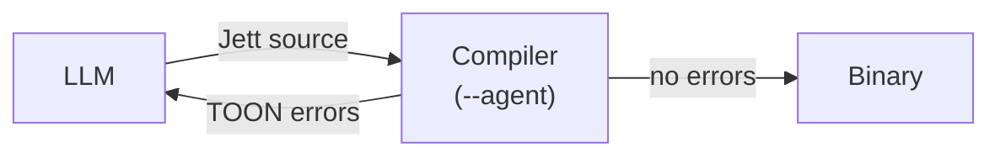

# Jett Language Design Document

## Vision

Jett is a programming language designed from the ground up to be **optimized for LLM consumption and generation**. While most languages were designed for humans typing on keyboards, Jett recognizes that a growing share of code is written by large language models. Every design decision prioritizes token efficiency, predictability, and minimizing the patterns that cause LLMs to make mistakes.

Jett is not an "AI framework" or a language about AI — it is a general-purpose language whose syntax, semantics, and conventions are shaped by how LLMs tokenize, predict, and reason about code.

## Language Paradigm

Jett is a **statically-typed imperative language with enforced purity boundaries**. It is not a functional language, and it is not an object-oriented language.

You write straightforward procedural code — loops, mutable variables, sequential steps — but the type system and capability system enforce the safety guarantees that purely functional languages achieve through purity. Pure functions are guaranteed pure by the compiler. Side effects are tracked explicitly through capability parameters, not hidden behind monads or implicit state.

**What Jett borrows from each tradition:**

- **From imperative/procedural:** `for`/`while` loops, mutable variable declarations, sequential control flow, straightforward step-by-step code.
- **From functional:** pure functions by default, `into` pipeline keyword, immutable data encouraged, composition over inheritance, no shared mutable global state.
- **From structural typing (Go/Rust style):** structs + interfaces, no classes, no inheritance, explicit interface implementation.
- **What Jett avoids:** no monads, no higher-kinded types, no class hierarchies, no method overriding, no implicit side effects.

The closest comparison in feel is **Go or Rust** — you write normal imperative code, but the compiler enforces strong guarantees about purity, side effects, and type safety. Jett is pragmatic, not academic.

## Designed for Agent Tooling

Jett is optimized not just for LLM code generation, but also for how coding agents **navigate, understand, and modify** existing codebases. Modern agents use standard tools — search, grep, file reading, text replacement, CLI commands — and Jett's design makes every one of these operations more reliable.

**Search and grep are deterministic.** One canonical form means searching for a pattern always finds it. An agent grepping for a function call will never miss it because someone wrote it differently — there is only one way to write it.

**Reading a function gives complete context.** Self-contained functions with inline imports mean an agent can read a single function and understand all its dependencies without searching for file-level imports or tracing class hierarchies.

**Text replacement is safe.** No function overloading and unique `namespace.function_name` identifiers mean renaming is a global text replacement across all files. There is no ambiguity about which function is being renamed.

**Diffs are clean.** One canonical formatting style (enforced by `jett format`) means diffs only contain logical changes, never formatting noise. When an agent changes one line of logic, the diff shows one line — not 50 lines of reformatting.

**The compile-fix loop is structured.** The Agent Server Protocol (Rule Set 21) outputs structured TOON errors that agents can parse and act on mechanically. The agent runs `jett build --agent`, reads the TOON error, fixes the issue, and repeats. Each error includes the file, line, column, expected type, got type, and a suggested fix.

**Discovering available code is a flat query.** The ASP provides `jett query --agent --namespaces` — a flat list of all available namespaces, functions, and types. An agent does not need to traverse directory trees or class hierarchies to find what it can call.

**New code can be added safely.** Jett's strict top-to-bottom ordering means an agent appending a new function at the end of a file cannot break existing code above it. Adding functionality is always additive.

**Builds are deterministic.** Content-addressed dependencies with SHA-256 hashes mean builds are reproducible across environments. An agent will never encounter "works on my machine" issues.

*Note: The `--agent` flag and the Agent Server Protocol (ASP) referenced above are defined in Rule Set 21. The ASP specifies how the compiler communicates structured TOON output to agents — including build errors, type queries, signature lookups, completions, and test results. The exact capabilities and query formats are still being refined and may evolve as the compiler is implemented. See Rule Set 21 for the current specification.*

---

## Foundational Rules

### Rule Set 1: Syntax and Tokenization Optimizations

#### 1. Strictly One Canonical Form

There must be exactly **one way** to express any given logic. No shortcuts, no aliases, no alternate syntax. Syntactic sugar exists in other languages to make humans type less, but for LLMs it creates ambiguity — the model wastes probability mass deciding *which* form to use and may inconsistently mix forms within a single file.

**What this means in practice:**

- No ternary operator alongside `if`/`else`. There is only `if`/`else`.
- No shorthand lambdas alongside named functions. There is only `function`.
- No implicit returns. Always use `return`.
- No optional parentheses. If a construct uses parentheses, it always uses them.
- No operator aliases. Jett uses `==`, `!=`, `&&`, `||`, `!` — universal symbols, each a single token.
- No multiple import styles. One `use` syntax, always.
- No string concatenation with `+` alongside interpolation. Pick one mechanism.

**Rationale:** When an LLM has seen training data with 5 ways to write a lambda in JavaScript, it may produce any of them unpredictably. When there is exactly one way, generation is deterministic and consistent.

#### 2. Tokenizer-Friendly Keywords

Jett uses **common English words** as keywords, not symbols or abbreviations. Every keyword should ideally map to a **single token** in major LLM tokenizers (GPT, Claude, LLaMA, etc.).

**Keyword design rules:**

- Use `function` not `fn`, `func`, `def`, or `λ`.
- Use `if`, `else`, `for`, `while`, `return` — universally recognized words.
- Use `==` for equality, `!=` for inequality, `&&`, `||`, `!` for boolean logic — all single tokens and universal across languages.
- Variable declarations use type-first syntax (`int64 x = 5`), saving 2 tokens per declaration over `let x: int64 = 5`.
- Avoid abbreviations that may tokenize into subwords (e.g. `fmt` might become `f` + `mt`).

**Why obscure symbols are harmful:**

Language-specific symbols like `$`, `<=>`, `:=`, `>>=` are problematic because:
1. Tokenizers often split them into multiple tokens (e.g. `>>=` becomes `>>` + `=` or `>` + `>=`), wasting tokens.
2. LLMs may confuse similar-looking symbol sequences (e.g. `->` vs `=>` vs `<-`).
3. Obscure symbols carry no inherent semantic meaning — a model must memorize what `<>` means in each language, whereas `not equal` is self-documenting.

**Universal symbol exceptions:** Arithmetic (`+`, `-`, `*`, `/`), comparison (`>`, `<`, `>=`, `<=`), equality (`==`, `!=`), and boolean (`&&`, `||`, `!`) operators are universal across virtually all programming languages. Every LLM has seen them millions of times and every tokenizer handles them as single tokens. These are kept as symbols. The only keyword operator is `modulo`.

#### 3. AST-Native Syntax

This is Jett's most distinctive design choice. **LLMs are fundamentally good at generating structured, nested data** — they produce JSON, XML, and nested property structures with high reliability. Jett's syntax should lean into this strength.

The language syntax is designed so that source code maps **directly and transparently** to its abstract syntax tree. There is minimal gap between what you write and the tree structure the compiler sees. This means:

**Structural properties:**

- Code reads as a **tree of labeled nodes**, not as a stream of tokens with implicit precedence rules.
- Every construct is explicitly delimited and named — the structure is always visible, never implicit.
- Nesting is semantic (reflects actual tree depth), not accidental (from operator precedence or bracket matching).
- The syntax can be losslessly round-tripped to/from a JSON AST representation.

**What AST-native looks like:**

Jett uses standard arithmetic operators (`+`, `-`, `*`, `/`) and comparison operators (`>`, `<`, `>=`, `<=`) with conventional precedence rules, plus the keyword operator `modulo` for remainder (`a modulo b`). These symbols are universal exceptions — every language uses them, every LLM tokenizer handles them as single tokens, and function-call alternatives like `add(a, multiply(b, c))` or keyword alternatives like `a greater_or_equal b` are significantly harder to read without saving tokens:

```
# Arithmetic uses standard operators:
int64 x = a + b * c - d / e
```

The operator precedence is standard (multiplication and division bind tighter than addition and subtraction), matching every other language the LLM has been trained on. Parentheses are used for explicit grouping when needed:

```
int64 x = (a + b) * (c - d) / e
```

**JSON AST equivalence:**

Any Jett program can be represented as a JSON AST, and that JSON can be converted back to Jett source without loss. This is powerful for LLMs because:

1. An LLM can generate the JSON AST directly if that is easier for a given task.
2. Tools can transform between Jett source and JSON AST freely.
3. The LLM never has to "guess" the tree structure — it is always explicit.

Example — a function in Jett source and its JSON AST:

```
function max(a: int64, b: int64) returns int64:
    if a > b:
        return a
    return b
```

```json
{
    "type": "function",
    "name": "max",
    "params": [
        {"name": "a", "type": "int64"},
        {"name": "b", "type": "int64"}
    ],
    "returns": "int64",
    "body": [
        {
            "type": "if",
            "condition": {"type": "compare", "op": ">", "left": {"type": "ref", "name": "a"}, "right": {"type": "ref", "name": "b"}},
            "then": [{"type": "return", "value": {"type": "ref", "name": "a"}}]
        },
        {
            "type": "return",
            "value": {"type": "ref", "name": "b"}
        }
    ]
}
```

The mapping between these two forms should be trivial and mechanical. If it is not, the syntax is not AST-native enough.

### Rule Set 2: Context Isolation and Flat Architecture

The core problem: LLMs work within finite context windows. If understanding a single function requires loading an entire codebase — inheritance trees, global state, implicit side effects — the LLM will either run out of context or make mistakes from incomplete information. Jett solves this by making every piece of code **self-describing and locally understandable**.

#### 1. Zero Implicit State

There must be **no spooky action at a distance**. A variable must never be silently changed by code in another file, another module, or a parent class. Every dependency, every state change, and every side effect must be **explicitly declared locally** — right where it happens.

**What this means in practice:**

- No global mutable variables. Global constants are allowed (they never change), but mutable global state is forbidden.
- No module-level side effects on import. `use math` loads definitions — it does not execute code, register handlers, or modify state.
- Side effects must be declared in the function signature via **capability parameters** (see Rule Set 16). If a function writes to a file, it receives a `Filesystem` capability. If it accesses the network, it receives a `Network` capability. The signature is the contract.
- All inputs to a function come through its parameters. No reading from ambient scope, no closures over mutable state, no thread-local storage. Anonymous functions can capture **immutable** values from the enclosing scope. Captured values are implicitly viewed — they are not consumed by the closure. Closures over **mutable** state are banned. This allows patterns like `list.find(users, function(u: User) returns bool: return u.id == target_id)` where `target_id` is an immutable value from the outer scope.

**Example — side effects are declared, not hidden:**

```
function save_user(view fs: Filesystem, view user: User) returns result[nothing, string]:
    string data = json.serialize[User](view user)
    Filesystem.write_file(view fs, "users.json", data) handle error:
        return fail("could not save user")
    return ok(nothing)

function compute_tax(income: float64, rate: float64) returns float64:
    return income * rate
```

`save_user` declares that it performs filesystem effects by taking a `view Filesystem` capability parameter. Any caller can see this without reading the function body. `compute_tax` has no capability parameters, so the compiler guarantees it is pure. An LLM reading only the signatures knows exactly what each function does and does not do.

**Why this matters for LLMs:**

When an LLM sees a function, it can reason about it completely from its signature and body. It never needs to ask "but what if some other module mutated this variable before this function ran?" That question simply cannot arise.

#### 2. Pure Functions by Default

Functions in Jett are **pure by default**. They take explicit inputs through their parameters, return explicit outputs through their return type, and do not mutate anything outside their own scope.

**Rules:**

- A function without capability parameters is guaranteed pure by the compiler.
- Pure functions cannot call impure functions — the capability system propagates. A function that needs to call an I/O function must itself accept the required capability.
- Pure functions can be tested with nothing but their inputs and outputs. No mocks, no setup, no teardown, no dependency injection frameworks.
- Pure functions are safe to cache, parallelize, and reorder — the compiler and runtime can optimize aggressively.

**What this enables for LLMs:**

An LLM can write and test a pure function **entirely in isolation**. It does not need the rest of the codebase in its context window. Given only the function signature and the types of its parameters, the LLM has complete information to:

1. Implement the function.
2. Write tests for the function.
3. Reason about whether the function is correct.

This is a dramatic reduction in the context an LLM needs per task.

**Example — testing a pure function needs zero context:**

```
function calculate_discount(price: float64, tier: string) returns float64:
    if tier == "gold":
        return price * 0.8
    else if tier == "silver":
        return price * 0.9
    else:
        return price

verify calculate_discount:
    assert calculate_discount(100.0, "gold") == 80.0
    assert calculate_discount(100.0, "silver") == 90.0
    assert calculate_discount(100.0, "basic") == 100.0
```

The tests need nothing beyond the function itself. No database connection, no user session, no application state.

#### 3. No Deep Inheritance — Composition and Interfaces Only

Jett has **no class inheritance**. Object-oriented inheritance trees are one of the worst patterns for LLMs because understanding a single method may require tracing through 5+ levels of parent classes, mixins, and overrides scattered across many files.

Instead, Jett uses two mechanisms that keep relationships **flat and local**:

**Interfaces** (like Go interfaces or Rust traits):

```
interface Displayable:
    function display(view self: Displayable) returns string
```

An interface is just a contract — a list of function signatures. It carries no implementation, no state, no hidden behavior.

**Composition** (structs contain other structs):

```
struct EmailSender:
    config: SmtpConfig

    function send(view self: EmailSender, view stdout: Stdout, view net: Network, message: Message) returns nothing:
        Stdout.write(view stdout, "sending email")
        smtp.deliver(view net, self.config, message)
        return nothing
```

`EmailSender` uses an `SmtpConfig` by containing it — not by inheriting from it. Side effects (logging via `Stdout`, networking via `Network`) are declared as capability parameters. The relationship is visible in the struct definition and function signatures. An LLM can see every dependency by reading the struct fields and method signatures.

**Why this matters for LLMs:**

- To understand a struct, read its definition. That is all.
- To understand what functions a type supports, read its interface implementations. They are all in one place.
- There is no `super()` call chain to trace. No method resolution order. No diamond problem. No hidden overrides.
- An LLM can generate a correct struct implementation by looking at the struct definition and the interface definition — two flat, local pieces of information.

**Note on deep composition:** Composition can still produce deeply nested structures — a struct containing a struct containing a struct. This does not cause the same problems as deep inheritance. Each nested struct is self-describing: its fields are visible in its definition, it has no hidden overrides, and no method resolution order. Reading any struct's definition tells you everything it contains without tracing a parent chain. Deep nesting may be a code smell, but it is not a source of hidden behavior.

**Comparison with inheritance-based languages:**

```
# In a language with deep inheritance (what Jett avoids):
# To understand what Dog.speak() does, you must read:
#   Animal -> LivingThing -> Pet -> DomesticAnimal -> Dog
#   ...across 5 files, with possible overrides at each level.

# In Jett (flat, local, complete):
interface Speaker:
    function speak(view self: Speaker) returns string

struct Dog:
    name: string
    breed: string

implement Speaker for Dog:
    function speak(view self: Dog) returns string:
        return "woof"

# Calling a method — module syntax only:
Dog my_dog = Dog(name: "Rex", breed: "labrador")
string sound = Dog.speak(view my_dog)
```

Structs define methods with `self` as the first parameter. Methods are called with module syntax: `Dog.speak(my_dog)`, `Point.distance(p1, p2)`. There is no `my_dog.speak()` form. This rule applies uniformly to ALL types, including capability types — `Stdout.write(view stdout, msg)`, `Filesystem.read_file(view fs, path)`, `Network.listen(view net, addr, port)`. Capabilities are not an exception.

Everything about `Dog` is right here. No context needed from parent classes. No files to chase.

### Rule Set 3: Types as Guardrails

LLMs are probabilistic — they can and will hallucinate logic. The type system is the primary defense against this. If the type system is **strict and expressive enough**, writing correct code becomes a puzzle of making the types fit together. An LLM that satisfies the type checker has, by construction, produced code that meets the spec. The types *are* the spec.

#### 1. Strict Static Type System — Catching Hallucinations at Compile Time

Every value in Jett has a known type at compile time. There is no `any`, no untyped mode, no escape hatch. The type checker is deliberately strict: it rejects code that a more lenient system would allow, because for LLMs, a false rejection (compiler error the LLM can fix) is far cheaper than a false acceptance (hallucinated logic that silently passes and fails at runtime).

**What strict means in practice:**

- No implicit conversions. An `int64` is not a `float64` unless explicitly converted.
- No union types without exhaustive matching. All enums require exhaustive `match`, and all `result` types require `handle`.
- No null. Values are either present (`T`) or explicitly optional (`optional[T]`), and optionals must be coarsened before use.
- No duck typing. A struct satisfies an interface only if it has an explicit `implement` block — accidental structural matches do not count.
- Function signatures are complete contracts. The parameter types, return type, and capability parameters fully describe what the function does. The compiler enforces this.

**Why this helps LLMs:**

When an LLM generates code that doesn't type-check, the compiler error tells it exactly what is wrong and what type was expected. The LLM can fix the error mechanically — it doesn't need to reason about runtime behavior or trace execution paths. The type system turns "is this code correct?" (a hard question) into "do these types match?" (an easy question).

**Example — the type system catches a hallucinated conversion:**

```
function format_price(cents: int64) returns string:
    return "price is {cents}"
    # This works — int64 implements Displayable, so it can be used in string interpolation.

function add_to_price(price: string, tax: int64) returns string:
    return price + tax
    # COMPILE ERROR: operator + is not defined for string and int64
    # hint: use string interpolation "..." or convert types explicitly
```

In a dynamically typed language, type mismatches would silently produce garbage or crash at runtime. In Jett, the LLM gets an immediate, actionable error.

Jett uses string interpolation `"text {expr}"` as the single canonical mechanism for building strings. Expressions inside `{}` must implement the `Displayable` interface — the compiler calls the type's `display()` function (e.g., `int64.display()`, `MyStruct.display()`) to produce the string representation. There is no `+` operator for strings and no `string.concat()` function.

#### Explicit Type Conversions

Jett has **no implicit type conversions**. An `int64` is never silently promoted to a `float64`, and a number is never silently coerced to a `string`. All type conversions are explicit function calls using the standard module function syntax: `TargetType.from_SourceType(value)`.

**Infallible conversions** (lossless — always succeed, return `T` directly):

```
float64 x = float64.from_int64(42)          # → 42.0
string s = string.from_int64(42)         # → "42"
string s = string.from_float64(3.14)     # → "3.14"
string s = string.from_bool(true)      # → "true"
```

**Fallible conversions** (can fail — return `result[T, string]`):

```
int64 n = int64.from_string("42") handle error:
    return fail("not a number")

float64 f = float64.from_string("3.14") handle error:
    return fail("not a float64")

int64 n = int64.from_float64(3.14) handle error:
    return fail("not a whole number")
    # Fails because 3.14 is not exactly representable as int64.
    # int64.from_float64(3.0) would succeed → 3
```

**Design rules:**

- Every conversion is a uniquely named function — no overloading. `int64.from_string` and `int64.from_float64` are separate functions, not overloads of `int64()`.
- Lossy numeric conversions return `result`. Converting `float64` to `int64` can fail because the float64 may not be a whole number. Converting `int64` to `float64` can fail for very large integers that lose precision. The compiler never silently truncates or rounds.
- The pattern is always `TargetType.from_SourceType(value)` — predictable and discoverable. An LLM can infer the correct function name from the types involved.
- String interpolation `"text {expr}"` requires the expression to implement `Displayable` — this is a compiler-stdlib coupling, not a general implicit conversion. Outside of interpolation, converting to string requires an explicit `string.from_int64()` or `string.from_float64()` call.

**What the compiler rejects:**

```
float64 x = 42
# COMPILE ERROR: expected float64, got int64
# hint: use float64.from_int64(42)

int64 y = 3.14
# COMPILE ERROR: expected int64, got float64
# hint: use int64.from_float64(3.14) and handle the possible error
```

**These are standard library functions, not language magic.** Primitive types (`int64`, `float64`, `string`, `bool`) serve as their own modules, exactly like structs do. When you define `struct Dog`, you call `Dog.speak(view my_dog)` — `Dog` is both the type and the module. Primitive types work the same way: `int64` is both the type (in `x: int64`) and the module (in `int64.from_string("42")`). The context disambiguates — type position vs expression position. There is no special compiler treatment for conversion functions; they are ordinary standard library functions that anyone could reimplement in a custom module.

#### 2. Intent-Based Refinement Types — Constraints in Plain Text

This is where Jett's type system becomes truly LLM-native. Standard types describe *what shape* data has (int64, string, list). Refinement types describe *what rules* data must follow. The LLM can express business logic constraints directly as types, and the compiler enforces them automatically.

**Syntax:**

```
type Password = string where string.char_count(value) > 8
type Age = int64 where value >= 0 && value < 150
type Email = string where string.contains(value, "@")
type Port = int64 where value >= 1 && value <= 65535
type NonEmpty[T] = list[T] where list.length[T](value) > 0
type Percentage = float64 where value >= 0.0 && value <= 100.0
```

The `where` clause attaches a constraint to a base type. `value` refers to the value being constrained, and the clause accepts any pure expression (no capabilities, no mutation) that evaluates to `bool`. The compiler checks it wherever a value of that type is created.

**How refinement types work at runtime:**

Refinement types are checked at **type boundaries** — when a value enters the refined type from an unrefined one. Inside the type, the constraint is guaranteed. Assigning to a refinement type is a **fallible operation** — the value might not satisfy the constraint — so the compiler requires `handle`, just like any other operation that can fail:

```
function create_user(name: string, password: Password) returns User:
    # Inside this function, `password` is guaranteed to satisfy string.char_count > 8.
    # No need to check again. The type system already enforced it.
    return User(name: name, password: password)

# At the call site, the compiler forces you to handle the possible failure:
Password user_password = raw_input handle error:
    return fail("password must be at least 8 characters")
User user = create_user("alice", user_password)
```

This uses the same `handle error:` pattern as `result[T, E]` — no new syntax. The compiler **refuses to compile** a refinement type assignment without a `handle` block. The LLM is forced to consider and handle the case where the value does not satisfy the constraint.

**Why this is powerful for LLMs:**

1. **Constraints are readable English.** `type Password = string where string.char_count(value) > 8` is something an LLM can generate from a natural language requirement like "passwords must be at least 8 characters" with near-perfect accuracy.

2. **The compiler enforces what the LLM declares.** The LLM doesn't need to remember to add validation checks throughout the code — the type system does it automatically.

3. **Refinement types compose.** If a function takes a `Port` and a `NonEmpty[string]`, the LLM knows from the types alone that the port is valid and the list is non-empty. No defensive checks needed inside the function.

4. **Failure handling is mandatory.** The `handle` pattern forces the LLM to write error handling for every refinement type boundary. An LLM cannot silently assume a string is a valid password — the compiler requires an explicit `handle error:` block.

5. **Errors are caught early and described clearly:**

```
error at line 45: refinement type assignment requires error handling
  assigning int64 to Port may fail the constraint: value >= 1
  hint: add "handle error:" to handle the case where the value is invalid
```

**Complex refinement examples:**

```
type SortedList[T] = list[T] where list.is_sorted(value)
type BoundedList[T] = list[T] where list.length[T](value) <= 100
type PositiveFloat = float64 where value > 0.0

type HttpStatus = int64 where value >= 100 && value < 600
type JsonString = string where string.is_valid_json(value)

function parse_config(raw: JsonString) returns result[Config, string]:
    # `raw` is guaranteed to be valid JSON — the type says so.
    Config config = json.parse[Config](raw) handle error:
        return fail("invalid config structure")
    return ok(config)
```

**Refinement types with struct fields:**

```
type NonEmptyName = string where string.char_count(value) > 0

struct User:
    name: NonEmptyName
    email: Email
    age: Age

# Constructing a User validates all refined fields — and requires handle:
User user = User(name: name, email: email, age: age) handle error:
    return fail("invalid user data: {error}")
```

**Refinement type constraints must be self-contained.** The `where` clause can only reference `value` (the value being constrained) and call pure functions with literal or constant arguments. Constraints cannot take external parameters — there is no `type Password[min: int64] = string where string.char_count(value) > min`. This keeps `[]` unambiguous: it always means generics, never parameterized constraints.

**For parameterized validation, use functions.** If validation rules depend on runtime values (e.g., a minimum password length from config), write a regular function that returns `result[T, string]`:

```
function validate_password(input: string, min_length: int64) returns result[string, string]:
    if string.char_count(input) <= min_length:
        return fail("password must be longer than {min_length} characters")
    return ok(input)

# Usage:
string password = validate_password(raw_input, config.min_password_length) handle error:
    return fail(error)
```

The rule is simple: refinement types for fixed constraints, functions for dynamic validation.

**Refinement types are not implicitly usable as their base type.** A `Password` is not a `string` — it is a `Password`. You cannot pass a `Password` to a function that expects `string`. This follows the "no implicit conversions" rule (Rule Set 2) and keeps the LLM aware of type boundaries. To coarsen a refinement type to its base type, use the `coarsen` keyword:

```
string raw = coarsen user_password
```

The target type is determined by the variable declaration's type annotation — the LLM and compiler both know what `coarsen` produces. For nested refinement types, `coarsen` can go to any ancestor in the chain:

```
type NonEmpty = string where string.char_count(value) > 0
type Password = NonEmpty where string.char_count(value) >= 8

NonEmpty ne = coarsen password       # Password → NonEmpty
string raw = coarsen password        # Password → string (skips to base)
```

If you need the base type multiple times in one function, assign it to a local variable once:

```
function process(password: Password, view stdout: Stdout) returns nothing:
    string raw = coarsen password
    int64 len = string.char_count(raw)
    string upper = string.to_upper(raw)
    Stdout.write(view stdout, "password length: {len}")
```

> **Why not implicit coarsening?** Implicit coarsening would hide information from the LLM. If `Password` silently becomes `string` wherever a string is expected, the LLM loses track of which values are validated and which are raw. `coarsen` makes the type boundary visible in the source code — the LLM can see exactly where a validated value is being treated as a plain string, and can reason about whether that is intentional.

> **Why `coarsen` and not `declassify`?** `declassify` is reserved for `secret` types (Rule Set 15), where it serves as a grep-able security audit keyword. `coarsen` is the antonym of "refine" — it reverses refinement, returning a value to its base type. Two different intents, two different keywords.

### Rule Set 4: Auto-Regressive Friendly Structure (Strict Linearity)

LLMs generate code **token-by-token, left-to-right, top-to-bottom**. They cannot look ahead. When an LLM writes a function call on line 10, it is committing to a name, argument list, and return type *right now* — if the actual definition doesn't appear until line 50, the LLM is guessing. By line 50, the model may have forgotten or drifted from what it assumed on line 10, producing mismatched signatures, wrong argument counts, or hallucinated parameter names.

Jett's structure must match the LLM's generation order exactly. Everything the LLM needs must already exist in its past context at the moment it is needed.

#### 1. No Forward Referencing — Strict Topological Order

The language enforces that **every variable, type, and function must be defined before it is used**. No exceptions, no forward declarations, no hoisting.

**Rules:**

- A function call on line N requires the function to be defined on some line M where M < N.
- A type annotation referencing `User` requires the `User` struct to be defined earlier in the file (or in an already-imported module).
- Mutual recursion (A calls B, B calls A) is handled with an explicit `mutual` block that declares both signatures upfront, keeping the forward reference contained and visible.
- Variables cannot be referenced before their declaration.

**What this looks like:**

```
# VALID — definition before use:
function double(x: int64) returns int64:
    return x * 2

function quadruple(x: int64) returns int64:
    int64 doubled = double(x)
    return double(doubled)

# INVALID — forward reference:
function quadruple(x: int64) returns int64:
    int64 doubled = double(x)    # COMPILE ERROR: "double" is not defined yet
    return double(doubled)

function double(x: int64) returns int64:
    return x * 2
```

**Mutual recursion — the only exception, explicitly declared:**

```
mutual:
    function is_even(n: int64) returns bool
    function is_odd(n: int64) returns bool

function is_even(n: int64) returns bool:
    if n == 0:
        return true
    return is_odd(n - 1)

function is_odd(n: int64) returns bool:
    if n == 0:
        return false
    return is_even(n - 1)
```

The `mutual` block puts both signatures into context before either body is written. This is the minimal, explicit escape hatch — no silent forward references allowed anywhere else.

**Why the keyword is `mutual`:** The only reason to forward-declare function signatures in Jett is mutual recursion — functions that depend on each other in a cycle. If function A needs function B, you simply define B first. The only case where that is impossible is when A calls B and B calls A. The keyword `mutual` communicates this intent directly: an LLM seeing `mutual:` immediately knows "these functions call each other." A more generic keyword like `declare` or `forward` would describe the mechanism without explaining why it exists.

**Why this matters for LLMs:**

This perfectly mirrors the auto-regressive generation process. When the LLM writes `int64 doubled = double(x)`, the definition of `double` is already in its past context — it knows the exact signature, parameter types, and return type. It is not guessing. The code generation order *is* the dependency order.

#### 2. Inline Dependency Declarations — Context Where Attention Is

Traditional languages put all imports at the top of a file. By the time the LLM is generating code on line 200, those imports are far away in its context — potentially outside its effective attention window. The LLM may forget which module a function came from, or hallucinate an import that doesn't exist.

Jett requires **all imports to be declared locally**, inside a function or block, right where they are used. File-level imports are banned. This keeps the relevant context exactly where the LLM's attention mechanism is focused.

**What the compiler rejects:**

```
namespace server

use auth          # COMPILE ERROR: imports must be inside a function or block
use models        # COMPILE ERROR: imports must be inside a function or block

function handle_login(view stdout: Stdout) returns nothing:
    ...
```

**What you write instead — all imports inside functions:**

```
function fetch_data(view net: Network, url: string) returns result[map[string, string], HttpError]:
    use net.http
    use json
    HttpResponse response = http.get(view net, url) handle error:
        return fail(error)
    map[string, string] data = json.parse[map[string, string]](response.body) handle error:
        HttpError parse_error = HttpError.status_error(0, error)
        return fail(parse_error)
    return ok(data)

function compute_stats(values: list[float64]) returns float64:
    use math
    float64 total = math.sum(values)
    int64 count = list.length[float64](values)
    float64 count_f = float64.from_int64(count)
    return total / count_f
```

**What this achieves:**

- Each function is **self-contained**. Its dependencies are declared inside it, right before they are used.
- An LLM generating `fetch_data` sees `use net.http` and `use json` immediately in local context — not 150 lines away at the top of the file.
- When an LLM reads or modifies a single function, it has **complete information** without scrolling or searching. The function is a self-describing unit.
- Removing a function automatically removes its imports. No orphaned imports accumulating at the top of files.
- If 10 functions use `math`, you write `use math` 10 times. The token cost is trivial — and the compiler resolves the import once regardless.

**Scoping rules:**

- A `use` statement is scoped to the block it appears in. `use math` inside a function is not visible outside that function.
- All `use` statements in a function must appear at the top, before any other code. Imports scattered throughout the function body are a compile error. This gives every function a predictable structure: imports first, then logic.
- A module imported in two functions is resolved once by the compiler — no runtime cost to repeated `use` statements.

```
function good_example(view stdout: Stdout) returns nothing:
    use math
    use json
    float64 x = math.sqrt(2.0)
    Stdout.write(view stdout, json.serialize[float64](view x))

function bad_example(view stdout: Stdout) returns nothing:
    int64 x = 42
    use math          # COMPILE ERROR: use statements must appear before any other code
    Stdout.write(view stdout, "value: {x}")
```

**Why this matters for LLMs:**

The LLM attention mechanism works best on nearby tokens. Inline imports guarantee that every piece of information needed to understand a block of code is physically close to that block. The LLM never has to "remember" what was imported 200 lines ago — it is right there. If file-level imports were allowed, LLMs would default to them — because that is what all their training data does — defeating the purpose of inline imports entirely.

### Rule Set 5: Zero Hidden Control Flow (Errors as Values Only)

LLMs struggle immensely with non-linear execution. Exceptions — `try`/`catch`/`throw` — are the worst offender. An exception thrown inside a deeply nested function call can silently bubble up through 10 stack frames and get caught in a completely different file. An LLM generating code locally has no way to see this. It doesn't know that `user.save()` might throw a `DatabaseConnectionError` that skips the next 30 lines and lands in a catch block three functions up.

Jett eliminates this entirely. **There are no exceptions.** Control flow always goes explicitly downward through the code. Errors are values, and handling them is mandatory.

#### 1. Mandatory Explicit Error Handling — Handle It on the Next Line

Functions that can fail return a `result[T, E]` type. The caller **must** handle the error immediately — the compiler refuses to let an error result be ignored or silently propagated.

**The pattern:**

```
function read_config(view fs: Filesystem, path: string) returns result[Config, string]:
    string raw = Filesystem.read_file(view fs, path) handle error:
        return fail("could not read file: {path}")
    Config config = json.parse[Config](raw) handle error:
        return fail("invalid config format")
    return ok(config)
```

The `handle` keyword is used at the call site of any function that returns a `result`. It is **not optional** — the compiler enforces it. If you call a function that can fail, you must handle the failure right there, on the very next line, while the context of what you just called is at the peak of the LLM's attention window.

**Why `handle` and not `catch`:**

`catch` implies exceptions — something was thrown and caught mid-flight. `handle` implies values — a result was returned and you are dealing with it. The naming reinforces the mental model: there is no throwing, no catching, no flight. There is only: call, check, continue.

**The compiler enforces handling:**

```
function bad_example(view fs: Filesystem) returns string:
    Config config = read_config(view fs, "app.conf")
    # COMPILE ERROR: result[Config, string] must be handled
    # "read_config" can fail, but the error is not handled
    # hint: add a "handle" block after the call

    return config.name   # this line is never reached by the compiler
```

You cannot accidentally ignore an error. The compiler will not let the program compile until every `result` is explicitly handled.

**Result type structure:**

```
# result[T, E] is a built-in generic type with two variants:
#   ok(value: T)    — the operation succeeded
#   fail(error: E)  — the operation failed
```

`result[T, E]` is fully generic — both `T` and `E` can be any type. There is no built-in error type. `fail()` takes a value of whatever type `E` is. For simple cases, use `string` as the error type. For complex cases, define a custom error struct or enum:

```
# Simple — E is string:
function read_config(view fs: Filesystem, path: string) returns result[Config, string]:
    string raw = Filesystem.read_file(view fs, path) handle error:
        return fail("could not read file")
    return json.parse[Config](raw)

# Complex — E is a custom enum:
enum DatabaseError:
    connection_failed(message: string)
    query_failed(query: string, reason: string)
    timeout

function query(view net: Network, sql: string) returns result[list[Row], DatabaseError]:
    # ...

# Caller remaps DatabaseError to string:
function load_users(view net: Network) returns result[list[Row], string]:
    list[Row] rows = query(view net, "select * from users") handle error:
        match error:
            connection_failed(msg):
                return fail("db down: {msg}")
            query_failed(q, reason):
                return fail("bad query: {q} — {reason}")
            timeout:
                return fail("db timed out")
    return ok(rows)
```

**The `handle` keyword — the only way to coarsen a result or optional:**

The `handle` keyword is the **single canonical form** for coarsening `result` and `optional` values. There is no alternative. You cannot use `match` on a `result` type — `match` is reserved for user-defined enums only.

The syntax form is **mandatory** and encodes the type being coarsened:

- **`result[T, E]` MUST use `handle error:`** — the error variable is always bound. The `error` keyword is required because results carry error information, and the caller must have access to it.
- **`optional[T]` MUST use bare `handle:`** — no error variable, because there is no error. The value is simply absent.

```
# Return form — exit the function on error:
Config config = read_config(view fs, "app.conf") handle error:
    return fail("config load failed")

# Default form — provide a fallback value:
Config config = read_config(view fs, "app.conf") handle error:
    default Config(port: 8080)

# Default form with side effects — log the error, then provide a fallback:
Config config = read_config(view fs, "app.conf") handle error:
    Stdout.write(view stdout, "config failed, using defaults: {error}")
    default Config(port: 8080)
```

The `handle error:` block executes only when the result is `fail`. If the result is `ok`, the coarsened value is bound to the variable on the left (`config`). The error variable is always available inside the block.

**Every handle block must end with either `return` or `default`** — there is no implicit value. This rule applies to both `handle error:` (for `result`) and bare `handle:` (for `optional`). A handle block that does neither is a compile error:

```
# result — COMPILE ERROR:
Config config = read_config(view fs, "app.conf") handle error:
    Stdout.write(view stdout, "something failed")
    # COMPILE ERROR: handle block must end with "return" or "default"
    # hint: add "return fail(...)" to exit, or "default <value>" to provide a fallback

# optional — COMPILE ERROR:
Item first = list.first(items) handle:
    Stdout.write(view stdout, "list was empty")
    # COMPILE ERROR: handle block must end with "return" or "default"

# optional — valid with default:
Item first = list.first(items) handle:
    Stdout.write(view stdout, "list was empty, using fallback")
    default Item(name: "unknown")
```

This is consistent with Jett's "no implicit returns" principle. In functions, you always write `return`. In handle blocks, you always write `return` or `default`. Nothing is ever silently inferred from the last expression.

**Return values must be consumed — no silent discards:**

A function that returns anything other than `nothing` cannot be called as a standalone statement. The return value must be assigned to a variable. This is enforced by Jett's linear type system (Rule Set 10) — every value must be consumed.

```
# returns nothing — OK as standalone statement:
Stdout.write(view stdout, "hello")

# returns float64 — MUST assign:
math.sqrt(16.0)
# COMPILE ERROR: return value of math.sqrt (float64) is not consumed
# hint: assign to a variable with "float64 x = math.sqrt(16.0)"

# returns result[T, E] — MUST assign AND handle:
read_config(view fs, "app.conf")
# COMPILE ERROR: result[Config, string] is not consumed and not handled
# hint: assign and handle with "Config config = read_config(...) handle error: ..."
```

This means there is always a variable on the left side of a `handle` block. The `default` keyword always has a target to assign to, and return values can never be silently ignored.

**Why `match` is not allowed on results:**

One canonical form means one way to coarsen. `match` on a `result` would create a second way to do the same thing as `handle`. By restricting `match` to user-defined enums, Jett enforces that all error handling looks identical everywhere. An LLM never has to decide between `match` and `handle` — there is only `handle`.

**`handle` also coarsens `optional[T]`:**

The `handle` keyword works for `optional[T]` values using the bare `handle:` form (no `error` keyword). If the value is `none`, the handle block executes:

```
Item first_item = list.first(items) handle:
    return fail("list is empty")

User user = db.find_user(users, id) handle:
    return fail("user not found: {id}")
```

This means `handle` is the single canonical coarsen mechanism for both `result[T, E]` and `optional[T]`. The distinction between the two is encoded in the syntax form.

**The form of `handle` tells you what you're coarsening -- and the form is mandatory:**

- **`result[T, E]` MUST use `handle error:`** -- the `error` keyword is required. The error variable is always bound inside the block:
  ```
  Config config = read_config(view fs, "app.conf") handle error:
      Stdout.write(view stdout, error)
      return fail(error)
  ```
- **`optional[T]` MUST use bare `handle:`** with **no error variable**, because there is no error -- the value is simply absent:
  ```
  User user = find_user(id) handle:
      return fail("user not found")
  ```

This distinction is mandatory -- using the wrong form is a **compile error**. `handle:` on a `result[T, E]` is rejected. `handle error:` on an `optional[T]` is rejected. The syntax form encodes the type being coarsened, and the compiler enforces it. When an LLM sees `handle error:`, it knows the expression returns `result[T, E]`. When it sees `handle:`, it knows the expression returns `optional[T]`.

#### 2. No Global Exits — Control Flow Goes Down, Never Sideways

Jett bans every construct that causes control flow to jump to a non-obvious destination.

**Banned constructs:**

| Construct | Why it is banned |
|-----------|-----------------|
| `throw` / exceptions | Invisible control flow jumping across stack frames. LLMs cannot track where an exception will be caught. |
| `goto` | Arbitrary jumps. Makes code flow unpredictable. |
| `exit()` / `abort()` | Global program termination from arbitrary locations. Hides the fact that a function can kill the entire process. |
| `panic` / unrecoverable errors | Same as `exit()` — a hidden control flow nuke. If something is truly unrecoverable, the `main` function returns an error. |
| Implicit exception propagation | In Python/Java, calling a function that throws can silently propagate. In Jett, errors are values — they don't propagate unless you explicitly return them. |

**What is allowed:**

| Construct | Why it is allowed |
|-----------|-----------------|
| `return` | Explicit, visible, goes to the caller. Always at the current function scope. |
| `break` | Exits the current loop. Scope is visible and local. |
| `continue` | Skips to the next loop iteration. Scope is visible and local. |
| Early `return` in guard clauses | Encouraged. Reduces nesting. The return target is always the current function. |

**The rule:** at any point in the code, you can determine where execution goes next by reading the **current line and the lines immediately below it**. There is never a hidden jump to a distant handler. Control flows down the AST, always.

**Example — error propagation is always visible:**

```
function process_order(view net: Network, order_id: string) returns result[Receipt, string]:
    use db
    use payment

    Order order = db.find_order(view net, order_id) handle error:
        return fail("order not found: {order_id}")

    Charge charge = payment.charge(view net, order.total, order.card) handle error:
        return fail("payment failed for order: {order_id}")

    Receipt receipt = db.save_receipt(view net, order, charge) handle error:
        return fail("could not save receipt")

    return ok(receipt)
```

Reading this function top to bottom, the LLM (or a human) can trace every possible execution path:
1. `db.find_order` succeeds → continue. Fails → return error.
2. `payment.charge` succeeds → continue. Fails → return error.
3. `db.save_receipt` succeeds → continue. Fails → return error.
4. Return success.

There are no hidden paths. No exception from `payment.charge` silently skipping the `db.save_receipt` line. No catch block 5 functions away. Every branch is explicit and local.

### Rule Set 6: Elimination of Attention-Splitting Ambiguity

LLMs use attention heads to link tokens together — to figure out what `user` refers to, what `process` means, what value `count` currently holds. When multiple things share similar names, or when a name can mean different things in different scopes, the attention mechanism gets confused. The model may merge logic from two different variables, hallucinate a function overload that doesn't exist, or lose track of a variable's current value after it was mutated 20 lines ago.

Jett eliminates every source of this ambiguity.

#### 1. Zero Variable Shadowing

If a variable named `user_id` exists in an outer scope, creating another variable named `user_id` in an inner scope is a **compile error**. There is never a question of "which `user_id`?" — there is only one, always.

**What the compiler rejects:**

```
function process_user(view net: Network, user_id: string) returns result[User, string]:
    use db
    User user = db.find(view net, user_id) handle error:
        return fail("not found")

    for item in user.orders:
        string user_id = item.buyer_id
        # COMPILE ERROR: "user_id" already exists in an outer scope
        # hint: use a distinct name, e.g. "buyer_id"
```

**What you write instead:**

```
function process_user(view net: Network, user_id: string) returns result[User, string]:
    use db
    User user = db.find(view net, user_id) handle error:
        return fail("not found")

    for item in user.orders:
        string buyer_id = item.buyer_id
        # Clear. Unambiguous. No confusion possible.
```

**Why this matters for LLMs:**

When an LLM sees `user_id` anywhere in a function, it resolves to exactly one binding. The attention head linking `user_id` on line 15 to its definition doesn't have to choose between two competing candidates. There is one `user_id`, defined in one place, with one value. The LLM cannot accidentally read from or write to the wrong one.

#### 2. No Function Overloading

Having `process(string)` and `process(int64)` in the same codebase splits the LLM's understanding of what `process` means. When the LLM generates a call to `process`, it must infer from argument types which overload it intends — and it may get it wrong, especially when types are similar or when the function is being called with a variable whose type was defined many lines ago.

Jett bans function overloading entirely. **Every function has a unique name.**

**What the compiler rejects:**

```
function process(data: string) returns string:
    return parse_text(data)

function process(data: int64) returns int64:
    # COMPILE ERROR: function "process" is already defined
    # hint: use a distinct name, e.g. "process_int64"
    return data * 2
```

**What you write instead:**

```
function process_text(data: string) returns string:
    return parse_text(data)

function process_number(data: int64) returns int64:
    return data * 2
```

**The rule extends to methods on structs:**

```
struct Parser:
    # NOT allowed:
    # function parse(view self: Parser, input: string) returns Ast
    # function parse(view self: Parser, input: list[Token]) returns Ast

    # Required — distinct names:
    function parse_text(view self: Parser, input: string) returns Ast:
        list[Token] tokens = tokenize(input)
        return Parser.parse_tokens(self, tokens)

    function parse_tokens(view self: Parser, input: list[Token]) returns Ast:
        return build_ast(input)
```

**Why this matters for LLMs:**

The word `process` maps to exactly one function. The word `parse` maps to exactly one function. When the LLM generates a function call, there is zero ambiguity about what will be invoked. The name *is* the identity — no type-based disambiguation needed.

#### 3. Immutable by Default — New Name for New Value

Variables in Jett cannot change value once assigned. If state must change, a **new variable with a new name** must be explicitly created. The `mutable` keyword exists as an opt-in escape hatch for performance-critical loops, but the default and idiomatic style is immutable bindings.

**Immutable (default and encouraged):**

```
function normalize_name(raw_name: string) returns string:
    string trimmed_name = string.trim(raw_name)
    string lower_name = string.lower(trimmed_name)
    string clean_name = string.replace(lower_name, "  ", " ")
    return clean_name
```

Each transformation gets a new name. At any point in this function, the LLM knows exactly what every variable holds — `raw_name` is the original input, `trimmed_name` is after trimming, `lower_name` is after lowering. There is no need to "scroll back" to figure out the current state of a variable that was reassigned 3 times.

**What the compiler rejects without `mutable`:**

```
function normalize_name(raw_name: string) returns string:
    string name = string.trim(raw_name)
    name = string.lower(name)
    # COMPILE ERROR: "name" is not mutable
    # hint: add "mutable" to the declaration or create a new variable
```

**Mutable (opt-in, for when it is genuinely needed):**

```
function sum_list(items: list[int64]) returns int64:
    mutable int64 total = 0
    for item in items:
        total = total + item
    return total
```

The `mutable` keyword is a visible flag. When an LLM sees `mutable int64 total`, it knows this variable will change and must track its state. When it sees `string trimmed_name`, it knows this value is fixed forever. The distinction is explicit and permanent — no guessing.

**Why this matters for LLMs:**

A mutable variable that gets reassigned on lines 5, 12, and 23 requires the LLM to maintain a "mental timeline" of its value. By line 30, the LLM must remember that `count` was reassigned on line 23, not that it still holds the value from line 5. LLMs are bad at this — they attend to all occurrences of `count` simultaneously, not chronologically.

Immutable variables eliminate this entirely. `trimmed_name` has one value, forever, from the line it is defined. There is no timeline to track. The LLM's attention head links the name to one definition and one value — done.

**Mutability is local only — no mutable references.** There is no way for a function to modify the caller's data. When a value is passed to a function, it is either consumed (moved) or borrowed read-only via `view`. There is no `param: mutable T` — no mutable references exist in the language. If a function needs to transform a value, it takes ownership, transforms it, and returns the new value. The caller rebinds:

```
mutable int64 x = 5
x = transform(x)    # transform consumes x, returns new value, x is rebound
```

This guarantees that reading a mutable variable's current value never requires looking at function implementations. The only place `x` can change is at explicit rebinding statements in the same scope.

### Rule Set 7: Syntactically Enforced Modularity (Chunking)

LLM performance degrades as the amount of code in a single block grows. Attention gets diluted across thousands of tokens, and the model starts losing track of variables, control flow, and intent. The solution is not to hope the LLM writes small functions — it is to make the compiler **refuse to accept large ones**.

Jett enforces hard limits on function complexity. These are not style guidelines or linter warnings — they are **compile errors**. The language physically prevents monolithic code from existing.

#### 1. Strict Scope Limits — The Compiler Enforces Chunking

Every function in Jett has a maximum allowed complexity. If a function exceeds the limit, it does not compile. The LLM (or human) must break it into smaller, self-contained pieces.

**Enforced limits:**

| Metric | Limit | Rationale |
|--------|-------|-----------|
| Statements per function | 100 max | Keeps each function within a bounded attention window while allowing practical orchestration code. |
| Nesting depth | 4 levels max | Deeply nested code is hard for LLMs to track. Guards and early returns reduce nesting. |
| Parameters per function | 6 max | Too many parameters signals the function is doing too much. Use a struct. |
| Cyclomatic complexity | 10 max | Limits the number of branching paths the LLM must reason about simultaneously. |

**Capability bundles:**

When a function needs multiple capabilities, they can be grouped into a struct to conserve parameter slots:

```
struct AppCapabilities:
    fs: Filesystem
    net: Network
    stdout: Stdout
    stderr: Stderr

function deploy_service(caps: AppCapabilities, config: Config, target: Server) returns nothing:
    string manifest = Filesystem.read_file(view caps.fs, "manifest.json") handle error:
        Stderr.write(view caps.stderr, "failed to read manifest")
        return nothing
    Stdout.write(view caps.stdout, "deploying...")
    # 3 parameters instead of 7
```

Capability bundles are regular structs — they can be constructed, destructured, and passed around like any value. The compiler tracks the individual capabilities inside the bundle for lineage and purity analysis.

`use` declarations are not counted toward the statement limit — they are imports, not executable statements.

**What the compiler produces when limits are exceeded:**

```
error at line 45: function "process_all_orders" exceeds the statement limit
  current: 117 statements (max: 100)
  hint: extract related statements into smaller functions

error at line 12: function "validate_input" exceeds the nesting depth limit
  current: 5 levels (max: 4)
  hint: use guard clauses with early returns to reduce nesting
```

**Example — the compiler forces decomposition:**

This function is too large and the compiler rejects it:

```
function process_report(data: list[Record]) returns result[Report, string]:
    # ... 120+ statements doing validation, transformation,
    # aggregation, formatting, and output ...
    # COMPILE ERROR: exceeds 100 statement limit
```

The LLM must break it apart:

```
function validate_records(data: list[Record]) returns result[list[Record], string]:
    # validation logic (~10 statements)

function transform_records(records: list[Record]) returns list[TransformedRecord]:
    # transformation logic (~10 statements)

function aggregate_results(records: list[TransformedRecord]) returns Summary:
    # aggregation logic (~10 statements)

function format_report(summary: Summary) returns Report:
    # formatting logic (~10 statements)

function process_report(data: list[Record]) returns result[Report, string]:
    list[Record] valid = validate_records(data) handle error:
        return fail("invalid records")
    list[TransformedRecord] transformed = transform_records(valid)
    Summary summary = aggregate_results(transformed)
    Report report = format_report(summary)
    return ok(report)
```

The result: `process_report` is now 4 lines. Each helper function is small, focused, and independently understandable. An LLM can generate, test, and reason about each one in isolation without its attention being diluted across a massive block.

**Why hard limits instead of soft warnings:**

Linter warnings are suggestions — LLMs (and humans) ignore them. A compile error is absolute. The LLM's code generation loop becomes: write function → compile → if too large, decompose → compile again. This loop naturally produces well-chunked code without any prompting or instructions. The language structure *forces* good architecture.

> **Note:** The limits target logic complexity, not data size. Struct construction is a single expression regardless of field count — a 100-field struct literal is one statement. Struct functions each have their own independent 100-statement limit, so a struct with many functions is not a problem. Heavy math or sequential I/O that appears to need 100+ statements is almost always decomposable into named sub-computations (`calculate_velocity`, `apply_drag`, `resolve_collision`) or grouped operations (`load_configs`, `load_assets`), which produces better code. These limits have no flags or per-function overrides — they are absolute. If the compiler rejects a function, the function is doing too much.

**Nesting depth enforcement — guards over nesting:**

```
# REJECTED — nesting depth 5:
function find_active_user(users: list[User], role: string) returns optional[User]:
    for user in users:
        if user.active:
            if user.role == role:
                if user.verified:
                    if user.age > 18:    # depth 5 — COMPILE ERROR
                        return some(user)
    return none

# ACCEPTED — flat with guards:
function find_active_user(users: list[User], role: string) returns optional[User]:
    for user in users:
        if not user.active:
            continue
        if user.role != role:
            continue
        if not user.verified:
            continue
        if user.age <= 18:
            continue
        return some(user)
    return none
```

Same logic, but flat. Each condition is a guard clause that skips to the next iteration. The LLM reads straight down — no bracket matching, no deep indentation tracking, no "which `if` does this `else` belong to?" ambiguity.

**Parameter count enforcement — structs over long signatures:**

```
# REJECTED — 8 parameters:
function create_user(name: string, email: string, age: int64, role: string,
                     team: string, manager: string, office: string,
                     start_date: string) returns User:
    # COMPILE ERROR: exceeds 6 parameter limit

# ACCEPTED — grouped into a struct:
struct UserRequest:
    name: string
    email: string
    age: Age
    role: string
    team: string
    manager: string
    office: string
    start_date: string

function create_user(request: UserRequest) returns User:
    # clean, one parameter, all fields accessible via request.name etc.
```

### Rule Set 8: Extremely Dense, Opinionated Standard Library

Every token an LLM spends writing a sorting algorithm, a date parser, or an array filter is a token wasted — and a chance to hallucinate. Hand-written algorithmic logic is where LLMs make their worst mistakes: off-by-one errors, wrong loop bounds, missed edge cases. The solution is to **never let the LLM write that logic in the first place**.

Jett ships with a massive, opinionated standard library that covers virtually every common operation. The LLM's job is reduced from "write algorithms" to "connect modules" — turning Jett into a high-level orchestration language where the LLM writes plumbing, not logic.

#### 1. Macro-Primitives — High-Level Operations as Built-Ins

Instead of providing low-level building blocks and hoping the LLM assembles them correctly, Jett provides **hyper-specific, high-level standard functions** for common tasks. These are battle-tested, edge-case-handled implementations that the LLM simply calls by name.

**Principle: if an LLM would need a `for` loop to do it, there should be a standard function instead.**

**List operations — no manual loops:**

```
# Instead of writing a filter loop:
list[User] adults = list.filter[User](users, function(u: User) returns bool: return u.age >= 18)

# Instead of writing a map loop:
list[string] names = list.map[User, string](users, function(u: User) returns string: return u.name)

# Instead of writing a reduce loop:
float64 total = list.sum[float64](prices)

# Instead of writing a search loop:
optional[User] found = list.find(users, function(u: User) returns bool: return u.id == target_id)

# Instead of writing a sort with comparator:
list[User] sorted = list.sort_by(users, function(u: User) returns int64: return u.age)

# Instead of writing deduplication logic:
list[Item] unique = list.unique(items)

# Instead of writing chunk/batch logic:
list[list[Item]] batches = list.chunk(items, 100)

# Instead of writing zip logic:
list[tuple[string, int64]] pairs = list.zip(names, scores)

# Group by a field:
map[string, list[User]] by_role = list.group_by(users, function(u: User) returns string: return u.role)
```

An LLM calling `list.filter` cannot produce an off-by-one error. It cannot forget to handle an empty list. It cannot accidentally mutate the original. The standard library handles all of this.

**String operations — no manual parsing:**

```
string trimmed = string.trim(input)
list[string] parts = string.split(csv_line, ",")
string joined = string.join(names, ", ")
string replaced = string.replace(text, "old", "new")
string upper = string.upper(name)
string lower = string.lower(name)
bool contains = string.contains(email, "@")
bool starts = string.starts_with(url, "https")
string padded = string.pad_left(code, 6, "0")
string slug = string.slugify("Hello World!")        # "hello-world"
string truncated = string.truncate(bio, 100, "...") # cut with suffix
string extracted = string.between(html, "<title>", "</title>")
```

No regex for simple operations. No manual index arithmetic. Each function does one thing, is named obviously, and handles edge cases internally.

**Date and time — no manual formatting:**

```
use time

Time now = Clock.now(view clock)
string formatted = time.format(now, "YYYY-MM-DD")
Time parsed = time.parse("2025-03-15", "YYYY-MM-DD") handle error:
    return fail("invalid date")
Duration diff = time.difference(start, end)
Time tomorrow = time.add_days(now, 1)
string weekday = time.day_of_week(now)
bool is_before = time.before(start, end)
int64 age = time.years_between(birth_date, now)
```

Date logic is one of the most error-prone areas in programming. An LLM should never be computing leap years or timezone offsets — the standard library does it correctly.

**JSON — zero boilerplate:**

```
use json

Config config = json.parse[Config](raw_string) handle error:
    return fail("invalid json")                              # string to typed value
string text = json.serialize[Config](view config)                    # value to string
Config strict = json.parse_exact[Config](raw_string) handle error:
    return fail("unexpected json field")                     # closed-contract parsing

# For dynamic/untyped JSON access (when the schema is unknown):
json.JsonTree raw = json.parse_raw(raw_string) handle error:
    return fail("invalid json")                              # string to raw json value
json.JsonTree user = json.require_field(view raw, "user") handle error:
    return fail(error)
json.JsonTree address = json.require_field(view user, "address") handle error:
    return fail(error)
json.JsonTree city_raw = json.require_field(view address, "city") handle error:
    return fail(error)
string city = json.as_string(view city_raw) handle error:
    return fail(error)
```

**HTTP — high-level client out of the box:**

The `net.http` module defines its own error type for HTTP operations:

```
# Defined by the net.http standard library module:
enum HttpError:
    connection_failed(message: string)
    timeout(message: string)
    status_error(code: int64, message: string)
```

```
use net.http

HttpResponse response = http.get(view net, "https://api.example.com/users") handle error:
    # error is HttpError — match to handle specific cases:
    match error:
        HttpError.timeout(msg):
            HttpError timeout_error = HttpError.timeout(msg)
            return fail(timeout_error)
        other:
            return fail(other)

list[User] body = json.parse[list[User]](response.body) handle error:
    return fail("invalid json")
int64 status = response.status

# POST with body:
HttpResponse post_response = http.post(view net, "https://api.example.com/users", json.serialize[User](view new_user)) handle error:
    return fail(error)
```

**File system — simple and complete:**

```
string content = Filesystem.read_file(view fs, "config.json") handle error:
    return fail("file not found")

Filesystem.write_file(view fs, "output.txt", data) handle error:
    return fail("could not write")

list[string] files = Filesystem.list_dir(view fs, "./data") handle error:
    return fail("directory not found")

bool exists = Filesystem.file_exists(view fs, "config.json")
int64 size = Filesystem.file_size(view fs, "data.bin") handle error:
    return fail("could not get file size")
Filesystem.copy_file(view fs, "source.txt", "dest.txt") handle error:
    return fail("could not copy file")
Filesystem.delete_file(view fs, "temp.txt") handle error:
    return fail("could not delete file")
```

**Math — common operations without manual implementation:**

```
use math

int64 clamped = math.clamp(value, 0, 100)
float64 rounded = math.round(price, 2)
float64 absolute = math.abs(difference)
float64 maximum = math.max(a, b)
float64 minimum = math.min(a, b)
float64 average = math.average(scores)
float64 median = math.median(scores)
float64 floored = math.floor(3.7)
float64 ceiled = math.ceil(3.2)
float64 power = math.pow(base, exponent)
```

**Hashing and encoding — no third-party dependencies:**

```
use crypto
use encoding

string hashed = crypto.sha256(password)
string b64 = encoding.base64_encode(data)
string decoded = encoding.base64_decode(b64)
string url_safe = encoding.url_encode(query)
bytes raw = bytes.from_string(data)
string hex = bytes.to_hex(raw)
```

**Validation — standard library refinement types:**

The `validate` module provides common formats as refinement types. The type IS the validation — once assigned, the value is guaranteed valid:

```
use validate

# Assignment enforces validation via the refinement type constraint:
validate.Email email = user_input handle error:
    return fail("invalid email")

validate.URL url = link handle error:
    return fail("invalid url")

validate.UUID id = raw_id handle error:
    return fail("invalid uuid")

validate.IPv4 addr = ip_string handle error:
    return fail("invalid ip")

# Functions declare the validated type — no re-validation needed:
function send_email(view net: Network, to: validate.Email, body: string) returns result[nothing, string]:
    # "to" is guaranteed to be a valid email by the type system
    # ...
```

#### 2. The Orchestration Principle

With a dense standard library, the LLM's role shifts fundamentally. It is no longer writing algorithms — it is **connecting well-tested components**. A typical Jett program written by an LLM looks like:

```
function process_csv_report(view fs: Filesystem, view clock: Clock, path: string) returns result[Report, string]:
    use string
    use list
    use time

    string raw = Filesystem.read_file(view fs, path) handle error:
        return fail("could not read file")

    list[string] lines = string.split(raw, "\n")
    list[list[string]] rows = list.map[string, list[string]](lines, function(line: string) returns list[string]:
        return string.split(line, ","))

    list[string] header = list.first(rows) handle:
        return fail("CSV file is empty")
    list[list[string]] data = list.skip(rows, 1)

    list[list[string]] filtered = list.filter[list[string]](data, function(row: list[string]) returns bool:
        string cell = list.get[string](row, 2) handle:
            return false
        return string.is_not_empty(cell))

    list[list[string]] sorted = list.sort_by_index(filtered, 0)

    Report report = Report(
        generated: Clock.now(view clock),
        row_count: list.length[list[string]](sorted),
        data: sorted
    )

    return ok(report)
```

This function reads a CSV file, parses it, filters empty rows, sorts by the first column, and builds a report. **Not a single `for` loop. Not a single manual index calculation. Not a single edge case to get wrong.** Every operation is a standard library call. The LLM is writing plumbing — declaring what should happen — not implementing how it happens.

**Why this matters for LLMs:**

1. **Fewer tokens generated.** `list.filter(data, predicate)` is far fewer tokens than a hand-written filter loop.
2. **Zero algorithmic hallucination.** The LLM cannot produce an off-by-one error in `list.sort_by` because it didn't write the sort.
3. **Predictable function names.** An LLM that has seen `list.filter` once will use it correctly every time. The name is the documentation.
4. **Testability.** Standard library functions are already tested. The LLM only needs to test its orchestration logic — the glue between calls.

### Rule Set 9: Native State-Machine Architecture

#### The Problem: "Boolean Soup" and LLM Amnesia

In traditional languages, developers track system state using multiple boolean flags or variables:

```
mutable bool is_loading = true
mutable bool is_logged_in = false
mutable bool has_error = false
mutable bool is_banned = false
```

Humans implicitly understand the rules between these variables — a user cannot be `is_logged_in = true` AND `is_banned = true` simultaneously. But those rules exist only in the programmer's head. They are nowhere in the code.

LLMs are terrible at maintaining implicit rules across long generations. Because an LLM generates text left-to-right, if it sets `is_banned = true` on line 20, by the time it reaches line 80 its attention mechanism may "forget" to set `is_logged_in = false`. The result: an illegal, contradictory state — the user is simultaneously logged in and banned. A bug that is invisible in the code because nothing in the language prevents it.

This problem gets worse as the number of flags grows. Four booleans create 16 possible combinations, but maybe only 5 of those combinations are valid. The other 11 are bugs waiting to happen, and an LLM has no way to know which is which from the code alone.

#### The Solution: Finite State Machines as a Core Language Primitive

Jett eliminates boolean soup by making **finite state machines (FSMs) a foundational syntax** — as native to the language as `if` statements or `for` loops. Instead of loose flags, you explicitly declare the allowed states and the allowed transitions between them. The compiler enforces that no illegal state can ever exist.

**Declaring a state machine:**

```
machine UserAuth:
    states:
        guest
        authenticating(user_id: string)
        logged_in(user_id: string)
        banned(user_id: string)

    transitions:
        guest to authenticating
        authenticating to logged_in
        authenticating to guest
        logged_in to guest
        logged_in to banned
```

This declaration is the **single source of truth** for the entire lifecycle of user authentication. It says:

- There are exactly 4 states. No fifth state can sneak in.
- A user can go from `guest` to `authenticating`, but never from `guest` directly to `logged_in`.
- A user can go from `logged_in` to `banned`, but never from `banned` back to `logged_in`.
- Every legal path is listed. Every unlisted path is illegal and will be rejected by the compiler.

**Using the state machine:**

```
function start_login(session: UserAuth at guest, user_id: string) returns UserAuth at authenticating:
    # This function can ONLY be called when session is in the "guest" state.
    # It MUST return the session in the "authenticating" state.
    # The compiler enforces both of these constraints.
    return UserAuth.transition(session, authenticating, user_id: user_id)

function complete_login(session: UserAuth at authenticating) returns UserAuth at logged_in:
    return UserAuth.transition(session, logged_in, user_id: session.user_id)

function ban_user(session: UserAuth at logged_in) returns UserAuth at banned:
    return UserAuth.transition(session, banned, user_id: session.user_id)
```

If the LLM tries to write a function that transitions from `banned` to `logged_in`:

```
function unban_user(session: UserAuth at banned) returns UserAuth at logged_in:
    return UserAuth.transition(session, logged_in, user_id: session.user_id)
    # COMPILE ERROR: transition from "banned" to "logged_in" is not declared
    # declared transitions from "banned": (none)
    # hint: add "banned to logged_in" to the transitions block if this is intended
```

The compiler catches the illegal transition immediately. The LLM gets a clear error and either fixes the code or adds the transition to the machine definition (making the design decision explicit).

#### Why This Is Perfect for LLMs

**1. Collapses context into a single point of truth.**

Instead of the LLM scanning its context window to check the values of 4 different boolean flags, the object holds a single state: `UserAuth at logged_in`. The LLM's attention mechanism only needs to look at **one token** to know exactly what is happening. No cross-referencing, no implicit rules to remember.

```
# Boolean soup — LLM must track 4 variables and their relationships:
mutable bool is_loading = true
mutable bool is_logged_in = false
mutable bool has_error = false
mutable bool is_banned = false

# State machine — LLM tracks one value:
mutable UserAuth session = UserAuth(guest)
```

**2. Makes invalid code impossible to write.**

The compiler physically prevents the LLM from hallucinating illegal logic. If a transition is not declared, it does not compile. There is no runtime check to forget, no `if` guard to miss. The legal paths are defined once, and the language **mathematically guarantees** they cannot be violated.

**3. State-restricted functions — no defensive checks needed.**

In traditional languages, the LLM must remember to write defensive checks at the start of every function:

```
# Traditional (bad for LLMs — requires remembering to check state):
function post_comment(user: User, text: string) returns result[Comment, string]:
    if user.is_banned:
        return fail("user is banned")
    if not user.is_logged_in:
        return fail("user not logged in")
    # ... actual logic ...
```

The LLM might forget one of these checks. It might check the wrong flag. It might check `is_loading` when it meant `is_logged_in`. Every forgotten check is a bug.

In Jett, the function signature declares which state is required. No checks needed — it is **impossible** to call the function in the wrong state:

```
function post_comment(view clock: Clock, session: UserAuth at logged_in, text: string) returns result[Comment, string]:
    # No if-checks needed. This function can ONLY be called when
    # the session is in the "logged_in" state. The compiler enforces this
    # at every call site. The LLM cannot forget. The human cannot forget.
    Timestamp now = Clock.now(view clock)
    Comment comment = Comment(author: session.user_id, text: text, created: now)
    return ok(comment)
```

If the LLM tries to call `post_comment` with a session in the wrong state:

```
UserAuth session = UserAuth(guest)
result[Comment, string] result = post_comment(view clock, session, "hello")
# COMPILE ERROR: expected "UserAuth at logged_in" but got "UserAuth at guest"
# hint: transition the session to "logged_in" before calling post_comment
```

APIs may also intentionally accept a bare `UserAuth` when they need to inspect
more than one possible state. In that shape, a positive state check narrows the
local variable for the guarded branch:

```
function display_name(session: UserAuth) returns string:
    if session at logged_in:
        return session.user_id
    return "guest"
```

The payload field `session.user_id` is only available inside the guarded branch;
outside it, `session` is still a bare `UserAuth`.
For a two-state machine, the `else` branch has a single remaining state, so it
narrows too. For `if not (session at state):`, reaching the `else` branch proves
the checked state for any machine. On a two-state bare machine, the guarded
branch also narrows to the other declared state. For machines with three or more
states, negative guarded branches stay opaque. A final `else` after a positive
`if` / `else if` chain still narrows when the chain has excluded every state
except one.

Reflection exposes the same high-level distinction: `type.info[UserAuth]()`
reports kind `machine`, while `type.info[UserAuth at logged_in]()` reports
kind `machine_state`. `type.machine_layout[UserAuth]()` returns the checked
machine shape, `type.machine_states[UserAuth]()` returns each state with its
payload fields, and `type.machine_transitions[UserAuth]()` returns the legal
transition edges. The reflected layout uses `states` and `edges`, with edge
fields named `source` and `target`, so the API stays usable without colliding
with reserved state-machine syntax.

**4. State machines can carry data per state.**

States are not just labels — they can hold data that is only available in that state:

```
machine OrderProcess:
    states:
        draft(items: list[Item])
        submitted(items: list[Item], submitted_at: time.Timestamp)
        shipped(tracking: string, shipped_at: time.Timestamp)
        delivered(tracking: string, delivered_at: time.Timestamp)
        cancelled(reason: string)

    transitions:
        draft to submitted
        draft to cancelled
        submitted to shipped
        submitted to cancelled
        shipped to delivered
```

The `tracking` field only exists in the `shipped` and `delivered` states. It is impossible to access `tracking` on a `draft` order — the type system will not allow it. The LLM never has to write "check if tracking exists" because the type already guarantees it.

```
function get_tracking(order: OrderProcess at shipped) returns string:
    # order.tracking is guaranteed to exist — we are in the "shipped" state.
    return order.tracking

function ship_order(view clock: Clock, order: OrderProcess at submitted, tracking: string) returns OrderProcess at shipped:
    Timestamp shipped_at = Clock.now(view clock)
    return OrderProcess.transition(order, shipped, tracking: tracking, shipped_at: shipped_at)
```

**5. The LLM defines reality once, then the compiler enforces it forever.**

The state machine declaration at the top of the file is a complete specification of the system's lifecycle. The LLM writes it once — listing every state and every legal transition. For the rest of the file (and every other file that uses this machine), the compiler guarantees that:

- Only declared states exist.
- Only declared transitions occur.
- Functions only run in the states their signatures require.
- State-specific data is only accessible in the correct state.

The LLM does not need to "remember" any of this. It defined the rules, and the language enforces them mechanically. The LLM is free to focus its attention on the logic of each individual function, knowing the machine definition prevents systemic errors.

#### Complex Example: Payment Processing

```
machine Payment:
    states:
        pending(amount: float64, currency: string)
        authorized(amount: float64, auth_code: string)
        captured(amount: float64, auth_code: string, capture_id: string)
        refunded(original_amount: float64, refund_id: string)
        failed(reason: string)

    transitions:
        pending to authorized
        pending to failed
        authorized to captured
        authorized to failed
        captured to refunded

enum PaymentOutcome:
    authorized(payment: Payment at authorized)
    declined(payment: Payment at failed)

enum CaptureOutcome:
    captured(payment: Payment at captured)
    declined(payment: Payment at failed)

function authorize_payment(view net: Network, pay: Payment at pending) returns result[PaymentOutcome, string]:
    use payment_gateway
    AuthResult auth = payment_gateway.authorize(view net, pay.amount, pay.currency) handle error:
        return fail("gateway error")
    if auth.declined:
        Payment at failed failed_payment = Payment.transition(pay, failed, reason: auth.reason)
        PaymentOutcome outcome = PaymentOutcome.declined(payment: failed_payment)
        return ok(outcome)
    Payment at authorized authorized_payment = Payment.transition(pay, authorized, amount: pay.amount, auth_code: auth.code)
    PaymentOutcome outcome = PaymentOutcome.authorized(payment: authorized_payment)
    return ok(outcome)

function capture_payment(view net: Network, pay: Payment at authorized) returns result[CaptureOutcome, string]:
    use payment_gateway
    CaptureResult capture = payment_gateway.capture(view net, pay.auth_code, pay.amount) handle error:
        return fail("capture failed")
    if capture.declined:
        Payment at failed failed_payment = Payment.transition(pay, failed, reason: capture.reason)
        CaptureOutcome outcome = CaptureOutcome.declined(payment: failed_payment)
        return ok(outcome)
    Payment at captured captured_payment = Payment.transition(pay, captured,
        amount: pay.amount,
        auth_code: pay.auth_code,
        capture_id: capture.id)
    CaptureOutcome outcome = CaptureOutcome.captured(payment: captured_payment)
    return ok(outcome)

function refund_payment(view net: Network, pay: Payment at captured) returns result[Payment at refunded, string]:
    use payment_gateway
    RefundResult refund = payment_gateway.refund(view net, pay.capture_id, pay.amount) handle error:
        return fail("refund failed: {error}")
    Payment at refunded refunded_payment = Payment.transition(pay, refunded,
        original_amount: pay.amount,
        refund_id: refund.id)
    return ok(refunded_payment)
```

Every function operates on a payment in a specific state and transitions it to the next state. The compiler ensures that `capture_payment` can only be called on an `authorized` payment, and `refund_payment` can only be called on a `captured` payment. The LLM cannot accidentally refund a pending payment or capture an already-refunded payment. The state machine makes the illegal states unrepresentable.

### Rule Set 10: Native Performance Without LLM-Hostile Complexity

To achieve C/Zig/Rust-level execution speed while keeping the language optimized for auto-regressive generation, Jett completely rethinks how memory, concurrency, and meta-programming work. The traditional tools for high performance — manual `malloc`/`free`, pointer arithmetic, mutex locks, macro systems — all require long-term memory spanning thousands of lines. LLMs hallucinate memory leaks, forget to unlock mutexes, and get confused by complex pointer arithmetic because tracking those things exceeds their attention capacity.

Jett's approach: **offload everything that requires long-term memory onto the structural rules of the syntax itself.** The compiler manages what the LLM cannot.

#### 1. Memory Management: Linear Typing

Garbage collection is too slow for native-speed code. C-style manual memory (`malloc`/`free`) causes LLMs to hallucinate use-after-free bugs. Rust-style lifetimes (`&'a mut T`) introduce heavy syntactic noise that splits the LLM's attention. Jett uses linear typing to give the compiler perfect knowledge of when every value dies, with zero hidden pointers.

**Linear typing — consume by default:**

When a variable is passed into a function, it is **consumed** (moved) and immediately becomes invalid in the current scope. If the LLM tries to use it again on the next line, the compiler rejects it. If the LLM wants to keep it, it must explicitly clone.

```
function send_message(view net: Network, connection: Connection, payload: Payload) returns nothing:
    Network.send(view net, connection, payload)
    # `payload` has been consumed by `send`. It no longer exists here.
    return nothing

function example(view net: Network, view stdout: Stdout) returns nothing:
    Connection conn = Connection(host: "localhost", port: 8080)
    Payload data = Payload(content: "hello")

    send_message(view net, conn, data)

    Stdout.write(view stdout, data.content)
    # COMPILE ERROR: "data" was consumed by "send_message" on the previous line
    # hint: use "clone data" if you need to keep a copy

    Stdout.write(view stdout, conn.status)
    # COMPILE ERROR: "conn" was consumed by "send_message"
```

**Why this works for LLMs:**

The rule is completely local. The LLM does not need to track lifetimes across functions or files. It only needs to know one thing: **after you pass a variable to a function, it is gone.** This is a single, simple rule that applies uniformly everywhere. The compiler enforces it mechanically — no long-term memory required.

**When the LLM needs to keep a value:**

```
function example(view net: Network, view stdout: Stdout) returns nothing:
    Connection conn = Connection(host: "localhost", port: 8080)
    Payload data = Payload(content: "hello")

    send_message(view net, conn, clone data)
    # `clone data` creates a copy that gets consumed. The original `data` survives.

    Stdout.write(view stdout, data.content)   # valid — `data` was never consumed
```

The `clone` keyword is explicit and visible. The LLM (and any reader) can see exactly where copies are made. There is no hidden reference counting or invisible borrowing.

`clone view_value` creates an owned deep copy from a viewed value. This is a common pattern — you often want to make an owned copy of borrowed data.

**Auto-view for field access:**

Field access on a value implicitly creates a view of the parent. `self.x` is equivalent to `(view self).x`. Accessing `user.name` does NOT consume `user` — it reads the field through an implicit view. Only passing the entire value to a function (as an owned parameter) consumes it.

This means code like the following is valid:

```
float64 dx = self.x - other.x
float64 dy = self.y - other.y
# Neither access consumes `self` or `other` — field access is a view operation.
```

Both `self.x` and `self.y` work because each field access creates an implicit view rather than consuming the struct. Similarly, `dx * dx` is valid because primitive types (`int64`, `float64`, `bool`, `string`) are implicitly copyable — they are not linear. Linear typing only restricts compound types (structs, lists, maps, etc.) that own heap-allocated resources.

**Rebinding semantics for mutable variables:**

The `mutable` keyword allows a variable name to be rebound after its previous value is consumed. This is not mutation — it is consume-and-rebind:

```
mutable int64 total = 0
for item in items:
    total = total + item
    # The old `total` is consumed by `+`, the result is rebound to `total`.
    # This is safe because linear typing ensures the old value is used exactly once.
return total
```

Without `mutable`, the compiler would reject `total = total + item` because `total` would be consumed on the right side and then the assignment would try to use the now-invalid name. The `mutable` keyword tells the compiler: "this name can be rebound after its value is consumed."

**For loop iteration semantics:**

- `for item in items:` — consumes `items`. Each `item` is owned and can be moved or used once.
- `for item in view items:` — borrows `items` as a view. Each `item` is a view element. `items` remains owned after the loop.

```
# Owned iteration (items consumed):
mutable int64 sum = 0
for item in items:
    sum = sum + item.price
# items is no longer available here

# View iteration (items preserved):
mutable int64 sum = 0
for item in view items:
    sum = sum + item.price
# items is still available here
submit_order(items)
```

**Compiler-managed allocation:** Because linear types give the compiler perfect ownership knowledge — every value has exactly one owner, no aliasing, no hidden references — the compiler can automatically determine the optimal allocation and deallocation strategy. The programmer never thinks about memory. The compiler handles:

- **Scope-based freeing**: values are freed when they go out of scope or are consumed.
- **In-place reuse**: consuming transforms reuse the same allocation (see memory optimization note in Rule Set 24).
- **Bulk allocation**: when a loop creates many small values, the compiler can batch-allocate them into a single memory region automatically.
- **Cross-function tracking**: because data flows one way (linear, no aliasing), the compiler can track a value's lifetime across function calls and free it at the earliest possible point.

The LLM never writes allocation code, never calls `free()`, never chooses an allocation strategy. The compiler does all of it.

#### 2. Multithreading: Strict Actor Model (Zero Shared Memory)

Shared mutable state — multiple threads modifying the same variable using locks or mutexes — is a disaster for LLMs. An LLM will reliably lock a mutex on line 5 and completely forget to unlock it on line 50 when an early return happens, causing a fatal deadlock.

Jett eliminates shared memory entirely. **Threads physically cannot see each other's memory.** Communication happens exclusively through message passing.

**The actor model:**

```
actor Counter(stdout: Stdout):
    mutable int64 count = 0

    receive increment:
        count = count + 1

    receive get_count responds int64:
        respond count

    receive print_count:
        string count_str = string.from_int64(count)
        Stdout.write(view stdout, count_str)

function main(stdout: Stdout) returns nothing:
    Counter counter = spawn Counter(stdout: clone stdout)

    send counter.increment
    send counter.increment
    send counter.increment

    int64 total = ask counter.get_count
    string total_str = string.from_int64(total)
    Stdout.write(view stdout, total_str)   # prints "3"
```

**Rules enforced by the compiler:**

- An `actor` has private state that **no other code can access directly**. There is no `counter.count` from outside. State is only modified through received messages.
- `send` delivers a message asynchronously. The sender does not wait.
- `ask` delivers a message and waits for a response. Used when the sender needs a value back.
- Because variables are linear (Rule Set 10), when a value is sent to an actor, it is consumed in the sender's scope. **No two threads can ever hold the same mutable data.** Race conditions are structurally impossible.

**How actors receive capabilities:**

Actors receive capabilities at spawn time. The capability is moved (or cloned) into the actor and becomes part of the actor's private state. The actor can then use the capability in its receive handlers without threading it through messages.

```
actor Logger(stdout: Stdout):
    receive log(message: string):
        Stdout.write(view stdout, message)

function main(stdout: Stdout) returns nothing:
    Logger logger = spawn Logger(stdout: clone stdout)
    send logger.log("application started")
    # stdout is still available here because we cloned it
```

**Capability cloning for actors:**

Since capabilities are linear types, passing a capability to `spawn` would consume it. To share a capability between the main function and one or more actors, use `clone`:

- `clone stdout` creates a second Stdout capability. Both the original and clone can write to stdout independently.
- `clone fs` creates a second Filesystem capability. Both can read/write files.
- Cloning is explicit — the programmer (or LLM) consciously decides which capabilities to share.
- The runtime serializes concurrent access to the same underlying resource (e.g., two Stdout clones writing to the same terminal are serialized to avoid garbled output).

**Sending data between actors:**

```
actor Processor:
    receive process(data: Payload) responds ProcessResult:
        ProcessResult process_result = heavy_computation(data)
        respond process_result

function main(stdout: Stdout) returns nothing:
    Processor worker = spawn Processor()
    Payload data = Payload(content: "input data")

    ProcessResult response = ask worker.process(data)
    # `data` has been consumed — it was sent to the actor.
    # The LLM cannot accidentally access it here.
    Stdout.write(view stdout, response.summary)
```

**Why this works for LLMs:**

- **No locks, no mutexes, no semaphores.** The LLM never has to "remember" to unlock something.
- **No shared mutable state.** Each actor owns its state exclusively. The LLM reasons about one actor at a time — completely local.
- **Linear typing prevents data races.** When data is sent, it is gone from the sender. Two threads cannot hold the same data.
- **Message passing is explicit.** The LLM can see exactly what data flows where. No hidden side channels.

#### 4. Structured Concurrency

In languages like JavaScript or C#, you can launch a background async task and forget about it. For an LLM, these "fire-and-forget" patterns create invisible ghost processes that it loses track of. Other languages split functions into `async` and non-`async` variants, creating a "function coloring" problem where the LLM must track which world each function lives in.

Jett uses **structured concurrency** without function coloring. `run` launches any function call as a concurrent task. `join` waits for it. `cancel` stops it. The compiler enforces that every task is resolved before the enclosing function returns.

```
function fetch_all_data(view net: Network) returns result[DashboardData, HttpError]:
    HttpResponse users = run http.get(view net, "https://api.example.com/users")
    HttpResponse orders = run http.get(view net, "https://api.example.com/orders")
    HttpResponse stats = run http.get(view net, "https://api.example.com/stats")

    # All three requests run in parallel.
    # users, orders, stats are pending — the compiler tracks them as unresolved.
    # They cannot be used as HttpResponse until joined.
    # The function CANNOT return until all three are resolved.

    HttpResponse users_result = join users handle error:
        return fail(error)
    HttpResponse orders_result = join orders handle error:
        return fail(error)
    HttpResponse stats_result = join stats handle error:
        return fail(error)

    list[User] users_data = json.parse[list[User]](users_result.body) handle error:
        HttpError users_error = HttpError.status_error(0, error)
        return fail(users_error)
    list[Order] orders_data = json.parse[list[Order]](orders_result.body) handle error:
        HttpError orders_error = HttpError.status_error(0, error)
        return fail(orders_error)
    Stats stats_data = json.parse[Stats](stats_result.body) handle error:
        HttpError stats_error = HttpError.status_error(0, error)
        return fail(stats_error)

    return ok(DashboardData(
        users: users_data,
        orders: orders_data,
        stats: stats_data
    ))
```

**No function coloring.** There is no `async` keyword. Any function can be launched concurrently with `run` — it is the caller's decision, not the function's. A function that takes `net: Network` clearly does I/O (the capability tells you), but whether to run it concurrently is up to whoever calls it.

**Rules enforced by the compiler:**

- `run` launches a function call as a concurrent task. The variable is typed with the function's return type, but the compiler tracks it as pending — it cannot be used until `join`ed. `spawn` is used separately for actors (see Rule Set 10).
- `join` waits for a task to complete. It returns a `result` that must be handled.
- Every `run` must have a matching `join` or `cancel` before the enclosing function returns. If the LLM forgets one, the compiler rejects the code.
- No orphaned tasks. No background processes silently running after the function ends.

**Cancellation through capabilities:**

`cancel` sets a cancellation flag on a task. The task is not killed immediately — instead, the next capability use (I/O operation) inside the cancelled task returns a `CancelledError`. The task's normal error handling cleans up resources. No cancellation tokens, no manual flag checking — the capability system provides natural cancellation checkpoints:

```
Data work = run expensive_operation(view net, data)

# If we need to stop the task:
cancel work
# Inside expensive_operation, the next I/O call (http.get, file.read, etc.)
# returns a CancelledError through normal error handling.
# Linear resources are cleaned up by the function's existing handle blocks.

# A cancelled task must still be joined to collect its result:
join work handle error:
    log(view stdout, "Task was cancelled")
```

**Running tasks in a loop:**

Pending values created by `run` can be added to lists and joined later — individually or all at once. The compiler tracks pending state through list operations:

```
mutable list[HttpResponse] tasks = list[]

for url in urls:
    HttpResponse response = run http.get(view net, url)
    tasks = list.append[HttpResponse](tasks, response)

# join the whole list — resolves all pending items
list[HttpResponse] results = join tasks handle error:
    return fail(error)
```

`join` means "ensure this value is resolved." On a pending value, it waits. On an already-resolved value, it returns immediately. This means lists can contain a mix of pending and non-pending values — `join` handles both:

```
mutable list[HttpResponse] tasks = list[]

for url in urls:
    if cache.has(url):
        HttpResponse cached = cache.get(url)
        tasks = list.append[HttpResponse](tasks, cached)
    else:
        HttpResponse response = run http.get(view net, url)
        tasks = list.append[HttpResponse](tasks, response)

# join resolves pending items, passes through already-resolved ones
list[HttpResponse] results = join tasks handle error:
    return fail(error)
```

**What the compiler rejects:**

```
function bad_example(view net: Network) returns result[string, string]:
    HttpResponse users = run http.get(view net, "https://api.example.com/users")
    HttpResponse orders = run http.get(view net, "https://api.example.com/orders")

    HttpResponse users_result = join users handle error:
        return fail("failed")

    return ok(users_result.body)

    # COMPILE ERROR: task "orders" is never joined or cancelled
    # hint: add "join orders" or "cancel orders" before returning
```

**Why this works for LLMs:**

- **No function coloring.** The LLM doesn't need to track which functions are async. `run` is a caller-side keyword applied to any function call.
- **Task lifecycles are visible.** Every task has a visible `run` and a visible `join` or `cancel` in the same function.
- **Cancellation is automatic.** The LLM doesn't need to thread cancellation tokens or check flags. `cancel` plus the capability system handles everything.
- **The compiler catches forgotten tasks.** The LLM cannot "fire and forget."

#### 5. Meta-Programming: Comptime Over Macros

High-performance languages need meta-programming to optimize code at compile time. C++ uses templates. Rust uses macros. Both introduce **entirely new secondary syntaxes** that behave differently from the main language. This confuses LLM token probabilities — the model has to learn two different ways to write logic.

Jett borrows from Zig: there are **no macros**. Instead, there is a `comptime` keyword that marks normal Jett code to be executed at compile time.

**One syntax for everything:**

```
comptime function generate_lookup_table(size: int64) returns list[int64]:
    mutable list[int64] table = list.new[int64]()
    mutable int64 i = 0
    while i < size:
        table = list.append[int64](table, i * i)
        i = i + 1
    return table

# This runs at compile time. The result is baked into the binary.
list[int64] squares = comptime generate_lookup_table(256)
```

The LLM writes a normal function — same syntax, same rules, same keywords. The `comptime` keyword simply tells the compiler to run it during compilation rather than at runtime. The LLM does not need to learn a separate template language, a macro syntax, or a preprocessor. **One syntax, two execution times.**

**Comptime for generic specialization:**

```
comptime function type_name[T]() returns string:
    return T.name

comptime function is_numeric[T]() returns bool:
    return T is int64 or T is float64

function print_value[T](view stdout: Stdout, val: T) returns nothing:
    if comptime is_numeric[T]():
        Stdout.write(view stdout, "number: {val}")
    else:
        Stdout.write(view stdout, "value: {val}")
```

The `if comptime` branch is resolved at compile time. The compiled binary only contains the branch that applies. This gives the same power as C++ template specialization or Rust trait bounds, but the LLM writes it as a normal `if` statement.

**Why this works for LLMs:**

- **Zero new syntax to learn.** `comptime` functions use the same `function`, `if`, `for`, `while`, `return` keywords as runtime code.
- **No macro hygiene problems.** There are no text-substitution macros that can break scope rules or introduce invisible bugs.
- **Predictable behavior.** The LLM can reason about a `comptime` function exactly like a runtime function — because it *is* one, just executed earlier.

#### Summary: The Native Performance Contract

| Concern | Traditional approach (LLM-hostile) | Jett approach (LLM-friendly) |
|---------|-----------------------------------|------------------------------|
| Memory allocation | `malloc`/`free` (forget to free = leak) | Compiler-managed (linear types give perfect ownership knowledge) |
| Ownership tracking | Lifetimes with syntactic annotations (`&'a mut T`) | Linear types (consumed on use, clone to keep) |
| Data layout | Manual SoA transformations | Compiler-optimized (future: automatic layout decisions based on access patterns) |
| Thread safety | Mutexes and locks (forget to unlock = deadlock) | Actor model, zero shared memory, message passing |
| Concurrency | Fire-and-forget async (orphaned tasks) | Structured concurrency (compiler forces join/cancel) |
| Meta-programming | Macros / templates (secondary syntax) | `comptime` (same syntax, executed at compile time) |

The underlying philosophy: **isolate every responsibility that requires long-term memory onto the compiler.** Memory is managed automatically (linear types give the compiler perfect ownership knowledge) so the LLM never thinks about allocation. Threads are mathematically isolated (actors) so the LLM doesn't manage locks. Concurrency is physically bound to indentation blocks so tasks can't escape the context window. Meta-programming uses the same syntax so the LLM doesn't learn two languages.

### Rule Set 11: Token-Optimized Syntax (Strict Semantic Whitespace)

Every token costs money, increases latency, and consumes context window. In C-style languages, braces `{}`, parentheses `()`, and semicolons `;` create enormous amounts of syntactic noise. Depending on the tokenizer (e.g., OpenAI's Tiktoken), `} else {` can consume up to 3 separate tokens — none of which carry semantic meaning. Over a 1,000-line file, this visual noise wastes thousands of tokens on structural punctuation instead of actual logic.

Jett eliminates this waste entirely through strict semantic whitespace.

#### 1. No Braces, No Semicolons — Indentation Is Structure

Jett uses **strict indentation** (like Python, Nim, or F#) to define scope. There are no braces and no semicolons anywhere in the language. Newlines terminate statements. Indentation levels define blocks.

**Token cost comparison:**

```
// C-style (17 syntactic noise tokens in this snippet):
function add(int a, int b) {
    if (a > 0) {
        return a + b;
    } else {
        return b;
    }
}
```

```
# Jett (0 syntactic noise tokens):
function max(a: int64, b: int64) returns int64:
    if a > b:
        return a
    else:
        return b
```

The Jett version communicates identical logic with **zero tokens spent on braces, semicolons, or wrapping parentheses around conditions.** Every token in the Jett version carries semantic meaning.

**Why tokenizers love whitespace:**

Modern LLM tokenizers (Tiktoken, SentencePiece, etc.) are heavily optimized for leading whitespace. Common indentation patterns map to single tokens:

| Text | Typical token count |
|------|-------------------|
| 4 spaces (one indent level) | 1 token |
| 8 spaces (two indent levels) | 1 token |
| `{` | 1 token |
| `}` | 1 token |
| `;` | 1 token |
| `} else {` | up to 3 tokens |

With indentation, the structural information that braces and semicolons provide is encoded in whitespace tokens that the tokenizer already handles efficiently. The result: **same structural information, fewer tokens.**

**Quantified savings over a typical file:**

A 200-line C-style file might contain:
- ~200 semicolons (200 tokens)
- ~80 opening braces (80 tokens)
- ~80 closing braces (80 tokens)
- ~30 parentheses around `if`/`while` conditions (60 tokens)
- Total: ~420 tokens of pure syntactic noise

The equivalent Jett file: **0 tokens of syntactic noise.** The same 420 tokens are now available for actual code, comments, or — more importantly — fitting more of the program into the LLM's context window.

#### 2. Attention Alignment — Scope Is Visual

LLMs naturally group concepts based on **token proximity**. Tokens that are close together in the sequence receive stronger mutual attention. Strict indentation exploits this by making scope **both visual and mathematical** — the physical structure of the code on screen directly reflects its logical structure.

**How attention heads process indented code:**

```
function process_order(order: Order) returns result[Receipt, string]:
    Order validated = validate(order) handle error:
        return fail("invalid order")
    Charge charged = charge(validated) handle error:
        return fail("payment failed")
    Receipt receipt = create_receipt(charged)
    return ok(receipt)
```

Every line inside this function is at the same indentation level. The LLM's attention mechanism naturally groups them together because they are physically close and share the same leading whitespace pattern. The function boundary is visually obvious — the next line at indentation level 0 is a different function.

**Contrast with brace-based scoping:** in brace-based languages, the LLM must match `{` to `}` across potentially hundreds of lines. A missing `}` on line 150 causes an error that manifests on line 300. The attention head linking the opening `{` to its closing `}` must span the entire function. With indentation, there is **nothing to match**. The scope is defined by the indentation level itself. There is no opening delimiter that needs a closing delimiter 200 lines later. The most common class of syntax errors in brace-based languages — mismatched or missing brackets — is eliminated entirely.

#### 3. Strict Rules — Zero Ambiguity

Jett's whitespace rules are rigid. There is exactly one way to indent code, and any deviation is a compile error.

**Enforced rules:**

| Rule | Enforcement |
|------|-------------|
| Indent unit is exactly 4 spaces | Using tabs or 2 spaces is a compile error |
| Each nested block adds exactly one indent level | Skipping a level (0 to 8 spaces) is a compile error |
| No trailing whitespace | Trailing spaces on any line is a compile error |
| No mixed indentation | Mixing tabs and spaces anywhere is a compile error |
| Blank lines inside blocks are allowed | But they must have zero characters (no invisible whitespace) |
| Maximum indent depth: 4 levels (16 spaces) | Enforced by Rule Set 7 (nesting depth limit) |

**Why strict rules matter:**

Ambiguous whitespace (Python allows both 2 and 4 spaces, tabs, and mixes) creates the same problem as syntactic sugar — multiple ways to express the same structure. LLMs may inconsistently mix indentation styles within a file. Jett eliminates this by enforcing one style absolutely.

```
function example() returns nothing:
    int64 x = 1          # 4 spaces — valid
      int64 y = 2        # 6 spaces — COMPILE ERROR: expected 4 or 8 spaces
  int64 z = 3            # 2 spaces — COMPILE ERROR: indent must be multiple of 4

function another() returns nothing:
	int64 a = 1           # tab — COMPILE ERROR: tabs are not allowed, use 4 spaces
```

**Colon as block opener:**

Every block-level construct ends with `:` before the indented body. This serves as a clear, single-token signal to both the LLM and the parser that an indented block follows:

```
function ...:
if ...:
else:
for ...:
while ...:
struct ...:
enum ...:
match ...:
machine ...:
actor ...:
verify ...:
property ...:
mutual:
implement ...:
receive ...:
bitfield ...:
```

The colon is the **only** token that signals "the next line will be indented." This is completely predictable. When the LLM generates `:` followed by a newline, it knows to increase the indentation level by exactly 4 spaces. When it returns to the previous indentation level, the block is closed. No closing token needed.

### Rule Set 12: Opaque, Iterator-Only String Manipulation

Byte-level string indexing is a persistent source of bugs in every language that exposes it — for both humans and LLMs.

#### The Problem: Byte Indexing Is Error-Prone

When a language allows raw byte or integer indexing into strings (e.g., `string[7]`, `string.charAt(3)`, `&string[2..5]`), it assumes the programmer knows exactly which byte offset corresponds to which character. In practice, this is fragile. UTF-8 characters are variable-width: ASCII characters are 1 byte, most international characters are 2-4 bytes, and emoji can be even longer. Code that indexes by byte position can:

- Slice a multi-byte UTF-8 character in half → runtime panic or segfault
- Return the wrong character due to miscounted byte offsets
- Produce off-by-one errors on strings containing any non-ASCII text
- Work on test strings (`"hello"`) but crash on real data (`"こんにちは"`)

Human programmers get this wrong routinely. LLMs get it wrong too — they reason about text at the token/word level, not the byte level, so byte offset calculations are particularly unnatural for them. The fix is the same either way: don't expose byte offsets at all.

#### The Solution: Strings Are Opaque

In Jett, the `string` type is an **opaque, high-performance byte array** that cannot be indexed by integer position. There is no `string[5]`. There is no `string.byte_at(3)`. There is no way to slice a string by byte offset. Period.

**What the compiler rejects:**

```
string name = "hello world"
string char = name[5]
# COMPILE ERROR: string does not support integer indexing
# hint: use string.char_at(name, 5) to get the 5th character,
# or use string.split(), string.take_chars(), string.find() for common operations
```

All string manipulation happens through **standard library functions** that operate on characters (Unicode grapheme clusters), never on raw bytes. The LLM never needs to know how many bytes a character occupies.

#### Iterator-Driven String Operations

Every common string task has a dedicated function that handles encoding, boundaries, and edge cases internally.

**Extracting parts of strings — by meaning, not by offset:**

```
use string

# Take the first N characters (not bytes):
string first_five = string.take_chars("こんにちは世界", 5)
# Result: "こんにちは" — correct regardless of byte width

# Take the last N characters:
string last_three = string.take_last_chars("hello world", 3)
# Result: "rld"

# Drop the first N characters:
string rest = string.drop_chars("hello world", 6)
# Result: "world"

# Get a character by position (returns optional, not a raw byte):
optional[string] third = string.char_at("hello", 2)
# Result: optional containing "l"

# Character count (not byte count):
int64 len = string.char_count("こんにちは")
# Result: 5 (not 15, which would be the byte count)
```

**Searching and splitting — the primary way to work with strings:**

```
use string

# Find a substring:
optional[StringPosition] position = string.find("hello world", "world")
# Result: optional containing a string iterator position (not a byte offset)

# Check containment:
bool has_at = string.contains(email, "@")

# Split into parts:
list[string] words = string.split("hello world foo", " ")
# Result: list["hello", "world", "foo"]

# Split with limit:
list[string] parts = string.split_max("a.b.c.d", ".", 2)
# Result: list["a", "b.c.d"]

# Get text between delimiters:
string title = string.between(html, "<title>", "</title>")

# Get text before/after a delimiter:
string domain = string.after(email, "@")
string username = string.before(email, "@")
```

**Transforming strings — no manual character loops:**

```
use string

string upper = string.upper("hello")              # "HELLO"
string lower = string.lower("Hello")              # "hello"
string trimmed = string.trim("  hello  ")         # "hello"
string trim_left = string.trim_start("  hello  ") # "hello  "
string replaced = string.replace("hello", "l", "r") # "herro"
string reversed = string.reverse("hello")         # "olleh"
string repeated = string.repeat("ha", 3)          # "hahaha"
string padded = string.pad_left("42", 5, "0")     # "00042"
string slug = string.slugify("Hello World!")       # "hello-world"
string truncated = string.truncate("long text here", 8, "...") # "long tex..."
```

**Iterating over characters — when a loop is genuinely needed:**

```
use string

for char in string.chars("hello"):
    Stdout.write(view stdout, char)
    # Yields: "h", "e", "l", "l", "o"
    # Each `char` is a single Unicode grapheme cluster, not a byte.

for word in string.words("the quick brown fox"):
    Stdout.write(view stdout, word)
    # Yields: "the", "quick", "brown", "fox"

for line in string.lines(multiline_text):
    process(line)
```

The `string.chars()` iterator yields **grapheme clusters** — what a human would call "a character." The emoji `👨‍👩‍👧‍👦` (a family emoji composed of multiple Unicode code points joined by zero-width joiners) is yielded as a single element, not as 7 separate code points. The LLM never has to know about code points, surrogate pairs, or combining characters.

#### Why This Design

**1. Eliminates an entire class of bugs by construction.**

Neither humans nor LLMs can generate `string[7]` because the syntax doesn't exist. Wrong byte offsets are impossible because byte offsets are not exposed. The bug class of "sliced a UTF-8 character in half" is structurally impossible.

**2. Every operation is semantic, not positional.**

`string.split(csv, ",")` expresses intent: "separate this string at commas." Nobody needs to know that commas are 1 byte in ASCII but that the fields between them might contain multi-byte characters. The standard library handles it.

**3. String code works on all human languages.**

Because the API operates on grapheme clusters, not bytes, code that works on `"hello"` also works on `"こんにちは"`, `"مرحبا"`, and `"🎉🎊🎈"`. No special-casing for Unicode — the language handles it uniformly.

**4. The API surface matches how people think about text.**

Both humans and LLMs think about text in terms of "words", "lines", "the part before the @", "the first 5 characters." These are exactly the operations Jett's string API provides. The API matches the natural abstraction level, not the machine's byte-level representation.

**Comparison with traditional string handling:**

| Task | C / Rust (byte-level) | Jett (character-level) |
|------|----------------------|-------------------|
| Get first 5 characters | Manual byte counting, UTF-8 boundary checking | `string.take_chars(s, 5)` |
| Find a substring | Returns byte offset, manual boundary handling | `string.find(s, "target")` returns iterator position |
| Split by delimiter | Returns byte slices, must handle empty cases | `string.split(s, ",")` returns `list[string]` |
| Reverse a string | Must reverse by grapheme clusters, not bytes | `string.reverse(s)` |
| Get string length | `.len()` returns bytes, `.chars().count()` returns code points, neither returns graphemes | `string.char_count(s)` returns grapheme count |
| Index into string | `s[5]` may panic on multi-byte character | Not possible — compile error |

### Rule Set 13: Inline, Contract-Based Testing (Context Preservation)

#### The Problem: Split Context Kills Test Quality

In standard development, code lives in `src/auth.jett` and tests live in `tests/test_auth.jett`. For an LLM, this split is devastating. When the LLM opens the test file, the function implementation is no longer in its immediate context. It must either:

1. Hold the entire implementation in memory from a previous read (attention degrades with distance), or
2. Work with only the function signature (insufficient for thorough tests), or
3. Have both files in context simultaneously (wastes half the context window on non-test code).

All three options produce worse tests. The LLM forgets edge cases it saw in the implementation. It hallucinates parameter names. It writes tests that check the wrong behavior because it can't see the code it's testing.

#### The Solution: Tests Live Next to the Code

Jett borrows from Zig's approach: **tests are written directly below the function they verify**, in the same file, in the same visual block. The LLM writes the function, and immediately writes the tests while the implementation is at the absolute peak of its attention window.

#### 1. Co-located `verify` Blocks

Every function can have a `verify` block immediately after its definition. The `verify` block contains test cases that are **contracts** — they are not optional quality checks, they are compiler-enforced proofs that the function behaves correctly.

**Basic example:**

```
function calculate_discount(price: float64, tier: string) returns float64:
    if tier == "gold":
        return price * 0.8
    else if tier == "silver":
        return price * 0.9
    else:
        return price

verify calculate_discount:
    assert calculate_discount(100.0, "gold") == 80.0
    assert calculate_discount(100.0, "silver") == 90.0
    assert calculate_discount(100.0, "bronze") == 100.0
    assert calculate_discount(0.0, "gold") == 0.0
    assert calculate_discount(50.0, "silver") == 45.0
```

The `verify` block is attached to `calculate_discount` by name. It **must** appear directly below the function it verifies — the compiler rejects `verify` blocks placed anywhere else. This is not a convention, it is enforced. Zero distance between implementation and tests. When the LLM generates the `verify` block, it just wrote the function body. Every branch, every edge case, every constant is fresh in its context.

**Why `verify` and not `test`:**

The word `test` implies something optional — something you run separately, maybe in CI, maybe later. `verify` implies a contract — the compiler will not accept this function unless the verification passes. The naming reinforces the semantics.

#### 2. Compiler-Enforced Contracts (Comptime Verification)

`verify` blocks are not regular tests that run at runtime. They are executed by the **comptime engine** (Rule Set 10) during compilation. If any assertion in a `verify` block fails, the program **does not compile**.

**What happens during compilation:**

```
function add_positive(a: int64, b: int64) returns int64:
    return a + b

verify add_positive:
    assert add_positive(2, 3) == 5       # passes at compile time
    assert add_positive(0, 0) == 0       # passes at compile time
    assert add_positive(-1, 1) == 0      # passes at compile time
    assert add_positive(1, 1) == 3       # COMPILE ERROR:
    # verify add_positive failed:
    #   assert add_positive(1, 1) == 3
    #   left:  2
    #   right: 3
    #   hint: the function returned 2 but the assertion expected 3
```

The binary is **never emitted** if a `verify` block fails. This means:

- Every function with a `verify` block is **proven correct** (for the tested inputs) before the program ever runs.
- Bugs are caught at compile time, not at runtime, not in CI, not in production.
- The LLM gets immediate feedback: write function → write verify → compile → if verify fails, fix → compile again.

**Comptime verification limitations:**

`verify` blocks can only call **pure functions** (no capability parameters). This is enforced by the compiler. A function that takes a `Filesystem` or `Network` capability cannot be verified at compile time because it would require actual I/O during compilation. For impure functions, Jett provides `property` blocks that run during `jett test` (see Rule Set 25).

#### 3. The Full Pattern: Function → Verify → Next Function

The idiomatic Jett file follows a strict rhythm: define, verify, define, verify. Each function and its proof live together as a unit.

```
function celsius_to_fahrenheit(c: float64) returns float64:
    return c * 1.8 + 32.0

verify celsius_to_fahrenheit:
    assert celsius_to_fahrenheit(0.0) == 32.0
    assert celsius_to_fahrenheit(100.0) == 212.0
    assert celsius_to_fahrenheit(-40.0) == -40.0

function fahrenheit_to_celsius(f: float64) returns float64:
    return (f - 32.0) / 1.8

verify fahrenheit_to_celsius:
    assert fahrenheit_to_celsius(32.0) == 0.0
    assert fahrenheit_to_celsius(212.0) == 100.0
    assert fahrenheit_to_celsius(-40.0) == -40.0

function is_boiling(c: float64) returns bool:
    return c >= 100.0

verify is_boiling:
    assert is_boiling(100.0) == true
    assert is_boiling(99.9) == false
    assert is_boiling(200.0) == true
```

Each function is immediately followed by its contract. When the LLM generates `celsius_to_fahrenheit`, it writes the verify block while the formula `c * 1.8 + 32.0` is still the most recent thing in its context. By the time it moves on to `fahrenheit_to_celsius`, the previous function is fully verified and can be trusted.

#### 4. Verify Blocks and Refinement Types

`verify` blocks work with refinement types (Rule Set 3) to create a powerful proof chain:

```
type Percentage = float64 where value >= 0.0 && value <= 100.0

function calculate_grade(score: int64, total: int64) returns Percentage:
    float64 score_f = float64.from_int64(score)
    float64 total_f = float64.from_int64(total)
    return score_f / total_f * 100.0

verify calculate_grade:
    assert calculate_grade(85, 100) == 85.0
    assert calculate_grade(0, 100) == 0.0
    assert calculate_grade(50, 50) == 100.0
    assert calculate_grade(1, 3) == 33.33 within 0.01
```

The return type `Percentage` guarantees the result is between 0 and 100. The `verify` block proves specific input/output pairs. Together, the type system and the verification contracts provide two layers of correctness: the type constrains the range, the verify proves specific behaviors.

**Float comparison with `== ... within`:**

Nobody can reliably predict exact IEEE 754 floating-point representations (e.g., `33.333333333333336`). For approximate float64 comparisons, Jett extends `==` with `within`:

```
assert calculate_grade(1, 3) == 33.33 within 0.01
# Passes if the result is within 0.01 of 33.33
```

- `== X` — exact comparison. Use for `int64`, `string`, `bool`, and exact float64 values like `0.0` or `100.0`.
- `== X within Y` — approximate comparison. Use for float64 results that involve division or irrational numbers. The tolerance `Y` is mandatory — there is no implicit epsilon.

#### Why This Matters for LLMs

**1. Zero context distance between code and tests.**

The LLM writes the function body, then immediately writes the verify block. The implementation is literally the previous few lines — maximum attention, maximum accuracy. No file switching, no context splitting.

**2. Compile-time feedback loop.**

The LLM generates code → the compiler runs verify blocks → if they fail, the LLM gets a precise error ("expected 3, got 2 on line 15") → the LLM fixes the code. This loop happens at compile time, not at test-runner time. Faster feedback means fewer wasted tokens.

**3. Tests are contracts, not afterthoughts.**

Verify blocks are optional — but when present, they are compiler-enforced. If a verify block exists, the function is proven correct (for the tested inputs) before the binary exists. The natural workflow encourages writing them: generate function, generate verify, move on.

**4. The LLM never writes a test for code it can't see.**

In traditional testing, the LLM might be asked to "write tests for the auth module" — a vague, context-heavy task. In Jett, the LLM always writes verify blocks for the function it just defined. The task is always local, always immediate, always fully in context.

### Rule Set 14: Anti-Hallucination Dependency Management

#### The Problem: LLMs Hallucinate Libraries

One of the most frequent and dangerous LLM code generation failures is **inventing third-party libraries that do not exist**. An LLM asked to parse JSON might confidently generate `use super_fast_json` or `import imaginary_auth_lib`. The library name sounds plausible. The API the LLM generates for it looks reasonable. But the package does not exist.

This happens because:

1. **Package registries are black boxes.** npm has 2+ million packages. PyPI has 500k+. Unless a specific package was prominent in training data, the LLM is guessing.
2. **Short names are guessable.** Registry names like `fast-json`, `auth-helper`, `string-utils` follow predictable patterns. The LLM's probability distribution happily generates plausible-sounding names that may or may not map to real packages.
3. **No verification at generation time.** The LLM has no way to check whether a package exists while it is generating tokens. It commits to a name and moves on.

The result: code that looks correct, passes a casual review, but fails on the first `jett build` because the dependency doesn't exist — or worse, it exists but is a completely different library than what the LLM assumed.

#### The Solution: Vendored Dependencies

Jett has **no package manager and no package registry**. There is no `jett install cool-lib`. External dependencies are `.jett` files that live in the project, tracked in git alongside the rest of the source code.

The compiler doesn't enforce a specific folder for dependencies — `use` resolves module paths to file paths like any other import. A common convention is `deps/`, but `lib/`, `vendor/`, or any other folder works the same way:

**The `jett.proj` file** marks the project root and contains project metadata. The compiler scans for `.jett` files starting from the directory that contains `jett.proj`. Its format is TOON:

```toon
name: my_project
version: 0.1.0
entry: src/main.jett
```

- `name` — the project name.
- `version` — the project version.
- `entry` — the file containing the `main()` function. The compiler uses this as the program's entry point.

That's it. No dependency lists (dependencies are vendored `.jett` files — git tracks them), no build configuration (the compiler has one mode), no scripts. The project file is small because the language eliminates the reasons other project files are large.

When compiling any file in a project, the compiler automatically discovers and merges all sibling `.jett` files. Functions, structs, enums, and other definitions from any file in the project are visible to all other files — no explicit imports are required for project-local code.

**Project structure (example):**

```
my_project/
    src/
        main.jett
        routes.jett
    deps/
        json_extra.jett
        websocket.jett
    jett.proj
```

**Using a dependency:**

```
use json_extra
use websocket
```

The compiler scans all `.jett` files in the project (including `deps/`), reads their `namespace` declarations, and resolves `use json_extra` to whichever file declared `namespace json_extra`. The file path is irrelevant (Rule Set 22). No URL fetching, no hash checking, no registry lookup. The dependency is right there, readable by the LLM, tracked by git.

**What happens when an LLM hallucinates a dependency:**

```
use super_fast_auth

# COMPILE ERROR: namespace not found: "super_fast_auth"
#   hint: available namespaces: json_extra, websocket
#   or use the standard library (use string, use json, etc.)
```

The hallucinated library is caught instantly. No file declares that namespace. The compiler lists what IS available.

#### Why Vendoring Works for LLMs

**1. Dependencies are readable source code.**

The LLM can read `deps/json_extra.jett` to understand the API — function signatures, types, verify blocks. No guessing what a library does based on a name. The source is right there in context.

**2. The LLM cannot add dependencies.**

Adding a dependency means adding a `.jett` file to `deps/`. This shows up as a new file in git diff. A human reviews it. The LLM can only `use` what already exists in the project — it works with what it has.

**3. Forces the LLM to use what it knows.**

When an LLM encounters a task that would typically require a third-party library, it has two options:

1. Use the Jett standard library (which is in its context/training data).
2. Write the logic itself using Jett primitives.

Both options produce code that actually works. Neither option involves guessing at package names. The massive standard library (Rule Set 8) covers most needs. External dependencies should be rare and deliberately chosen.

#### Adding Dependencies: The Human Workflow

Adding a dependency is a deliberate human action:

1. Find the library's `.jett` file (from the author's repository, a trusted source, etc.)
2. Download it into `deps/`
3. Review the source code
4. Commit to git

There is no `jett install` command. No lock file. Git is the lock file — the commit hash pins the exact dependency content. `git diff` shows exactly what changed when a dependency is added or updated.

#### Supply Chain Security

Vendored dependencies provide supply chain security by default:

- **No dependency confusion attacks.** There is no registry namespace to squat.
- **No silent updates.** Dependencies only change when someone commits a change to `deps/`. Every update is a visible git diff.
- **No typosquatting.** There is no short name to misspell. The file either exists in `deps/` or it doesn't.
- **Reproducible builds.** The git repository IS the source of truth. Clone the repo, build — same result everywhere.
- **Full auditability.** Every dependency is readable source code in the repo. Code review covers dependencies and application code equally.

> **Note:** Third-party package managers may emerge for Jett, but they are not part of the language. The recommended approach is vendored dependencies with git tracking.

### Rule Set 15: Explicit Data Masking for Security Contexts

#### The Problem: LLMs Leak Secrets by Pattern Matching

LLMs are pattern matchers. When generating backend code — APIs, database queries, logging — they follow patterns seen in training data. And training data is full of code that:

- Logs entire request objects (including `Authorization` headers with bearer tokens)
- Returns full database rows to API responses (including password hashes, SSNs, internal IDs)
- Passes API keys through string formatting into error messages
- Stores secrets in plain-text variables that end up in debug output

The LLM doesn't understand that a password hash is different from a username. Both are strings. Both get passed to functions that accept strings. The LLM generates `Stdout.write(stdout, user)` and the user struct contains `password_hash` and suddenly secrets are in the logs.

This is not a hypothetical — it is one of the most common security vulnerabilities in LLM-generated code. The LLM treats all data uniformly because, at the type level, it *is* all the same: `string`.

#### The Solution: Security Sensitivity at the Type Level

Jett introduces a `secret` type wrapper that **taints** data at the type level. Once a value is marked as secret, the compiler tracks it through every operation and **structurally prevents** it from being passed to any output function — `Stdout.write`, `log`, `http.respond`, `Filesystem.write_file`, or any function that is not explicitly authorized to handle secrets.

**Declaring secret data:**

```
struct User:
    id: string
    name: string
    email: string
    password_hash: secret[string]
    api_key: secret[string]
    ssn: secret[string]
```

The `secret[string]` type is not just a label — it is a distinct type that the compiler enforces differently from `string`. A `secret[string]` **cannot** be used anywhere a `string` is expected.

**What the compiler rejects:**

```
function get_user_debug(user: User) returns string:
    return "user: {user.name} hash: {user.password_hash}"
    # COMPILE ERROR: secret[string] does not implement Displayable
    # "user.password_hash" is of type secret[string] which cannot be interpolated
    # hint: use secret.redact(user.password_hash) to get a masked representation
```

```
function log_user(view stdout: Stdout, user: User) returns nothing:
    use log
    Stdout.write(view stdout, "user logged in: {json.serialize[User](view user)}")
    # COMPILE ERROR: User contains secret fields and cannot be serialized
    # secret fields: password_hash, api_key, ssn
    # hint: use json.serialize_public[User](view user) to serialize only non-secret fields
```

```
function handle_login(view net: Network, request: Request) returns result[Response, string]:
    use net.http
    User user = authenticate(request) handle error:
        Response bad_request = http.response(400, "invalid credentials")
        return ok(bad_request)
    string user_json = json.serialize[User](view user)
    # COMPILE ERROR: cannot pass struct containing secret fields to json.serialize
    # secret fields: password_hash, api_key, ssn
    # hint: use json.serialize_public[User](view user) to serialize only non-secret fields
```

The compiler catches every path where a secret value could reach an output boundary. The LLM is **physically blocked** from generating code that leaks secrets.

#### How Secret Tainting Works

**1. Taint propagation — secrets are contagious.**

Any operation on a secret value produces another secret value. The taint cannot be washed off by accident:

```
secret[string] key = load_api_key()

secret[string] upper_key = string.upper(key)
# upper_key is secret[string] — the taint propagates through string operations

string combined = string.join(list("prefix", key, "suffix"), "-")
# COMPILE ERROR: cannot pass secret[string] to string.join with non-secret arguments
# hint: the result would leak the secret value
```

**2. Explicit declassification — the only way to coarsen a secret.**

When code genuinely needs to use a secret value (e.g., to send it in an authentication header, to compare against a hash), it must use the `declassify` keyword. This is a deliberate, auditable action:

```
function authenticate(stored_hash: secret[string], input_password: string) returns bool:
    string input_hash = crypto.sha256(input_password)
    return declassify stored_hash is input_hash
    # `declassify` explicitly coarsens the secret for this comparison.
    # This is auditable — grep for "declassify" to find every place secrets are accessed.
```

```
function call_external_api(view net: Network, api_key: secret[string], payload: string) returns result[Response, string]:
    use net.http
    map[string, string] headers = map("Authorization": "Bearer {declassify api_key}")
    return http.post(view net, "https://api.example.com/data", payload, headers: headers)
```

Every use of `declassify` is a **visible, searchable marker** in the codebase. A security audit can grep for `declassify` and review every place where secrets are accessed. If an LLM generates `declassify`, it is making an explicit choice that a reviewer can catch.

**3. Safe alternatives for common operations.**

The standard library provides functions that work with secret-containing types safely:

```
# Serialize only non-secret fields:
string public_json = json.serialize_public[User](view user)
# Result: {"id": "123", "name": "alice", "email": "alice@example.com"}
# password_hash, api_key, ssn are omitted automatically.

# Redact for logging:
string masked = secret.redact(user.api_key)
# Result: "***" — always exactly 3 stars regardless of input length or content.
# No partial reveal, no length information leaked.

# Compare secrets without exposing them:
bool match = secret.compare(stored_hash, computed_hash)
# Constant-time comparison that returns bool without declassifying either value.
```

#### Secret Types with Refinement Types

Secret types compose with refinement types (Rule Set 3) for validated, secure data:

```
type ApiKey = secret[string] where string.char_count(value) == 40
type PasswordHash = secret[string] where string.starts_with(value, "$2b$")
type Ssn = secret[string] where string.char_count(value) == 11 && string.char_at(value, 3) == "-"
```

The type system enforces both the security constraint (cannot be leaked) and the format constraint (must match the expected pattern). An `ApiKey` is guaranteed to be exactly 40 characters long AND is guaranteed to never appear in logs, responses, or error messages.

#### Secret Types with State Machines

Secrets integrate with state machines (Rule Set 9) for lifecycle management:

```
machine ApiKeyLifecycle:
    states:
        active(key: secret[string], created: time.Timestamp)
        rotated(old_key: secret[string], new_key: secret[string], rotated_at: time.Timestamp)
        revoked(revoked_at: time.Timestamp)

    transitions:
        active to rotated
        active to revoked
        rotated to active
        rotated to revoked
```

The `key` field only exists in the `active` state. It is `secret[string]`, so even in the active state it cannot be logged or serialized. The revoked state carries no key at all — the secret is structurally gone.

#### Why This Matters for LLMs

**1. The LLM cannot accidentally leak secrets.**

The most common LLM security mistake — `print(user)` where user contains a password — is a compile error. The LLM doesn't need to "remember" which fields are sensitive. The type system remembers.

**2. Security is the default, not an opt-in.**

In traditional languages, everything is public by default and security is added after the fact. In Jett, once a field is `secret[string]`, every path to exposure is blocked by default. The LLM must explicitly `declassify` to access secrets — a visible, auditable action.

**3. `declassify` is a searchable audit point.**

Every place where a secret is coarsened is marked with the `declassify` keyword. Security reviewers can `grep declassify` across the entire codebase to find every secret access point. This is trivially automatable.

**4. Safe alternatives are easier to use than unsafe ones.**

`json.serialize_public[User](view user)` is fewer tokens and less effort than manually constructing a response without secret fields. The path of least resistance for the LLM is the secure path.

**Summary — the compiler enforces a simple rule:**

```
secret[T] ──→ Stdout.write()  BLOCKED
secret[T] ──→ log()           BLOCKED
secret[T] ──→ http.respond()  BLOCKED
secret[T] ──→ json.serialize() BLOCKED
secret[T] ──→ Filesystem.write_file() BLOCKED
secret[T] ──→ string concat   BLOCKED
secret[T] ──→ declassify ──→  ALLOWED (auditable)
secret[T] ──→ secret.redact() ALLOWED (masked output)
secret[T] ──→ secret.compare() ALLOWED (constant-time comparison)
```

### Rule Set 16: Capability-Based I/O (Zero Hidden Side Effects)

#### The Problem: Side Effects Hide in the Call Stack

In high-performance languages like C++ or Rust, any function can open a file, connect to a network socket, or spawn a process. The function signature says `fn process(data: Vec<u8>) -> Result<Output>` — nothing in the signature reveals that this function writes to disk, sends network packets, or reads environment variables.

For an LLM, this is a severe problem. To know whether calling `process(data)` has side effects, the LLM must read the entire implementation — and the implementation of every function it calls, recursively. This requires holding the entire call stack in the context window. For a function 5 levels deep in a call chain, the LLM would need thousands of lines of context to determine whether a call is pure or effectful.

The result: the LLM **hallucinates side effects** (assumes a function is pure when it isn't) or **hallucinates purity** (adds unnecessary I/O to a function that should be pure) because it cannot see deep enough into the call chain.

Rule Set 2 established that side effects must be visible in the function signature. Rule Set 16 makes this **concrete and enforceable** by requiring **capability objects** to be physically threaded through the program.

#### The Solution: Capability Objects as Function Parameters

Jett completely bans global I/O access. There is no global `Stdout.write()`, no global `file.open()`, no implicit access to the network, file system, or operating system. Instead, I/O operations require a **capability object** — a value that grants permission to perform a specific kind of side effect.

Capability objects are created **only in `main()`** and must be explicitly passed down to every function that needs them.

**The capability types:**

```
# Built-in capability types:
# Filesystem   — read/write files, list directories
# Network      — open connections, send/receive data
# Stdout       — write to standard output
# Stderr       — write to standard error
# Stdin        — read from standard input
# Clock        — read the current time
# Random       — generate random numbers
# Process      — spawn child processes
# Environment  — read environment variables
```

**Capabilities are a closed, built-in set.** Users cannot define custom capability types. Capabilities represent primitive OS-level side effects (file I/O, networking, stdout, etc.) — these are a finite, well-known set. Higher-level abstractions like database access or HTTP clients are built on top of primitive capabilities (e.g., a database module takes a `Network` parameter internally). This keeps the capability system simple: the compiler knows the full set, purity tracking is straightforward, and LLMs have a small, fixed list to learn rather than an open-ended set that varies per project. Capability types are not syntactically distinguished from other types in function signatures — they follow the same `view` pattern as any other borrowed parameter.

**How `main()` receives capabilities:**

```
function main(stdout: Stdout, stderr: Stderr, fs: Filesystem, net: Network, env: Environment) returns nothing:
    string config_path = Environment.get(view env, "CONFIG_PATH") handle error:
        Stderr.write(view stderr, "CONFIG_PATH not set")
        return nothing

    Config config = load_config(view fs, config_path) handle error:
        Stderr.write(view stderr, "failed to load config")
        return nothing

    run_server(view fs, view net, view stdout, config)
    Stdout.write(view stdout, "server stopped")
```

**Command-line arguments** are accessed through the same `Environment` capability via `Environment.args()`:

```
function main(stdout: Stdout, env: Environment, fs: Filesystem) returns nothing:
    list[string] args = Environment.args(view env)
    # args contains: list("compress", "input.txt", "--output", "output.gz")

    if list.length[string](args) < 2:
        Stdout.write(view stdout, "usage: compress <input> [--output <path>]")
        return nothing

    string input_path = list.get[string](args, 0) handle error:
        return nothing
    bytes data = Filesystem.read_bytes(view fs, input_path) handle error:
        Stdout.write(view stdout, "failed to read file")
        return nothing

    bytes compressed = compress(data)
    Filesystem.write_bytes(view fs, "output.gz", compressed) handle error:
        Stdout.write(view stdout, "failed to write output")
```

`Environment.args()` returns `list[string]` — the raw arguments passed to the program, excluding the program name. Arguments are read-only data from the OS, so they belong with `Environment.get()` for environment variables.

`main()` is the **only** function that receives capabilities from the runtime. Every other function in the program gets its capabilities by having them passed in as parameters. If a function doesn't have a `Filesystem` parameter, it **cannot** touch the file system. Period. The compiler enforces this.

#### Capabilities Use `view` — Ownership Stays in `main()`

`main()` **owns** all capabilities. Every other function **borrows** them via `view` — the same `view` keyword used for any other borrowed parameter (Rule Set 19). No special compiler magic is needed for capabilities.

```
function read_config(view fs: Filesystem, path: string) returns result[Config, string]:
    string raw = Filesystem.read_file(view fs, path) handle error:
        return fail("could not read {path}")
    Config config = json.parse[Config](raw) handle error:
        return fail("invalid config format")
    return ok(config)
```

The caller keeps ownership. The function borrows via `view`. After the call returns, the caller's capability is still available — because it was never consumed:

```
function main(stdout: Stdout, fs: Filesystem) returns nothing:
    Config config = read_config(view fs, "app.conf") handle error:
        Stdout.write(view stdout, "failed")
        return nothing
    Data data = read_data(view fs, config.data_path) handle error:
        Stdout.write(view stdout, "failed")
        return nothing
    process(data)
    Stdout.write(view stdout, "done")
```

Every function that touches the filesystem has `view fs: Filesystem` in its parameters. Every function that writes output has `view stdout: Stdout`. **By reading only the function signature**, the LLM (or a human) knows exactly which side effects a function can perform.

This is the same `view` system as any other type — no special rules for capabilities. The programmer already knows how `view` works; capabilities just use it.

#### What the Compiler Rejects

**A function trying to do I/O without a capability:**

```
function sneaky_logger(message: string) returns nothing:
    Stdout.write(stdout, message)
    # COMPILE ERROR: "stdout" is not defined
    # "sneaky_logger" does not have a Stdout capability in its parameters
    # hint: add "view stdout: Stdout" to the function parameters
```

**A function trying to access the network without a capability:**

```
function fetch_data(url: string) returns result[string, string]:
    use net.http
    return http.get(url)
    # COMPILE ERROR: "http.get" expects 2 arguments, got 1
    # hint: add "view net: Network" to the function parameters
```

**A pure function guaranteed by its signature:**

```
function calculate_tax(income: float64, rate: float64) returns float64:
    return income * rate
    # No capability parameters. The compiler GUARANTEES this function:
    # - Does not read or write files
    # - Does not access the network
    # - Does not print to stdout
    # - Does not read the clock
    # - Does not use randomness
    # - Has ZERO side effects of any kind
```

#### Scoped Capabilities — Restricting What a Function Can Do

Capabilities can be **narrowed** before being passed down. This lets `main()` grant only the minimum permissions needed:

```
function main(fs: Filesystem, net: Network, stdout: Stdout) returns nothing:
    # Create a read-only filesystem view:
    Filesystem read_fs = Filesystem.read_only(fs)

    # Pass only read access to the config loader:
    Config config = load_config(view read_fs, "app.conf") handle error:
        Stdout.write(view stdout, "failed")
        return nothing

    # load_config physically cannot write files — it only has read_only access.
```

**Narrowing options:**

```
Filesystem read_fs = Filesystem.read_only(fs)           # can read, cannot write
Filesystem scoped_fs = Filesystem.scoped(fs, "/data/")    # can only access files under /data/
Network local_net = Network.allow(net, "localhost")  # can only connect to localhost
Stdout limited_stdout = Stdout.buffered(stdout) # writes are buffered, not immediate
```

Capability narrowing **consumes** the original capability. `Filesystem read_fs = Filesystem.read_only(fs)` consumes `fs` — only `read_fs` remains. To keep both full and restricted access, clone first: `Filesystem read_fs = Filesystem.read_only(clone fs)`.

This gives fine-grained control over what each function can do, and it's all visible in the function signature and the narrowing call.

#### How Capabilities Declare Effects

The presence of a capability parameter **is** the effect declaration. There is no separate `effects` keyword — the signature tells you everything:

| Signature | What it tells you |
|-----------|------------------|
| `function read(view fs: Filesystem, path: string)` | Reads/writes files |
| `function send(view net: Network, data: string)` | Accesses the network |
| `function log(view stdout: Stdout, msg: string)` | Writes to stdout |
| `function compute(x: int64) returns int64` | Pure — no capability, no side effects |

A `Filesystem` parameter tells you "this function reads/writes files specifically." A `Network` parameter tells you "this function accesses the network." The capability is the effect declaration, made concrete.

#### Why This Is Perfect for LLMs

**1. Side effects are visible in the signature — zero call-chain analysis needed.**

The LLM reads `function send_report(view net: Network, view stdout: Stdout, report: Report)` and knows instantly: this function uses the network and writes to stdout. No implementation reading required. No recursive call-chain analysis. The signature is a complete contract.

**2. Pure functions are provably pure.**

If a function has no capability parameters, it is pure. Not "probably pure" or "assumed pure" — the compiler has mathematically proven it cannot perform side effects. The LLM can trust this guarantee completely.

**3. The LLM can't hallucinate side effects.**

In traditional languages, an LLM might add a `log.info()` call inside a utility function, silently introducing a side effect. In Jett, that call requires a `Stdout` capability. If the function doesn't have one, the code doesn't compile. The LLM is forced to either add the capability to the signature (making the effect visible) or remove the logging call.

**4. Capability threading mirrors auto-regressive generation.**

The LLM generates `main()` first, which has all capabilities. As it generates child functions, it must explicitly pass down the capabilities each one needs. This is a natural top-down flow that matches the LLM's left-to-right generation process. The LLM never needs to "go back" and add a capability — it threads them forward as it writes.

**5. Testing is trivial.**

To test a function that takes a capability, pass a mock. The function doesn't know the difference — it just calls methods on the capability object. No dependency injection framework, no global state to reset, no monkey-patching. Mock capabilities and property-based testing are covered in Rule Set 25.

### Rule Set 17: Cross-Platform Compilation (Agnostic Capability Lowering)

#### The Problem: OS-Specific Code Multiplies Hallucination Surface

In C++ or Rust, writing cross-platform code means writing OS-specific branches:

```
// Rust — the LLM must know 3 different OS APIs for one operation:
#[cfg(target_os = "windows")]
fn open_socket() { /* Win32 Winsock API */ }

#[cfg(target_os = "linux")]
fn open_socket() { /* POSIX socket API */ }

#[cfg(target_os = "macos")]
fn open_socket() { /* BSD/kqueue API */ }
```

This forces the LLM to understand and memorize Win32 APIs, POSIX syscalls, Apple's BSD/Cocoa frameworks, and the conditional compilation syntax to switch between them. Each OS API is a separate hallucination surface — the LLM may confidently generate a Windows function call with the wrong argument order, or a Linux syscall that doesn't exist on the target kernel version.

The problem compounds: for N platforms and M I/O operations, the LLM must know N × M platform-specific implementations. For 3 platforms and 20 operations, that's 60 different API calls to get right. An LLM will not.

#### The Solution: The Compiler Is the HAL

Jett's capability system (Rule Set 16) naturally solves cross-platform compilation. The LLM writes **platform-agnostic code** using universal capability objects. The compiler maps those capabilities to the correct OS-specific implementation at compile time based on the target platform.

**The LLM writes this — once, for all platforms:**

```
function start_server(view net: Network, view stdout: Stdout, port: int64) returns nothing:
    Listener listener = Network.listen(view net, "0.0.0.0", port) handle error:
        Stdout.write(view stdout, "failed to bind port")
        return nothing

    Stdout.write(view stdout, "listening on port {port}")

    while true:
        Connection connection = Network.accept(view net, listener) handle error:
            Stdout.write(view stdout, "accept failed")
            continue
        handle_connection(view net, view stdout, connection)
```

This code does not contain a single OS-specific reference. No `#ifdef`, no `cfg!()`, no `#[target_os]`. The LLM writes against the `Network` capability interface. The compiler does the rest.

**What the compiler does at build time:**

```
jett build server.jett --target linux-x86_64
# Compiler maps: Network.listen() → POSIX socket() + bind() + listen()
# Compiler maps: Network.accept() → POSIX accept()
# Output: native Linux ELF binary

jett build server.jett --target windows-x86_64
# Compiler maps: Network.listen() → Winsock WSASocket() + bind() + listen()
# Compiler maps: Network.accept() → Winsock accept()
# Output: native Windows PE binary

jett build server.jett --target macos-arm64
# Compiler maps: Network.listen() → BSD socket() + bind() + listen()
# Compiler maps: Network.accept() → BSD accept() with kqueue
# Output: native macOS Mach-O binary

jett build server.jett --target wasm
# Compiler maps: Network.listen() → WASI socket API
# Output: WebAssembly module
```

The same Jett source code compiles to 4 different platforms. The LLM wrote the code once. Zero conditional compilation. Zero OS-specific knowledge required.

#### How Capability Lowering Works

Every capability type has a **universal interface** that the LLM programs against, and a **platform-specific implementation** that the compiler selects at build time.

**The universal interface (what the LLM sees):**

```
# Filesystem capability — platform-agnostic operations:
# Filesystem.read_file(view fs, path)      → reads a file, returns string
# Filesystem.write_file(view fs, path, data) → writes data to a file
# Filesystem.list_dir(view fs, path)       → lists directory contents
# Filesystem.file_exists(view fs, path)    → checks if file exists
# Filesystem.delete_file(view fs, path)    → deletes a file
# Filesystem.create_dir(view fs, path)     → creates a directory

# The LLM never sees:
# - Windows: CreateFileW, ReadFile, FindFirstFileW
# - Linux: open(), read(), opendir()
# - macOS: open(), read() (BSD variants)
```

**Path normalization:**

```
# The LLM writes forward slashes everywhere:
string config = Filesystem.read_file(view fs, "data/config/app.json") handle error:
    return fail("config not found")

# When compiled for Windows, the compiler automatically translates
# "data/config/app.json" to "data\\config\\app.json" internally.
# The LLM never writes backslashes. The LLM never handles path separators.
```

**The full capability lowering table:**

| Capability | What the LLM writes | Windows lowering | Linux lowering | macOS lowering |
|-----------|---------------------|-----------------|---------------|---------------|
| `Filesystem.read_file` | `Filesystem.read_file(view fs, path)` | `CreateFileW` + `ReadFile` | `open` + `read` | `open` + `read` |
| `Filesystem.write_file` | `Filesystem.write_file(view fs, path, data)` | `CreateFileW` + `WriteFile` | `open` + `write` | `open` + `write` |
| `Network.listen` | `Network.listen(view net, addr, port)` | Winsock `WSASocket` + `bind` | `socket` + `bind` + `listen` | BSD `socket` + `bind` + `listen` |
| `Network.connect` | `Network.connect(view net, addr, port)` | Winsock `connect` | `connect` | `connect` |
| `Stdout.write` | `Stdout.write(view stdout, text)` | `WriteConsoleW` | `write(1, ...)` | `write(1, ...)` |
| `Process.spawn` | `Process.spawn(view proc, cmd, args)` | `CreateProcessW` | `fork` + `execvp` | `posix_spawn` |
| `Clock.now` | `Clock.now(view clock)` | `GetSystemTimeAsFileTime` | `clock_gettime` | `gettimeofday` |
| `Environment.get` | `Environment.get(view env, key)` | `GetEnvironmentVariableW` | `getenv` | `getenv` |

The entire left column is what the LLM writes. The right columns are what the compiler generates. The LLM never sees the right columns.

#### Zero Conditional Compilation

Jett has **no conditional compilation syntax**. There is no `#ifdef`, no `cfg!()`, no `#if TARGET_OS`. The language does not have a mechanism for the LLM to write platform-specific branches, because it never needs to.

**What the compiler rejects:**

There is simply no syntax for it. The LLM cannot write "if windows then X else Y" because the language does not provide that construct. The only way to interact with the OS is through capabilities, and capabilities are platform-agnostic by design.

If a genuinely platform-specific behavior is needed (rare, and only for advanced use cases), it is handled in the **standard library's capability implementations**, not in user code. The user code stays agnostic.

**Note on debug instrumentation:** Debug features like breakpoints and profiling annotations are automatically stripped by the compiler in production builds. This is not conditional compilation — the LLM never writes "if debug then X else Y." It writes the same code regardless of build mode, and the compiler silently removes debug instrumentation when building for release.

#### Build Targets

```
# Build for the current platform:
jett build server.jett

# Cross-compile for a specific target:
jett build server.jett --target linux-x86_64
jett build server.jett --target linux-arm64
jett build server.jett --target windows-x86_64
jett build server.jett --target macos-arm64
jett build server.jett --target macos-x86_64
jett build server.jett --target wasm

# Build for multiple targets at once:
jett build server.jett --target linux-x86_64,windows-x86_64,macos-arm64
```

Cross-compilation is a first-class feature of the compiler, not an afterthought. Like Zig and Go, the Jett compiler can produce binaries for any supported target from any host platform.

#### Why This Is Perfect for LLMs

**1. One codebase, zero platform knowledge required.**

The LLM writes one version of the code. It never needs to know that Windows uses `CreateFileW` while Linux uses `open()`. It never needs to memorize the differences between POSIX and Win32 APIs. The hallucination surface for OS-specific calls is reduced to zero.

**2. No conditional compilation to get wrong.**

LLMs frequently hallucinate the syntax or semantics of conditional compilation. Is it `#ifdef _WIN32`? `#if defined(__APPLE__)`? `cfg!(target_os = "windows")`? In Jett, the question doesn't arise — there is no conditional compilation syntax to get wrong.

**3. The capability interface is the only API surface.**

The LLM learns `Filesystem.read_file`, `Network.listen`, `Stdout.write`. These work on every platform. The total API surface the LLM needs to know is the capability interface — a small, stable, well-documented set of functions. Not N × M platform-specific functions.

**4. Cross-compilation is a build flag, not a code change.**

Deploying to a new platform requires `--target linux-arm64`, not a code rewrite. The LLM's generated code is immediately portable to any target the compiler supports.

### Rule Set 18: Zero-Boilerplate, Native Serialization

#### The Problem: LLMs Cannot Write Parsers Reliably

Parsing — JSON deserialization, binary format decoding, network packet construction — is one of the most error-prone tasks for LLMs. Correct parsing requires:

- Tracking byte offsets precisely (LLMs cannot count bytes — Rule Set 12)
- Handling endianness (big-endian vs little-endian field ordering)
- Writing robust error handling for malformed input at every field boundary
- Managing variable-length fields, optional fields, and nested structures
- Keeping deserialization code perfectly in sync with the struct definition

LLMs routinely hallucinate byte offsets, forget to handle endianness, skip error checks on individual fields, and generate deserialization code that drifts from the struct definition after a refactor. Every hand-written parser is a bug waiting to happen.

Even JSON — the "easy" format — causes problems. An LLM might forget to handle a missing optional field, parse a number as a string, or generate code that doesn't match the struct's field names after renaming.

#### The Solution: Serialization Is a Compiler Primitive

In Jett, serialization and deserialization are **not libraries**. They are **native compiler features** that are automatically generated for every data type. The LLM never writes a parser. It defines the data structure, and the compiler produces correct, optimized serialization code at compile time.

**Every struct is automatically compatible with the `json` module and binary serialization:**

```
struct User:
    id: string
    name: string
    email: string
    age: int64

# The compiler makes User compatible with:
# json.serialize[User](view user)       → string (JSON representation)
# json.parse[User](raw)      → result[User, string]
# User.to_bytes(user)        → bytes (compact binary representation)
# User.from_bytes(raw)      → result[User, string]
```

The compiler makes every JSON-data struct compatible with `json.serialize[Type]()` and `json.parse[Type](raw)` automatically. There are no auto-generated `.to_json()` or `.from_json()` methods on the struct itself - the `json` module functions are the canonical API. `json.serialize` declares a `view` parameter - it reads the value without consuming it. The caller writes `json.serialize[User](view user)` with the `view` keyword explicit at the call site. `json.parse[Type](raw)` is the typed parse form for compatibility-oriented JSON boundaries: the Type parameter is mandatory, not optional, and unknown object fields are ignored so newer producers can add data safely. `json.parse_exact[Type](raw)` has the same return type but rejects unknown object fields recursively, so it is preferred for config files, protocol messages, tests, and any other closed input contract. Both parse forms return `result[Type, string]` and reject target types that cannot be constructed from JSON, such as functions, actors, interfaces, and `TypeConstruction`. There is no single-argument `json.parse(raw)` that returns an untyped value. For structs with `secret[T]` fields, `json.serialize_public[Type](view value)` omits those fields. Public serialization is a structural projection, not redaction: it may descend through lists/maps/optionals/results to records whose secret-bearing fields can be omitted, but secret wrappers or secret-bearing enums are rejected when their secret data cannot be projected away through a record field boundary.

The LLM does not write parsing functions. The LLM does not import a serialization library. The compiler sees the struct definition and generates everything. For fields that need custom naming (e.g., mapping to camelCase APIs), Jett uses an inline `serialize` keyword on the field itself (see Custom Field Naming below) — not a separate annotation syntax.

**Using auto-generated serialization:**

```
function save_user(view fs: Filesystem, view user: User) returns result[nothing, string]:
    string json_data = json.serialize[User](view user)
    Filesystem.write_file(view fs, "users/{user.id}.json", json_data) handle error:
        return fail("could not save user")
    return ok(nothing)

function load_user(view fs: Filesystem, id: string) returns result[User, string]:
    string raw = Filesystem.read_file(view fs, "users/{id}.json") handle error:
        return fail("user file not found")
    User user = json.parse_exact[User](raw) handle error:
        return fail("invalid user data")
    return ok(user)
```

The LLM writes business logic — save this user, load that user. The serialization is a single function call. No parsing loops, no field-by-field extraction, no byte offset arithmetic.

#### How the Compiler Generates Serialization

The goal is for serialization to be implemented via **comptime field and type introspection** (see open questions) — not compiler magic. The comptime engine (Rule Set 10) would inspect struct fields, bitfield fields, enum variants, and nested type metadata at compile time and generate optimal serialization code. Until comptime introspection is designed, the exact mechanism is TBD, but the usage is fixed:

**JSON generation — field names match struct fields exactly:**

```
struct Product:
    name: string
    price: float64
    in_stock: bool
    tags: list[string]

Product p = Product(name: "widget", price: 9.99, in_stock: true, tags: list("sale", "new"))

string json_string = json.serialize[Product](view p)
# Result: {"name":"widget","price":9.99,"in_stock":true,"tags":["sale","new"]}
```

There is no configuration. Field names in JSON match field names in the struct. The types determine the JSON types (string → JSON string, float64 → JSON number, bool → JSON boolean, list → JSON array). This is the only way — zero syntactic sugar, zero alternatives (Rule Set 1).

**Binary generation — compact, deterministic layout:**

```
bytes binary_data = Product.to_bytes(p)
# Compact binary representation:
# - Fixed-size fields are stored inline
# - Variable-size fields (strings, lists) use length-prefixed encoding
# - Byte order is always little-endian (no configuration)
# - The format is deterministic: same input → same bytes, always

Product restored = Product.from_bytes(binary_data) handle error:
    return fail("corrupt data")
# restored is identical to p
```

The binary format is deterministic and self-describing enough to detect corruption. The LLM never chooses an endianness, never writes a length prefix, never pads a field. The compiler handles all of it.

#### Serialization with Secret Types

The auto-generated serialization respects `secret` types (Rule Set 15):

```
struct UserRecord:
    id: string
    name: string
    password_hash: secret[string]
    api_key: secret[string]

# Serialization behavior:
# json.serialize[UserRecord](view user) → COMPILE ERROR: struct contains secret fields
#   hint: use json.serialize_public[UserRecord](view user) to serialize non-secret fields only

# The json module provides two serialization paths:
# json.serialize_public[UserRecord](view user) → {"id":"123","name":"alice"}
#   (secret fields are omitted)
# future: json.serialize_full[UserRecord](view user, declassify_token) → requires explicit declassification
#   (only callable with a declassification token — see Rule Set 15)
```

Calling `json.serialize` on a struct with secret fields is a compile error. The LLM cannot accidentally serialize secrets. It must explicitly choose `json.serialize_public` (safe). `json.serialize_public` omits secret-bearing fields; it does not invent placeholder JSON for secret values. Containers of records can be serialized because each record can project away its own secret fields, but containers of `secret[T]` and secret-bearing enum values are rejected when their secret data cannot be projected away through nested record fields. A future audited full-serialization path can require a declassification token.

#### Serialization with State Machines

State-machine JSON is a target design, not a current compiler guarantee. The
current compiler deliberately rejects `json.serialize`, `json.serialize_public`,
`json.parse`, and `json.parse_exact` for both bare `Machine` and
`Machine at state` targets. Machine reflection can now describe states and
transition edges, but JSON still needs a deliberate serialization contract for
state tags, payload shape, transition compatibility, and schema evolution.

The intended future shape is auto-generated serialization with the state tag
included:

```
machine OrderProcess:
    states:
        draft(items: list[Item])
        submitted(items: list[Item], submitted_at: time.Timestamp)
        shipped(tracking: string, shipped_at: time.Timestamp)

OrderProcess order = OrderProcess(draft, items: list(Item(name: "widget", qty: 2)))

string json_string = json.serialize[OrderProcess](view order)
# Result: {"state":"draft","payload":{"items":[{"name":"widget","qty":2}]}}

OrderProcess restored = json.parse[OrderProcess](json_string) handle error:
    return fail("invalid order data")
# restored is in the "draft" state with the same items
```

When this lands, the serialized form will include the state name and
deserialization will restore the correct state with the correct state-specific
data. The open design currently prefers an envelope with `state` and `payload`
keys to avoid collisions with payload fields. Until then, code that needs JSON
at a state-machine boundary should expose an explicit data-transfer struct or
enum so the JSON shape remains visible in source.

#### Serialization with Refinement Types

Deserialization automatically validates refinement type constraints (Rule Set 3):

```
type Age = int64 where value >= 0 && value < 150
type Email = string where string.contains(value, "@")

struct ValidatedUser:
    name: string
    age: Age
    email: Email

string raw = "{{\"name\":\"alice\",\"age\":-5,\"email\":\"alice@example.com\"}}"
ValidatedUser user = json.parse[ValidatedUser](raw) handle error:
    return fail("invalid user: {error}")
# RUNTIME ERROR during json.parse:
#   field "age": value -5 does not satisfy: value >= 0
```

The compiler ensures `json.parse` checks every refinement constraint during deserialization. The LLM does not write validation logic. It defines the types with constraints, and the deserializer enforces them automatically.

#### Custom Field Naming (When External APIs Require It)

Sometimes external APIs use different naming conventions (camelCase, PascalCase, different field names entirely). Jett handles this with a `serialize` annotation, keeping the mapping co-located with the struct:

```
struct ApiResponse:
    user_name: string serialize "userName"
    total_count: int64 serialize "totalCount"
    is_active: bool serialize "isActive"

# json.serialize[ApiResponse](view ...) produces: {"userName":"...","totalCount":42,"isActive":true}
# json.parse[ApiResponse](...) accepts: {"userName":"...","totalCount":42,"isActive":true}
# json.parse_exact[ApiResponse](...) accepts the same names and rejects unknown fields
# The struct code always uses snake_case field names internally.
```

The `serialize` annotation is the only way to customize field naming. It is co-located with the field definition — the LLM never has to look elsewhere to know the JSON field name.

#### Network Protocol Structs

For binary network protocols, bitfields (Rule Set 23) handle precise binary layouts:

```
bitfield PacketHeader:
    magic: 32 bits
    version: 16 bits
    payload_length: 32 bits
    checksum: 32 bits

# The compiler generates:
# PacketHeader.to_bytes(header) → exactly 14 bytes, fields packed in declaration order
# PacketHeader.from_bytes(raw)  → parses exactly 14 bytes, validates magic/checksum
```

Bitfields pack fields in declaration order using the declared bit widths. The LLM specifies *what* the format is (field names, sizes, order). The compiler generates *how* to parse it (byte offsets, endianness, boundary checks).

#### Why This Is Perfect for LLMs

**1. The LLM never writes a parser.**

Zero parsing code means zero parsing bugs. No byte offsets to hallucinate, no endianness to forget, no field-by-field extraction loops to get wrong.

**2. Struct definition is the single source of truth.**

When the LLM adds a field to a struct, the serialization is automatically updated. There is no separate parser file to keep in sync. No "I added `email` to the struct but forgot to update the JSON parser" bugs.

**3. Validation is automatic.**

Refinement types are enforced during deserialization. The LLM defines `type Age = int64 where value >= 0` once, and every JSON payload, binary blob, and network packet is validated against that constraint automatically.

**4. Security is automatic.**

Secret fields are excluded from default serialization. The LLM cannot accidentally serialize a password hash into a JSON API response because `json.serialize` on a struct with secret fields is a compile error.

**5. The LLM writes business logic, not I/O plumbing.**

The LLM's job is reduced to: define the struct, call `json.serialize()` or `json.parse()`. The entire serialization layer — format handling, error checking, validation, security — is generated by the compiler.

### Rule Set 19: The `into` Pipeline Keyword

#### The Problem: Inside-Out Function Nesting

In most languages, composing multiple operations requires nesting function calls from the inside out:

```
# The LLM must plan this inside-out:
string response = format_to_json(fetch_database_records(authenticate_user(request)))
```

LLMs can generate nested calls — they write the outermost function first and work inward, which is a form of goal-directed reasoning ("I want JSON, so `format_to_json` wraps everything"). This works fine for 2-3 levels of nesting.

The problem emerges at depth. With 4-5+ nested calls, bracket-matching becomes error-prone (Rule Set 11), the execution order is the reverse of the writing order, and the LLM's attention is split across multiple nesting levels (Rule Set 7). Reading `send_email(format_report(aggregate(filter_active(fetch_users(db, query)), threshold), template), recipient)` requires mentally parsing which arguments belong to which function — a task that gets harder as depth increases.

#### The Solution: The `into` Pipeline Keyword

Jett provides a native pipeline keyword `into` that passes the result of the left expression as the first argument to the function on the right. Data flows **left-to-right, top-to-bottom** — exactly matching the LLM's auto-regressive generation order.

**The same logic, written as a pipeline:**

```
string response = request
    into authenticate_user
    into fetch_database_records
    into format_to_json
```

The LLM generates this top-to-bottom, in execution order:

1. Start with `request` — the input.
2. Pipe to `authenticate_user` — the first operation.
3. Pipe to `fetch_database_records` — the second operation.
4. Pipe to `format_to_json` — the final operation.

Each line is one step. The generation order matches the execution order. The LLM never has to "plan ahead" or write things backwards.

#### How `into` Works

The `into` keyword takes the expression on its left and passes it as the **first argument** to the function on its right.

**Desugaring:**

```
# Pipeline form:
x into f

# Desugars to:
f(x)

# Multi-step pipeline:
x into f into g into h

# Desugars to:
h(g(f(x)))

# Pipeline with additional arguments:
x into f(extra_arg)

# Desugars to:
f(x, extra_arg)
```

**Practical examples:**

```
# Data processing pipeline:
Report report = raw_data
    into string.split("\n")
    into list.filter[string](function(line: string) returns bool: return string.is_not_empty(line))
    into list.map[string, list[string]](function(line: string) returns list[string]: return string.split(line, ","))
    into list.skip(1)
    into build_report

# HTTP request handling:
string response = request
    into validate_auth
    into extract_user_id
    into load_user_profile
    into view json.serialize[User]
```

```
# String transformation pipeline:
string slug = title
    into string.trim
    into string.lower
    into string.replace(" ", "-")
    into string.replace("--", "-")
```

#### Type Safety Across Pipelines

The compiler checks that types match at every `into` boundary. If a function returns `string` but the next function in the pipeline expects `int64`, the compiler catches it immediately.

```
function get_name(view user: User) returns string:
    return user.name

function double(x: int64) returns int64:
    return x * 2

int64 result = user
    into view get_name
    into double
    # COMPILE ERROR at into double:
    #   "get_name" returns string
    #   "double" expects int64 as first argument
    #   hint: the types in the pipeline do not connect
```

The compiler error points at the exact `into` step where the types break. The LLM knows exactly which connection in the chain is wrong.

#### Pipelines with Error Handling

Pipelines integrate with the `result` type and `handle` keyword (Rule Set 5). When a pipeline step can fail, the LLM handles the error inline:

```
string user_data = request
    into validate_auth handle error:
        return fail("auth failed")
    into extract_user_id handle error:
        return fail("no user id")
    into load_user_profile handle error:
        return fail("user not found")
    into view json.serialize_public[User]
```

Each `handle` block applies to the pipeline step immediately before it. The error handling is co-located with the operation that can fail — no distant `catch` blocks, no forgotten error paths.

**Pipeline + handle semantics:**

- `into function_call handle: ...` is a **single pipeline step**. The `handle` is attached to the function call, not to the pipeline itself.
- On success: `handle` coarsens the `result` (or `optional`), and the coarsened success value flows to the next `into` step.
- On failure: the `handle` block executes. There are **two valid forms**:
  1. **Default form:** `handle error: default Config(port: 8080)` — the `default` keyword provides a fallback value and execution continues normally.
  2. **Return form:** `handle error: return fail(...)` — early exit from the enclosing function. The pipeline (and function) terminates immediately.
- The pipeline only continues to the next `into` if every preceding step either succeeded or provided a fallback via `default`.

In the example above, if `validate_auth` returns `fail(...)`, the `handle` block runs `return fail("auth failed")` and the entire pipeline (and enclosing function) returns immediately. If `validate_auth` returns `ok(auth_token)`, the coarsened `auth_token` flows into `extract_user_id` as the first argument.

#### Pipelines with Capabilities

Pipelines work naturally with capability-based I/O (Rule Set 16). The capability is passed as an additional argument:

```
function process_request(view fs: Filesystem, view net: Network, view stdout: Stdout, request: Request) returns result[string, string]:
    string output = request
        into authenticate
        into authorize
        into fetch_data(view fs) handle error:
            return fail("data fetch failed")
        into transform_response
        into view json.serialize[Response]

    Stdout.write(view stdout, "processed request")
    return ok(output)
```

**Capabilities in pipelines:**

When a pipeline step takes a capability parameter, the capability is passed as `view` — same as any other function call. The capability is borrowed, not consumed, so it remains available for subsequent pipeline steps:

```
string result = request
    into validate
    into fetch_data(view fs)
    into process(view stdout)
```

Each step borrows the capability via `view`. No special pipeline rules needed — it's just normal `view` semantics.

#### The `into` Keyword vs Direct Calls — Compiler-Enforced One Form Per Case

**No function call can appear as an argument to another function call.** If you need the result of a function call as an argument, bind it to a variable first. The only exception is string interpolation, where inline expressions like `"hello {string.upper(name)}"` are allowed.

- **`into` for sequential data transformations.** When data flows through a sequence of operations, use the pipeline.
- **Direct calls for single operations.** `T x = f(y)` is the form for a single function call.
- **Bind intermediate results.** When a function takes multiple computed arguments, bind each to a variable.

```
# Single call — correct:
string trimmed = string.trim(name)

# ALLOWED — string interpolation:
string message = "hello {string.upper(name)}"

# BANNED — function call as argument:
string result = f(g(x))
# COMPILE ERROR: function call "g(x)" cannot appear as an argument
# hint: bind the result to a variable first

# Correct — bind intermediate result:
T g_result = g(x)
string result = f(g_result)

# BANNED — nested argument calls:
T result = f(g(d(), b(x, c())), n())
# COMPILE ERROR: function call "d()" cannot appear as an argument

# Correct — bind each intermediate result:
T c_result = c()
T b_result = b(x, c_result)
T d_result = d()
T g_result = g(d_result, b_result)
T n_result = n()
T result = f(g_result, n_result)

# Sequential chain — use pipeline:
string result = input
    into parse
    into process
    into format
```

This means every function call stands alone on its own line with its result bound to a named variable, or flows through an `into` pipeline. No nesting, no ambiguity, no parenthesis matching.

#### Why This Is Perfect for LLMs

**1. Generation order matches execution order.**

The LLM writes step 1, then step 2, then step 3 — in the order they execute. No inside-out planning, no backward construction, no look-ahead required.

**2. Each pipeline step is one line, one operation.**

The LLM generates one line per operation. Each line is self-contained. The attention mechanism focuses on one step at a time. The previous step's output type is immediately above — maximum context proximity.

**3. The compiler validates the chain.**

Type checking at every `into` boundary means the LLM gets immediate feedback if any step produces the wrong type. The error points at the exact broken connection. The LLM fixes one step, not the whole chain.

**4. Flat, linear, readable.**

Pipelines eliminate deep nesting entirely. A 5-step pipeline is 5 lines of code at the same indentation level. No bracket matching, no indentation tracking, no "which closing paren belongs to which opening paren?" ambiguity.

**5. Naturally encourages small, composable functions.**

To use a pipeline, each step must be a function that takes an input and returns an output. This naturally produces the small, focused, pure functions that Rule Sets 2, 7, and 13 encourage. The `into` keyword makes good architecture the path of least resistance.

### Rule Set 20: C Interop (Pre-Generated Bindings)

#### The Problem: Manual Bindings Are a Hallucination Minefield

Every major operating system's native APIs — GUI frameworks, system calls, hardware access — are built on C or C++ interfaces. To call them from a new language, developers traditionally write thousands of lines of manual "bindings": calculating struct sizes, mapping pointer types, handling memory ownership across the language boundary, and translating calling conventions.

For LLMs, writing C bindings is catastrophic:

- **Pointer sizes vary by platform.** A pointer is 4 bytes on 32-bit, 8 bytes on 64-bit. The LLM will guess wrong.
- **Struct padding and alignment.** C compilers insert invisible padding between fields. An LLM cannot calculate these offsets accurately.
- **Ownership across boundaries.** Who frees the memory — the C side or the Jett side? The LLM will hallucinate the wrong answer.
- **Calling conventions.** `__stdcall` vs `__cdecl` vs `__fastcall` on Windows alone. Different argument passing on ARM vs x86.
- **String encoding.** C strings are null-terminated byte arrays. Windows uses UTF-16 (`wchar_t*`). The LLM will confuse them.

Every one of these is a silent failure — the code compiles, runs, and either crashes with a segfault or silently corrupts memory. An LLM generating C bindings will produce code that looks plausible but is subtly, fatally wrong.

#### The Solution: Pre-Generated Binding Files

Instead of compile-time magic, Jett provides a **binding generator tool** that reads C header files and produces `.jett` wrapper files. These wrapper files are checked into the project like vendored dependencies (Rule Set 18). The LLM can read them and knows the exact function names, signatures, and types.

**Generating bindings:**

```
# Command-line tool, run once (not at compile time):
jett bind "SDL2/SDL.h" --output deps/sdl.jett
jett bind "sqlite3.h" --output deps/sqlite.jett
```

This produces `.jett` files that the LLM can read directly:

```
# deps/sdl.jett (generated by jett bind)
# Source: SDL2/SDL.h

struct Window:
    # opaque handle — linear type, must be explicitly destroyed
    _handle: int64

function init(flags: int64) returns result[nothing, string]:
    # wraps SDL_Init(Uint32 flags)
    # returns fail(...) if SDL_Init returns non-zero

function create_window(title: string, x: int64, y: int64, w: int64, h: int64, flags: int64) returns result[Window, string]:
    # wraps SDL_CreateWindow
    # returns fail(...) if NULL returned

function destroy_window(window: Window) returns nothing:
    # wraps SDL_DestroyWindow — consumes the window (linear)

int64 INIT_VIDEO = 32
int64 WINDOW_SHOWN = 4
int64 WINDOWPOS_CENTERED = 805240832
```

**Using the bindings:**

```
function create_game_window(view stdout: Stdout) returns result[sdl.Window, string]:
    use sdl

    sdl.init(sdl.INIT_VIDEO) handle error:
        return fail("SDL init failed")

    sdl.Window window = sdl.create_window(
        "My Game",
        sdl.WINDOWPOS_CENTERED,
        sdl.WINDOWPOS_CENTERED,
        800, 600,
        sdl.WINDOW_SHOWN
    ) handle error:
        return fail("could not create window")

    Stdout.write(view stdout, "window created")
    return ok(window)
```

The critical difference: the LLM can read `deps/sdl.jett` and see the exact function names, parameter types, and return types. It doesn't have to guess what the compiler will generate. The binding file is source code like any other.

#### What the Binding Generator Does

The `jett bind` tool:

- **Translates `char*` to `string`** with null-termination handled by the generated wrapper.
- **Wraps raw pointers in opaque handle types** (`SDL_Window*` becomes `sdl.Window` — an opaque, linear type).
- **Makes fallible functions return `result`** where possible (functions returning NULL or error codes). This is best-effort — the tool uses heuristics (NULL return, negative error codes, errno patterns) and may not always get it right.
- **Converts naming conventions** (`SDL_CreateWindow` → `sdl.create_window` in snake_case).
- **Handles memory ownership** based on C naming conventions (functions named `Create*`/`Alloc*` allocate, functions named `Destroy*`/`Free*` deallocate).

#### Linear Types Still Prevent FFI Memory Bugs

Because C pointers are wrapped in opaque linear types, the two most common FFI bugs are compile errors:

```
function bad_example() returns nothing:
    use sdl

    sdl.Window window = sdl.create_window("Test", 100, 100, 640, 480, 0) handle error:
        return nothing

    sdl.destroy_window(window)
    sdl.destroy_window(window)
    # COMPILE ERROR: "window" was consumed by the first sdl.destroy_window call
```

Double-free and use-after-free are structurally impossible. This is the one guarantee that survives the FFI boundary — linear types don't require knowing what the C code does internally.

#### Honest Limitations

C interop introduces problems that Jett cannot fully solve:

**1. Capability tracking breaks.** The compiler cannot know which capabilities a C function uses. `SDL_CreateWindow` might touch the filesystem, network, or anything else — C headers carry no effect information. Code using C bindings operates outside the capability system.

**2. Error handling is best-effort.** C functions signal errors in many ways — NULL returns, negative error codes, errno, output parameters. The binding generator uses heuristics to wrap these in `result[T, string]`, but it will guess wrong for some functions. The generated bindings may need manual review and correction.

**3. Many constructs won't translate.** Variadic functions (`printf`), complex macros, inline assembly, deeply nested pointer types, unions, and `void*` callbacks are either skipped or require manual annotation. For complex C libraries, a significant portion of the API may need hand-written wrappers.

**4. Platform agnosticism is lost.** Importing a binding generated from `windows.h` only works on Windows. The developer owns this complexity. For cross-platform behavior, use capabilities (Rule Set 16) instead.

**5. The LLM must read the generated file.** Unlike pure Jett code where the LLM knows the standard library, C bindings are project-specific generated code. The LLM needs the binding file in its context to know what functions are available. This is still better than guessing compile-time translations, but it does require the binding file to be present.

**6. Runtime errors are possible.** C code can segfault, corrupt memory, or behave in ways Jett cannot detect at compile time. Linear types prevent double-free and use-after-free, but they cannot prevent all C-side bugs. C interop is inherently less safe than pure Jett code.

### Rule Set 21: The Agent Server Protocol (ASP)

#### The Problem: Compiler Errors Are Designed for Human Eyes

Modern compilers produce beautifully formatted error messages — Rust's errors have colored arrows pointing to the exact character, GCC draws ASCII underlines, Clang shows column-aligned source snippets with carets. These are excellent for humans reading a terminal.

LLMs are terrible at parsing them:

- **Spatial formatting is noise.** Arrows (`^^^`), underlines (`~~~~`), box-drawing characters (`│`, `─`) consume tokens but carry no semantic information for the LLM. The LLM must "parse" visual art — a task its architecture is not designed for.
- **Terminal colors are invisible.** ANSI color codes (`\e[31m`) are either stripped (losing the emphasis they carried) or passed through as raw escape sequences (confusing the tokenizer).
- **Line/column references require mental mapping.** "Error on line 47, column 12" forces the LLM to count lines in its context to find the offending code. This is exactly the kind of positional counting that LLMs cannot do reliably (Rule Set 12).
- **Multi-error output is unstructured.** Five errors printed sequentially in a terminal are just a wall of text. The LLM must figure out where one error ends and the next begins.

The result: when an LLM receives compiler output, it spends tokens parsing formatting, miscounts line numbers, and often misidentifies the actual error — producing a "fix" that addresses the wrong problem.

#### The Solution: The Compiler Speaks TOON to LLMs

Jett ships with two output modes:

- **Human mode** (default): beautiful, formatted terminal output for developers.
- **Agent mode** (`--agent`): strict, deterministic TOON payloads designed for LLM consumption.

TOON (Token-Oriented Object Notation) is a compact serialization format that uses ~40% fewer tokens than JSON while maintaining lossless round-trip conversion. It uses indentation for nesting and CSV-style tabular layouts for arrays of objects. See https://github.com/toon-format/toon.

```
# Human-readable output (default):
jett build server.jett

# Agent-readable output (for LLMs):
jett build server.jett --agent
```

When `--agent` is passed, the compiler outputs **zero formatting, zero spatial art, zero color codes**. It emits a TOON document containing everything an LLM needs to understand and fix the error — structured, labeled, and unambiguous.

#### The Agent TOON Payload

**A single error:**

```
status: error
errors[1]{code,severity,message,file,line,column}:
  E0012,error,secret[string] does not implement Displayable,src/handlers.jett,23,41
ast_node:
  type: string_interpolation
  parts[2]{type,value,object,field,field_type}:
    string_literal,user: ,,,
    field_access,,user,password_hash,secret[string]
scope:
  variables[2]{name,type,defined_line}:
    user,User,20
    request,Request,18
constraint_violated:
  rule: secret_type_exposure
  expected: string
  got: secret[string]
  explanation: secret[string] cannot be passed to functions that expose data (string interpolation, Stdout.write, log, http.respond)
suggested_fix:
  action: replace
  line: 23
  old_text: "user: {user.password_hash}"
  new_text: "user: {secret.redact(user.password_hash)}"
  explanation: use secret.redact() to get a masked representation of the secret value
```

**What this payload contains:**

| Field | Purpose |
|-------|---------|
| `code` | Unique error identifier — deterministic, greppable |
| `message` | Plain-English description of the error |
| `file`, `line`, `column` | Exact location — no counting needed |
| `ast_node` | The exact AST node that failed — the LLM can see the tree structure of the broken expression |
| `scope` | All variables in scope at the error location — the LLM knows what it has to work with |
| `constraint_violated` | Which type rule or language rule was broken, what was expected, what was found |
| `suggested_fix` | A concrete, apply-ready fix with the exact old text and new text |

The LLM does not parse formatting. It reads structured TOON — compact, labeled, and unambiguous. Every piece of information is named and typed, using ~40% fewer tokens than the equivalent JSON.

#### The Closed-Loop Development Cycle

The Agent Server Protocol enables a **self-healing development loop** where the compiler feeds directly back into the LLM:



**The cycle:**

1. LLM generates Jett source code.
2. Code is compiled with `jett build --agent`.
3. If errors → the TOON payload goes directly back to the LLM's API.
4. LLM reads the structured error, applies the suggested fix (or reasons about the constraint violation to produce its own fix).
5. Updated code is compiled again.
6. Repeat until the build succeeds.

This is not a theoretical workflow — it is the **intended primary development model** for Jett. The language is designed so that this loop converges quickly:

- Errors are precise (exact AST node, exact constraint).
- Fixes are concrete (old text → new text replacement).
- TOON uses ~40% fewer tokens than JSON, keeping the loop cheap.
- Each fix addresses exactly one error.

#### ASP Beyond Build Errors

The Agent Server Protocol extends to every compiler interaction, not just build errors:

**Type information queries:**

```
jett query --agent --type-at src/server.jett:45:12
```

```
query: type_at
file: src/server.jett
line: 45
column: 12
result:
  expression: user.email
  type: string
  refinements[1]: string.contains(value, "@")
  defined_in: src/models.jett:12
```

**Function signature lookup:**

```
jett query --agent --signature "string.split"
```

```
query: signature
function: string.split
params[2]{name,type}:
  input,string
  delimiter,string
returns: list[string]
capabilities[0]:
module: string
doc: Splits the input string at each occurrence of the delimiter
```

**Available completions at a position:**

```
jett query --agent --complete-at src/server.jett:30:15
```

```
query: complete_at
file: src/server.jett
line: 30
column: 15
context:
  in_function: handle_request
  pipe_input_type: User
  expecting: function taking User as first argument
completions[3]{name,signature}:
  json.serialize_public,(view value: User) returns string
  json.serialize,BLOCKED — User contains secret fields
  validate_user,(user: User) returns result[User, string]
```

**Verify/test results** (`jett test` runs all `verify` and `property` blocks):

```
jett test --agent
```

```
status: fail
total: 12
passed: 11
failed: 1
results[1]{name,status,assertion,expected,actual,file,line}:
  verify calculate_discount,fail,calculate_discount(100.0, "gold") is 80.0,80.0,75.0,src/pricing.jett,15
```

Every tool in the Jett toolchain — build, test, format, query — speaks TOON when asked. The LLM never has to parse human-formatted output.

#### ASP vs LSP — Complementary, Not Competing

Jett ships both:

- **LSP (Language Server Protocol)** — for human developers using editors (VS Code, Neovim, etc.). Real-time diagnostics, hover information, code completion, refactoring. Standard LSP that any editor can use.
- **ASP (Agent Server Protocol)** — for LLM agents using the compiler programmatically. Batch-oriented, TOON-based, deterministic, no streaming. Designed for the compile-fix-compile loop.

LSP is optimized for interactive, keystroke-by-keystroke human development. ASP is optimized for batch, generate-compile-fix LLM development. Both share the same underlying compiler engine.

#### MCP Server — Agents Connect Directly

`jett mcp` starts a local MCP (Model Context Protocol) server that wraps the compiler. Any MCP-compatible agent (Claude, VS Code Copilot, Cursor, etc.) gets Jett support without a custom integration.

**Tools** — the compiler's ASP commands exposed as callable tools:

| Tool | Description |
|------|-------------|
| `jett_build` | Compile the project, returns TOON errors or success |
| `jett_query_type` | Type at a given file and line |
| `jett_query_signature` | Function signature lookup |
| `jett_complete` | Completions at a given file, line, and column |
| `jett_test` | Run all verify and property blocks |
| `jett_profile` | Profile a run and return bottleneck summary |

**Resources** — Jett documentation available for the agent to read on demand:

| Resource | Description |
|----------|-------------|
| `jett://docs/language` | Language reference — syntax, keywords, types |
| `jett://docs/stdlib` | Standard library — all modules, functions, signatures |
| `jett://docs/examples` | Example programs for common patterns |
| `jett://project/namespaces` | All namespaces and functions in the current project |

The resources are critical: an LLM does not need Jett in its training data. It connects to the MCP server, reads the language reference and stdlib docs, and starts writing correct Jett code. The documentation is always up-to-date because it ships with the compiler.

The ASP TOON format stays the same — MCP is purely the transport layer. Tools return TOON payloads. The agent reads structured TOON, not formatted text.

#### Why This Is Perfect for LLMs

**1. Zero parsing overhead.**

The LLM receives structured TOON, not formatted text. It doesn't spend tokens decoding arrows, colors, or spatial layout. TOON uses ~40% fewer tokens than JSON, so every token carries maximum semantic meaning.

**2. Exact AST node identification.**

The error payload includes the exact broken AST node. The LLM doesn't count lines or search for the error — the payload points directly to it, including the tree structure of the expression.

**3. Suggested fixes are apply-ready.**

The `suggested_fix` field contains the exact old text and new text. The LLM can apply the fix as a direct string replacement. No reasoning about what "might" fix the error — the compiler tells it exactly what to change.

**4. Scope information eliminates guessing.**

The `scope` field lists every variable available at the error location. The LLM doesn't have to "remember" what's in scope — the compiler tells it. This is especially valuable for deep nesting or long functions where the LLM's attention may have drifted from earlier variable declarations.

**5. The compile-fix loop converges fast.**

Because errors are precise and fixes are concrete, the LLM typically fixes each error in one iteration. A 5-error build usually converges in 5-6 compile cycles, not 15-20. This saves tokens, time, and money.

### Rule Set 22: Folder-Agnostic Flat Module System

#### The Problem: Directory Trees Are an LLM Hallucination Factory

Deep directory structures are one of the most common sources of broken LLM-generated code:

```
# LLMs constantly hallucinate import paths:
import "../../../models/user"           # wrong number of ../
import "src/main/controllers/auth"      # absolute path that doesn't exist
from "../../utils" import helpers       # correct yesterday, broken after a refactor
use crate::services::auth::login        # Rust path that may or may not be right
```

The problem has multiple dimensions:

- **Relative paths require counting.** The LLM must know exactly how many directories up (`../`) to go, which requires knowing the current file's position in the tree. LLMs cannot reliably count (Rule Set 12).
- **Deep trees consume context tokens.** Explaining `src/main/java/com/example/auth/controllers/LoginController.java` to an LLM uses dozens of tokens just for the path — tokens that carry zero semantic information.
- **Refactoring breaks paths.** Moving a file from `src/auth/` to `src/auth/v2/` breaks every import that referenced it by path. The LLM cannot know whether a path is still valid without seeing the current file tree.
- **Conventions vary.** Is it `src/`, `lib/`, `app/`? Is the module name the file name or the directory name? Does `index.jett` in a directory represent the directory? Every convention is another thing to hallucinate.

#### The Solution: The Compiler Ignores the File System

In Jett, the physical location of files on disk is **irrelevant to the module system**. All scoping is purely **namespace-driven**. The compiler scans all `.jett` files in the project and resolves modules by their declared namespace, not by their file path.

**Declaring a namespace:**

```
# File: auth.jett (or login_stuff.jett, or anything.jett — the filename doesn't matter)
namespace auth

function login(credentials: Credentials) returns result[Session, string]:
    # ...

function logout(session: Session) returns nothing:
    # ...
```

**Using it from any other file:**

```
# File: server.jett (or handlers.jett, or app.jett — doesn't matter)
namespace server

function handle_login(view stdout: Stdout, request: Request) returns result[Response, string]:
    use auth
    Session session = auth.login(request.credentials) handle error:
        return fail("login failed")
    Stdout.write(view stdout, "user logged in")
    string session_json = json.serialize_public[Session](view session)
    return ok(Response(status: 200, body: session_json))
```

`use auth` works regardless of whether `auth.jett` is in the same directory, a subdirectory, or a completely different part of the project tree. The compiler resolves `auth` to whichever file declared `namespace auth`. The LLM never writes a file path in an import.

#### How Namespace Resolution Works

**1. The compiler scans the project (two-pass resolution).**

At build time, the compiler first discovers all `.jett` files in the project directory (recursively) and reads the `namespace` declaration at the top of each file. This builds a complete namespace registry before any `use` statements are resolved. This two-pass approach is necessary because file `a.jett` might `use` a namespace declared in `b.jett` — if the compiler tried to resolve imports on the first encounter, it could fail simply because it hadn't read `b.jett` yet. By scanning all namespace declarations first, resolution order doesn't matter.

**2. Namespaces map to files — not paths.**

```
# These files can live anywhere in the project:
# /project/auth.jett           → namespace auth
# /project/models/user.jett    → namespace models.user
# /project/stuff/helpers.jett  → namespace helpers
# /project/db.jett             → namespace database

# The physical paths don't matter. Only the namespace declarations matter.
```

**3. Imports use namespace names, never file paths.**

```
use auth              # resolves to whichever file declared "namespace auth"
use models.user       # resolves to whichever file declared "namespace models.user"
use helpers           # resolves to whichever file declared "namespace helpers"
use database          # resolves to whichever file declared "namespace database"
```

**4. Duplicate namespaces are compile errors.**

```
# file_a.jett:
namespace auth

# file_b.jett:
namespace auth

# COMPILE ERROR: namespace "auth" is declared in both file_a.jett and file_b.jett
# hint: each namespace must be declared in exactly one file
```

One namespace, one file. No ambiguity about which `auth` is being imported.

Compiler-shipped stdlib files have one narrow implementation exception: the
compiler may split one stdlib namespace across several stdlib fragment files.
Those fragments are merged into one namespace before user code is checked, and
duplicate declarations inside the merged namespace are still compile errors.
This exception is not available to project files or vendored dependencies, and
project code still cannot reopen a stdlib namespace such as `json`.

**Third-party namespace collisions:** If a vendored library declares `namespace auth` and your project also has `namespace auth`, this is a compile error. Since dependencies are vendored source files, you own the copy — rename the namespace in the vendored file (e.g. to `namespace authlib.auth`), then `use authlib.auth as auth` at the call site. Library authors should use prefixed namespaces (e.g. `namespace mylib.auth` instead of just `namespace auth`) to minimize collisions.

#### Namespace Visibility And Exports

Declarations inside a namespace are **private by default**. Code in the same
namespace can use private helper declarations, but code outside the namespace
can only name declarations marked with `export`.

This keeps library and standard library internals out of the public API by
default. Public surface area is local, explicit, and searchable:

```
namespace json

export function parse[T](raw: string) returns result[T, string]:
    return json_parse_reflected[T](raw)

function json_parse_reflected[T](raw: string) returns result[T, string]:
    # private helper, callable inside namespace json only
    ...
```

`export` can prefix public top-level API declarations:

```
export function load(path: string) returns result[Config, string]:
    ...

export struct Config:
    host: string
    port: int64

export enum Mode:
    development
    production

export bitfield Flags:
    enabled: 1 bit

export type Port = int64 where value > 0

export interface Displayable:
    function display(view value: self) returns string

export machine Session:
    states:
        guest
        logged_in(user_id: string)

    transitions:
        guest to logged_in

export actor Worker:
    receive ping:
        return nothing
```

Compiler-shipped standard library files may use the narrower
`export root type` form for carefully audited compatibility aliases:

```
export root type JsonValue = json.JsonTree
```

This form is stdlib-only and type-alias-only. Project files cannot use it, and
it does not mark any implementation as trusted. The current `JsonValue` root
alias is a migration bridge for legacy raw JSON code. In stdlib-loaded code,
reflection reports bare `JsonValue` as an alias to `json.JsonTree`; the legacy
primitive spelling is not available unless that root alias is loaded.

Inside a `mutual` block, each public function signature is exported
individually. This allows one recursive group to expose a small public entry
point while keeping the rest of the cycle private:

```
namespace parser

mutual:
    export function parse_document(tokens: list[Token]) returns result[Node, string]
    function parse_expression(tokens: list[Token]) returns result[Node, string]
    function parse_term(tokens: list[Token]) returns result[Node, string]
```

From outside the namespace, exported declarations must still be accessed through
the namespace path or an explicit namespace alias. `export` makes a declaration
public; it does not create a global flat name.

```
namespace app

function main() returns nothing:
    use json
    result[User, string] user = json.parse[User](raw)
```

This means `parse[User](raw)` is still rejected outside `namespace json`, even
though `json.parse` is exported. That rule preserves Jett's flat, explicit name
model: public APIs are discoverable as `namespace.name`, and renames remain
mechanical.

`export` controls ordinary source visibility only. It is not a trust marker.
Compiler-shipped standard library modules may still need separate trusted-origin
metadata for policy-bearing hooks such as JSON serialization.

#### Flat File Organization — The LLM Decides

Because the compiler doesn't care about directory structure, the LLM (or developer) can organize files however makes sense:

**Option A — everything flat in one directory:**

```
project/
    jett.proj
    auth.jett         # namespace auth
    database.jett     # namespace database
    models.jett       # namespace models
    server.jett       # namespace server
    handlers.jett     # namespace handlers
```

**Option B — grouped by feature:**

```
project/
    jett.proj
    auth/
        auth.jett         # namespace auth
        credentials.jett  # namespace auth.credentials
    data/
        database.jett     # namespace database
        models.jett       # namespace models
    web/
        server.jett       # namespace server
        handlers.jett     # namespace handlers
```

**Option C — everything in one file (for small projects):**

```
project/
    jett.proj
    app.jett          # namespace auth, namespace models, etc. — multiple namespaces in one file
```

All three options produce identical builds. The imports (`use auth`, `use database`) work the same way in all three. The LLM never has to know or specify which option the project uses.

#### Multiple Namespaces in One File

For small projects or tightly coupled modules, multiple namespaces can live in a single file:

```
# File: app.jett

namespace models

struct User:
    id: string
    name: string
    email: string

namespace auth

function authenticate(name: string, password: string) returns result[models.User, string]:
    use models
    # ...

namespace server

function main(stdout: Stdout, net: Network) returns nothing:
    use auth
    use models
    # ...
```

The compiler treats each `namespace` block as a separate module. Other files can `use models`, `use auth`, or `use server` without knowing they all live in the same file. All `use` statements are inside functions, consistent with the inline-only import rule.

**Declaration order matters.** Within a single file, a namespace can only `use` namespaces declared above it — consistent with the strict top-to-bottom ordering rule (Rule Set 4). In the example above, `auth` can `use models` because `models` is declared first, but `models` cannot `use auth`. This is the same no-forward-referencing rule that applies to functions, just at the namespace level.

#### Single-File Libraries

Multiple namespaces in one file is the foundation for distributable libraries. Since Jett uses vendored dependencies (Rule Set 14), a library that spans multiple namespaces is distributed as a single `.jett` file placed in `deps/`:

```
# File: deps/http_toolkit.jett
# This single file IS the entire library.

namespace http_toolkit.client

struct HttpRequest:
    method: string
    url: string
    headers: map[string, string]

function get(view net: Network, url: string) returns result[Response, HttpToolkitError]:
    # ...

namespace http_toolkit.server

function listen(view net: Network, port: int64) returns result[Listener, HttpToolkitError]:
    # ...

namespace http_toolkit.errors

enum HttpToolkitError:
    connection_failed(message: string)
    timeout(message: string)
    status_error(code: int64, message: string)
```

A consumer imports this single file and gets access to all its namespaces:

```
# http_toolkit.jett is in the deps/ directory

function main(net: Network, stdout: Stdout) returns nothing:
    use http_toolkit.client
    use http_toolkit.errors
    Response response = client.get(view net, "https://example.com") handle error:
        Stdout.write(view stdout, "failed: {error}")
        return nothing
    Stdout.write(view stdout, response.body)
```

**The bundle tool** — for library authors who develop across multiple files, the compiler provides a bundling command:

```
jett bundle --output my_library.jett
```

This concatenates all project files into a single distributable file, preserving all namespace declarations. The result is a self-contained `.jett` file that can be hosted at any URL and imported by other projects. Library authors develop with whatever file organization they prefer, then bundle for distribution.

#### Sub-Namespaces for Large Projects

Hierarchical namespaces use dot notation for logical grouping:

```
# File: http_server.jett
namespace net.http.server

# File: http_client.jett
namespace net.http.client

# File: tcp.jett
namespace net.tcp
```

```
# Importing:
use net.http.server     # imports the server module
use net.http.client     # imports the client module
use net.tcp             # imports the tcp module

# Or import the parent to get everything:
use net.http            # imports both server and client
```

The dot notation is purely logical — it does not imply a directory structure. `net.http.server` can live in a file called `http_server.jett` in the root directory, or `server.jett` in a `net/http/` subdirectory, or `everything.jett` alongside 10 other namespaces.

#### Inline Imports Use Namespaces

Inline `use` (Rule Set 4) resolves against namespace declarations:

```
namespace handlers

function process_payment(view net: Network, order: Order) returns result[Receipt, string]:
    use auth                # inline import — binds to "auth"
    use payment.gateway     # inline import — binds to "gateway"

    Session session = auth.validate_token(order.token) handle error:
        return fail("auth failed")
    Receipt receipt = gateway.charge(view net, order.total) handle error:
        return fail("payment failed")
    return ok(receipt)
```

Inline `use` keeps dependencies local to the function (Rule Set 4). Namespace resolution makes the import path-free (Rule Set 22). Together, they create self-contained functions with zero directory knowledge.

#### Import Binding and Conflict Resolution

When you write `use net.http`, the import binds to the **last segment** of the namespace — `http`. You call functions with `http.get(...)`, not `net.http.get(...)`.

```
function fetch(view net: Network) returns result[string, HttpError]:
    use net.http
    HttpResponse response = http.get(view net, "https://example.com") handle error:
        return fail(error)
    return ok(response.body)
```

If two imports share the same last segment, the compiler produces an error and requires the `as` keyword to disambiguate:

```
function fetch_both(view net: Network) returns nothing:
    use net.http
    use tor.http
    # COMPILE ERROR: import name conflict — "http" is bound by both
    #   "net.http" and "tor.http"
    # hint: use the "as" keyword to rename one or both imports:
    #   use net.http as net_http
    #   use tor.http as tor_http
```

The fix — explicit aliasing with `as`:

```
function fetch_both(view net: Network, view stdout: Stdout) returns nothing:
    use net.http as net_http
    use tor.http as tor_http

    HttpResponse clearnet = net_http.get(view net, "https://example.com") handle error:
        Stdout.write(view stdout, "clearnet failed: {error}")
        return nothing
    HttpResponse onion = tor_http.get(view net, "http://example.onion") handle error:
        Stdout.write(view stdout, "tor failed: {error}")
        return nothing
    Stdout.write(view stdout, "both fetched")
```

The `as` keyword works uniformly across all import types — namespace imports and C interop binding imports. One pattern for all cases.

#### What the Compiler Rejects

**No file paths in imports — ever:**

```
use "../models/user"
# COMPILE ERROR: imports must use namespace names, not file paths
# hint: use "models.user" instead

use "src/auth.jett"
# COMPILE ERROR: imports must use namespace names, not file paths
# hint: use "auth" instead
```

**No relative paths, no absolute paths, no file extensions.** The `use` keyword takes a namespace name and nothing else.

**No circular imports:**

```
# auth.jett:
namespace auth
use models       # OK — auth depends on models

# models.jett:
namespace models
use auth          # COMPILE ERROR: circular import detected
                  # "models" and "auth" depend on each other
                  # hint: extract shared definitions into a third namespace
```

Circular imports are a compile error. If two namespaces need each other, extract the shared part into a third namespace that both can import. This forces a clean dependency hierarchy and fits the strict topological ordering principle — the compiler can always process namespaces in dependency order.

**No unused imports:**

```
function fetch(view net: Network) returns result[string, string]:
    use auth
    use net.http
    HttpResponse response = http.get(view net, "https://example.com") handle error:
        return fail("request failed")
    return ok(response.body)

# COMPILE ERROR: unused import "auth" in function "fetch"
# hint: remove the "use auth" declaration
```

Every `use` must be referenced. Unused imports are not warnings — they are compile errors. This prevents dead imports from accumulating as code evolves.

**No unused variables:**

```
function process(data: string) returns int64:
    int64 length = string.char_count(data)
    string trimmed = string.trim(data)
    return length

# COMPILE ERROR: unused variable "trimmed" in function "process"
# hint: remove the declaration or use the variable
```

Every variable declaration must be referenced. Unused variables are compile errors — not warnings. Dead variables are noise that wastes tokens in an LLM's context and misleads both humans and agents about what the function actually does.

#### Why This Is Perfect for LLMs

**1. Zero path hallucination.**

The LLM writes `use auth`, not `use "../../../src/auth/login"`. There are no relative paths to miscalculate, no directory depths to count, no file extensions to remember. The namespace name is the only identifier.

**2. Refactoring never breaks imports.**

Moving `auth.jett` from `src/` to `src/v2/` changes nothing. The file still declares `namespace auth`. Every `use auth` in the project still works. The LLM never has to update import paths after a file move.

**3. The LLM doesn't need to know the project structure.**

To import a module, the LLM only needs to know its namespace name. It doesn't need the file tree in its context window. This saves tokens and eliminates an entire category of context the LLM would otherwise need.

**4. One flat list of available modules.**

The ASP (Rule Set 21) can provide the LLM with a flat list of available namespaces:

```
jett query --agent --namespaces
```

```toon
namespaces[3]{name,file,public_functions,public_types}:
    auth,     auth.jett,     "login,logout,validate_token",
    models,   models.jett,   ,                              "User,Order,Product"
    database, database.jett, "query,insert,update",
```

The LLM receives a flat, structured list of every module in the project. No tree parsing, no directory traversal, no path construction. Just names and what they contain.

**5. File organization is a human decision, not an LLM burden.**

Humans can organize files into directories however they prefer for their own readability. The LLM is completely unaffected by this choice. It writes `use auth` whether the project has 1 directory or 50.

### Rule Set 23: Token-Safe Bitwise and Hardware Operations

#### The Problem: Bitwise Code Is Error-Prone

LLMs can handle simple bitwise operations, but complex bit manipulation remains a frequent source of subtle bugs:

- **Wrong shift amounts.** `>> 4` when it should be `>> 3`. Easy to get wrong when fields aren't aligned to nice boundaries.
- **Wrong masks.** `& 0xFF` when the field is only 4 bits wide (should be `& 0x0F`).
- **Wrong endianness.** Network byte order (big-endian) vs host byte order (little-endian). Byte swapping logic is easy to forget or reverse.
- **Incorrect bit extraction.** Extracting bits 4-7 from a byte requires `(value >> 4) & 0x0F`. The shift, mask, and field width must be mathematically consistent — a single wrong value corrupts the result silently.

This matters for native-performance applications: network protocol parsing, hardware drivers, graphics programming, compression algorithms, and cryptographic operations all require precise bit manipulation.

#### The Solution: Declarative Bitfields Replace Bitwise Operators

Jett **completely abolishes traditional bitwise operators** (`&`, `|`, `<<`, `>>`, `^`, `~`). They do not exist in the language. There is no way to write `(packet >> 4) & 0x0F`.

Instead, Jett provides **declarative bitfield structs** where the LLM describes memory layouts using plain English field names and base-10 integer sizes. The compiler generates all the bit-shifting, masking, and extraction code.

**Declaring a bitfield:**

```
bitfield TcpFlags:
    fin: 1 bit
    syn: 1 bit
    rst: 1 bit
    psh: 1 bit
    ack: 1 bit
    urg: 1 bit
    ece: 1 bit
    cwr: 1 bit
```

```
bitfield IpHeader:
    version: 4 bits
    header_length: 4 bits
    dscp: 6 bits
    ecn: 2 bits
    total_length: 16 bits
    identification: 16 bits
    flags: 3 bits
    fragment_offset: 13 bits
    ttl: 8 bits
    protocol: 8 bits
    checksum: 16 bits
    source_address: 32 bits
    destination_address: 32 bits
```

The LLM writes field names and bit widths using **base-10 integers** — which it understands perfectly. No hex constants, no shift amounts, no masks. The compiler computes all of it.

#### Using Bitfields — Pure Field Access

Reading and writing bitfield values uses the same dot-access syntax as regular structs:

```
function parse_ip_packet(raw: bytes) returns result[IpHeader, string]:
    IpHeader header = IpHeader.from_bytes(raw) handle error:
        return fail("invalid IP header")

    if header.version != 4:
        return fail("not IPv4")

    if header.ttl == 0:
        return fail("TTL expired")

    return ok(header)
```

The LLM writes `header.version`, `header.ttl`, `header.protocol`. It never writes `(raw[0] >> 4) & 0x0F` to extract the version field. The compiler generates the bit extraction automatically from the bitfield declaration.

**Writing bitfield values:**

```
function create_tcp_flags(syn: bool, ack: bool) returns TcpFlags:
    int64 syn_bit = if syn: 1 else: 0
    int64 ack_bit = if ack: 1 else: 0
    return TcpFlags(
        fin: 0, syn: syn_bit, rst: 0, psh: 0,
        ack: ack_bit, urg: 0, ece: 0, cwr: 0
    )
```

The LLM sets fields by name. The compiler packs them into the correct bit positions.

#### Bitfields with Enums — Named Values for Bit Patterns

Common bit patterns get named values instead of magic numbers:

```
enum IpProtocol:
    tcp = 6
    udp = 17
    icmp = 1

bitfield IpHeader:
    version: 4 bits
    header_length: 4 bits
    # ...
    protocol: 8 bits as IpProtocol
    # ...
```

```
function is_tcp(view header: IpHeader) returns bool:
    return header.protocol is IpProtocol.tcp
```

The LLM writes `IpProtocol.tcp` — not `6`, not `0x06`, not `0b00000110`. The name carries the meaning. The compiler handles the numeric encoding.

#### Bitfields with Refinement Types

Bit widths naturally constrain value ranges. The compiler auto-generates refinement constraints:

```
bitfield ColorChannel:
    red: 8 bits      # auto-constrained: 0 to 255
    green: 8 bits     # auto-constrained: 0 to 255
    blue: 8 bits      # auto-constrained: 0 to 255
    alpha: 8 bits     # auto-constrained: 0 to 255
```

When values are known at compile time, the compiler catches violations immediately:

```
ColorChannel color = ColorChannel(red: 300, green: 128, blue: 0, alpha: 255)
# COMPILE ERROR: field "red" is 8 bits wide (range 0 to 255), but value is 300
```

When values come from variables or function returns, construction returns a `result` and must be handled:

```
function make_color(r: int64, g: int64, b: int64) returns result[ColorChannel, string]:
    ColorChannel color = ColorChannel(red: r, green: g, blue: b, alpha: 255) handle error:
        return fail("color value out of range")
    return ok(color)
```

There is no field-level mutation — bitfields follow the same ownership rules as structs (Rule Set 6). To change a field, construct a new bitfield value.

This is consistent with refinement types (Rule Set 3) — compile-time values are checked at compile time, runtime values are checked at runtime and require error handling.

#### Variable-Length and Conditional Fields

For protocols with variable-length sections:

```
bitfield DnsHeader:
    id: 16 bits
    qr: 1 bit
    opcode: 4 bits
    aa: 1 bit
    tc: 1 bit
    rd: 1 bit
    ra: 1 bit
    z: 3 bits
    rcode: 4 bits
    qdcount: 16 bits
    ancount: 16 bits
    nscount: 16 bits
    arcount: 16 bits
    payload: list[uint8]
```

A `list[uint8]` field captures everything after the fixed-size fields as a raw byte list. The LLM can then parse the payload section using further bitfield declarations or standard library functions.

#### Replacing Every Bitwise Operation

| Traditional (LLM-hostile) | Jett bitfield (LLM-friendly) |
|--------------------------|----------------------------|
| `(value >> 4) & 0x0F` | `header.version` (4-bit field) |
| `value \| (1 << 5)` | `TcpFlags(..., ack: 1, ...)` — construct a new TcpFlags with the modified field |
| `value & ~(0xFF << 8)` | Direct field assignment — compiler handles masking |
| `htons(port)` / `ntohs(port)` | Compiler handles byte order based on `network` modifier |
| `memcpy(&header, buffer, sizeof(header))` | `Header.from_bytes(buffer)` |
| `0x1F`, `0b00011111`, `31` | A field width: `field: 5 bits` |

No hex literals, no binary literals, no shift operators, no mask operators. The LLM works entirely in base-10 integers and field names.

#### Byte Order Annotation

Network protocols use big-endian (network byte order). Hardware registers may use little-endian. The LLM declares the byte order once on the bitfield — not per-field:

```
bitfield network TcpHeader:
    source_port: 16 bits
    dest_port: 16 bits
    sequence_number: 32 bits
    ack_number: 32 bits
    data_offset: 4 bits
    reserved: 3 bits
    flags: 9 bits
    window_size: 16 bits
    checksum: 16 bits
    urgent_pointer: 16 bits
```

The `network` modifier tells the compiler that all multi-byte fields are big-endian (network byte order). The compiler automatically inserts byte-swap operations when reading/writing on a little-endian host. The LLM never calls `htons()` or `ntohl()`. Bitfields without a modifier default to the host's native byte order.

#### Serialization Integration

Bitfields should get the same serialization as regular structs (Rule Set 18). How serialization is implemented — whether via comptime struct introspection or compiler-provided primitives — is still an open question (see open questions). The usage would look the same either way:

```
IpHeader header = IpHeader.from_bytes(raw_packet) handle error:
    return fail("invalid header")

string serialized = json.serialize[IpHeader](view header)
# {"version":4,"header_length":5,"dscp":0,"ecn":0,"total_length":60,...}

bytes bytes = IpHeader.to_bytes(header)
# Exact binary representation, bit-packed, correct byte order
```

The LLM can convert between wire format (bytes), structured data (bitfield), and human-readable format (JSON) with single function calls.

#### Performance Considerations

For standard bitfield access — extracting fields, setting values, checking flags — the compiler emits the same shift-and-mask instructions that hand-written bitwise code would produce. There is no performance overhead for typical use cases like protocol parsing, file format headers, or hardware registers.

However, some advanced bit manipulation techniques may not map cleanly to declarative bitfields: bit-parallel algorithms, population count tricks, SWAR (SIMD Within A Register), or custom bit-twiddling optimizations used in compression and cryptography. For these cases, C interop (Rule Set 20) provides an escape hatch — write the performance-critical bit manipulation in C and expose it through a binding.

This is a deliberate trade-off: correctness and readability for the 95% case, with C interop for the 5% that needs hand-tuned bit operations.

#### Why This Is Perfect for LLMs

**1. Base-10 integers only.**

The LLM writes `4 bits`, `16 bits`, `32 bits` — numbers it can reason about. No hex (`0x0F`), no binary (`0b1111`), no octal (`017`). Base-10 is the only number format in bitfield declarations.

**2. Field names carry all semantics.**

`header.source_port` is self-documenting. `(raw[0] << 8) | raw[1]` is not. The LLM writes English. The compiler writes machine code.

**3. The compiler generates the bitwise operations.**

Shift amounts, mask values, byte order conversion, field packing — all computed at compile time from the declarative bitfield definition. The LLM specifies *what* the layout is. The compiler handles *how* to access it.

**4. Validation is automatic.**

An 8-bit field rejects values above 255. A 4-bit field rejects values above 15. The compiler knows the range from the bit width. The LLM cannot overflow a field.

**5. One format for all hardware interaction.**

Network protocols, file format headers, hardware registers, graphics pixel formats — all use the same `bitfield` syntax. One pattern for the LLM to learn, covering every low-level binary task.

### Rule Set 24: Read-Only Views (Solving the Memory-Borrowing Problem)

#### The Problem: Linear Typing Demands Cloning for Read Access

Rule Set 10 established linear typing: when a variable is passed to a function, it is consumed (moved) and becomes invalid in the caller's scope. This is excellent for memory safety — it gives the compiler perfect knowledge of ownership with zero hidden pointers.

But there is a performance problem. If the LLM has a 10GB data structure and wants to pass it to a function that only reads its `.length` field, linear typing forces a choice:

1. **Move it.** The data moves to the callee. The caller loses access. The callee must return it as part of its return type to give it back. This works but creates verbose plumbing.
2. **Clone it.** `clone data` copies the entire 10GB structure just to read one field. This is absurdly wasteful.

Other languages solve this with borrowing and lifetimes. Rust uses `&T` (immutable reference) and `&'a T` (lifetime-annotated reference). But Rust's lifetime syntax is notoriously complex:

```
// Rust lifetime syntax — LLM-hostile:
fn longest<'a>(x: &'a str, y: &'a str) -> &'a str
fn process<'a, 'b>(data: &'a mut Vec<&'b str>) -> &'a str where 'b: 'a
```

Lifetime annotations split the LLM's attention across multiple scopes, require tracking relationships between lifetimes (`'b: 'a` means `'b` outlives `'a`), and introduce a secondary type annotation syntax that LLMs consistently get wrong. This violates Rule Set 1 (tokenizer-friendly keywords) and Rule Set 6 (attention-splitting ambiguity).

#### The Solution: Lexical Views — Zero-Copy Reads Without Lifetimes

Jett introduces one concept: the **view**. A view is a read-only, non-owning reference to data that is **lexically scoped** — it cannot outlive the block it was created in. No lifetime annotations. No borrowing syntax. No `'a`. One keyword, one rule.

**Passing a view:**

```
function count_items(view data: list[Item]) returns int64:
    return list.length[Item](data)

function total_price(view items: list[Item]) returns float64:
    mutable float64 sum = 0.0
    for item in view items:
        sum = sum + item.price
    return sum
```

The `view` keyword before the type means: "this function can read this data but cannot consume it, mutate it, or store it." The caller retains ownership. No data is copied. No data is moved.

**Calling with a view:**

```
function process_order(order: Order) returns nothing:
    # order.items is NOT consumed — view is explicit at the call site:
    int64 count = count_items(view order.items)
    float64 total = total_price(view order.items)

    # order.items is still valid here — it was never moved:
    Item first = list.first(view order.items) handle:
        return nothing

    # Now consume it when we're done reading:
    submit_order(order)
    # order is consumed here — moved into submit_order
    return nothing
```

The `view` keyword appears in **both** declarations and call sites. The function parameter declares `view` to tell the function body it can only read. The call site writes `view` to tell the LLM (and any reader) that the value is not consumed.

**General rule: `view` at the call site means "this variable survives this line."** The LLM never has to read a function signature to know whether a value survives a call — it can see `view` right at the call site. If the caller writes `view` but the function does not declare a `view` parameter, the compiler rejects it — the function needs ownership and cannot accept a view.

**Passing to a view parameter without `view`:** When a function declares a `view` parameter, the caller can choose whether to keep the value:

```
function count(view data: list[int64]) returns int64:
    return list.length[int64](data)

# Keep the value — view at call site:
int64 len = count(view items)
int64 total = list.sum[int64](items)    # items is still valid

# Last use — no view at call site:
int64 len = count(items)
# items is freed after the call — the function still only reads it,
# but the caller has relinquished ownership
```

The function always gets read-only access — it declared `view`, so it cannot consume or modify the data. The `view` at the call site controls the **caller's** ownership, not the function's behavior. This gives the LLM a simple, universal rule: **no `view` at the call site means the variable is gone after this line**, regardless of whether the function takes ownership or just reads it.

| Function parameter | Call site | What happens |
|---|---|---|
| `view` | `f(view x)` | Borrow — x survives, function reads only |
| `view` | `f(x)` | Borrow then free — x is gone, function reads only |
| owned (default) | `f(x)` | Consumed — x is gone, function takes ownership |
| owned (default) | `f(view x)` | **Compile error** — function needs ownership |

#### The Three Strict Rules of Views

Views are governed by three rules that the compiler enforces absolutely. These rules are deliberately restrictive to keep the concept simple and make violations impossible.

**Rule 1: A view cannot be consumed.**

```
function bad_consume(view data: list[int64]) returns list[int64]:
    list[int64] sorted = list.sort(data)
    # COMPILE ERROR: cannot consume "data" — it is a view
    # "data" is borrowed read-only and cannot be moved
    # hint: clone the data or take ownership instead of a view
    return sorted
```

A view is a borrow — the caller still owns the data. Any operation that would consume (move) the value is a compile error. The function can read the view and pass it as `view` to other functions, but cannot take ownership.

**Rule 2: A view cannot be sent to another thread.**

```
function bad_send(view data: list[int64]) returns nothing:
    Processor worker = spawn Processor()
    send worker.process(data)
    # COMPILE ERROR: cannot send a view to an actor
    # views are confined to the current thread
    # hint: clone the data or move ownership to the actor instead
```

Views exist only on the stack of the current thread. They cannot be sent to actors (Rule Set 10), put into channels, or stored in any structure that crosses thread boundaries. The reason: actors run asynchronously — by the time the actor reads the data, the caller may have returned and freed it. The view would be a dangling reference. This is really a special case of Rule 3 (views can't outlive their scope), but called out separately because sending to an actor is the most common way this mistake happens.

**Rule 3: A view cannot outlive its lexical scope.**

```
function bad_escape(view data: list[int64]) returns view list[int64]:
    return data
    # COMPILE ERROR: cannot return a view from a function
    # views cannot outlive the function that received them
    # hint: take ownership if the caller needs the data returned

mutable view list[int64] stored_view
# COMPILE ERROR: views cannot be stored in variables with broader scope
# a view exists only within the function call or block where it was created
```

A view cannot be returned, cannot be stored in a struct field, cannot be assigned to a variable in an outer scope, and cannot be captured in a closure. It exists for exactly one purpose: reading data within the current function, then disappearing. This is why no lifetime annotations are needed — the lifetime is always "this function call, no more."

#### Why No Lifetime Annotations

In Rust, lifetime annotations exist to tell the compiler how long a reference must be valid when the answer is not obvious from the code structure. Jett's views eliminate the ambiguity entirely:

| Rust (needs lifetimes) | Jett (no lifetimes needed) |
|------------------------|--------------------------|
| A reference returned from a function — which input does it borrow from? | Views cannot be returned. Question eliminated. |
| A reference stored in a struct — how long must the source live? | Views cannot be stored. Question eliminated. |
| Two references with different lifetimes — which outlives which? | Views exist for one function call. No overlapping lifetimes possible. |
| A reference passed to a closure — does the closure outlive the source? | Views cannot be captured. Question eliminated. |

Every situation that requires lifetime annotations in Rust is structurally impossible in Jett. The three rules prevent every case. The compiler doesn't need annotations because the answer is always the same: the view lives for this function call and dies when the function returns.

#### Views with Structs — Reading Fields Without Cloning

```
struct GameState:
    players: list[Player]
    world: World
    tick: int64

function render_frame(view state: GameState, view stdout: Stdout) returns nothing:
    # Read any field through the view — zero copy:
    int64 player_count = list.length[Player](state.players)
    Stdout.write(view stdout, "players: {player_count}")
    Stdout.write(view stdout, "tick: {state.tick}")

    for player in view state.players:
        # `player` is also a view — views propagate through field access:
        render_player(view player, view stdout)

function game_loop(view stdout: Stdout) returns nothing:
    mutable GameState state = GameState(players: list.new[Player](), world: World(), tick: 0)

    while true:
        # Pass a view for rendering (read-only, zero-copy):
        render_frame(view state, view stdout)

        # Then rebind the owned state:
        state = update_game(state)
```

`render_frame` receives a view of the entire game state. It can read every field, iterate through players, access nested structures — all without copying a single byte. When it returns, the game loop still owns `state` and can mutate it.

> **Note:** Views propagate through access. If you have a `view list[T]`, accessing any element gives you a `view T`, not an owned copy. The same applies to struct fields, nested lists, and any sub-structure. To get an owned value from a view, you must explicitly clone with `clone`.
>
> ```
> function example(view data: list[Item], view stdout: Stdout) returns nothing:
>     for item in view data:
>         # item is view Item — read-only, not copied
>         Stdout.write(view stdout, item.name)    # OK — reading a field
>
>     Item first = list.first(data)
>     # first is view Item — still a view, not an owned copy
>
>     Item owned = clone first
>     # NOW it's an owned copy — explicit
> ```

#### Views with the Pipeline Operator

Views work naturally with pipelines (Rule Set 19). The `view` keyword is used in the pipeline step to indicate a read-only pass:

```
string report = large_dataset
    into filter_active_records
    into calculate_summary
    into view json.serialize[Summary]
```

Transform functions like `filter_active_records` consume their input and produce a new value. Read-only functions like `json.serialize` take a `view` parameter — and the pipeline step must use the `view` keyword to match. The types are checked at each `into` boundary as usual.

#### Views and Capabilities

View parameters work alongside capability parameters:

```
function log_stats(view stdout: Stdout, view state: GameState) returns nothing:
    Stdout.write(view stdout, "players: {list.length[Player](state.players)}")
    Stdout.write(view stdout, "world size: {state.world.size}")
    # stdout is viewed (capability), state is viewed (read-only)
    # The function can write to stdout but cannot modify state
```

#### Performance: Zero-Copy Reads at C Speed

Under the hood, a view is a pointer to the original data. No copying, no reference counting, no garbage collection overhead. Reading through a view is exactly as fast as dereferencing a raw pointer in C — because that is exactly what the compiled code does.

The safety comes not from runtime checks but from the three compile-time rules. The compiler statically proves that:

- The data cannot be freed while a view to it exists (because views can't outlive their scope).
- The owner cannot rebind the variable while a view to it exists. This applies to loops (`for item in view items:` prevents `items = new_list` inside the body) and to concurrent tasks (`run process(view items)` prevents rebinding `items` until the task is `join`ed or `cancel`led). In both cases, rebinding would free the data the view points to.
- No data race can occur (because views can't be sent to actors, which are the only construct that crosses thread boundaries).

This is the same level of safety as Rust's borrow checker, achieved with zero annotation overhead.

#### The Complete Ownership Model

With views, Jett's ownership model has exactly three modes:

| Mode | Keyword | What it means | When to use |
|------|---------|--------------|-------------|
| **Own** | (default) | Value is moved. Caller loses it. | When the function needs to consume, store, or modify the data. |
| **View** | `view` | Read-only reference. Caller keeps ownership. | When the function only needs to read. Zero-copy, zero-cost. |
| **Clone** | `clone` | Deep copy. Both sides have independent copies. | When both caller and callee need independent ownership. |

Three modes, three keywords, zero lifetime annotations. The LLM chooses between them based on one simple question: does this function need to modify or keep the data?

- **Yes, modify or keep** → pass normally (move).
- **No, just read** → pass as `view`.
- **Both need their own copy** → `clone`.

#### Why This Is Perfect for LLMs

**1. One keyword replaces all of Rust's borrowing syntax.**

No `&`, `&mut`, `&'a`, `&'a mut`, `&'static`. Just `view`. One concept, one word, one rule: read-only, dies when the function returns.

**2. The decision is trivially simple.**

"Does this function need to modify the data?" If no → `view`. If yes → move. The LLM doesn't need to reason about lifetimes, borrow scopes, or ownership transfer chains. The question has a binary answer.

**3. Zero-copy performance with zero annotation cost.**

The LLM gets C-level performance (pointer dereference, no copying) without writing any unsafe code or lifetime annotations. The compiler guarantees safety from the three structural rules.

**4. Views are explicit everywhere.**

`count_items(view data)` at the call site and `view data: list[Item]` in the parameter — the `view` keyword appears on both sides. The LLM writing the call sees that `data` survives. The LLM writing the function sees it can only read. There is no implicit borrowing, no hidden reference creation.

**5. No lifetime errors — the most common Rust stumbling block eliminated.**

Lifetime errors are the single most common compilation failure in Rust. They are also the hardest for LLMs to fix because the errors reference abstract lifetime relationships (`'a does not live long enough`). Jett eliminates the concept entirely. There are no lifetime errors because there are no lifetimes.

> **Note: Memory optimization through linear types.** Because Jett enforces single ownership, the compiler always knows that a value has no other references (except read-only views). This enables aggressive in-place memory reuse without runtime checks:
>
> - **Consuming transforms**: `x = transform(x)` — `x` is consumed, so `transform` can mutate the underlying memory in-place and return it. It looks like a new value is created, but the compiled code reuses the same allocation.
> - **List operations**: `list.append(old_list, item)` — `old_list` is consumed, so the compiler can append in-place to the existing buffer. No need to copy the entire list.
> - **Struct updates**: Returning a modified struct after consuming the original — the compiler can update fields in-place since it knows the original is dead.
> - **Views are zero-cost**: Reading through a view is just pointer dereferencing. No allocation, no reference counting, no copies.
> - **`clone` is the only real copy**: Actual memory duplication only happens when the programmer explicitly requests it — and that cost is visible in the source code.
>
> The immutable-looking style is actually more memory-efficient than languages with mutable aliasing, because the compiler has perfect ownership knowledge and never needs defensive copies.

### Rule Set 25: Native Property-Testing (Fuzzing) Over Unit Testing

#### The Problem: LLMs Only Test the Happy Path

When an LLM writes unit tests (or `verify` blocks from Rule Set 13), it writes the patterns it saw most often in training data:

```
verify add_positive:
    assert add_positive(2, 3) == 5
    assert add_positive(0, 0) == 0
    assert add_positive(-1, 1) == 0
```

These are correct — but they are exclusively "normal" inputs. The LLM will not think to test:

- **Integer overflow:** `2147483647 + 1` — what happens at the maximum integer boundary?
- **Extremely large inputs:** a list with 10 million elements passed to a sort function.
- **Empty inputs:** an empty string passed to a parser, an empty list passed to `list.first`.
- **Adversarial inputs:** strings with null bytes, unicode edge cases, negative zero, NaN.
- **Boundary conditions:** off-by-one at array bounds, exactly-at-limit values for refinement types.

LLMs are bad at edge cases because edge cases are rare in training data. The neural architecture pattern-matches on common examples, not on adversarial ones. This leaves massive blind spots — the LLM's `verify` block passes, but the function fails in production on an input the LLM never imagined.

#### The Solution: Property-Based Testing as a Language Primitive

Jett adds `property` blocks alongside `verify` blocks. A `property` block does not specify individual inputs and expected outputs. Instead, the LLM declares **the rules that must always hold** — the invariants, the relationships, the properties of the function's behavior. The compiler's built-in fuzzer then bombards the function with thousands of random, edge-case, and adversarial inputs to find violations.

Unlike `verify` blocks (which are named after the function they test), `property` blocks are **standalone** — they have their own name, their own `given` inputs, and can call any combination of functions. A property block must appear after the functions it references (top-to-bottom rule, Rule Set 4), but it is not tied to any single function.

**Basic property test:**

```
function sort_list(view items: list[int64]) returns list[int64]:
    # ... sorting implementation ...

property sort_list:
    given items: list[int64]
    list[int64] sorted = sort_list(items)
    assert list.length[int64](sorted) == list.length[int64](items)
    assert list.is_sorted(sorted)
    assert list.all_elements_in(sorted, items)
```

The `property` block declares:

1. **`given`** — the randomly generated inputs. The fuzzer knows the type (`list[int64]`) and generates thousands of variations: empty lists, single-element lists, already-sorted lists, reverse-sorted lists, lists with duplicates, lists with maximum/minimum integers, extremely long lists.
2. **`assert`** — the properties that must hold for every generated input. The sorted list must have the same length, must be ordered, and must contain exactly the same elements.

The LLM does not choose specific inputs. The LLM declares what "correct" means. The CPU does the testing.

#### How the Fuzzer Works

When the developer or LLM runs `jett test`, the compiler:

1. Finds all `property` blocks.
2. For each `given` parameter, generates inputs using type-aware random generation:

| Type | What the fuzzer generates |
|------|--------------------------|
| `int64` | 0, 1, -1, max_int64, min_int64, random positive, random negative, powers of 2, boundary values |
| `float64` | 0.0, -0.0, 1.0, -1.0, very small (epsilon), very large, max_float64, min_float64, infinity, negative infinity, NaN |
| `string` | empty, single char, ASCII, unicode, multi-byte characters, very long strings, strings with null bytes, whitespace-only |
| `list[T]` | empty, single element, two elements, many elements, duplicates, sorted, reverse-sorted, all-same |
| `bool` | true, false |
| `optional[T]` | none, some(generated T) |
| Refinement types | Values at boundaries (just above minimum, just below maximum, exactly at limits) |
| Enums | Every variant, including variants with generated data |
| Custom structs | All fields generated recursively using the above rules |

3. Runs the property block with each generated input set.
4. If any assertion fails, the fuzzer **shrinks** the input to find the minimal failing case.
5. Reports the minimal failing input via the ASP (Rule Set 21).

**Default: 10,000 random inputs per property block.** Because Jett compiles to native speed (Rule Set 10), 10,000 test iterations execute in milliseconds.

#### Shrinking — Finding the Minimal Failing Input

When the fuzzer finds a failure, the raw random input is often large and confusing (e.g., a list with 847 elements). The fuzzer automatically **shrinks** the input to the smallest example that still triggers the failure:

```
# Fuzzer found failure with: list(483, -2, 0, 17, -99, 42, 0, 8, ...)  (847 elements)
# Shrinking...
# Minimal failing input: list(1, 0)
```

The ASP output for a property failure:

```toon
status: property_failure
property: sort_list
file: src/sorting.jett
line: 25
failed_assertion: list.is_sorted(sorted)
minimal_input:
    items[2]: 1,0
actual_output:
    sorted[2]: 1,0
iterations_before_failure: 42
shrink_steps: 15
explanation: "sort_list(list(1, 0)) produced list(1, 0) which is not sorted"
```

The LLM receives the **minimal failing input** — the simplest case that breaks the function. This is vastly more useful than "failed on a list with 847 elements." The LLM can immediately see that `sort_list(list(1, 0))` returns `list(1, 0)` (unsorted) and fix the bug.

#### Property Tests + Verify Blocks — Two Layers of Correctness

`verify` and `property` are complementary:

- **`verify`** — specific input/output pairs, executed at compile time (comptime). Proves the function is correct for known examples. Fast, deterministic, zero overhead.
- **`property`** — invariant declarations, executed by the fuzzer at test time. Proves the function is correct for thousands of unknown examples. Finds the edge cases the LLM didn't imagine.

```
function clamp(value: int64, low: int64, high: int64) returns int64:
    if value < low:
        return low
    if value > high:
        return high
    return value

verify clamp:
    assert clamp(5, 0, 10) == 5
    assert clamp(-1, 0, 10) == 0
    assert clamp(15, 0, 10) == 10
    assert clamp(0, 0, 10) == 0
    assert clamp(10, 0, 10) == 10

property clamp:
    given value: int64, low: int64, high: int64
    int64 result = clamp(value, low, high)
    if low <= high:
        assert result >= low
        assert result <= high
        if value >= low && value <= high:
            assert result == value
```

The `verify` block proves 5 specific cases at compile time. The `property` block proves the invariants hold for 10,000 random `(value, low, high)` triples — including integer boundaries, negative numbers, extreme ranges, and invalid combinations like `low > high` that the LLM would never think to test.

#### No Preconditions — Test Everything

Property blocks have no `where` clause for filtering inputs. If a function should only accept certain inputs, use refinement types in the function signature (Rule Set 3) or validate inside the function. The fuzzer should hit invalid inputs too — that's how it finds bugs.

```
property divide:
    given a: int64, b: int64
    result[int64, string] result = divide(a, b)
    if b == 0:
        assert result == fail
    else:
        int64 val = result handle error:
            assert false "divide should succeed when b != 0"
        assert val * b + (a modulo b) == a
```

The fuzzer generates all combinations including `b = 0`. The property verifies that division by zero is handled correctly *and* that valid divisions satisfy the mathematical property. No cases are hidden.

#### Property Tests with State Machines

Properties can test state machine transitions (Rule Set 9):

```
function apply_auth_action(session: UserAuth, action: AuthAction, user_id: string) returns UserAuth:
    match action:
        login_attempt:
            if session at guest:
                UserAuth s = UserAuth.transition(session, authenticating, user_id: user_id)
                return UserAuth.transition(s, logged_in, user_id: user_id)
            return session
        logout:
            if session at logged_in:
                return UserAuth.transition(session, guest)
            return session
        ban:
            if session at logged_in:
                return UserAuth.transition(session, banned, user_id: session.user_id)
            return session

property user_auth_lifecycle:
    given actions: list[AuthAction], user_id: string
    mutable UserAuth session = UserAuth(guest)
    for action in actions:
        session = apply_auth_action(session, action, user_id)
    # After any sequence of actions, the session is in a valid state:
    assert session at guest || session at authenticating || session at logged_in || session at banned
```

The fuzzer generates random sequences of actions and verifies that the state machine never reaches an invalid state.

#### Property Tests with Serialization

Properties naturally verify serialization round-trips (Rule Set 18):

```
property json_round_trip:
    given user: User
    string json_string = json.serialize[User](view user)
    User restored = json.parse[User](json_string) handle error:
        assert false "round-trip failed: json.parse returned error"
    assert restored == user
```

The fuzzer generates thousands of random `User` structs with random field values, serializes each to JSON, deserializes it back, and verifies perfect equality. This catches encoding bugs, missing fields, and type conversion errors that no LLM-written unit test would find.

#### ASP Integration — Failures Feed Back to the LLM

Property failures integrate with the Agent Server Protocol (Rule Set 21):

```
jett test --agent
```

```toon
status: property_failure
property: json_round_trip
file: src/models.jett
line: 45
failed_assertion: restored == user
minimal_input:
    user:
        id: a
        name: ""
        email: x@y
        age: 0
expected:
    id: a
    name: ""
    email: x@y
    age: 0
actual:
    id: a
    name: null
    email: x@y
    age: 0
explanation: "empty string \"\" was deserialized as null instead of empty string"
```

The LLM receives: the minimal input that breaks the code, the expected vs actual output, and a plain-English explanation. It fixes the specific bug and re-runs `jett test`. The CPU found the edge case. The LLM fixed it. Neither had to do the other's job.

#### Why This Is Perfect for LLMs

**1. Offloads edge-case thinking from LLM to CPU.**

The LLM is bad at imagining adversarial inputs. The CPU is perfect at generating them. Property tests let each do what it's best at: the LLM declares correctness properties (pattern matching on specs), the CPU generates test cases (brute-force enumeration).

**2. The LLM writes properties, not test cases.**

`assert list.is_sorted(sorted)` is a single statement that replaces 50 hand-picked `verify` assertions. The LLM expresses *what* correct means, not *which specific inputs to check*.

**3. Minimal failing inputs are LLM-readable.**

The fuzzer shrinks failing cases to the simplest reproduction. `sort_list(list(1, 0)) returned list(1, 0)` is trivially debuggable. The LLM doesn't waste tokens analyzing a 847-element list.

**4. Native speed makes fuzzing practical.**

10,000 iterations in milliseconds because Jett compiles to native code. The fuzzer runs as part of `jett test`, not as a separate expensive process. The LLM's compile-test-fix loop stays fast.

**5. Catches hallucinated logic that verify blocks miss.**

A `verify` block with 5 hand-picked examples might pass even if the function is completely wrong for edge cases. A `property` block with 10,000 random inputs will almost certainly catch it. The combination of both — `verify` for compile-time proof of known cases, `property` for test-time proof of unknown cases — provides the strongest correctness guarantee an LLM-generated function can have.

#### Implicit Views in Test and Debug Contexts

In `property` blocks, `verify` blocks, and `breakpoint` evaluations, all values are **implicitly viewable** — they can be used multiple times without being consumed. This is a pragmatic relaxation of linear typing for testing and debugging contexts:

```
property sort_preserves_elements:
    given items: list[int64]
    list[int64] sorted = sort_list(items)
    # In property blocks, sorted can be used multiple times:
    assert list.length[int64](sorted) == list.length[int64](items)
    assert list.is_sorted(sorted)
    assert list.all_elements_in(sorted, items)
    # Without implicit views, each use of `sorted` would consume it.
```

**Why this is safe:**

- Property and verify blocks never run in production — they execute at compile time or during `jett test`.
- The relaxation is confined to a lexical scope (the block itself). Outside the block, normal linear rules apply.
- The compiler still tracks types, capabilities, and refinements. Only linear consumption is relaxed.
- `breakpoint` evaluations are debug-only (compiled out in `--release`). Expression evaluation implicitly views all variables in scope, ensuring debugging is non-destructive.

### Rule Set 26: Variable Tracing

#### The Problem: Debugging Requires Tracing, and Tracing Floods Context

When an LLM-generated function produces a wrong result, debugging traditionally requires one of two approaches:

1. **Print-statement debugging.** Scatter `print(variable)` calls throughout the code. This produces massive output — hundreds of lines of log output for every variable at every step. The LLM must parse all of it to find the one place where the value went wrong. The output floods the context window with irrelevant data.

2. **Step-through debugging.** Use a debugger to step through execution line by line. This is interactive and requires a human. An LLM cannot use a step-through debugger — it is a batch-oriented agent, not an interactive one.

Both approaches share the same flaw: they generate **far more information than needed**. If `tax_rate` is wrong, the LLM doesn't need to see the history of every variable in the program — it only needs the history of `tax_rate`.

#### The Solution: `trace` — A Keyword Statement for Per-Variable Lineage

Jett provides a `trace` keyword that takes a variable name. When the compiler encounters `trace variable_name`, it instruments the compiled output to record the complete history of that variable — every assignment, every function it passed through, every transformation — from the point the variable was declared up to the `trace` statement. No type changes. No function signature changes. No capability parameters. Just one line added.

**Standard code:**

```
function process_invoice(income: float64) returns nothing:
    mutable float64 tax = calculate_base_tax(income)
    tax = apply_state_tax(tax, "CA")
    tax = apply_discount(tax, "veteran")
    float64 final_amount = finalize(tax)
    # something is wrong with final_amount...
```

**Debugging code — add one line:**

```
function process_invoice(income: float64) returns nothing:
    mutable float64 tax = calculate_base_tax(income)
    tax = apply_state_tax(tax, "CA")
    tax = apply_discount(tax, "veteran")
    float64 final_amount = finalize(tax)
    trace final_amount
```

That's it. One statement added. The variable types stay the same. The function signature stays the same. No `view stdout` parameter, no special return types. The compiler handles all instrumentation internally.

#### How Tracing Works Under the Hood

Because Jett uses linear typing (Rule Set 10), the compiler knows every function a value passes through and the exact order. There are no hidden references, no aliasing, no shared mutable state. The value moves sequentially from function to function. The compiler uses this to build a perfect lineage chain.

When the compiler encounters `trace variable_name`, it:

1. Walks backward through the code from the `trace` statement to the variable's declaration.
2. Identifies every assignment, function call, and pipeline step that touched the variable.
3. Instruments each of those points to record: function name, file, line, value before, value after.
4. At the `trace` statement, emits the accumulated lineage as structured TOON output.

**Example with output:**

```
function process_invoice(income: float64) returns nothing:
    mutable float64 tax = calculate_base_tax(income)
    tax = apply_state_tax(tax, "CA")
    tax = apply_discount(tax, "veteran")
    float64 final_amount = finalize(tax)
    trace final_amount
```

**Output — a tiny, hyper-specific TOON log for one variable:**

```toon
variable: final_amount
final_value: 847.30
lineage[4]{step,function,file,line,input,output}:
    1, calculate_base_tax, src/tax.jett, 12, "income: 50000.0", 5000.0
    2, apply_state_tax,    src/tax.jett, 13, 5000.0,            5325.0
    3, apply_discount,     src/tax.jett, 14, 5325.0,            4792.50
    4, finalize,           src/tax.jett, 15, 4792.50,           847.30
```

The LLM receives just this — a few lines of TOON showing exactly how the value evolved. It instantly sees that `finalize` is where the math went wrong (input 4792.50, output 847.30 — an unreasonable transformation). No guessing. No massive logs. No scrolling through hundreds of print statements.

#### `trace` and the Pipeline Operator

Tracing integrates naturally with pipelines (Rule Set 19):

```
float64 tax_amount = income
    into calculate_base_tax
    into apply_state_tax("CA")
    into apply_discount("veteran")
    into finalize

trace tax_amount
```

Each `into` step is a lineage entry. The trace output shows the value flowing left-to-right through the pipeline, with before/after at every step. The pipeline structure maps 1:1 to the lineage array.

#### Zero Performance Impact on Untraced Variables

`trace` only instruments the specific variable it names. Every other variable in the program runs at full native speed with zero overhead. This is critical for debugging in production-like conditions — the LLM can trace one suspicious variable without slowing down the rest of the application.

#### Tracing with Error Handling

When a traced variable passes through a `handle` block, the lineage records the error path:

```
string data = read_config(fs, "app.conf") handle error:
    return fail("config not found")
trace data
```

If the `handle` path is taken, the lineage records:

```toon
step: 1
function: read_config
file: src/config.jett
line: 5
input: app.conf
output: "ERROR: file not found"
error_handled: true
```

The LLM can see not just the value changes but also where error paths were taken. If it needs to see what the handler did, it reads the source at the reported file and line.

#### ASP Integration — Trace Output as Structured TOON

When `--agent` is active, trace output goes through the ASP (Rule Set 21):

```
jett run app.jett --agent
```

The trace data is part of the agent TOON payload. The LLM receives it directly in the compile-test-fix loop. No terminal parsing, no log file searching.

#### `trace` Is a Debugging Tool, Not a Permanent Statement

`trace` is meant to be **temporary**. The workflow:

1. LLM generates code. A test or property fails.
2. LLM adds `trace suspicious_variable` to narrow down the problem.
3. Runs the program. Reads the trace output.
4. Identifies the broken function from the lineage.
5. Fixes the function.
6. Removes the `trace` statement.

The compiler can optionally warn about `trace` statements left in code during release builds. `trace` statements are compiled out entirely in `--release` mode — they produce no runtime overhead and no output in production.

#### Combining Trace with Property Testing

When a `property` block finds a failing input, the LLM can add a trace to see exactly where the logic broke:

```
# Property test found: sort_list(list(3, 1, 2)) returned list(3, 1, 2) (not sorted)
# LLM adds trace to debug:

function sort_list(view items: list[int64]) returns list[int64]:
    mutable list[int64] result = clone items
    result = partition(result)
    result = merge(result)
    trace result
    return result
```

The trace shows which step (partition or merge) produced the wrong intermediate result. No function signature changes, no new debug-specific function — just one `trace` line added to the existing code.

#### Why This Is Perfect for LLMs

**1. Minimal context window usage.**

The trace output is a tiny TOON array — typically 5-10 entries, one per transformation step. Compare this to full application logs (thousands of lines) or print-statement debugging (output for every variable at every step). The LLM's context window stays focused on the one variable that matters.

**2. The LLM sees the exact step where things went wrong.**

The lineage array shows input and output at every function. If step 3 takes 5325.0 as input and produces 847.30 as output, the bug is in step 3. The LLM doesn't need to reason about the whole program — it reads the lineage and pinpoints the broken function.

**3. Zero code changes to enable.**

No type changes, no function signature changes, no capability parameters. Just add `trace variable_name` where you want to inspect. Remove it when done. The surrounding code is completely unaffected.

**4. Clear semantics.**

`trace variable_name` traces everything that happened to `variable_name` from its declaration up to the `trace` statement. No ambiguity about what is being traced or from when.

**5. Structured output feeds directly into the LLM.**

The trace TOON goes through the ASP. The LLM receives it as structured data it can parse natively. No regex on log files, no pattern matching on terminal output. Just TOON with labeled fields: `function`, `input`, `output`, `line`.

### Rule Set 27: The Interactive Agent Breakpoint

#### The Problem: LLMs Can't Step-Debug, and Print-Debugging Requires Predicting What to Inspect

Human developers use interactive debuggers — set a breakpoint, step through code, inspect variables on demand. LLMs cannot do this because debuggers are interactive, cursor-driven tools designed for human terminal sessions.

The fallback — print-statement debugging — requires the LLM to **predict in advance** which variables it will need to inspect. If the LLM adds `print(user)` but the bug is actually in `session.permissions`, it has to edit the code, add a new print, recompile, and re-run. Each round-trip costs tokens, time, and context.

The fundamental mismatch: debugging is inherently **interactive and exploratory**, but LLMs operate in **batch mode** (generate code → compile → read output). The LLM needs a way to explore the runtime state of a program dynamically, without predicting what to inspect before the program runs.

#### The Solution: `breakpoint` — A Chatbot Inside the Running Program

Jett provides a `breakpoint` keyword. When the native application hits this statement during execution, it:

1. **Pauses execution** at that exact point.
2. **Opens an ASP communication channel** (lightweight HTTP server on localhost or stdin/stdout loop).
3. **Sends a structured prompt** to the LLM describing the current execution state.
4. **Waits for queries** from the LLM.
5. **Responds to each query** with structured TOON.
6. **Resumes execution** when the LLM sends a `continue` command.

The running application becomes a **chatbot** that the LLM can interrogate.

**Inserting a breakpoint:**

```
function process_order(view fs: Filesystem, order: Order) returns result[Receipt, string]:
    ValidatedOrder validated = validate_order(order) handle error:
        return fail("validation failed")

    breakpoint   # execution pauses here

    ChargedOrder charged = charge_payment(validated) handle error:
        return fail("payment failed")
    Receipt receipt = create_receipt(charged)
    return ok(receipt)
```

**What the LLM receives when the breakpoint is hit:**

```toon
type: breakpoint
file: src/orders.jett
line: 6
function: process_order
scope:
    variables[3]{name,type,status}:
        order,     Order,         consumed
        validated, ValidatedOrder, owned
        fs,        Filesystem,    owned
awaiting: query
```

The LLM now knows: execution is paused at line 6 of `process_order`, `validated` is available to inspect, `order` has been consumed (moved into `validate_order`), and `fs` is available. The LLM can then query the paused program — inspect variables, evaluate expressions, view the call stack — and send a `continue` command when done.

#### Conditional Breakpoints

`breakpoint` optionally takes a condition expression. It only pauses when the condition is true:

```
function process_batch(view fs: Filesystem, view orders: list[Order]) returns nothing:
    for order in view orders:
        breakpoint order.total > 1000.0   # only pause for high-value orders
        result[nothing, string] result = process_single_order(view fs, view order)
```

The LLM doesn't have to step through 500 normal orders to reach the one that's broken — it pauses only when the condition is met. A bare `breakpoint` with no condition always pauses.

#### Security: Breakpoints Are Debug-Only

`breakpoint` only compiles in debug mode. In release builds, `breakpoint` compiles to nothing — zero performance cost and no security risk of leaving one in production. The compiler can optionally warn about `breakpoint` statements left in release builds.

`breakpoint` is a compiler keyword exempt from the capability system. No capability parameter is required.

#### Why This Is Perfect for LLMs

**1. Debugging becomes conversational.** The running program is a chatbot. The LLM asks questions, gets answers, and asks follow-ups. This matches the LLM's natural interaction model.

**2. No prediction required.** With print-debugging, the LLM must predict in advance which variables to inspect. With `breakpoint`, it decides at runtime based on what it sees.

**3. Minimal context window usage.** Each query returns one small TOON response. The LLM only sees the data it asked for — not a flood of every variable in the program.

**4. Works with the compile-fix loop.** Insert breakpoint → run → inspect → identify bug → remove breakpoint → fix → re-run. This fits naturally into the existing ASP compile-fix loop (Rule Set 21).

> **Open question:** The exact query protocol (how the LLM sends queries to the paused program, the set of available queries, the TOON format of responses, communication modes) needs to be designed. The concept is clear — the LLM interrogates a paused program via structured TOON — but the wire protocol is not yet specified.

---

### Rule Set 28: Profiling — Bottleneck Summaries over Visual Flamegraphs

#### The Problem with Traditional Profiling

When an LLM writes an application and it runs slowly, the developer (or the LLM itself) needs to understand *why*. Traditional profilers produce visual flamegraphs — interactive SVG or HTML graphics that a human navigates by hovering, zooming, and scanning colored bands. This is a bad way to communicate profiling data to an LLM:

1. **Flamegraphs are designed for human spatial intuition.** A wide band *looks* big to a human. An LLM can process the image, but extracting precise percentages and function names from a visual representation is lossy and error-prone compared to structured data.
2. **pprof/perf output is noisy.** Raw profiler dumps contain thousands of lines of stack frames with cryptic symbol names. Even if fed as text, the LLM wastes its entire context window parsing noise.

Jett solves this by making the compiler itself the profiler — and outputting **Bottleneck Summaries** in structured TOON instead of visual artifacts.

#### The Design: `jett run --profile`

Jett includes a built-in CPU sampling profiler at the compiler level. It is not a separate tool, not a third-party library, and not a visual application. It is a compiler flag:

```
jett run --profile app.jett
```

This runs the program normally while collecting CPU samples at a configurable frequency. When the program exits (or is interrupted), instead of generating a flamegraph, the compiler analyzes the samples and produces a **Bottleneck Summary** — a structured TOON document identifying the critical performance bottlenecks.

#### Bottleneck Summary Format

The output is a TOON array of bottleneck entries, sorted by impact (highest CPU percentage first):

```toon
profile_summary:
    total_samples: 48000
    sample_rate_hz: 1000
    wall_time_seconds: 48.0
    cpu_time_seconds: 47.2
bottlenecks[2]:
    rank: 1
    function: process_image
    namespace: pipeline.transform
    file: transform.jett
    line: 142
    cpu_percent: 34.2
    self_percent: 28.1
    total_samples: 16416
    self_samples: 13488
    hot_lines[3]{line,percent,code}:
        155, 12.4, "Pixel pixel = image.get_pixel(x, y)"
        162,  9.7, "Pixel blurred = convolve(kernel, neighbors)"
        170,  6.0, "output.set_pixel(x, y, blurred)"
    call_chain[1]: main → run_pipeline → process_batch → process_image
    suggestion: "process_image accounts for 34.2% of CPU. The hot path is pixel-by-pixel iteration with per-pixel allocation. Consider using the standard library batch image operations (images.convolve_batch) which operate on the entire buffer."
    ---
    rank: 2
    function: parse_config
    namespace: config.loader
    file: loader.jett
    line: 28
    cpu_percent: 18.7
    self_percent: 3.2
    total_samples: 8976
    self_samples: 1536
    hot_lines[2]{line,percent,code}:
        45, 8.1, "Document parsed = json.parse[Document](raw_text) handle error: return fail(error)"
        52, 7.4, "Document validated = schema.validate(parsed)"
    call_chain[1]: main → initialize → parse_config
    suggestion: "parse_config is called once at startup but accounts for 18.7% of CPU. The json.parse and schema.validate calls dominate. If the config file is static, consider parsing at comptime."
```

#### Key Design Decisions

**1. The compiler generates suggestions, not just data.**

Each bottleneck entry includes a `suggestion` field — a plain-English sentence the LLM (or human) can act on immediately. The compiler generates these using internal heuristics:

- If a function is called inside a loop and allocates on every iteration → suggest hoisting or batching.
- If a function's self-time is high relative to total time → the bottleneck is in its own body, not callees.
- If a function's self-time is low relative to total time → the bottleneck is in what it calls; suggest inlining or replacing callees.
- If a function appears in a single call chain → suggest restructuring the caller.
- If a hot line involves a known-expensive standard library function → suggest the efficient alternative.
- If work is done at runtime that could be done at comptime → suggest `comptime`.

**2. Hot lines pinpoint the exact code.**

Instead of just naming the function, the summary includes the specific lines within that function that consumed the most CPU. This gives the LLM (or human) surgical precision — fix *these three lines*, not "somewhere in this 40-line function."

**3. Call chains provide context.**

Each bottleneck includes the call chain that leads to it. This is critical for LLMs because it answers "how did we get here?" — the LLM knows whether the bottleneck is in a startup path, a request handler, a background task, etc.

**4. Sorted by impact.**

Bottlenecks are ranked by CPU percentage, highest first. An LLM can read just the first entry and make the highest-impact fix. It doesn't need to process the entire profile — the most important information is always first.

**5. Threshold filtering.**

Only bottlenecks above a configurable threshold (default: 5% of CPU time) are included. This eliminates noise. A traditional profiler shows every function; the bottleneck summary shows only what matters.

```
# Only show bottlenecks above 10% CPU
jett run --profile --profile-threshold 10 app.jett

# Show more detail (lower threshold)
jett run --profile --profile-threshold 2 app.jett
```

#### Integration with the Agent Server Protocol

When combined with the `--agent` flag (Rule Set 21), the profiler output is emitted as part of the standard ASP TOON stream:

```
jett run --agent --profile app.jett
```

This means the profiler fits into the existing LLM-driven development loop:

1. LLM writes the application.
2. LLM runs it with `--agent --profile`.
3. Program executes and profile is collected.
4. ASP returns the bottleneck summary as structured TOON.
5. LLM reads the top bottleneck, applies the suggestion.
6. LLM re-runs with profiling to verify the improvement.
7. Repeat until performance is acceptable.

No human intervention required. No visual tools. No copy-pasting flamegraph screenshots into chat windows.

#### Memory Profiling

The same approach extends to memory profiling with `--profile-memory`:

```
jett run --profile-memory app.jett
```

Output follows the same structure but reports allocation-heavy functions instead of CPU-heavy ones:

```toon
memory_summary:
    peak_memory_bytes: 134217728
    total_allocations: 2400000
    total_bytes_allocated: 891289600
bottlenecks[1]:
    rank: 1
    function: build_index
    namespace: search.indexer
    file: indexer.jett
    line: 88
    allocation_percent: 42.1
    total_allocations: 1010400
    total_bytes: 375272960
    hot_lines[1]{line,percent,code}:
        102, 31.0, "IndexEntry entry = IndexEntry(term: term, doc_id: doc_id, position: position)"
    suggestion: "build_index is responsible for 42.1% of all allocations. Each IndexEntry is allocated individually inside a loop. Consider restructuring to batch-create entries or pre-allocate the list with a known size."
```

#### Why This Is Perfect for LLMs

**1. Zero visual dependency.** The entire profiling workflow is text/TOON. No flamegraphs, no browser-based viewers, no SVG files. An LLM can consume the output directly in its context window.

**2. Actionable by default.** Traditional profilers present raw data and expect the developer to interpret it. Bottleneck summaries include the `suggestion` field — the compiler has already done the first-pass interpretation. The LLM can act immediately.

**3. Token-efficient.** A flamegraph for a complex application might have thousands of stack frames. The bottleneck summary distills this to 3-10 entries, each a few lines of TOON. This fits easily within any context window.

**4. Fits the ASP loop.** Because the profiler output is standard ASP TOON, it slots directly into the existing compile → run → diagnose → fix cycle (Rule Set 21). The LLM doesn't need a separate tool or workflow for performance optimization — it uses the same `--agent` flag it already uses for compilation errors.

---

## Core Design Principles

### 1. Token Economy

Every syntactic choice should minimize the number of tokens required to express a concept. LLM APIs charge per token and context windows are finite. Wasting tokens on boilerplate, verbose keywords, or redundant delimiters is a real cost.

**Guidelines:**

- Prefer common English words as keywords (they typically map to single tokens).
- Avoid multi-character symbolic operators that tokenizers split unpredictably.
- Eliminate mandatory boilerplate (the entry point is just `function main(...)`, no required imports for standard functionality).
- Use indentation-based structure to remove the need for braces or `end` keywords.

### 2. Symbol Minimalism

Jett keeps its symbol set **as small as possible**. Symbols are only used where a keyword alternative would be genuinely worse.

**Allowed symbol set:**

| Symbol | Usage |
|--------|-------|
| `=` | Assignment |
| `+` `-` `*` `/` | Arithmetic (convenience for simple expressions). `modulo` is a keyword operator: `a modulo b` |
| `>` `<` `>=` `<=` | Comparison operators |
| `!=` | Inequality |
| `.` | Member access |
| `,` | Separator |
| `(` `)` | Grouping, function calls |
| `[` `]` | Indexing, collections |
| `:` | Type annotations, block starts |
| `"` | Strings |

The `view` keyword is explicit at both call sites and declarations. When passing a value to a function that declares a `view` parameter, the caller must write `view`: `process(view data)`. In pipelines: `data into view json.serialize[Type]`.

**Replaced by keywords:**

| Instead of | Jett uses |
|------------|-----------|
| `===` | `==` |
| `->`, `=>` | `returns` |
| `{ }` | indentation |
| `;` | newline |
| `//` | `#` |

### 3. Predictable Patterns

LLMs excel at pattern completion. Jett's syntax is **highly regular** so that once an LLM has seen one example of a construct, it can reliably produce all variations.

**Guidelines:**

- One way to do things, not many. No synonym keywords, no alternate syntax.
- Every block-level construct follows the same shape: `keyword ... :` followed by an indented body.
- Function definitions, conditionals, loops, and type definitions all share this uniform structure.
- No implicit returns, no optional parentheses that change meaning, no context-sensitive parsing surprises.

### 4. Explicit Over Clever

Clever shortcuts and implicit behavior are where LLMs make mistakes. Jett favors code that reads linearly and states its intent clearly.

**Guidelines:**

- No operator overloading.
- No implicit type coercion.
- No type inference — every variable declaration requires an explicit type (`int64 x = 5`).
- No variable shadowing.
- No hoisting or order-independent definitions.
- Error handling is explicit (no hidden exceptions propagating silently).

---

## Syntax Overview

### Program Entry Point

Executable Jett programs start with a `main` function. Libraries do not need one — a library is just namespaces with structs and functions, consumed by other projects via `use`. There are no top-level statements in any file. Every file consists only of struct definitions, function definitions, and namespace declarations.

```
namespace app

function main(stdout: Stdout, fs: Filesystem) returns nothing:
    use config

    Config app_config = config.load(view fs) handle error:
        Stdout.write(view stdout, "config failed: {error}")
        return nothing

    Stdout.write(view stdout, "running with config: {app_config.name}")
```

The runtime provides capabilities to `main` based on its parameter list. If `main` does not declare a `Network` parameter, the program physically cannot access the network — the capability is never created. This is where the capability system begins: `main` is the root of the capability tree.

> **Note:** `main` follows the same limits as every other function (100 statements, 4 nesting levels, 6 parameters, 10 cyclomatic complexity). If `main` is hitting those limits, it is doing too much — extract the logic into named functions. A well-structured `main` is a short orchestrator that wires together capabilities and delegates to other functions.

### Variables

```
string name = "jett"
int64 age = 1
mutable int64 counter = 0
```

Variables are immutable by default. The `mutable` keyword before the type opts into mutability. (Full word, not `mut` — see tokenizer-friendly keywords rule.)

**Every variable declaration requires an explicit type and an initial value.** There is no type inference and no uninitialized variables. `x = 5` without a type is a compile error — write `int64 x = 5`. `int64 x` without a value is also a compile error — every variable must have a value from the moment it exists. There is no null, no zero-default, no undefined state.

**Global constants** can be declared at the top level of a namespace. They use the same syntax as local variables but must be immutable and initialized with a compile-time constant expression:

```
namespace config

int64 MAX_RETRIES = 5
string DEFAULT_HOST = "localhost"
float64 PI = 3.14159265358979
```

Global mutable variables are forbidden (Rule Set 2). Global constants are allowed because they never change — they are baked into the binary at compile time.

### Functions

```
function add(a: int64, b: int64) returns int64:
    return a + b

function greet(view stdout: Stdout, name: string) returns nothing:
    Stdout.write(view stdout, "hello {name}")
```

`function` is always spelled out. `returns` declares the return type. No `->` arrow.

Every function always has a `returns` clause — functions that produce no value use `returns nothing`. This is consistent with the one-canonical-form principle: there is always exactly one pattern for function signatures, never "sometimes there's a `returns` clause, sometimes there isn't."

**Every code path must end with an explicit `return` — except `returns nothing` functions.** A function that `returns int64` must have `return <value>` on every code path. If any path is missing a return, the compiler rejects it. The one exception: functions that `returns nothing` may omit the final `return nothing` — the function implicitly returns when execution reaches the end. Early `return nothing` is still allowed for exiting mid-function.

Named arguments work in both struct construction AND function calls. Any parameter can be passed by name for clarity. This allows `GuiCapability.create_text_field(gui, label, width: 200, height: 30)` — mixing positional and named arguments in a single call.

### Conditionals

```
function classify(view stdout: Stdout, x: int64) returns nothing:
    if x > 0:
        Stdout.write(view stdout, "positive")
    else if x == 0:
        Stdout.write(view stdout, "zero")
    else:
        Stdout.write(view stdout, "negative")
```

Note: `else if condition:` is the construct for chaining conditionals. It is not a separate keyword -- it is `else` followed by `if`, which naturally composes under the unified block syntax.

### Loops

```
function process_items(view stdout: Stdout, items: list[string]) returns nothing:
    for item in items:
        Stdout.write(view stdout, item)

function countdown(view stdout: Stdout, mutable count: int64) returns nothing:
    while count > 0:
        Stdout.write(view stdout, "count: {count}")
        count = count - 1
```

### Collections

```
list[string] names = list("alice", "bob", "charlie")
map[string, int64] scores = map("alice": 10, "bob": 20)
```

Collections are constructed with explicit keywords. No `[]` literal for lists, no `{}` for maps. The constructor keyword *is* the type — AST-native.

### Structs

```
struct Point:
    x: float64
    y: float64

    function distance(view self: Point, view other: Point) returns float64:
        float64 dx = self.x - other.x
        float64 dy = self.y - other.y
        return math.sqrt(dx * dx + dy * dy)

# Methods are called with module syntax — there is no p1.distance(p2) form:
Point p1 = Point(x: 0.0, y: 0.0)
Point p2 = Point(x: 3.0, y: 4.0)
float64 d = Point.distance(view p1, view p2)
```

### Error Handling

```
function read_file(view fs: Filesystem, path: string) returns result[string, string]:
    string content = Filesystem.read_file(view fs, path) handle error:
        return fail("could not open file")
    return ok(content)

# handle is the ONLY way to coarsen a result:
string content = read_file(view fs, "data.txt") handle error:
    Stdout.write(view stdout, error)
    return nothing
Stdout.write(view stdout, content)
```

Errors are values, never exceptions. Functions that can fail return `result[T, E]`. The `handle` keyword is the **only** way to coarsen a result — `match` is reserved for user-defined enums. See Rule Set 5 for the full rationale.

Every `handle` block must end with either `return` (exit function) or `default` (provide fallback value):

- **Default form:** provides a fallback value using the `default` keyword.
  ```
  string content = read_file(view fs, "data.txt") handle error:
      default "default content"
  ```
- **Return form:** exits the enclosing function via `return` or `return fail(...)`.
  ```
  string content = read_file(view fs, "data.txt") handle error:
      return fail(error)
  ```

### Enums (User-Defined Union Types)

Enums are Jett's user-defined union types. Each variant can carry different associated data, and `match` forces exhaustive handling of all variants. There are no anonymous union types (`string | int64`) — if you need a value that can be one of several types, define an enum.

```
enum Color:
    red
    green
    blue

enum Shape:
    circle(radius: float64)
    rect(width: float64, height: float64)
```

Jett has three union-like constructs, each with its own coarsen mechanism:

| Type | Variants | Unwrap mechanism |
|------|----------|-----------------|
| `result[T, E]` | `ok(T)`, `fail(E)` | `handle error:` |
| `optional[T]` | `some(T)`, `none` | `handle:` |
| User-defined enums | Any number of variants | `match` |

### Match (User-Defined Enums Only)

`match` is used exclusively for user-defined enums. It cannot be used on `result` types — use `handle` for those (see Rule Set 5).

```
function describe_shape(view stdout: Stdout, shape: Shape) returns nothing:
    match shape:
        circle(r):
            Stdout.write(view stdout, "circle with radius {r}")
        rect(w, h):
            Stdout.write(view stdout, "rect {w} by {h}")
```

### Assert

`assert` is a test-only statement. It may only appear inside a `verify` or `property` block — the compiler rejects `assert` in regular function bodies. Two forms are supported:

```
assert list.length[Item](items) > 0
assert balance >= 0.0 "balance must not be negative"
```

The first form checks truthiness. The second form provides a custom failure message. In a `verify` block, a failing assertion is a compile error. In a `property` block, a failing assertion causes `jett test` to report the failing input.

### Modules

```
namespace myapp

function main(stdout: Stdout, net: Network) returns nothing:
    use math
    use net.http
    float64 pi = math.pi
    HttpResponse response = http.get(view net, "https://example.com") handle error:
        # error is HttpError — the module's specific error type
        Stdout.write(view stdout, "request failed: {error}")
        return nothing
```

All `use` statements must be inside a function or block — file-level imports are banned.

### String Interpolation

String interpolation is the ONE canonical mechanism for building strings in Jett. There is no `string.concat()` function and no `+` operator for strings. **All strings are interpolated by default** — there is no separate "plain string" vs "template string" distinction, no `f""` prefix, no backtick delimiter. Every `"..."` string supports `{expr}` interpolation. This eliminates a decision point: the LLM never has to choose between string types.

```
string name = "world"
string greeting = "hello {name}"           # "hello world"
string result = "total: {order.total}"     # expressions inside {} are evaluated
string multi = "{a} + {b} = {a + b}"       # arbitrary expressions allowed
```

**Displayable requirement:** Expressions inside `{}` must be of a type that implements the `Displayable` interface. The compiler calls the type's `display()` function under the hood (e.g., `int64.display(count)` for an `int64`). Types that do not implement `Displayable` are rejected:

```
int64 count = 42
string message = "count is {count}"        # OK — int64 implements Displayable

User user = User(name: "alice")
string msg = "user: {user}"               # COMPILE ERROR: User does not implement Displayable
```

**Compiler-stdlib coupling:** This is one of a small number of places where the compiler has special knowledge of a standard library interface. String interpolation depends on `Displayable`, just as `handle error:` depends on the built-in `result` type and `handle:` depends on `optional`. These are intentional, well-defined couplings — not a general implicit conversion system. Outside of string interpolation, converting to string requires an explicit `string.from_int64()` or `string.from_float64()` call.

**Literal braces:** Use `{{` and `}}` for literal `{` and `}` characters:

```
string json_example = "the format is: {{key: value}}"
# produces: "the format is: {key: value}"
```

### Comparison Operators

Jett uses symbolic comparison operators alongside keyword operators for equality and logic:

| Operator | Meaning |
|----------|---------|
| `>` | Greater than |
| `<` | Less than |
| `>=` | Greater than or equal |
| `<=` | Less than or equal |
| `==` | Equality |
| `!=` | Inequality |
| `&&` | Logical and |
| `\|\|` | Logical or |
| `!` | Logical not |

Arithmetic: `+`, `-`, `*`, `/`, `modulo`.

```
if x > 0:
    Stdout.write(view stdout, "positive")
if balance >= 0.0:
    Stdout.write(view stdout, "solvent")
```

### Capabilities Use `view`

`main()` owns all capabilities. Every other function borrows them via `view` — the same keyword used for any other non-owning parameter. Callers write `view` at call sites, just like any other view parameter.

```
function greet(view stdout: Stdout, name: string) returns nothing:
    Stdout.write(view stdout, "hello {name}")
```

No special compiler rules for capabilities. They follow the same `view` semantics as every other type.

---

## Type System

### Built-in Types

| Type | Description |
|------|-------------|
| `int8` | 8-bit signed integer |
| `int16` | 16-bit signed integer |
| `int32` | 32-bit signed integer |
| `int64` | 64-bit signed integer |
| `uint8` | 8-bit unsigned integer |
| `uint16` | 16-bit unsigned integer |
| `uint32` | 32-bit unsigned integer |
| `uint64` | 64-bit unsigned integer |
| `float32` | 32-bit floating point |
| `float64` | 64-bit floating point |
| `string` | UTF-8 string (full word, not `str`) |
| `bool` | `true` or `false` |
| `bytes` | Raw byte buffer (no UTF-8 guarantee). Used for binary I/O (`Filesystem.read_bytes`, `Filesystem.write_bytes`). |
| `list[T]` | Ordered collection |
| `map[K, V]` | Key-value collection |
| `set[T]` | Unique collection |
| `optional[T]` | Either a `T` or `none` |
| `result[T, E]` | Either `ok(T)` or `fail(E)` |
| `nothing` | Unit type with exactly one value, also called `nothing`. Used in `result[nothing, string]` for functions that can fail but return no value on success. `ok(nothing)` is the canonical form for wrapping success in `result[nothing, E]`. |
| `function(T) returns U` | Function type. Used for callbacks and higher-order functions. |

`uint64` has a distinct runtime carrier for the full unsigned range. When an
expression is checked in a `uint64` context, including nested contexts such as
`list[uint64]` elements, the interpreter uses the checked expression type rather
than guessing from the literal's small numeric value. Expression-only consumers,
such as primitive interface dispatch, therefore see the checked carrier.

**Function types** describe the signature of a function value — its parameter types and return type. They reuse the existing `function` and `returns` keywords in type position:

```
# Function type in a parameter — accepts any function matching the signature:
function apply(value: int64, transform: function(int64) returns int64) returns int64:
    return transform(value)

# Function type alias:
type Handler = function(Request) returns Response

# Using a function type alias in a parameter:
function serve(view net: Network, handler: Handler) returns nothing:
    # ...

# Passing an anonymous function:
int64 doubled = apply(5, function(x: int64) returns int64: return x * 2)
```

Anonymous functions can capture **immutable** values from the enclosing scope. Captured values are implicitly viewed — they are not consumed by the closure. Closures over **mutable** state are banned.

Function types can be used in variable declarations to store closures:

```
function make_adder(n: int64) returns function(int64) returns int64:
    return function(x: int64) returns int64: return x + n

function(int64) returns int64 add5 = make_adder(5)
int64 result = add5(10)    # result == 15
```

### Explicit Typing

Every variable declaration requires a type annotation. There is no type inference for variable declarations.

```
int64 x = 42
float64 y = 42.0
string name = "jett"
```

### Generics

Generics use `[T]` (square brackets) rather than `<T>` — avoids ambiguity with comparison operators and is more reliably tokenized. Square brackets **only** mean generics in Jett — there is no `[]` indexing operator. List access uses `list.get[T](items, index)` (which returns `optional[T]`, forcing bounds checking), and string indexing does not exist (see Rule Set 12). This makes `[]` completely unambiguous: it always means a type parameter.

**Generic type parameters are always explicit at call sites.** The compiler does not infer type parameters — the caller must specify them. This keeps types visible everywhere, especially in pipes and nested calls where there is no variable declaration to show the type:

```
# Always explicit — no inference
string result = add[string]("hello", " world")
list[int64] items = list.new[int64]()

# In pipes — types stay visible without needing variable declarations
data into json.parse[list[User]] into process_users
```

**Basic generic function:**

```
function first[T](view items: list[T]) returns optional[T]:
    return list.get[T](items, 0)
```

**Constrained generics — limiting which types T can be:**

Generic type parameters can be constrained to types that implement specific interfaces using the `implements` keyword:

```
function sort[T implements Orderable](items: list[T]) returns list[T]:
    # T is guaranteed to support comparison operations
    ...

function display_sorted[T implements Orderable and Displayable](items: list[T], view stdout: Stdout) returns nothing:
    # T must implement both Orderable and Displayable
    list[T] sorted = sort[T](items)
    for item in sorted:
        string displayed = T.display(item)
        Stdout.write(view stdout, displayed)

# Multiple type parameters — comma separates parameters, and separates interfaces:
function merge[T implements Orderable and Hashable, U implements Displayable](a: T, b: U) returns string:
    ...
```

Multiple interface constraints on the same type parameter are joined with `and`. Commas separate distinct type parameters. This avoids ambiguity: `and` always means "also this interface," and commas always mean "next type parameter."

**Unconstrained generics:**

If a generic type parameter has no constraint, the only operations available are storing it and passing it around. You cannot compare, display, or otherwise operate on an unconstrained `T` — the compiler enforces this:

```
function wrap[T](value: T) returns list[T]:
    return [value]    # OK — storing T in a list

function bad_sort[T](items: list[T]) returns list[T]:
    optional[T] a = list.get[T](items, 0)
    optional[T] b = list.get[T](items, 1)
    if a > b:    # COMPILE ERROR: T does not implement Orderable
        ...
```

**Monomorphization — generics are resolved at compile time:**

The compiler generates a separate version of each generic function for every concrete type used at call sites. If the codebase calls `sort[int64](numbers)` and `sort[string](names)`, the compiler produces two functions: one for `int64` and one for `string`. There is no runtime type erasure and no runtime overhead — generic code runs at the same speed as hand-written type-specific code.

The interface constraint does not cause the compiler to pre-generate code for all implementing types. It only generates code for types **actually used**. The constraint is for type-checking the function body, not for driving code generation.

**Standard library interfaces for primitives:**

Primitive types (`int64`, `float64`, `string`, `bool`) implement standard interfaces from the standard library:

| Interface | Implemented by | Operations |
|-----------|---------------|------------|
| `Equatable` | `int64`, `float64`, `string`, `bool` | `==`, `!=` |
| `Orderable` | `int64`, `float64`, `string` | `<`, `>`, `<=`, `>=` |
| `Displayable` | `int64`, `float64`, `string`, `bool` | string representation (used by string interpolation) |
| `Hashable` | `int64`, `string`, `bool` | can be used as `map` keys and `set` elements |
| `Serializable` | JSON-data structs and primitives | `json.serialize[T]()`, `json.parse[T]()`, `json.parse_exact[T]()` |

Primitive interface implementations are ordinary `implement` blocks, not compiler magic. JSON compatibility is structural for data-shaped types: the compiler enforces the public policy boundary, and the trusted stdlib uses reflection to walk fields and construct values without user-written parser/serializer code.

---

## Standard Library

The standard library is intentionally massive and opinionated. The goal is to make Jett a **batteries-included** language where the LLM writes orchestration code, not algorithms. See Rule Set 8 for the full rationale.

### Core Modules

- **string** — trim, split, join, replace, pad, slugify, truncate, contains, between, starts/ends_with, is_empty, is_not_empty
- **math** — arithmetic, clamp, round, abs, min/max, average, median, pow, floor, ceil, constants
- **list** — filter, map, reduce, find, sort, sort_by, sort_by_index, unique, chunk, zip, group_by, flatten, first, last, skip, take, length, get, append, is_sorted, all_elements_in
- **map** — get, set, keys, values, merge, filter, contains_key, get_or
- **set** — add, remove, union, intersection, difference, contains
- **net.http** — HTTP client (get, post, put, delete), response handling, HttpError enum (connection_failed, timeout, status_error)
- **net.socket** — low-level TCP/UDP networking
- **json** — parse, parse_exact, parse_raw, serialize, serialize_public, raw `JsonTree` field/index access, strict raw accessors, scalar casts
- **time** — now, format, parse, difference, add/subtract, comparisons, day_of_week, years_between
- **os** — environment variables, process management, file system, argv
- **test** — mock infrastructure for property-based testing (`test.mock` for mock filesystems, networks, etc.)
- **log** — structured logging with levels
- **format** — number formatting, padding, and text alignment
- **crypto** — hashing (sha256, sha512, md5), HMAC
- **encoding** — base64, hex, URL encoding/decoding
- **validate** — standard refinement types for common formats: Email, URL, UUID, IPv4, IPv6. The type IS the validation — once assigned, the value is guaranteed valid.
- **regex** — pattern matching and extraction (when string functions aren't enough)
- **csv** — parsing and writing CSV data
- **random** — random numbers, random selection, shuffling
- **uuid** — UUID generation

---

## LLM-Specific Optimizations

### Consistent Naming Convention

All standard library functions and types use `snake_case`. No exceptions, no mixed conventions.

### No Semicolons, No Braces

Two of the most common LLM generation errors — missing semicolons and mismatched braces — are eliminated by design. Newlines end statements. Indentation defines blocks.

### Unified Block Syntax

Every block construct follows exactly one pattern — `keyword ... :` then indented body:

```
function ...:
if ...:
else ...:
for ...:
while ...:
struct ...:
enum ...:
match ...:
machine ...:
actor ...:
verify ...:
property ...:
mutual ...:
implement ...:
receive ...:
bitfield ...:
```

All 17 block constructs share the same shape. An LLM only needs to learn one pattern.

### Keywords

Jett's keyword set uses complete, common English words that each map to a single token. Boolean and comparison operators use universal symbols (`==`, `!=`, `&&`, `||`, `!`, `<`, `>`, `<=`, `>=`):

`mutable`, `function`, `return`, `returns`, `if`, `else`, `for`, `in`, `into`, `while`, `struct`, `enum`, `match`, `use`, `true`, `false`, `none`, `and`, `within`, `self`, `handle`, `error`, `default`, `result`, `ok`, `fail`, `as`, `break`, `continue`, `interface`, `implement`, `assert`, `type`, `where`, `value`, `mutual`, `machine`, `states`, `transitions`, `to`, `at`, `is`, `transition`, `clone`, `actor`, `receive`, `send`, `ask`, `respond`, `spawn`, `run`, `join`, `cancel`, `comptime`, `verify`, `secret`, `declassify`, `coarsen`, `serialize`, `namespace`, `export`, `bitfield`, `bit`, `bits`, `network`, `view`, `property`, `given`, `trace`, `breakpoint`, `some`, `optional`, `nothing`, `other`, `not`, `int8`, `int16`, `int32`, `int64`, `uint8`, `uint16`, `uint32`, `uint64`, `float32`, `float64`, `string`, `bool`, `bytes`, `list`, `map`, `set`, `modulo`

### JSON AST Round-Tripping

Every Jett program can be mechanically converted to a JSON AST and back. LLMs can generate either form. Tooling can accept either form as input. This enables workflows like:

1. LLM generates JSON AST (if structured output is easier for the task).
2. Tool converts JSON AST to Jett source.
3. Human reviews Jett source.
4. Tool converts back to JSON AST for further LLM processing.

### Meaningful Error Messages

The compiler produces LLM-readable error messages. Instead of cryptic codes, errors describe what went wrong and suggest a fix in plain English.

```
error at line 12: variable "count" is not mutable
  hint: add "mutable" to the declaration: mutable int64 count = 0
```

---

## Compilation and Runtime

### Implementation Language

The Jett compiler and toolchain will be **written initially in Rust**. Rust provides a strong type system, memory safety, excellent performance, and a mature ecosystem of libraries for building compilers (parsing, code generation, etc.). Once Jett is mature enough, the compiler will be **self-hosted** — rewritten in Jett itself. This is a standard milestone for programming languages and will serve as a real-world stress test of the language.

### Target

Jett compiles to native code via an **LLVM backend** (primary target) for performance-critical applications, and can also be interpreted for scripting and rapid prototyping. As a future secondary target, Jett will support **transpilation to C** — this provides portability to platforms LLVM does not cover well (e.g., niche embedded targets), enables building Jett programs without an LLVM installation, and produces inspectable intermediate output for debugging.

### Modes

- **`jett run file.jett`** — interpret and run immediately
- **`jett build file.jett`** — compile to native binary. Runs `verify` blocks during compilation (they are compile-time checks). Does NOT run `property` blocks — those are test-time only.
- **`jett test`** — run all `verify` and `property` blocks in the project. `verify` blocks execute at compile time for pure functions. `property` blocks run fuzz-based tests at test time (10,000 random inputs by default).
- **`jett format`** — format source code (single canonical style, no configuration)

### Project Structure

```
project/
    jett.proj
    src/
        main.jett
        utils.jett
```

The `.proj` file is minimal (TOON format):

```toon
name: myproject
version: 0.1.0
entry: src/main.jett
```

External dependencies live in the `deps/` directory as vendored `.jett` files tracked in git (see Rule Set 14).

---

## Open Questions

- **Comptime boundaries** — what standard library functions are available at comptime? All pure functions? Only a subset? File I/O at comptime (for code generation from schemas)?
- **Comptime struct, enum, bitfield, and machine introspection** — the reflection surface now includes `type.name[T]()`, `type.kind[T]()`, `type.kind_tag[T]()`, `type.primitive_tag[T]()`, `type.has_secret[T]()`, `type.info[T]()`, `type.arg[T](index)`, `type.fields[T]()`, `type.bitfield_layout[T]()`, `type.bitfield_fields[T]()`, `type.machine_layout[T]()`, `type.machine_states[T]()`, `type.machine_transitions[T]()`, `type.machine_state_value[T](view value)`, `type.machine_field_value[T, U](view value, view field)`, `type.variants[T]()`, `type.variant_value[T](view value)`, checked `type.field_value[T, U](view value, view field)`, checked `type.variant_field_value[T, U](view value, view field)`, and reflected struct/bitfield/enum construction through `type.construct_start[T]()`, `type.construct_variant_start[T](variant)`, `type.construct_put[T, U](builder, field, value)`, and `type.construct_finish[T](builder)`. `type.info[T]()` returns recursive `TypeInfo`, including base metadata for aliases and refinements, structured `TypeKind` tags, and optional structured `TypePrimitive` tags for primitive types; `type.arg[T](index)` returns indexed wrapper/base metadata and direct literal-index calls can bind scoped comptime types; `type.fields[T]()` returns `list[TypeField]` for struct and bitfield fields, including `index`, `name`, `type_name`, `kind`, `serialize_name`, `has_secret`, and `type_info`; `type.bitfield_layout[T]()` returns `TypeBitfield` with byte-order metadata and field layout; `type.bitfield_fields[T]()` returns `list[TypeBitfieldField]` with bit widths, payload shape, semantic field type, and optional enum annotation metadata; `type.machine_layout[T]()` returns `TypeMachine` with ordered states and transition edges; `type.machine_states[T]()` returns `list[TypeMachineState]` with state payload fields and state-level `has_secret`; `type.machine_transitions[T]()` returns `list[TypeMachineTransition]` with source/target names and indexes; `type.machine_state_value[T](view value)` exposes the active state for a concrete machine value; `type.machine_field_value[T, U](view value, view field)` reads an active-state payload field through reflected metadata; `type.variants[T]()` returns `list[TypeVariant]` with discriminants and enum payload fields represented as `TypeField` metadata, while `type.variant_value[T](view value)` exposes the active variant for a concrete enum value. Shape-specific aggregate reflection APIs are total probes: for non-matching top-level kinds they return empty metadata, while value-carrying and construction APIs remain checked. Field-level `serialize "..."` names are carried into `serialize_name`, and normal JSON execution now uses trusted stdlib `.jett` wrappers for raw `JsonTree` parsing/access plus reflected typed parse/serialize, while compiler-owned public entrypoints still enforce policy for handled parse results, `view`, map keys, unsupported parse/serialize targets, and secret exposure. Still open: finalizing which JSON policy gates can become ordinary stdlib constraints, deciding the final public raw JSON spelling policy, state-machine JSON wire support, and the final construction-block syntax. See `docs/active/stdlib_json_extraction_plan.md` and `docs/active/canonical_reflection_metadata_plan.md`.
- **Hot reloading** — can code be swapped in a running program without restarting? Important for web servers, long-lived processes, and rapid iteration. Open questions: how does it interact with actors holding state? What happens to in-flight messages? Does it require recompile + process restart, or true in-place code swap? How do linear types and capabilities interact with swapped functions?
- **C binding file format** — what exactly do the generated `.jett` binding files look like? How are opaque handle types declared? How does the compiler know a function is an FFI call vs a normal Jett function? Is there a special `extern` or `foreign` keyword? How are C calling conventions, struct layouts, and memory ownership rules expressed in the binding file? The current examples are sketches — the actual syntax needs to be designed.
- **Self-hosting timeline** — at what point is Jett mature enough to rewrite the compiler from Rust into Jett?
- **Mutual struct composition** — two structs cannot contain each other (composition is physical containment, so circular inclusion would be infinitely sized). The `mutual` block exists for functions but not for structs. Need to determine how recursive data structures (trees, linked lists, graphs) are expressed in Jett — possibly via indices or some form of indirection.
- **Fixed-size vs dynamic lists** — `list[T]` is currently used as a dynamic/growable collection throughout the design. For performance-critical code (bitfield payloads, buffer management, numerical computing), a fixed-size array type may be needed. Options: a separate `array[T, N]` type with compile-time-known size, or a refinement type like `type FixedBuffer = list[uint8] where list.length(value) == 1024`. A separate type gives the compiler more optimization opportunities (stack allocation, no bounds growth), but adds another collection type for the LLM to choose between.
- **Struct equality and hashing** — `set[T]` and `map[K, V]` require elements/keys to implement `Hashable` and `Equatable`. Currently only primitives implement these. How do user-defined structs become usable in sets and as map keys? Options: auto-derive `Hashable`/`Equatable` when all fields implement them, require manual `implement` blocks, or some hybrid. This also affects `==` on structs — is structural equality automatic, or must it be explicitly implemented?
- **Generic structs and tuple types** — generics are currently supported on functions (`function sort[T](...)`) and refinement types (`type NonEmpty[T] = list[T]`), but not on user-defined structs. Should Jett allow `struct Pair[T, U]: first: T, second: U`? Built-in types like `result[T, E]`, `optional[T]`, and `list[T]` are already generic, so the concept exists — the question is whether user-defined structs can also be parameterized. This also raises: can generic variables exist (`Pair[int64, string] p = ...`)? How do generic structs interact with interfaces? Related: `list.zip` uses a `tuple[T, U]` type that is not yet defined — this depends on generic structs being resolved.
- **Type naming convention** — the design currently mixes lowercase for built-in types (`int64`, `string`, `list[T]`, `optional[T]`, `result[T, E]`) and PascalCase for user-defined types and capabilities (`User`, `Config`, `Stdout`, `Filesystem`). Is this distinction intentional and worth keeping, or should all types use a single convention? Lowercase is more token-efficient and consistent with Jett's keyword style. PascalCase visually distinguishes types from variables and functions. A unified convention reduces rules the LLM must learn, but the current split may help LLMs distinguish built-in vs user-defined types.

---

## Footnotes

1. Before working on the compiler, it would be valuable to have an LLM generate non-trivial Jett programs to see how the code looks and feels in practice. This would validate the syntax and semantics before committing to implementation. Good candidates: a file compression algorithm (can benchmark against existing tools to validate performance), a hashing algorithm (exercises bitfields and binary data), and a prime number finder (simpler, but tests loops and arithmetic).
2. The compiler may automatically apply SoA (Structure of Arrays) transformations as a future optimization when access patterns suggest it. No syntax is needed — this is a compiler-internal optimization like auto-vectorization.
3. A compressed reference file (`skill.md`) should be created for LLM agents — containing compiler usage, syntax overview, code rules, common patterns, and short code examples. This is the file an LLM loads into its context before writing Jett code. Should be done after the design document is stable.
4. TOON (`toon.serialize()`, `toon.parse()`) could be exposed as a standard library module for user code, alongside JSON. This would let Jett programs produce TOON output for LLM consumption — not just the compiler. To be considered after core stdlib is stable.
5. Fast compilation is an implementation goal: incremental compilation, caching, and minimal rebuilds. Target should be sub-second recompilation for typical changes. Slow compilation breaks the LLM compile-test-fix feedback cycle.
